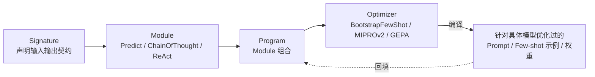

# 框架与编排 · DSPy 声明式优化

与 LangChain 和 LlamaIndex 常见的「手写 Prompt、手工调参」做法相比，DSPy 把 Prompt 视为程序里的可优化对象。它用「声明式签名 + 编译器」替代手写 Prompt，用「指标驱动的优化器」替代人工试错。

## 章节

1. [第十六章：DSPy 的声明式编程模型：Signature、Module 与 Program](16-declarative-programming-model.md)
2. [第十七章：DSPy 的编译器与优化器](17-compiler-and-optimizers.md)

## 模块关系

## 阅读建议

- 建议先读第十六章，理解 Signature / Module / Program 如何把「做什么」和「怎么做」分开；再读第十七章，看编译器如何利用这种分离自动搜索更优实现；
- 如果想和 LangChain、LlamaIndex 对照，两章都会标注 DSPy 的评测循环与 LangSmith 式可观测性的差异，适合先读 [LangChain 生态 · 生产闭环](../01-langchain/05-production/README.md) 再回来比较；
- 如果主要想判断是否值得引入 DSPy，可直接看第十七章 17.4 节，再对照 [框架选型与可移植架构](../06-selection-portability/README.md)。

返回 [AI 框架与编排 相关知识点](../README.md)。
