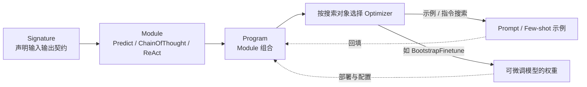

# 框架与编排 · DSPy 声明式优化

DSPy 把指令、示例或可训练模型参数视为程序中的优化对象。Signature 与 Module 先构成可运行程序，开发者再选择优化器、数据、指标和预算；这并不取消手写任务指令、程序结构设计和独立测试。

## 章节

1. [第十六章：DSPy 的声明式编程模型：Signature、Module 与 Program](16-declarative-programming-model.zh.md)
2. [第十七章：DSPy 的编译器与优化器](17-compiler-and-optimizers.zh.md)

## 模块关系

## 阅读建议

- 建议先读第十六章，理解 Signature / Module / Program 如何把「做什么」和「怎么做」分开；再读第十七章，看编译器如何利用这种分离自动搜索更优实现；
- 如果想和 LangChain、LlamaIndex 对照，两章都会标注 DSPy 的评测循环与 LangSmith 式可观测性的差异，适合先读 [LangChain 生态 · 生产闭环](../01-langchain/05-production/README.zh.md) 再回来比较；
- 如果主要想判断是否值得引入 DSPy，可直接看第十七章 17.4 节，再对照 [框架选型与可移植架构](../06-selection-portability/README.zh.md)。
- 结合 [官方优化器指南](https://dspy.ai/diving-deeper/choosing-an-optimizer/) 阅读：为什么 GEPA 需要有意义的反馈、验证集为何不能充当最终测试集、编译后每次推理是否更贵，比记住优化器名称更重要。

返回 [AI 框架与编排 相关知识点](../README.zh.md)。
