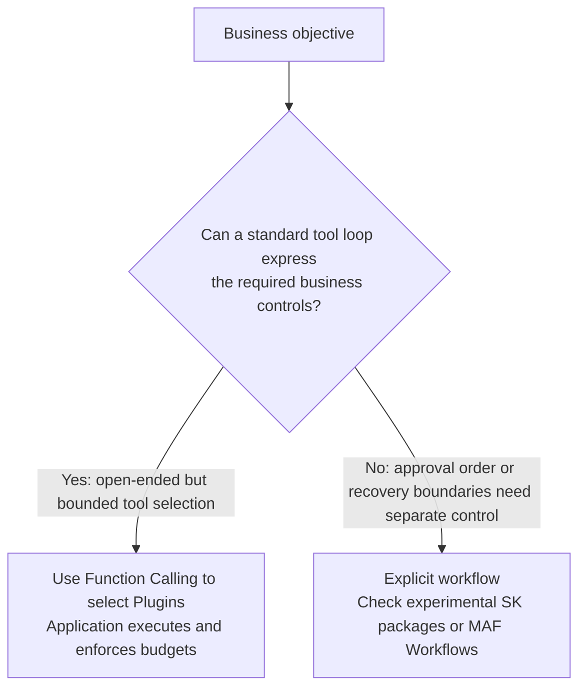

# Chapter 18: Semantic Kernel's Core Abstractions: Kernel, Plugin, and Planner

## 18.1 Positioning and scope

Semantic Kernel (SK) combines model services, functions, dependency injection, and invocation filters. It is a useful way to explain how AI connects to existing C#, Python, or Java applications. It also supports agents and multi-agent orchestration: it is not merely a model adapter, nor should other frameworks be excluded by drawing an artificial boundary between "enterprise" and "research."

**Microsoft Agent Framework (MAF) is SK's standalone successor, and the official project now describes MAF 1.0 as production-ready.** This chapter retains SK's core concepts for maintaining existing projects. New agent projects should also evaluate MAF; do not confuse the "Agent Framework" in older SK documentation with the standalone Microsoft Agent Framework. Chapter 19 discusses support and migration boundaries.

## 18.2 `Kernel`: a service container and an entry point for coordinating calls

`Kernel` manages services and Plugins and participates in function execution, prompt rendering, service selection, and the Filter pipeline. It is neither a model-inference implementation nor a persistent workflow engine, but saying that it "executes no logic at all" is also inaccurate:

```csharp
var builder = Kernel.CreateBuilder();
builder.AddAzureOpenAIChatCompletion(deploymentName, endpoint, apiKey);
builder.Plugins.AddFromType<OrderPlugin>();
Kernel kernel = builder.Build();
```

This registration pattern makes .NET dependency-injection experience useful, but you still need to understand service lifetimes, mutable Plugin collections, and request isolation. Familiarity with ASP.NET Core does not automatically confer an understanding of tool calls and model retries.

## 18.3 Plugins: prompt functions and native code functions

Semantic Kernel uses **Plugins** to bring together functions described in natural language and functions written in code:

- **Prompt function**: A `KernelFunction` created from a template, often called a Semantic Function in historical material.
- **Native function**: A `KernelFunction` created from a code method, commonly using `[KernelFunction]` in C# or `@kernel_function` in Python. It must also be registered and exposed to the model through invocation settings; the decorator alone grants no permission to call it.

```python
from semantic_kernel.functions import kernel_function

class OrderPlugin:
    @kernel_function(description="Look up an order's shipping status")
    def get_shipping_status(self, order_id: str) -> str:
        return shipping_service.query(order_id)
```

When exposed as tools, both types can appear to the model as a function name, description, and parameter schema. Their implementation may involve a model call or a database query. A Plugin groups functions that can be selected by a model or invoked directly by the application. The model only proposes a call; the application is responsible for execution, authorization, argument validation, and returning results.

## 18.4 How Planners relate to automatic function calling

Early versions used Planners such as Stepwise. Current official Planning documentation presents the **automatic function-calling loop** as the primary path: supply available tools to the model, execute its requests, add the results to the history, and continue until completion or a limit is reached. When maintaining an older Planner, consult the deprecation and migration guidance for its specific package; do not treat historical classes as the default API for a new project.

For example, in C#, `FunctionChoiceBehavior.Auto()` works with a chat service and Kernel to enable automatic invocation. Giving the model responsibility for selection does not move transactions, permissions, or reliable recovery "into the model." Those remain under application control.



This resembles the decision discussed in [LangChain Ecosystem, Chapter 9](../01-langchain/04-langgraph/09-langchain-vs-langgraph.md), but the trigger is not simply the number of steps. Even one money transfer needs explicit permissions and approval; multiple rounds of read-only search may still fit a budget-limited function-calling loop.

## 18.5 Filters: intercepting calls does not automatically deliver compliance

SK provides three kinds of Filter: function invocation, prompt rendering, and automatic function invocation. They can support authorization, auditing, result replacement, or early termination. The following Python fragment registers one; the application supplies `kernel` and the audit function:

```python
from typing import Awaitable, Callable
from semantic_kernel.filters import FilterTypes, FunctionInvocationContext

@kernel.filter(FilterTypes.FUNCTION_INVOCATION)
async def audit_filter(
    context: FunctionInvocationContext,
    next: Callable[[FunctionInvocationContext], Awaitable[None]],
) -> None:
    log_audit_trail(context.function.plugin_name, context.function.name)
    await next(context)
```

Not calling `next(context)` short-circuits execution. To reject a request, explicitly return a controlled error or an alternative result. Audit logging should not record full arguments and prompts by default, as that can expose personal information. Filters play a role similar to middleware in other frameworks. Their actual governance value depends on policies, coverage, and tests, not an "enterprise-grade" label.

## 18.6 Common mistakes

### 18.6.1 Registering every Kernel as a global singleton

The official C# documentation recommends registering the lightweight Kernel as transient because its Plugin collection is mutable. Expensive services such as model clients can be reused, but tenant identity, chat history, and request-specific Plugins should not be modified on a singleton without isolation. Whether a particular Plugin service can be a singleton also depends on its thread safety and the lifetimes of its own dependencies.

### 18.6.2 Ignoring the blurred boundary between Semantic and Native Functions

The same functionality can be implemented as a Semantic Function, which generates a result through a prompt, or as a Native Function, which computes it in code. Choose based on whether the logic needs language understanding, not on which style the team knows better. Giving a Semantic Function logic that should be computed precisely in code introduces unnecessary uncertainty.

### 18.6.3 Assuming a Planner is the only orchestration option

Automatic function calling is now the primary path. When reliable business control is required, evaluate explicit workflows and their runtime guarantees rather than assuming the experimental SK Process Framework already provides the equivalent of a mature business-process engine.

### 18.6.4 Treating Filters only as logging hooks

Filters are useful for more than logging. They can check permissions before a function call and redact sensitive information afterward. Using them only for logs leaves this cross-cutting capability underused.

Ask further questions: If the application invokes the same function directly, does it bypass the Kernel? Does a cache hit bypass user-level authorization? Could an automatic retry charge the customer again? A reliable design places final authorization and idempotency checks in the business service. Filters provide consistent entry-point control, not the only line of defense.

## 18.7 Chapter summary

1. **SK is useful for explaining enterprise integration and governance abstractions.** New agent projects should also evaluate its successor, MAF.
2. **Kernel coordinates services and the invocation pipeline.** Its lifetime should isolate mutable request state, rather than making everything a singleton.
3. **Plugins group prompt and code functions.** Tool selection is separate from actual execution and authorization.
4. **Automatic function calling is the main current planning path.** Reliable approvals and recovery still require explicit design.
5. **Filters provide governance hooks, not automatic compliance or exactly-once execution guarantees.**

When maintaining an SK project, follow a single call: where Kernel obtains the model service, how the Plugin registers its functions, when automatic invocation executes a tool, and where each Filter takes effect. Connecting existing code does not mean authorization, auditing, and reliable recovery are complete; each boundary still needs to be designed.

## References

- [Semantic Kernel official documentation: Introduction](https://learn.microsoft.com/en-us/semantic-kernel/overview/)
- [Semantic Kernel: Kernel concepts](https://learn.microsoft.com/en-us/semantic-kernel/concepts/kernel)
- [Semantic Kernel: Plugin concepts](https://learn.microsoft.com/en-us/semantic-kernel/concepts/plugins/)
- [Semantic Kernel: Planning concepts](https://learn.microsoft.com/en-us/semantic-kernel/concepts/planning)
- [Semantic Kernel: Filter concepts](https://learn.microsoft.com/en-us/semantic-kernel/concepts/enterprise-readiness/filters)
- [Semantic Kernel official repository and successor-framework announcement, pinned commit](https://github.com/microsoft/semantic-kernel/blob/ca40aa7226531d28a721d0ca0e451d0aaf86dafc/README.md)

Version note: The MAF successor relationship and 1.0 release statement were checked on 2026-09-15. This statement does not cover every language or experimental extension; Chapter 19 explains the boundaries.
