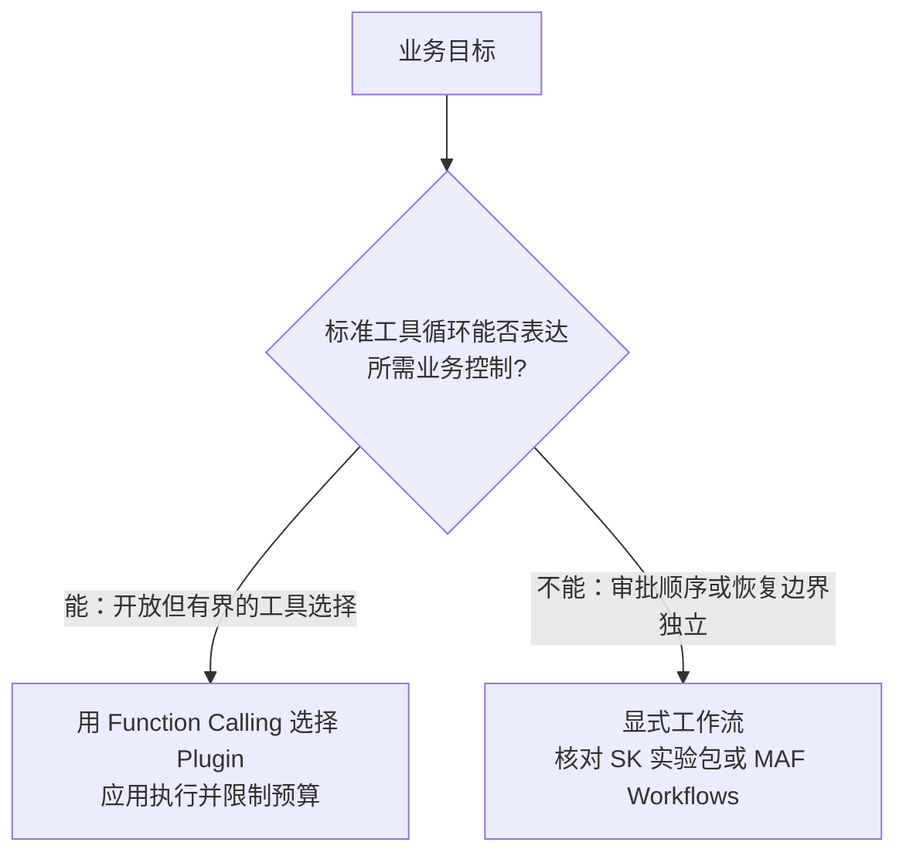

# 第十八章：Semantic Kernel 的核心抽象：Kernel、Plugin 与 Planner

## 18.1 定位与阅读边界

Semantic Kernel（SK）把模型服务、函数、依赖注入和调用过滤器组合起来，适合说明 AI 如何接入既有 C#、Python 或 Java 应用。它也能做 Agent 和多智能体编排，不能仅把它视为模型适配器，或以「企业/研究」划线排除其他框架。

**Microsoft Agent Framework（MAF）是 SK 的独立后继，官方已将 MAF 1.0 列为生产可用发布。** 本章保留 SK 核心概念用于维护存量项目；新 Agent 项目应同时评估 MAF，不要把 SK 旧文档里的 “Agent Framework” 与独立的 Microsoft Agent Framework 混为一谈。支持范围与迁移边界见第十九章。

## 18.2 `Kernel`：服务容器，也是调用链的协调入口

`Kernel` 管理服务和 Plugin，也参与函数执行、Prompt 渲染、服务选择与 Filter 链。它不是模型推理实现或持久化工作流引擎，但说它「完全不执行逻辑」同样不准确：

```csharp
var builder = Kernel.CreateBuilder();
builder.AddAzureOpenAIChatCompletion(deploymentName, endpoint, apiKey);
builder.Plugins.AddFromType<OrderPlugin>();
Kernel kernel = builder.Build();
```

这种注册模式便于复用 .NET 依赖注入经验，但仍需理解服务生命周期、可变 Plugin 集合和请求隔离；熟悉 ASP.NET Core 不等于自动理解工具调用与模型重试。

## 18.3 Plugin：Prompt 函数与原生代码函数

Semantic Kernel 用 **Plugin** 统一了「用自然语言描述的函数」和「用代码写的函数」：

- **Prompt function**：从模板创建 `KernelFunction`，历史材料常称 Semantic Function；
- **Native function**：从代码方法创建 `KernelFunction`，C# 常用 `[KernelFunction]`，Python 常用 `@kernel_function`；还需要注册并在调用设置中向模型开放，装饰器本身不授予调用权限。

```python
from semantic_kernel.functions import kernel_function

class OrderPlugin:
    @kernel_function(description="查询订单的物流状态")
    def get_shipping_status(self, order_id: str) -> str:
        return shipping_service.query(order_id)
```

向模型开放为工具时，两者都可呈现为函数名、描述和参数 Schema；实现中可能是模型调用，也可能是数据库查询。Plugin 是函数分组，既能供模型选择，也能由应用直接调用。模型只提出调用意图，应用负责执行、鉴权、校验参数与返回结果。

## 18.4 Planner 与自动函数调用是什么关系

早期版本使用 Stepwise 等 Planner。当前官方 Planning 文档以**自动函数调用循环**为主要路径：向模型给出可用工具，执行其请求，把结果写回历史，再继续直到结束或达到限制。维护旧 Planner 要看具体包的弃用/迁移说明，不应把旧类当作新项目默认 API。

例如 C# 的 `FunctionChoiceBehavior.Auto()` 配合聊天服务和 Kernel 启用自动调用。模型负责选择，不代表执行事务、权限或可靠恢复也「下沉给模型」；这些仍由应用控制。



这与 [LangChain 生态 · 第九章](../01-langchain/04-langgraph/09-langchain-vs-langgraph.zh.md) 的判断类似，但触发因素不是单纯的步骤数：即使只有一次转账，也需要明确权限与审批；即使有多轮只读搜索，也可能用受预算限制的函数调用循环。

## 18.5 Filter：拦截调用，而非自动获得合规

SK 提供函数调用、Prompt 渲染和自动函数调用三类 Filter，可用于鉴权、审计、结果覆盖或提前终止。下面是 Python 的注册片段；`kernel` 与审计函数由应用提供：

```python
from typing import Awaitable, Callable
from semantic_kernel.filters import FilterTypes, FunctionInvocationContext

@kernel.filter(FilterTypes.FUNCTION_INVOCATION)
async def audit_filter(
    context: FunctionInvocationContext,
    next: Callable[[FunctionInvocationContext], Awaitable[None]],
) -> None:
    log_audit_trail(context.function.plugin_name, context.function.name)
    await next(context)
```

不调用 `next(context)` 会短路执行；如要拒绝请求，应显式返回受控错误或替代结果。审计不应默认记录完整参数与 Prompt，避免泄漏个人信息。Filter 与其他框架的 middleware 职责类似，真正的治理效果取决于策略、覆盖范围和测试，不由「企业级」标签保证。

## 18.6 常见错误

### 18.6.1 把所有 Kernel 都注册成全局单例

官方 C# 文档建议将轻量的 Kernel 注册为 transient，因为 Plugin 集合可变。昂贵的模型客户端等服务可复用；租户身份、聊天历史和请求级 Plugin 不应在无隔离的单例上修改。具体 Plugin 服务能否单例，还取决于线程安全和自身依赖生命周期。

### 18.6.2 忽视 Semantic Function 和 Native Function 的边界含糊问题

同一个功能既可以写成 Semantic Function（靠 Prompt 生成结果）也可以写成 Native Function（靠代码计算结果），选择应该基于「这个逻辑是否需要语言理解能力」，而不是团队更熟悉哪种写法——把本该用代码精确计算的逻辑交给 Semantic Function，会引入不必要的不确定性。

### 18.6.3 认为 Planner 是唯一的编排方式

自动函数调用是当前主要路径；需要可靠业务控制时，应评估显式工作流及其运行时保证，而不是直接假定 SK Process Framework 的实验能力已等价于成熟业务引擎。

### 18.6.4 把 Filter 只当作日志埋点

Filter 的价值不只是记录日志，还包括在函数调用前做权限校验、在调用后做敏感信息脱敏——只用来打日志会浪费这层横切能力。

还应追问：同一函数被应用直接调用时会不会绕过 Kernel？缓存命中是否绕过了用户级鉴权？自动重试会不会再次扣款？可靠设计应把最终授权和幂等校验放在业务服务内，Filter 做统一入口控制，而不是唯一防线。

## 18.7 本章总结

1. **SK 适合解释企业接入与治理抽象**；新 Agent 项目还应评估其后继 MAF；
2. **Kernel 协调服务与调用链**，生命周期应隔离可变请求状态，而不是统一单例；
3. **Plugin 分组 Prompt 与代码函数**，工具选择和真实执行、授权是两回事；
4. **当前主要规划路径是自动函数调用**，可靠审批与恢复仍需显式设计；
5. **Filter 提供治理插入点，不自动提供合规或恰好一次执行保证**。

维护 SK 项目时，可以顺着一次调用排查：Kernel 从哪里取得模型服务，Plugin 如何注册函数，自动调用何时执行工具，Filter 又在哪个位置生效。接入既有代码并不等于已经完成授权、审计和可靠恢复，这些边界仍要逐项设计。

## 参考资料

- [Semantic Kernel 官方文档：Introduction](https://learn.microsoft.com/en-us/semantic-kernel/overview/)
- [Semantic Kernel: Kernel 概念](https://learn.microsoft.com/en-us/semantic-kernel/concepts/kernel)
- [Semantic Kernel: Plugins 概念](https://learn.microsoft.com/en-us/semantic-kernel/concepts/plugins/)
- [Semantic Kernel: Planning 概念](https://learn.microsoft.com/en-us/semantic-kernel/concepts/planning)
- [Semantic Kernel: Filters 概念](https://learn.microsoft.com/en-us/semantic-kernel/concepts/enterprise-readiness/filters)
- [Semantic Kernel 官方仓库与后继框架说明（固定提交）](https://github.com/microsoft/semantic-kernel/blob/ca40aa7226531d28a721d0ca0e451d0aaf86dafc/README.md)

版本说明：MAF 后继关系与 1.0 发布声明于 2026-09-15 复核；该声明不覆盖全部语言和实验性扩展，具体边界见第十九章。
