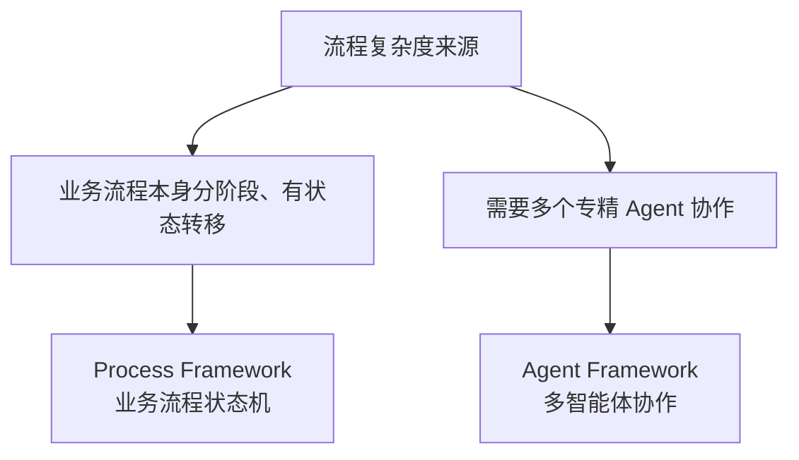

# 第十九章：Semantic Kernel 的 Process Framework 与 Agent Framework

## 19.1 两套编排能力，两种复杂度来源

第十八章末尾提到，简单场景可以让模型用 Function Calling 自动规划，复杂场景则需要显式建模。Semantic Kernel 把「复杂」进一步拆成两种不同的来源，并给出两套对应的框架：

- **Process Framework**：复杂度来自**业务流程本身**——一个多步骤、有明确阶段划分的业务流程（比如「收到工单 → 分类 → 路由给对应团队 → 等待处理 → 关闭并通知」），部分步骤需要 AI，部分步骤是纯业务代码；
- **Agent Framework**：复杂度来自**多个智能体之间的协作**——多个各有专长的 Agent 需要互相通信、共享上下文、决定谁来处理当前请求。



## 19.2 Process Framework：业务流程的显式状态机

Process Framework 把一个业务流程建模为**步骤（Step）+ 事件（Event）**：每个 Step 是一个独立的处理单元（可以包含 AI 调用，也可以是纯业务代码），Step 之间通过发出和监听事件连接：

```csharp
ProcessBuilder process = new("SupportTicketProcess");
var classify = process.AddStepFromType<ClassifyTicketStep>();
var routeToTeam = process.AddStepFromType<RouteToTeamStep>();

process
    .OnInputEvent("TicketReceived")
    .SendEventTo(new ProcessFunctionTargetBuilder(classify));

classify
    .OnEvent("TicketClassified")
    .SendEventTo(new ProcessFunctionTargetBuilder(routeToTeam));
```

**这与 [LangGraph](../01-langchain/04-langgraph/README.md) 用节点和边表达状态图非常接近**：两者都显式声明了流程的阶段划分，都支持在特定步骤暂停等待人工介入，都能持久化流程状态以便恢复。区别更多体现在生态定位上——Process Framework 的建模语言（Step/Event）更贴近传统的业务流程管理（BPM）术语，方便已经熟悉工作流引擎的企业团队理解；LangGraph 的建模语言（Node/Edge/State）更贴近图论和状态机术语，方便习惯函数式/图计算的团队理解。

## 19.3 Agent Framework：多智能体协作的编排层

Agent Framework 面向另一类问题——多个 Agent 各自维护对话历史和角色设定，需要按某种策略决定「下一步该谁发言」：

```python
from semantic_kernel.agents import ChatCompletionAgent, GroupChatOrchestration

researcher = ChatCompletionAgent(name="Researcher", instructions="负责收集资料")
writer = ChatCompletionAgent(name="Writer", instructions="负责整理成报告")

orchestration = GroupChatOrchestration(agents=[researcher, writer])
result = await orchestration.invoke(task="调研并总结季度行业趋势")
```

这套「多个带角色的 Agent + 一个决定发言顺序的编排策略」的设计，和 [轻量级 Agent 框架](../05-lightweight-agent-frameworks/README.md) 模块要讲的 AutoGen `GroupChat`、CrewAI `Crew` 在概念层面几乎是同构的——**这也是本章要强调的判断**：多智能体协作的编排模式，在不同框架里换了不同的名字（GroupChat / Crew / Orchestration），但要解决的核心问题（角色划分、发言策略、共享上下文的边界）是一致的，选型时不必被术语差异迷惑。

## 19.4 多语言一致性与企业落地的取舍

Semantic Kernel 的 C#、Python、Java 三个 SDK **共享同一套核心概念（Kernel/Plugin/Process/Agent Framework）**，但功能覆盖和发布节奏并不完全同步——通常 C# SDK 功能最完整、发布最快，Python 紧随其后，Java 覆盖面相对滞后。这对企业选型有直接影响：

| 场景 | 需要评估的问题 |
|---|---|
| 团队主力是 .NET，且需要长期维护 | Semantic Kernel 的多语言一致性设计减少了「AI 团队用 Python、后端团队用 C#」之间的概念鸿沟 |
| 需要用到最新发布的实验性能力 | 应优先确认该能力是否已经覆盖到团队实际使用的语言 SDK，而不是假设三语言功能对等 |
| 追求版本升级的稳定性 | Semantic Kernel 1.0+ 承诺不做破坏性变更，这对长期维护的企业系统是显著优势，但也意味着新范式（比如更激进的 Agent 抽象）落地速度可能慢于社区驱动、迭代更快的框架 |

> **这正是 [框架选型与可移植架构](../06-selection-portability/README.md) 反复强调的判断维度之一**：稳定性和创新速度是一组权衡，企业级中间件通常用前者换后者，选型时要明确自己的团队更需要哪一种。

## 19.5 常见错误

### 19.5.1 把 Process Framework 和 Agent Framework 混为一谈

前者解决「业务流程阶段划分」，后者解决「多智能体协作」——一个复杂系统可能同时需要两者：用 Process Framework 建模整体业务流程，其中某个 Step 内部再调用 Agent Framework 编排多个 Agent 协作完成子任务。

### 19.5.2 假设三语言 SDK 功能完全对等

选型前应该直接查阅目标语言 SDK 的最新文档确认具体能力覆盖，而不是假设「C# 文档写的功能 Python 也一定有」。

### 19.5.3 忽视 Process Framework 早期版本的稳定性标注

引入处于预览阶段的能力时，应结合官方发布说明确认其稳定性承诺，避免把实验性功能当作已受 1.0+ 稳定性保证覆盖的核心 API 长期依赖。

### 19.5.4 认为「企业级」等于「功能更强」

企业级中间件的核心价值是治理、稳定性和多语言一致性，不代表它在最新的 Agent 范式（比如复杂反思循环、大规模并行探索）上一定领先社区驱动的框架，选型仍要回到具体需求。

## 19.6 本章总结

1. **Process Framework 解决业务流程本身的阶段划分复杂度**，用 Step/Event 显式建模状态转移，与 LangGraph 的图状态机在能力上高度接近，但建模语言更贴近传统 BPM 术语；
2. **Agent Framework 解决多智能体协作复杂度**，其角色划分、发言策略、共享上下文的设计与 AutoGen、CrewAI 等框架的多智能体编排概念同构；
3. **两套框架可以嵌套使用**：整体业务流程用 Process Framework，其中某个步骤内部再用 Agent Framework 编排多智能体子任务；
4. **多语言一致性是 Semantic Kernel 的核心卖点，但不是绝对的功能对等**，选型前需要确认目标语言 SDK 的具体能力覆盖；
5. **稳定性与创新速度是一组权衡**：1.0+ 的不破坏性变更承诺换来了长期维护友好性，代价可能是新范式的落地速度慢于社区驱动的框架。

> **一句话概括：Semantic Kernel 的 Process Framework 和 Agent Framework 分别是「业务流程复杂度」和「多智能体协作复杂度」两个不同问题的答案，它们在能力上并不比 LangGraph、AutoGen 等社区框架有本质领先，真正的差异化优势始终落在多语言一致性和企业治理能力上。**

## 参考资料

- [Semantic Kernel: Process Framework](https://learn.microsoft.com/en-us/semantic-kernel/frameworks/process/process-framework)
- [Semantic Kernel: Agent Framework 概述](https://learn.microsoft.com/en-us/semantic-kernel/frameworks/agent/)
- [Semantic Kernel: Agent Orchestration](https://learn.microsoft.com/en-us/semantic-kernel/frameworks/agent/agent-orchestration/)
- [LangGraph 官方文档](https://docs.langchain.com/oss/python/langgraph/overview)
