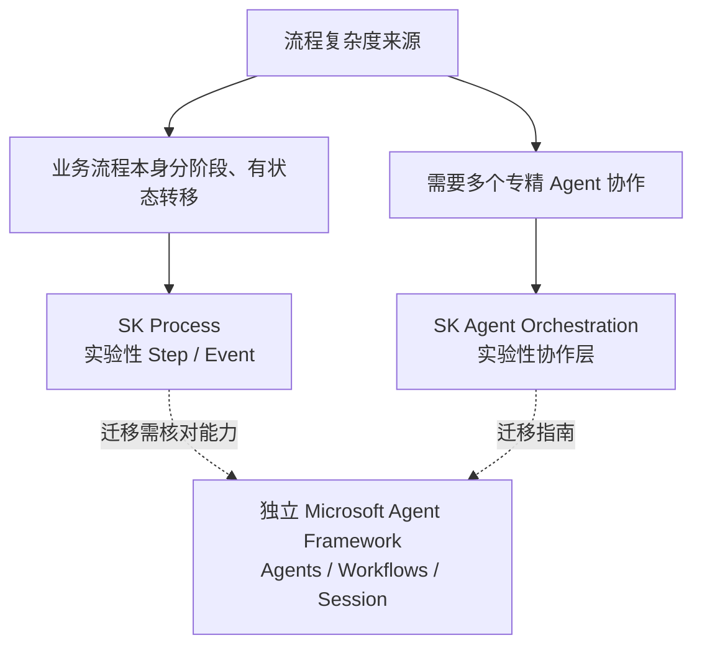

# 第十九章：Semantic Kernel 的 Process Framework 与 Agent Framework

## 19.1 先分清三个容易重名的对象

旧 SK 文档中的 Agent Framework 不是独立的 Microsoft Agent Framework。需要分开理解三个对象：

- **SK Process Framework**：以 Step/Event 组织业务流程；官方概览仍标为 experimental；
- **SK Agent Framework / Agent Orchestration**：SK 包内的 Agent 抽象及协作层。Agent 不只用于多智能体；Agent Orchestration 概览仍标为 experimental，不能把这个标记扩展成「所有 SK API 都实验性」；
- **Microsoft Agent Framework（MAF）**：独立后继 SDK，融合 SK 与 AutoGen 的经验。官方仓库已说明 1.0 为生产可用发布；核心发布状态不等于每个 provider、Workflows 扩展或语言 SDK 都同样稳定，应逐包核对。当前概览明确 Go SDK 仍为 public preview。



## 19.2 Process Framework：业务流程的显式状态机

Process Framework 把一个业务流程建模为**步骤（Step）+ 事件（Event）**：每个 Step 是一个独立的处理单元（可以包含 AI 调用，也可以是纯业务代码），Step 之间通过发出和监听事件连接：

```csharp
ProcessBuilder process = new("SupportTicketProcess");
var classify = process.AddStepFromType<ClassifyTicketStep>();
var routeToTeam = process.AddStepFromType<RouteToTeamStep>();

process
    .OnInputEvent("TicketReceived")
    .SendEventTo(new ProcessFunctionTargetBuilder(classify));

classify
    .OnEvent("TicketClassified")
    .SendEventTo(new ProcessFunctionTargetBuilder(routeToTeam));
```

上例仅定义流程拓扑，`ClassifyTicketStep`、`RouteToTeamStep`、运行时与启动事件还需实现。它和 [LangGraph](../01-langchain/04-langgraph/README.md) 都能表达多步骤控制，但不能因图形相似就认定持久化、暂停和重放语义相同。必须确认所用 SK 语言包和运行时如何保存 Step 状态、事件及外部请求，进程内执行样例本身不是可靠恢复证明。

## 19.3 SK Agent Orchestration：协作模式与运行时

SK Agent Orchestration 支持 sequential、concurrent、handoff、group chat、magentic 等模式，不只决定谁发言。下面保留存量 Python API 的 group chat 装配方式，模型服务及凭据需预先配置：

```python
from semantic_kernel.agents import (
    ChatCompletionAgent, GroupChatOrchestration, RoundRobinGroupChatManager,
)
from semantic_kernel.agents.runtime import InProcessRuntime

researcher = ChatCompletionAgent(
    name="Researcher", instructions="负责收集资料", service=chat_service,
)
writer = ChatCompletionAgent(
    name="Writer", instructions="负责整理成报告", service=chat_service,
)

orchestration = GroupChatOrchestration(
    members=[researcher, writer],
    manager=RoundRobinGroupChatManager(max_rounds=4),
)
runtime = InProcessRuntime()
runtime.start()
result = await orchestration.invoke(task="调研并总结季度行业趋势", runtime=runtime)
output = await result.get()
await runtime.stop_when_idle()
```

Group chat 与 AutoGen Team 有可比之处，但不等于 CrewAI Crew：顺序任务、消息轮询和动态 handoff 的状态归属及终止语义不同。例子中的轮次上限只防止无界聊天，不证明任务完成；真实系统还需时间预算、结果验收和异常时的运行时清理。

## 19.4 发布与支持状态：不能沿用旧预览结论

SK 提供 C#、Python、Java SDK，但不保证所有 Process/Agent 功能对等；例如 SK Agent Orchestration 文档明确 Java 尚不支持。MAF 的概览列出 .NET、Python、Go，不能据此推导 SK Java 有直接迁移目标。

| 场景 | 需要评估的问题 |
|---|---|
| 新建 .NET / Python Agent | 优先评估 MAF，并核对所需 provider 和运行时包的稳定性 |
| 已运行的 SK 项目 | 先锁定版本与回归基线，按能力缺口和维护成本分批迁移，不必因为后继发布就立即重写 |
| 使用 SK 实验性 Process/Orchestration | 独立审查其兼容性；核心包的稳定版本不覆盖所有实验接口 |
| 有长期支持要求 | 查具体发布及支持政策，不能把“1.x”解释为永远没有破坏性变更 |

微软过渡公告说明：SK v1.x 继续处理关键 bug、安全问题及部分既有功能，主要新功能转向 MAF，并承诺至少支持到 MAF GA 后一年。这是最低支持承诺，不是精确的终止支持日期；维护计划仍需跟踪单独的支持政策和 EOL 公告。

## 19.5 迁移不是换一个包名

官方迁移指南给出的主要变化包括：

| 迁移面 | SK | MAF |
|---|---|---|
| Python 包/命名空间 | `semantic-kernel` / `semantic_kernel` | `agent-framework` / `agent_framework`，可按 provider 拆包 |
| .NET 主要抽象 | `Kernel`、`ChatCompletionAgent` | `AIAgent`，常配合 `Microsoft.Extensions.AI` 的客户端与消息类型 |
| 工具注册 | Plugin / KernelFunction | Agent 工具；.NET 可用 `AIFunctionFactory.Create` |
| 会话与运行 | AgentThread、Invoke | AgentSession、Run；消息和流式返回类型也改变 |

先迁移无副作用、短会话的功能，验证工具 Schema、异常处理、输出与成本；随后再迁移 Filter/middleware、持久会话和长任务。旧检查点不能仅靠重命名字段转换：要盘点待处理事件、已完成业务操作和审批状态，决定让旧任务排空，还是转换业务状态后在新系统重新入场。

架构讨论中可以用一次退款审批追问：谁持有会话，审批授权保存在哪，崩溃后哪个步骤重做，幂等键由谁生成？这些问题比「两套框架都支持 workflow」更能判断迁移是否安全。

## 19.6 常见错误

### 19.6.1 把三个名称当成同一个运行时

SK Process、SK Agent Orchestration 与 MAF 有不同包和执行语义。可以用工作流包裹 Agent，但必须指定哪一层拥有检查点、取消、重试与最终提交。

### 19.6.2 假设语言 SDK 功能完全对等

选型前应该直接查阅目标语言 SDK 的最新文档确认具体能力覆盖，而不是假设「C# 文档写的功能 Python 也一定有」。

### 19.6.3 用核心包版本替实验功能作保证

引入处于预览阶段的能力时，应结合官方发布说明确认其稳定性承诺，避免把实验性功能当作已受 1.0+ 稳定性保证覆盖的核心 API 长期依赖。

### 19.6.4 认为「企业级」等于「自动可靠」

发布稳定不等于工具副作用自动事务化；仍需权限、幂等、超时、补偿和生产故障演练。

## 19.7 本章总结

1. **SK Process 与 SK Agent Orchestration 是存量抽象**，官方相关概览仍标为实验性；
2. **独立 MAF 是后继，不是旧 Agent Framework 改名后的同一 API**；
3. **MAF 1.0 核心发布与 SK 支持延续应分别判断**，也要逐包、逐语言核对；
4. **迁移重点是工具、消息、治理和会话状态语义**，而非简单替换 import；
5. **恢复能力必须通过故障演练验证**，不由流程图或 SDK 标签保证。

维护旧项目时理解 SK 抽象仍有价值；做新选型时，应把 MAF 和实际业务约束放进同一份评估，而不是停留在旧产品分类。

## 参考资料

- [Semantic Kernel: Process Framework](https://learn.microsoft.com/en-us/semantic-kernel/frameworks/process/process-framework)
- [Semantic Kernel: Agent Framework 概述](https://learn.microsoft.com/en-us/semantic-kernel/frameworks/agent/)
- [Semantic Kernel: Agent Orchestration](https://learn.microsoft.com/en-us/semantic-kernel/frameworks/agent/agent-orchestration/)
- [Semantic Kernel: Group Chat 完整运行时示例](https://learn.microsoft.com/en-us/semantic-kernel/frameworks/agent/agent-orchestration/group-chat)
- [Semantic Kernel 官方仓库的 MAF 1.0 说明（固定提交）](https://github.com/microsoft/semantic-kernel/blob/ca40aa7226531d28a721d0ca0e451d0aaf86dafc/README.md)
- [Microsoft Agent Framework 概览](https://learn.microsoft.com/en-us/agent-framework/overview/)
- [SK → MAF 迁移指南](https://learn.microsoft.com/en-us/agent-framework/migration-guide/from-semantic-kernel/)
- [微软：Semantic Kernel 与 MAF 支持过渡公告](https://devblogs.microsoft.com/agent-framework/semantic-kernel-and-microsoft-agent-framework/)
- [LangGraph 官方文档](https://docs.langchain.com/oss/python/langgraph/overview)

版本说明：MAF 1.0、Go public preview、SK Process/Orchestration 实验性标记和过渡公告于 2026-09-15 复核。过渡公告保留了发布当时「MAF 仍在 Preview」的描述，不能用它覆盖后续 1.0 发布声明，也不能据此推算 SK 的精确 EOL。
