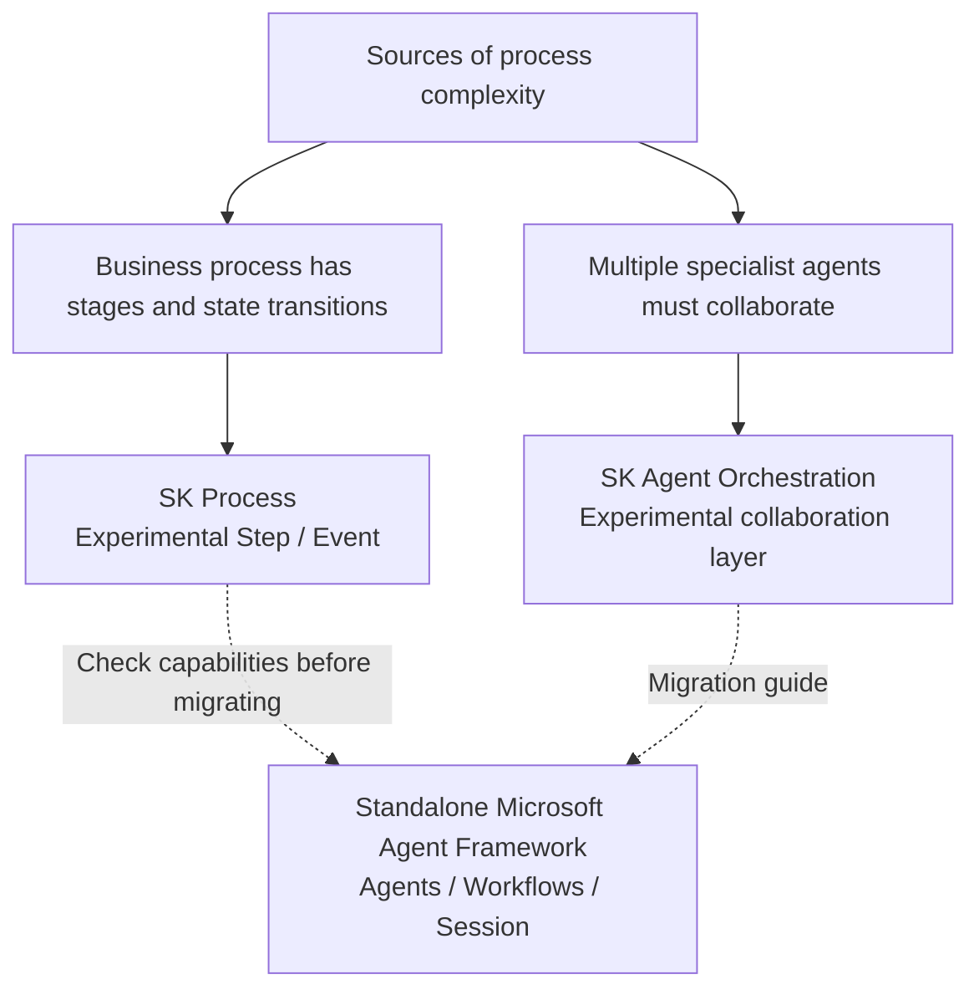

# Chapter 19: Semantic Kernel's Process Framework and Agent Framework

## 19.1 First distinguish three easily confused names

The Agent Framework in older SK documentation is not the standalone Microsoft Agent Framework. Three things need to be understood separately:

- **SK Process Framework**: Organizes business processes using Steps and Events; its official overview still marks it as experimental.
- **SK Agent Framework / Agent Orchestration**: The agent abstractions and collaboration layer within SK packages. Agents are not only for multi-agent systems. The Agent Orchestration overview still marks it as experimental, but that label must not be extended to mean that every SK API is experimental.
- **Microsoft Agent Framework (MAF)**: A standalone successor SDK incorporating lessons from SK and AutoGen. The official repository describes 1.0 as production-ready. The core release status does not imply equal stability for every provider, Workflow extension, or language SDK; check individual packages. The current overview explicitly identifies the Go SDK as public preview.



## 19.2 Process Framework: an explicit state machine for business processes

Process Framework models a business process as **Steps + Events**. Each Step is an independent processing unit, which may contain AI calls or ordinary business code. Steps connect by emitting and listening for events:

```csharp
ProcessBuilder process = new("SupportTicketProcess");
var classify = process.AddStepFromType<ClassifyTicketStep>();
var routeToTeam = process.AddStepFromType<RouteToTeamStep>();

process
    .OnInputEvent("TicketReceived")
    .SendEventTo(new ProcessFunctionTargetBuilder(classify));

classify
    .OnEvent("TicketClassified")
    .SendEventTo(new ProcessFunctionTargetBuilder(routeToTeam));
```

This example defines only the process topology. `ClassifyTicketStep`, `RouteToTeamStep`, the runtime, and the starting event still need implementations. Both this framework and [LangGraph](../01-langchain/04-langgraph/README.md) can express multi-step control, but similar-looking graphs do not establish identical persistence, pause, or replay semantics. Verify how the chosen SK language package and runtime save Step state, events, and external requests. An in-process execution example is not proof of reliable recovery.

## 19.3 SK Agent Orchestration: collaboration patterns and the runtime

SK Agent Orchestration supports sequential, concurrent, handoff, group chat, and magentic patterns; it does more than decide who speaks next. The following retains the group-chat assembly pattern from the existing Python API. Configure the model service and credentials first. The Chinese instructions assign information gathering to the Researcher and report preparation to the Writer; the task asks them to research and summarize quarterly industry trends:

```python
from semantic_kernel.agents import (
    ChatCompletionAgent, GroupChatOrchestration, RoundRobinGroupChatManager,
)
from semantic_kernel.agents.runtime import InProcessRuntime

researcher = ChatCompletionAgent(
    name="Researcher", instructions="负责收集资料", service=chat_service,
)
writer = ChatCompletionAgent(
    name="Writer", instructions="负责整理成报告", service=chat_service,
)

orchestration = GroupChatOrchestration(
    members=[researcher, writer],
    manager=RoundRobinGroupChatManager(max_rounds=4),
)
runtime = InProcessRuntime()
runtime.start()
result = await orchestration.invoke(task="调研并总结季度行业趋势", runtime=runtime)
output = await result.get()
await runtime.stop_when_idle()
```

Group chat has similarities to an AutoGen Team, but it is not equivalent to a CrewAI Crew. Sequential tasks, round-robin messaging, and dynamic handoffs differ in state ownership and termination semantics. The round limit in this example only prevents unbounded conversation; it does not prove that the task is complete. A real system also needs time budgets, result acceptance criteria, and runtime cleanup on exceptions.

## 19.4 Release and support status: old preview conclusions do not carry forward

SK provides C#, Python, and Java SDKs, but does not guarantee parity for all Process and Agent features. For example, the SK Agent Orchestration documentation explicitly states that Java is not yet supported. The MAF overview lists .NET, Python, and Go; that does not imply a direct migration target for SK Java.

| Scenario | Questions to evaluate |
|---|---|
| New .NET / Python agent | Evaluate MAF first, and check the stability of required providers and runtime packages |
| Existing SK deployment | Pin versions and a regression baseline first; migrate incrementally according to capability gaps and maintenance costs rather than immediately rewriting because a successor has shipped |
| Experimental SK Process/Orchestration features | Review their compatibility separately; a stable core package does not cover every experimental interface |
| Long-term support requirements | Check specific releases and support policies; "1.x" does not mean there can never be a breaking change |

Microsoft's transition announcement states that SK v1.x will continue to receive fixes for critical bugs and security issues, alongside work on some existing features, while most new features move to MAF. It commits to support for at least one year after MAF becomes generally available. This is a minimum support commitment, not an exact end-of-support date. Maintenance plans must still track separate support policies and EOL announcements.

## 19.5 Migration is more than changing a package name

The official migration guide identifies changes including:

| Migration area | SK | MAF |
|---|---|---|
| Python package / namespace | `semantic-kernel` / `semantic_kernel` | `agent-framework` / `agent_framework`, with provider-specific packages available |
| Main .NET abstractions | `Kernel`, `ChatCompletionAgent` | `AIAgent`, often with client and message types from `Microsoft.Extensions.AI` |
| Tool registration | Plugin / KernelFunction | Agent tools; .NET can use `AIFunctionFactory.Create` |
| Sessions and runs | AgentThread, Invoke | AgentSession, Run; message and streaming return types also change |

Start with short-session features without side effects, verifying tool schemas, exception handling, outputs, and cost. Then migrate Filters/middleware, persistent sessions, and long-running tasks. Old checkpoints cannot be converted merely by renaming fields: inventory pending events, completed business operations, and approval state. Decide whether to let old tasks drain or convert their business state and re-enter through the new system.

A refund approval makes a useful architecture follow-up: Who owns the session? Where is the approval authorization stored? Which step runs again after a crash? Who generates the idempotency key? These questions reveal more about migration safety than observing that both frameworks support workflows.

## 19.6 Common mistakes

### 19.6.1 Treating all three names as the same runtime

SK Process, SK Agent Orchestration, and MAF use different packages and execution semantics. A workflow can wrap an agent, but you must specify which layer owns checkpoints, cancellation, retries, and the final commit.

### 19.6.2 Assuming full feature parity across language SDKs

Before choosing a framework, read the current documentation for the target language SDK to confirm its capabilities. Do not assume that a feature documented for C# must also exist in Python.

### 19.6.3 Using the core package's version as a guarantee for experimental features

When adopting preview capabilities, consult official release notes for their stability commitments. Avoid making experimental features a long-term dependency under the mistaken assumption that they are core APIs covered by 1.0+ stability guarantees.

### 19.6.4 Equating "enterprise-grade" with "automatically reliable"

A stable release does not make tool side effects automatically transactional. Permissions, idempotency, timeouts, compensation, and production failure drills are still necessary.

## 19.7 Chapter summary

1. **SK Process and SK Agent Orchestration are abstractions used in existing systems.** Their official overviews still mark them as experimental.
2. **The standalone MAF is a successor, not the same API under a new name for the old Agent Framework.**
3. **Assess MAF's 1.0 core release and continued SK support separately**, and check individual packages and language SDKs.
4. **Migration centers on the semantics of tools, messages, governance, and session state**, not merely replacing imports.
5. **Recovery capabilities must be verified through failure drills**, not inferred from a flowchart or an SDK label.

Understanding SK abstractions remains valuable when maintaining older projects. For a new selection, evaluate MAF alongside actual business constraints rather than relying on historical product categories.

## References

- [Semantic Kernel: Process Framework](https://learn.microsoft.com/en-us/semantic-kernel/frameworks/process/process-framework)
- [Semantic Kernel: Agent Framework overview](https://learn.microsoft.com/en-us/semantic-kernel/frameworks/agent/)
- [Semantic Kernel: Agent Orchestration](https://learn.microsoft.com/en-us/semantic-kernel/frameworks/agent/agent-orchestration/)
- [Semantic Kernel: Complete Group Chat runtime example](https://learn.microsoft.com/en-us/semantic-kernel/frameworks/agent/agent-orchestration/group-chat)
- [Semantic Kernel official repository's MAF 1.0 statement, pinned commit](https://github.com/microsoft/semantic-kernel/blob/ca40aa7226531d28a721d0ca0e451d0aaf86dafc/README.md)
- [Microsoft Agent Framework overview](https://learn.microsoft.com/en-us/agent-framework/overview/)
- [SK → MAF migration guide](https://learn.microsoft.com/en-us/agent-framework/migration-guide/from-semantic-kernel/)
- [Microsoft: Semantic Kernel and MAF support transition announcement](https://devblogs.microsoft.com/agent-framework/semantic-kernel-and-microsoft-agent-framework/)
- [LangGraph official documentation](https://docs.langchain.com/oss/python/langgraph/overview)

Version note: MAF 1.0, the Go public preview, the experimental labels for SK Process/Orchestration, and the transition announcement were checked on 2026-09-15. The transition announcement retains its original description of MAF as still in Preview; it must not override the later 1.0 release statement or be used to infer an exact SK EOL date.
