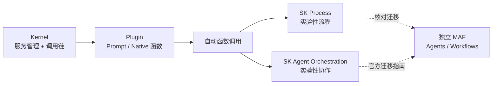

# 框架与编排 · Semantic Kernel 企业级编排

本模块保留 Semantic Kernel（SK）的核心概念，帮助维护已有系统。**截至 2026-09-08，官方仓库已将独立 Microsoft Agent Framework（MAF）列为后继，并说明 MAF 1.0 为生产可用发布。** SK 旧文档里的 “Agent Framework” 指包内抽象，不等于 MAF。

SK Process 与 Agent Orchestration 相关概览仍标为实验性，不能用核心包 1.x 版本给所有功能作稳定性保证；语言 SDK 和集成包也不完全对等。第十九章结合 [官方迁移指南](https://learn.microsoft.com/en-us/agent-framework/migration-guide/from-semantic-kernel/) 与支持公告讨论存量维护和新项目选型。

## 章节

1. [第十八章：Semantic Kernel 的核心抽象：Kernel、Plugin 与 Planner](18-kernel-plugin-planner.md)
2. [第十九章：Semantic Kernel 的 Process Framework 与 Agent Framework](19-process-and-agent-framework.md)

## 模块关系

## 阅读建议

- 如果来自 .NET 或其他企业技术栈，可先看第十八章，理解 Kernel 调用链、transient 建议与可变 Plugin 的请求隔离；
- 如果主要想和 LangGraph、AutoGen 对比编排模型，可直接看第十九章 19.3 节；
- 如果重点在企业采购或合规风险，两章的「常见错误」和「本章总结」都包含治理与 lock-in 判断，适合配合 [框架选型与可移植架构](../06-selection-portability/README.md) 一起读。

返回 [AI 框架与编排 相关知识点](../README.md)。

原文与图示：Polo Li，按 [CC BY 4.0](https://creativecommons.org/licenses/by/4.0/) 授权。
