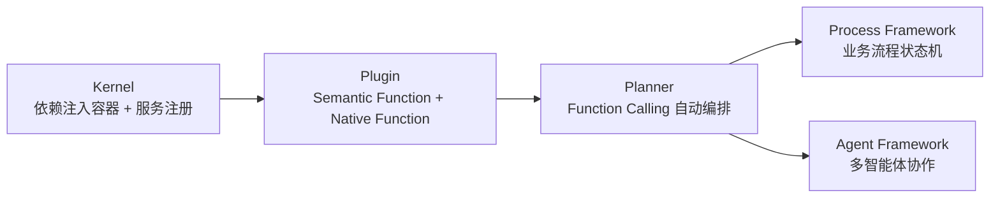

# 框架与编排 · Semantic Kernel 企业级编排

前面三个模块默认站在 Python 生态看问题。Semantic Kernel 则从一开始就强调**多语言、企业优先**：同一套核心抽象覆盖 C#、Python、Java，并把「1.0 之后不做破坏性变更」写进了版本承诺。本模块关注的是这些能力如何影响治理、合规和可移植性判断。

## 章节

1. [第十八章：Semantic Kernel 的核心抽象：Kernel、Plugin 与 Planner](18-kernel-plugin-planner.md)
2. [第十九章：Semantic Kernel 的 Process Framework 与 Agent Framework](19-process-and-agent-framework.md)

## 模块关系

## 阅读建议

- 如果来自 .NET 或其他企业技术栈，可先看第十八章，理解 Kernel 作为依赖注入容器的定位；
- 如果主要想和 LangGraph、AutoGen 对比编排模型，可直接看第十九章 19.3 节；
- 如果重点在企业采购或合规风险，两章的「常见错误」和「本章总结」都包含治理与 lock-in 判断，适合配合 [框架选型与可移植架构](../06-selection-portability/README.md) 一起读。

返回 [AI 框架与编排 相关知识点](../README.md)。
