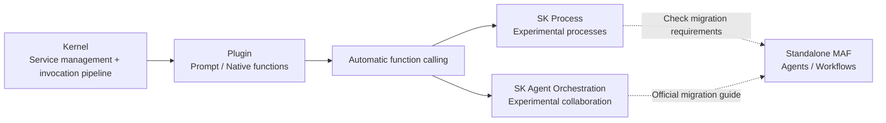

# Frameworks and Orchestration · Semantic Kernel Enterprise Orchestration

This module retains Semantic Kernel's (SK) core concepts to support maintenance of existing systems. **Microsoft Agent Framework (MAF) is its standalone successor, and the official project now describes MAF 1.0 as production-ready.** The "Agent Framework" in older SK documentation means abstractions within its packages, not MAF. Version sources are listed in Chapter 19's references.

The SK Process and Agent Orchestration overviews still mark those features as experimental. A 1.x core package cannot guarantee stability for every feature, and language SDKs and integration packages do not have complete parity. Chapter 19 uses the [official migration guide](https://learn.microsoft.com/en-us/agent-framework/migration-guide/from-semantic-kernel/) and support announcements to discuss maintenance of existing systems and selection for new projects.

## Chapters

1. [Chapter 18: Semantic Kernel's Core Abstractions: Kernel, Plugin, and Planner](18-kernel-plugin-planner.md)
2. [Chapter 19: Semantic Kernel's Process Framework and Agent Framework](19-process-and-agent-framework.md)

## How the pieces fit together

## Reading suggestions

- If you come from .NET or another enterprise stack, start with Chapter 18 to understand the Kernel invocation pipeline, the transient-lifetime recommendation, and request isolation for mutable Plugins.
- To compare orchestration models with LangGraph and AutoGen, go directly to Section 19.3.
- If enterprise procurement or compliance risk is your focus, both chapters discuss governance and lock-in in their common-mistakes and summary sections. Read them alongside [Framework Selection and Portable Architectures](../06-selection-portability/README.md).

Return to [AI Frameworks and Orchestration topics](../README.md).
