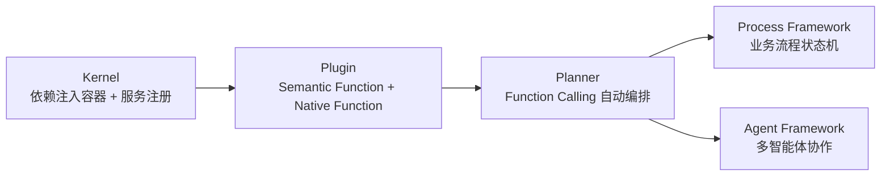

# 框架与编排 · Semantic Kernel 企业级编排

前三个模块（LangChain、LlamaIndex、DSPy）都以 Python 生态为默认假设。Semantic Kernel 从一开始就是**多语言、企业优先**的设计：同一套核心抽象在 C#、Python、Java 三种语言里保持对等，并把「1.0 之后不做破坏性变更」写进了版本承诺。本模块关心的不是「它能不能做 Agent」，而是「企业级组织在选择编排框架时，除了功能之外还必须评估哪些治理和可移植性问题」。

## 章节

1. [第十八章：Semantic Kernel 的核心抽象：Kernel、Plugin 与 Planner](18-kernel-plugin-planner.md)
2. [第十九章：Semantic Kernel 的 Process Framework 与 Agent Framework](19-process-and-agent-framework.md)

## 模块关系

## 阅读建议

- **来自 .NET/企业技术栈的读者**：直接看第十八章，理解 Kernel 作为依赖注入容器的定位；
- **关心和 LangGraph/AutoGen 对比编排模型的读者**：直接看第十九章 19.3 节；
- **评估企业采购/合规风险的读者**：两章的「常见错误」和「本章总结」都包含治理与 lock-in 判断，建议配合 [框架选型与可移植架构](../06-selection-portability/README.md) 一起读。

返回 [AI 框架与编排 相关知识点](../README.md)。
