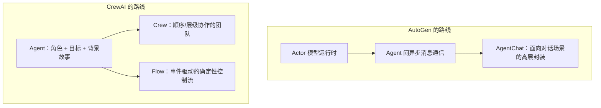

# 第二十章：AutoGen 与 CrewAI 的多智能体抽象

## 20.1 两条多智能体编排路线

[Semantic Kernel · 第十九章](../04-semantic-kernel/19-process-and-agent-framework.md) 已经指出，多智能体协作的编排模式在不同框架里换了不同名字。AutoGen 和 CrewAI 是社区里最常被拿来比较的两个专精多智能体协作的框架，它们代表了两条不同的技术路线：

- **AutoGen**：从底层运行时开始设计，把 Agent 之间的通信建模为**异步消息传递的 Actor 模型**，目标是「事件驱动、可分布式部署、可扩展」的多智能体系统；
- **CrewAI**：从「团队协作」的业务隐喻出发，把 Agent 建模为**带角色、目标和背景故事的团队成员**，用 YAML 配置降低搭建门槛，目标是「快速把一个多角色协作流程跑起来」。



## 20.2 AutoGen：分层的运行时——Core 与 AgentChat

AutoGen 的架构分两层：

- **AutoGen Core**：最底层的运行时，基于 [Actor 模型](https://en.wikipedia.org/wiki/Actor_model) 实现——每个 Agent 是一个独立的 Actor，只能通过异步消息与其他 Agent 通信，这套模型天然支持事件驱动、跨语言（官方文档提到 Python 与 .NET 互操作）和分布式部署；
- **AgentChat**：构建在 Core 之上、面向对话场景的高层 API，提供开箱即用的 `AssistantAgent`、`GroupChat` 等组件，多数应用开发者直接从这一层开始用。

```python
from autogen_agentchat.agents import AssistantAgent
from autogen_agentchat.teams import RoundRobinGroupChat

researcher = AssistantAgent("researcher", model_client=model_client)
writer = AssistantAgent("writer", model_client=model_client)

team = RoundRobinGroupChat([researcher, writer])
result = await team.run(task="调研并撰写一份市场分析简报")
```

**`RoundRobinGroupChat` 只是众多编排策略中的一种**（还有 `SelectorGroupChat` 让模型动态选择下一个发言者、`Swarm` 让 Agent 之间显式移交控制权）。AutoGen 把「谁在什么时候发言」单独建模成可替换的策略对象；要更换协作方式，通常只需要替换 Team 实现，不必改 Agent 本身的定义。

和 Semantic Kernel Agent Framework 的 `GroupChatOrchestration` 对照，两者在「多个 Agent + 一个决定发言顺序的策略」这一层概念上是同构的。AutoGen 的差异点在于底层 Actor 运行时原生支持跨进程、跨语言的分布式部署；如果不同 Agent 需要部署到不同服务、由不同团队维护，这一点会直接影响架构选择。

## 20.3 CrewAI：Crew 处理协作，Flow 处理确定性控制

CrewAI 的核心抽象也分两层，但分工逻辑和 AutoGen 不同：

- **`Crew`**：一组 `Agent`（带 `role`、`goal`、`backstory`）执行一组 `Task`，协作模式可以是 `sequential`（顺序执行）或 `hierarchical`（由一个管理者 Agent 分派任务）。**Crew 内部的执行细节相对不透明**——具体哪个 Agent 什么时候做什么，很大程度依赖 LLM 在运行时的判断；
- **`Flow`**：用 `@start`、`@listen` 装饰器构建的事件驱动工作流，负责**确定性的控制流和跨 Crew 状态管理**——可以在 Flow 里调用多个 Crew，用普通 Python 条件判断决定下一步走向。

```python
from crewai.flow.flow import Flow, listen, start
from crewai import Crew

class ResearchFlow(Flow):
    @start()
    def kickoff(self):
        self.state["topic"] = "多智能体框架选型"

    @listen(kickoff)
    def run_research_crew(self):
        crew = Crew(agents=[researcher, writer], tasks=[research_task, write_task])
        return crew.kickoff(inputs={"topic": self.state["topic"]})
```

这条分层设计把确定性控制和角色协作拆开处理：需要固定顺序执行的步骤交给 Flow，具体子任务里的多 Agent 协作交给 Crew。它与 [LlamaIndex · 第十五章](../02-llamaindex/15-query-engine-workflows.md) 中 Workflows 的定位有相似之处，都是用一层显式的事件驱动骨架包裹内部更不确定的执行细节。

## 20.4 两种路线的工程含义对比

| 维度 | AutoGen | CrewAI |
|---|---|---|
| **核心隐喻** | Actor 模型，Agent 是独立的消息处理单元 | 团队协作，Agent 是带角色的团队成员 |
| **协作策略的灵活性** | 策略是可替换的 Team 实现（RoundRobin/Selector/Swarm），扩展性强 | Crew 内是 sequential/hierarchical 两种预置模式，扩展需要用 Flow 包裹 |
| **确定性控制** | 依赖 Team 策略和消息路由规则 | 依赖 Flow 的显式事件驱动骨架，与 Crew 的角色协作分层 |
| **上手门槛** | 需要理解 Actor 模型和异步消息的基本概念 | YAML/角色隐喻降低了初期理解成本 |
| **分布式部署** | Core 运行时原生支持跨进程/跨语言部署 | 主要面向单进程内的多 Agent 协作 |
| **适合团队** | 需要研究级灵活性、或需要真正分布式部署的团队 | 需要快速验证多角色协作流程、团队对「角色分工」隐喻更熟悉 |

## 20.5 常见错误

### 20.5.1 认为 AutoGen 的 `GroupChat` 类协作策略只有一种

不同 Team 实现（RoundRobin/Selector/Swarm）适合不同的协作模式，直接套用默认的轮询策略处理需要动态决策「谁该发言」的场景，会导致协作效率低下。

### 20.5.2 只用 Crew 就想获得确定性的业务流程保证

Crew 内部的协作细节依赖 LLM 运行时判断，不适合直接承载「必须严格按顺序执行、不能出错」的关键业务步骤，这类需求应该用 Flow 包裹。

### 20.5.3 忽视 AutoGen Core 和 AgentChat 的层次关系

只看到 AgentChat 的简单 API，误以为 AutoGen 缺乏底层控制能力；实际上需要更细粒度控制时，可以直接使用 Core 层的 Actor 和消息类型。

### 20.5.4 把「角色化」等同于「更聪明」

CrewAI 的 `role`/`goal`/`backstory` 实际上是结构化 Prompt 的组成部分，帮助模型进入特定角色语境，不会改变底层模型本身的推理能力。

## 20.6 本章总结

1. **AutoGen 从运行时开始设计**，用 Actor 模型实现异步消息通信，Core 层提供事件驱动、可分布式部署的能力，AgentChat 是构建在其上的高层对话式 API；
2. **AutoGen 把协作策略（谁先发言）做成可替换的 Team 实现**，换策略不需要改动 Agent 定义本身；
3. **CrewAI 用 Crew 处理团队协作，用 Flow 处理确定性控制流**，两者分层互补——Crew 内部的不确定性需要靠外层 Flow 的显式事件驱动骨架来约束；
4. **AutoGen 更适合需要真正分布式部署或研究级灵活性的场景，CrewAI 更适合快速验证角色化协作流程**，两者不是同一问题的两种实现，而是针对不同复杂度来源的不同答案；
5. **无论哪个框架，多智能体协作的「协作策略」和「确定性控制」都需要分开设计**，不能指望一层抽象同时解决两个问题。

AutoGen 用 Actor 模型处理分布式协作问题，CrewAI 用团队协作隐喻降低多角色流程的搭建门槛；两者的分层设计（Core / AgentChat 与 Crew / Flow）都把「协作灵活性」和「确定性控制」分到不同抽象层承接。

## 参考资料

- [AutoGen 官方文档](https://microsoft.github.io/autogen/stable/)
- [AutoGen: Core 用户指南](https://microsoft.github.io/autogen/stable/user-guide/core-user-guide/index.html)
- [AutoGen: AgentChat 用户指南](https://microsoft.github.io/autogen/stable/user-guide/agentchat-user-guide/index.html)
- [CrewAI 官方文档](https://docs.crewai.com/)
- [CrewAI: Flows 概念](https://docs.crewai.com/en/concepts/flows)
- [CrewAI: Crews 概念](https://docs.crewai.com/en/concepts/crews)
