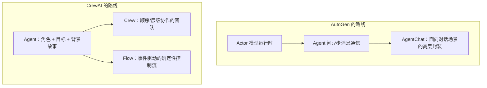

# 第二十章：AutoGen 与 CrewAI 的多智能体抽象

## 20.1 两条多智能体编排路线

[Semantic Kernel · 第十九章](../04-semantic-kernel/19-process-and-agent-framework.md) 已区分协作模式与产品状态。**截至 2026-09-08，AutoGen 官方仓库明确进入 maintenance mode：不再增加新功能或增强，由社区继续维护，官方建议新用户采用 Microsoft Agent Framework，存量用户参考迁移指南。** 这不是「已有代码立刻不能运行」，也不是仍承诺积极新增功能。

本章保留 AutoGen 用于理解和维护既有系统，并与 CrewAI 比较架构；目录名「轻量级」是组织标签，不代表这两者只适合原型或具有低运行成本：

- **AutoGen**：从底层运行时开始设计，把 Agent 之间的通信建模为**异步消息传递的 Actor 模型**，目标是「事件驱动、可分布式部署、可扩展」的多智能体系统；
- **CrewAI**：以角色、任务和 Crew 描述协作，同时提供 Flow 管理流程状态、路由与多个 Crew；可用 Python 或 YAML 定义，不是仅有角色 Prompt 的轻量封装。



## 20.2 AutoGen：分层的运行时——Core 与 AgentChat

这里讨论的是重构后的 AutoGen Core/AgentChat API，不是早期 0.2 的 `ConversableAgent` / `GroupChat` 接口。主要分层如下：

- **Core**：Actor 风格的事件与消息处理抽象，提供本地及分布式运行时；每个 Agent 不是天然一个独立进程，跨语言/跨进程需要对应运行时、消息序列化与部署配置；
- **AgentChat**：基于 Core 的高层 API，包含 `AssistantAgent`、`RoundRobinGroupChat`、`SelectorGroupChat` 等 Agent 和 Team；
- **Extensions**：模型客户端、代码执行器等集成，常见包为 `autogen-ext`。

```python
from autogen_agentchat.agents import AssistantAgent
from autogen_agentchat.conditions import MaxMessageTermination
from autogen_agentchat.teams import RoundRobinGroupChat

researcher = AssistantAgent("researcher", model_client=model_client)
writer = AssistantAgent("writer", model_client=model_client)

team = RoundRobinGroupChat(
    [researcher, writer],
    termination_condition=MaxMessageTermination(max_messages=6),
)
result = await team.run(task="调研并撰写一份市场分析简报")
```

上例是异步片段，需配置 `model_client`，在应用生命周期结束时关闭客户端；研究员若要取得实时资料还需工具。消息上限限制循环，并不保证任务已经完成。`SelectorGroupChat` 可以动态选择发言者，`Swarm` 用 handoff 移交控制权；更换 Team 时也要调整 Agent 的移交配置、消息可见性和终止规则，不是总能只换一行代码。

AutoGen 与 SK group chat 都有发言协调，但 API 和状态格式不同。AgentChat 的进程内 Team 不会因使用 Core 就自动分布式。需要分别验证传输故障、身份认证、消息版本、背压和恢复策略；新系统还应将 MAF 的承接路径计入维护成本。

## 20.3 CrewAI：Crew 处理协作，Flow 处理确定性控制

CrewAI 的核心抽象也分两层，但分工逻辑和 AutoGen 不同：

- **`Crew`**：Agent 执行 Task 的组合。`Process.sequential` 按任务列表的既定顺序执行，任务可指定 Agent 和前置上下文；`Process.hierarchical` 需要 `manager_llm` 或 `manager_agent`，由管理者分派和验收。不能把两者统称为「执行顺序全由 LLM 决定」；
- **`Flow`**：通过 `@start`、`@listen`、`@router` 组织事件依赖、状态和分支，可包含代码、模型或 Crew。显式骨架并不使内部 LLM 或外部 API 的结果确定，更不自动提供事务保证。

```python
from crewai.flow.flow import Flow, listen, start
from crewai import Crew

class ResearchFlow(Flow):
    @start()
    def prepare_topic(self):
        self.state["topic"] = "多智能体框架选型"

    @listen(prepare_topic)
    def run_research_crew(self):
        crew = Crew(agents=[researcher, writer], tasks=[research_task, write_task])
        return crew.kickoff(inputs={"topic": self.state["topic"]})

result = ResearchFlow().kickoff()
```

这里的 `researcher`、`writer` 应预先配置为 CrewAI 的 Agent，任务也应使用 CrewAI Task，不能复用上一段的 AutoGen 对象。启动步骤命名为 `prepare_topic`，避免覆盖 Flow 自身用于启动整个工作流的 `kickoff()` 方法。

这条分层设计把确定性控制和角色协作拆开处理：需要固定顺序执行的步骤交给 Flow，具体子任务里的多 Agent 协作交给 Crew。它与 [LlamaIndex · 第十五章](../02-llamaindex/15-query-engine-workflows.md) 中 Workflows 的定位有相似之处，都是用一层显式的事件驱动骨架包裹内部更不确定的执行细节。

## 20.4 两种路线的工程含义对比

| 维度 | AutoGen | CrewAI |
|---|---|---|
| **核心隐喻** | Actor 模型，Agent 是独立的消息处理单元 | 团队协作，Agent 是带角色的团队成员 |
| **协作策略** | Team 实现及 Agent 的 handoff/消息契约 | Crew 的 sequential/hierarchical；Flow 可组合更广的流程 |
| **确定性控制** | 依赖 Team 策略和消息路由规则 | 依赖 Flow 的显式事件驱动骨架，与 Crew 的角色协作分层 |
| **上手门槛** | AgentChat 可直接使用；下沉 Core 才需更多消息运行时知识 | 角色隐喻方便起步，生产仍需流程、数据与权限设计 |
| **部署边界** | Core 有分布式选项，不代表所有 Team 自动获得分布式语义 | 开源流程与托管/企业部署分开评估，不能只凭 Crew API 判断规模上限 |
| **选型背景** | 存量维护、历史架构研究；新项目官方推荐 MAF | 角色任务协作与显式 Flow 的组合；需测实际成本和恢复能力 |

## 20.5 常见错误

### 20.5.1 认为 AutoGen 的 `GroupChat` 类协作策略只有一种

不同 Team 实现（RoundRobin/Selector/Swarm）适合不同的协作模式，直接套用默认的轮询策略处理需要动态决策「谁该发言」的场景，会导致协作效率低下。

### 20.5.2 只用 Crew 就想获得确定性的业务流程保证

sequential Crew 已有任务顺序，但任务成功、授权和外部写操作原子性不是顺序保证的一部分。Flow 能表达审批门和分支，仍需业务服务实现幂等、补偿和失败处理。

### 20.5.3 忽视 AutoGen Core 和 AgentChat 的层次关系

只看到 AgentChat 的简单 API，误以为 AutoGen 缺乏底层控制能力；实际上需要更细粒度控制时，可以直接使用 Core 层的 Actor 和消息类型。

### 20.5.4 把「角色化」等同于「更聪明」

CrewAI 的 `role`/`goal`/`backstory` 实际上是结构化 Prompt 的组成部分，帮助模型进入特定角色语境，不会改变底层模型本身的推理能力。

## 20.6 多角色何时值得额外成本

先比较单 Agent + 工具的基线。把同一模型复制成三个角色，可能只增加三份相近观点；只有分工带来独立证据、权限隔离、并行吞吐或可验证的审查收益时，才值得新增 Agent。

- **上下文成本**：共享历史会随轮次增长，管理者和选择器也可能调用模型；记录总调用数、输入 token 和 p95 延迟，而不只看最终回答。
- **结束条件**：消息上限、耗时预算、完成判定是不同条件。反复出现相同工具请求时应熔断，而不是让角色继续互相确认。
- **状态恢复**：AutoGen Agent/Team 有 `save_state()` / `load_state()`，不是完全没有持久化接口；保存位置、快照时机和外部副作用去重仍由应用处理。CrewAI Flow 的状态持久化也不能自动恢复每一次内部模型调用。
- **实质审查**：Reviewer 应拿原始证据和验收规则，而不是只看 Writer 的总结，否则双方可能共享同一个错误。代码执行工具需独立隔离与资源限制。

## 20.7 本章总结

1. **AutoGen 从运行时开始设计**，用 Actor 模型实现异步消息通信，Core 层提供事件驱动、可分布式部署的能力，AgentChat 是构建在其上的高层对话式 API；
2. **Team 策略可替换，但状态、handoff 与终止规则需一起验证**；AutoGen 已进入维护模式；
3. **Crew 的顺序/层级 process 与 Flow 显式控制要分开理解**，显式顺序不保证任务结果正确；
4. **CrewAI 不是仅用于原型的轻量角色包装**，AutoGen 也不是新分布式项目的默认答案；
5. **无论哪个框架，多智能体协作的「协作策略」和「确定性控制」都需要分开设计**，不能指望一层抽象同时解决两个问题。

AutoGen 用 Actor 模型处理分布式协作问题，CrewAI 用团队协作隐喻降低多角色流程的搭建门槛；两者的分层设计（Core / AgentChat 与 Crew / Flow）都把「协作灵活性」和「确定性控制」分到不同抽象层承接。

## 参考资料

- [AutoGen 官方文档](https://microsoft.github.io/autogen/stable/)
- [AutoGen: Core 用户指南](https://microsoft.github.io/autogen/stable/user-guide/core-user-guide/index.html)
- [AutoGen: AgentChat 用户指南](https://microsoft.github.io/autogen/stable/user-guide/agentchat-user-guide/index.html)
- [AutoGen 官方仓库：Maintenance Mode](https://github.com/microsoft/autogen)
- [AutoGen → MAF 迁移指南](https://learn.microsoft.com/en-us/agent-framework/migration-guide/from-autogen/)
- [AutoGen: 保存与加载 Agent/Team 状态](https://microsoft.github.io/autogen/stable/user-guide/agentchat-user-guide/tutorial/state.html)
- [CrewAI 官方文档](https://docs.crewai.com/)
- [CrewAI: Flows 概念](https://docs.crewai.com/en/concepts/flows)
- [CrewAI: Crews 概念](https://docs.crewai.com/en/concepts/crews)
- [CrewAI: Processes 的顺序与层级执行](https://docs.crewai.com/en/concepts/processes)

原文与图示：Polo Li，按 [CC BY 4.0](https://creativecommons.org/licenses/by/4.0/) 授权。
