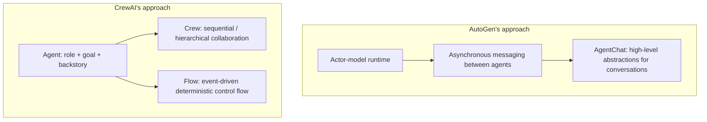

# Chapter 20: Multi-Agent Abstractions in AutoGen and CrewAI

## 20.1 Two approaches to multi-agent orchestration

[Semantic Kernel, Chapter 19](../04-semantic-kernel/19-process-and-agent-framework.md) distinguished collaboration patterns from product status. **AutoGen is now in maintenance mode: it will receive no new features or enhancements and will be community-maintained. The official recommendation is for new users to adopt Microsoft Agent Framework and existing users to consult the migration guide.** This does not mean existing code immediately stops working, nor does it imply a continuing commitment to active feature development.

This chapter retains AutoGen to explain and maintain existing systems and compare its architecture with CrewAI. "Lightweight" in the directory name is an organizational label, not a claim that either framework is suitable only for prototypes or inexpensive to run:

- **AutoGen**: Starts with the underlying runtime, modeling communication between agents as an **Actor model with asynchronous message passing**, targeting event-driven, distributable, scalable multi-agent systems.
- **CrewAI**: Describes collaboration through roles, tasks, and Crews, while also providing Flows to manage process state, routing, and multiple Crews. Definitions can use Python or YAML; it is not merely a lightweight wrapper around role prompts.



## 20.2 AutoGen: a layered runtime—Core and AgentChat

The APIs discussed here are the redesigned AutoGen Core/AgentChat APIs, not the early 0.2 `ConversableAgent` / `GroupChat` interfaces. The main layers are:

- **Core**: Actor-style event and message-processing abstractions with local and distributed runtimes. An agent is not inherently a separate process; cross-language or cross-process operation requires the corresponding runtime, message serialization, and deployment configuration.
- **AgentChat**: A high-level API built on Core, including agents and Teams such as `AssistantAgent`, `RoundRobinGroupChat`, and `SelectorGroupChat`.
- **Extensions**: Integrations such as model clients and code executors, commonly provided through `autogen-ext`.

```python
from autogen_agentchat.agents import AssistantAgent
from autogen_agentchat.conditions import MaxMessageTermination
from autogen_agentchat.teams import RoundRobinGroupChat

researcher = AssistantAgent("researcher", model_client=model_client)
writer = AssistantAgent("writer", model_client=model_client)

team = RoundRobinGroupChat(
    [researcher, writer],
    termination_condition=MaxMessageTermination(max_messages=6),
)
result = await team.run(task="调研并撰写一份市场分析简报")
```

This asynchronous fragment requires a configured `model_client`, which should be closed when the application lifecycle ends. The Chinese task asks for research and a market-analysis brief. The researcher also needs tools to obtain current information. A message limit bounds the loop; it does not guarantee task completion. `SelectorGroupChat` can select speakers dynamically, while `Swarm` transfers control through handoffs. Switching Teams also requires checking the agents' handoff configuration, message visibility, and termination rules; it is not always a one-line replacement.

AutoGen and SK group chat both coordinate speakers, but their APIs and state formats differ. An in-process AgentChat Team does not become distributed automatically because it uses Core. Transport failures, authentication, message versions, backpressure, and recovery strategies require separate verification. New systems should also account for the transition to MAF when estimating maintenance costs.

## 20.3 CrewAI: Crews handle collaboration; Flows handle deterministic control

CrewAI also has two main abstraction layers, but their division of responsibilities differs from AutoGen's:

- **`Crew`**: A composition of Agents executing Tasks. `Process.sequential` follows the predefined order of the task list; tasks can specify an Agent and prerequisite context. `Process.hierarchical` requires `manager_llm` or `manager_agent`, with a manager assigning work and checking its results. It is inaccurate to describe both as having their execution order entirely decided by an LLM.
- **`Flow`**: Uses `@start`, `@listen`, and `@router` to organize event dependencies, state, and branches, which may contain code, models, or Crews. An explicit structure does not make the results of its internal LLMs or external APIs deterministic, much less automatically transactional.

```python
from crewai.flow.flow import Flow, listen, start
from crewai import Crew

class ResearchFlow(Flow):
    @start()
    def prepare_topic(self):
        self.state["topic"] = "多智能体框架选型"

    @listen(prepare_topic)
    def run_research_crew(self):
        crew = Crew(agents=[researcher, writer], tasks=[research_task, write_task])
        return crew.kickoff(inputs={"topic": self.state["topic"]})

result = ResearchFlow().kickoff()
```

Here, `researcher` and `writer` must already be configured as CrewAI Agents, and the tasks must be CrewAI Tasks. The AutoGen objects from the previous fragment cannot be reused. The Chinese topic means "multi-agent framework selection." The starting step is named `prepare_topic` to avoid overriding Flow's own `kickoff()` method, which starts the whole workflow.

This layered design separates deterministic control from role-based collaboration: give steps that need a fixed order to Flow, and give multi-agent collaboration within individual subtasks to Crew. Its purpose resembles Workflows in [LlamaIndex, Chapter 15](../02-llamaindex/15-query-engine-workflows.md): both wrap less predictable internal execution in an explicit event-driven structure.

## 20.4 Engineering implications of the two approaches

| Dimension | AutoGen | CrewAI |
|---|---|---|
| **Core metaphor** | Actor model; each agent is an independent message-processing unit | Team collaboration; each agent is a team member with a role |
| **Collaboration strategy** | Team implementation plus the agents' handoff/message contracts | Sequential/hierarchical Crews; Flows can compose broader processes |
| **Deterministic control** | Depends on Team policies and message-routing rules | Depends on the explicit event-driven Flow structure, separated from role collaboration in Crews |
| **Learning curve** | AgentChat can be used directly; working at the Core layer requires more knowledge of messaging runtimes | Role-based metaphors make it easy to start; production still requires process, data, and authorization design |
| **Deployment boundaries** | Core has distributed options, but not every Team automatically acquires distributed semantics | Evaluate open-source execution separately from hosted/enterprise deployment; the Crew API alone does not establish a scaling limit |
| **Selection context** | Existing-system maintenance and study of historical architectures; the official recommendation for new projects is MAF | Combines role/task collaboration with explicit Flows; actual costs and recovery capabilities need measurement |

## 20.5 Common mistakes

### 20.5.1 Assuming round-robin is AutoGen's only Team strategy

Different Team implementations—RoundRobin, Selector, and Swarm—fit different collaboration patterns. Applying the default round-robin strategy where the next speaker needs to be chosen dynamically can make collaboration inefficient.

### 20.5.2 Expecting a Crew alone to guarantee a deterministic business process

A sequential Crew already provides task ordering, but that guarantee does not include task success, authorization, or atomic external writes. A Flow can express approval gates and branches; business services must still implement idempotency, compensation, and failure handling.

### 20.5.3 Overlooking the relationship between AutoGen Core and AgentChat

Seeing only AgentChat's simple API can create the mistaken impression that AutoGen lacks low-level control. When finer control is needed, the Core layer's actors and message types can be used directly.

### 20.5.4 Equating role assignment with greater intelligence

CrewAI's `role`/`goal`/`backstory` fields are components of a structured prompt. They help establish a role-specific context for the model, but do not change the underlying model's reasoning ability.

## 20.6 When multiple roles justify their extra cost

First compare against a single-agent-plus-tools baseline. Copying the same model into three roles may produce only three similar opinions. Add agents only when the division of labor brings independent evidence, permission isolation, parallel throughput, or a verifiable improvement from review.

- **Context cost**: Shared history grows with the number of rounds; managers and selectors may also call models. Record total calls, input tokens, and p95 latency, not just the final answer.
- **Termination conditions**: Message limits, time budgets, and completion judgments are different conditions. Repeated identical tool requests should trip a circuit breaker rather than letting roles continue confirming one another.
- **State recovery**: AutoGen Agents/Teams have `save_state()` / `load_state()`; they do not lack persistence interfaces altogether. The application still manages where state is saved, when snapshots are taken, and how external side effects are deduplicated. CrewAI Flow state persistence likewise cannot automatically resume every internal model call.
- **Substantive review**: Give the Reviewer original evidence and acceptance rules, not just the Writer's summary, or both may share the same mistake. Code-execution tools need separate isolation and resource limits.

## 20.7 Chapter summary

1. **AutoGen starts from the runtime**, using the Actor model for asynchronous messaging. Core provides event-driven execution and distributed-deployment capabilities; AgentChat is the higher-level conversational API built on top.
2. **Team strategies can be replaced, but state, handoffs, and termination rules must be verified together.** AutoGen is now in maintenance mode.
3. **Understand a Crew's sequential/hierarchical process separately from explicit Flow control.** Explicit ordering does not guarantee correct task results.
4. **CrewAI is not merely a lightweight role wrapper for prototypes**, and AutoGen is not the default answer for new distributed projects.
5. **Every framework requires separate designs for collaboration strategy and deterministic control.** One abstraction should not be expected to solve both problems.

AutoGen uses the Actor model to address distributed collaboration, while CrewAI uses a teamwork metaphor to make multi-role processes easier to assemble. Their layered designs—Core / AgentChat and Crew / Flow—both assign collaboration flexibility and deterministic control to different abstraction layers.

## References

- [AutoGen official documentation](https://microsoft.github.io/autogen/stable/)
- [AutoGen: Core user guide](https://microsoft.github.io/autogen/stable/user-guide/core-user-guide/index.html)
- [AutoGen: AgentChat user guide](https://microsoft.github.io/autogen/stable/user-guide/agentchat-user-guide/index.html)
- [AutoGen official repository: Maintenance Mode, pinned commit](https://github.com/microsoft/autogen/blob/027ecf0a379bcc1d09956d46d12d44a3ad9cee14/README.md)
- [AutoGen → MAF migration guide](https://learn.microsoft.com/en-us/agent-framework/migration-guide/from-autogen/)
- [AutoGen: Saving and loading Agent/Team state](https://microsoft.github.io/autogen/stable/user-guide/agentchat-user-guide/tutorial/state.html)
- [CrewAI official documentation](https://docs.crewai.com/)
- [CrewAI: Flow concepts](https://docs.crewai.com/en/concepts/flows)
- [CrewAI: Crew concepts](https://docs.crewai.com/en/concepts/crews)
- [CrewAI: Sequential and hierarchical Processes](https://docs.crewai.com/en/concepts/processes)

Version note: AutoGen's maintenance mode and successor recommendation were checked against the pinned commit above on 2026-09-15. The code in this chapter retains the Core/AgentChat generation of APIs rather than rewriting it into MAF APIs.
