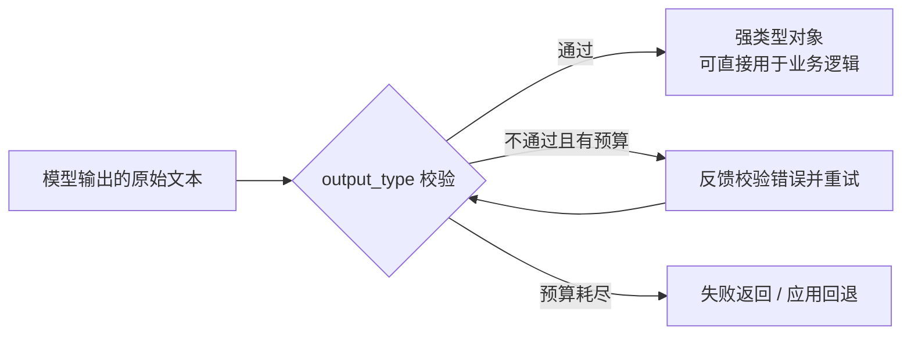

# 第二十一章：PydanticAI 的类型安全范式与三者适用边界

## 21.1 第三种路线：把「协作」问题换成「正确性」问题

PydanticAI 以 Python 类型、工具和依赖注入组织 Agent，但不只支持无状态的单 Agent 调用：它也支持会话历史、多 Agent 组合和持久执行集成。本章从单个 Agent 的可测试边界切入，再看这些能力如何扩展。

这里的类型安全包括静态检查与运行时校验，不代表自然语言输入或模型推断自动获得事实正确性。

## 21.2 核心设计：`Agent`、`output_type` 与依赖注入

PydanticAI 的 `Agent` 对象接受一个 `output_type`（通常是 Pydantic `BaseModel`），运行结果会被自动校验并转换成对应类型，而不是返回一段需要自己解析的原始字符串：

```python
from typing import Literal
from dataclasses import dataclass
import os
from pydantic import BaseModel, Field
from pydantic_ai import Agent, RunContext

class Sentiment(BaseModel):
    label: Literal["positive", "negative", "neutral"]
    score: float = Field(ge=-1, le=1)

@dataclass
class ReviewDeps:
    reviews: dict[str, list[str]]

agent = Agent(
    os.environ["PYDANTIC_AI_MODEL"],
    deps_type=ReviewDeps,
    output_type=Sentiment,
    retries=2,
)

@agent.tool
def recent_reviews(ctx: RunContext[ReviewDeps], product: str) -> list[str]:
    """获取某个产品的近期评论片段。"""
    return ctx.deps.reviews.get(product, [])

result = agent.run_sync(
    "请根据近期评论评价产品 keyboard。",
    deps=ReviewDeps(reviews={"keyboard": ["按键手感很好", "声音有点大"]}),
)
print(result.output.label, result.output.score)
```

先设置 `PYDANTIC_AI_MODEL` 为官方支持且账户可用的 `provider:model` 标识，并配置凭据；不要把 CLI 模型别名当成供应商 API 模型名。这里用内存数据演示可替换依赖，生产可改成带请求身份的只读服务。已有异步事件循环中应 `await agent.run(...)`，不要调用 `run_sync()`。

这里有两个工程上直接相关的点：

1. **`@agent.tool` 装饰的函数签名和 docstring 直接生成工具 Schema**——这和 [Tools 主题](../../tools/README.md) 中 Function Calling 的 Schema 设计原则完全一致，PydanticAI 没有发明新协议，只是让 Schema 生成过程和 Python 类型注解无缝衔接；
2. **`RunContext` 是依赖注入的入口**——工具函数通过 `ctx.deps` 访问运行时注入的依赖（数据库连接、当前用户身份等），这些依赖在测试时可以被替换成 mock 对象，不需要真的连接外部系统就能验证 Agent 的调用逻辑。

## 21.3 类型安全带来的工程收益



当输出不满足约束时，框架可以将校验错误反馈给模型并有限重试；预算耗尽仍会失败，需要应用处理。工具输出、供应商原生结构化输出、提示式输出有不同支持条件，不能假定所有模型都执行同一种严格 JSON Schema 约束。静态类型工具能检查调用代码，不会验证外部事实。

可用 output validator 检查跨字段业务约束，并以 `ModelRetry` 请求修正；如果证据本身不足，则应拒答而非无限重试。重试同样增加 token、延迟，不能绕过单请求预算。

## 21.4 决策矩阵：AutoGen、CrewAI、PydanticAI 与本主题其他框架的适用边界

把本模块两章和前几个模块放在一起，可以按六个工程维度画出一张对照表（更完整的跨全部框架对照见 [框架选型与可移植架构 · 第二十二章](../06-selection-portability/22-cross-framework-technical-taxonomy.md)）：

| 维度 | AutoGen | CrewAI | PydanticAI | Semantic Kernel | LangGraph |
|---|---|---|---|---|---|
| **核心抽象** | Core 消息 / AgentChat Team | Agent、Task、Crew、Flow | 类型化 Agent 与依赖 | Kernel、Plugin、Process / Agent | 状态图 |
| **状态模型** | Agent 内部状态及 Team 消息 | Task 输出、记忆与 Flow state | Run、消息历史、依赖；三者职责不同 | 按具体 Agent/Process 建模 | 状态通道与 reducer |
| **恢复入口** | `save_state` / `load_state`，应用管理存储 | Flow 持久化，不等于内部每次调用检查点 | 官方 durable execution 集成，如 Temporal、DBOS、Prefect | 核对实验功能及运行时，不笼统承诺 | checkpointer，仍需持久后端 |
| **工具契约** | AgentChat 工具与 Core 消息分层 | Tool / 参数 Schema | 类型注解、Pydantic、业务 validator | KernelFunction 与 Plugin | Tool Schema 与工具执行 |
| **观测接入** | Core 有遥测，需配置导出 | Flow/Crew 追踪与可观测性集成 | Logfire / OpenTelemetry | OpenTelemetry / Application Insights | LangSmith / 其他集成 |
| **迁移负担** | 消息、Team 策略；维护模式需评估 MAF | Task 上下文、Flow 状态和运行服务 | 消息格式、重试/工具语义、持久执行后端 | Plugin、Filter、线程及 MAF 迁移 | reducer、检查点与中断语义 |

这是核对清单，不是「最严格/最成熟/最低锁定」排名。新 .NET/Python 项目应另外评估 [MAF](../04-semantic-kernel/19-process-and-agent-framework.md)，不要默认选处于维护模式的 AutoGen 或 SK 实验 Process。PydanticAI 的持久执行也需要部署相应引擎，运维负担并未因为提供集成而消失。

已有会话可通过 `message_history` 传给下一次 run；这与依赖注入不同，也不等于崩溃恢复。恢复长任务时要按 Temporal、DBOS 等后端的语义划定可重放步骤，避免把数据库连接或授权令牌作为历史数据持久保存。

## 21.5 常见错误

### 21.5.1 认为类型校验能替代模型能力评测

`output_type` 校验能保证「格式正确」，不能保证「内容正确」——一个格式完全合法但语义错误的 `Sentiment` 对象照样能通过校验，仍然需要独立的评测流程判断内容质量。

### 21.5.2 把依赖注入当作可选的代码风格

`RunContext` 是一种方便的可测试边界，并非唯一方法；普通函数参数或服务适配器也能隔离依赖。关键是不要把用户身份与全局可变连接耦合，让测试可以替换外部服务。

### 21.5.3 只看决策矩阵的单一维度就下结论

Python 类型容易复用，不代表会话格式、工具重试与持久运行时可以零成本迁移。应按具体集成评估，而不是把 PydanticAI 一概归为「无状态、恢复全自建」。

### 21.5.4 把角色化框架的「团队隐喻」当作技术架构本身

CrewAI 的 `role`/`goal`/`backstory` 是 Prompt 工程的组织方式，不代表底层有类似人类团队的组织架构或权限体系，不能替代真实的权限与审批设计。

类型系统相关的追问应落到失败样本：合法的 `score=0.9` 能否证明评论积极？能否通过 validator 检测相互矛盾字段？若校验期间查询订单状态发生变化，结果该按哪个版本提交？前两项由评测和业务校验覆盖，最后一项需要业务事务或版本检查，不能靠 Pydantic 类型解决。

## 21.6 本章总结

1. **PydanticAI 把「Agent 开发」重新定义为「类型安全的函数调用」**：`output_type` 保证输出可被自动校验并重试，`RunContext` 提供可测试的依赖注入入口；
2. **类型注解帮助生成工具 Schema**，供应商支持的 Schema 子集、输出模式和校验语义仍需核对；
3. **类型校验解决的是「格式正确性」，不是「内容正确性」**，仍然需要独立的评测体系判断语义质量；
4. **AutoGen、CrewAI、PydanticAI 在状态模型、持久化、工具契约、可观测性和 lock-in 风险上呈现出明显不同的取舍**，没有一个框架在全部维度上都最优；
5. **框架选型应该先明确项目最看重的两三个维度**，再对照决策矩阵找最匹配的框架，而不是寻找一个「全能」选项。

如果说 AutoGen 和 CrewAI 主要回答「多个 Agent 怎么协作」，那么 PydanticAI 处理的是另一层问题：单个 Agent 的输入输出能否获得和普通 Python 函数类似的类型安全保障。三者对应的是不同优化方向，而不是同一赛道上的直接替代关系。

## 参考资料

- [PydanticAI 官方文档](https://ai.pydantic.dev/)
- [PydanticAI: Agents 核心概念](https://pydantic.dev/docs/ai/core-concepts/agent/)
- [PydanticAI: Function Tools](https://ai.pydantic.dev/tools/)
- [PydanticAI: Dependencies 依赖注入](https://ai.pydantic.dev/dependencies/)
- [AutoGen 官方文档](https://microsoft.github.io/autogen/stable/)
- [CrewAI 官方文档](https://docs.crewai.com/)
- [PydanticAI: 输出模式与校验](https://pydantic.dev/docs/ai/core-concepts/output/)
- [PydanticAI: Durable Execution](https://pydantic.dev/docs/ai/capabilities/durable_execution/overview/)
- [AutoGen: State](https://microsoft.github.io/autogen/stable/user-guide/agentchat-user-guide/tutorial/state.html)

原文与图示：Polo Li，按 [CC BY 4.0](https://creativecommons.org/licenses/by/4.0/) 授权。
