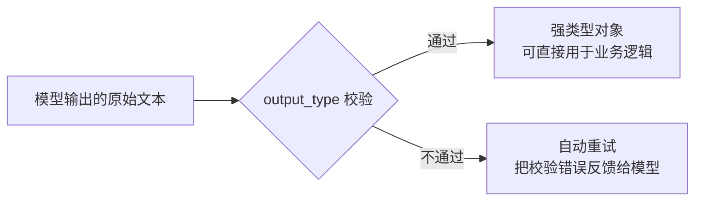

# 第二十一章：PydanticAI 的类型安全范式与三者适用边界

## 21.1 第三种回答:把「协作」问题换成「正确性」问题

第二十章的 AutoGen 和 CrewAI 都在回答「多个 Agent 怎么协作」。PydanticAI 关心的是另一个经常被忽视的问题：**单个 Agent 的输入输出,能不能像调用一个普通函数一样被类型系统和运行时校验覆盖**。它的立足点是 Pydantic——Python 生态里最常用的数据校验库——把同一套「用类型注解声明数据形状,运行时自动校验」的思路,搬到了 Agent 开发上。

> **PydanticAI 官方把自己定位为「Python 的 AI SDK：一个类型化、可扩展的 Agent 循环」**——通篇文档都在强调「typed end to end」(端到端类型化),这是它和本主题里其他框架相比最鲜明的差异化定位。

## 21.2 核心设计:`Agent`、`output_type` 与依赖注入

PydanticAI 的 `Agent` 对象接受一个 `output_type`(通常是 Pydantic `BaseModel`),运行结果会被自动校验并转换成对应的类型,而不是一段需要自己解析的原始字符串:

```python
from typing import Literal
from pydantic import BaseModel, Field
from pydantic_ai import Agent, RunContext

class Sentiment(BaseModel):
    label: Literal["positive", "negative", "neutral"]
    score: float = Field(ge=-1, le=1)

agent = Agent("openai:gpt-5.6-sol", output_type=Sentiment)

@agent.tool
def recent_reviews(ctx: RunContext[None], product: str) -> list[str]:
    """获取某个产品的近期评论片段。"""
    return review_service.fetch(product)

result = agent.run_sync("最近大家对这款产品的评价怎么样？")
print(result.output.label, result.output.score)
```

**两个细节值得展开**：

1. **`@agent.tool` 装饰的函数签名和 docstring 直接生成工具 Schema**——这和 [Tools 主题](../../tools/README.md) 中 Function Calling 的 Schema 设计原则完全一致，PydanticAI 没有发明新协议，只是让 Schema 生成过程和 Python 类型注解无缝衔接；
2. **`RunContext` 是依赖注入的入口**——工具函数通过 `ctx.deps` 访问运行时注入的依赖（数据库连接、当前用户身份等），这些依赖在测试时可以被替换成 mock 对象，不需要真的连接外部系统就能验证 Agent 的调用逻辑。

## 21.3 类型安全带来的工程收益



当模型的输出不满足 `output_type` 声明的约束（比如 `score` 超出了 `[-1, 1]` 范围），PydanticAI 会把校验错误反馈给模型并触发重试，**这个反馈闭环本身发生在框架内部，不需要开发者手写「解析失败就重新提示模型」的样板代码**。这与 [LangChain 生态 · 第四章](../01-langchain/02-agent-building/04-build-agent.md) 中结构化输出的处理方式目标一致，区别在于 PydanticAI 把这层校验做得更贴近 Python 静态类型工具链（配合 `mypy`/`pyright` 可以在编写阶段就发现类型不匹配问题）。

## 21.4 决策矩阵：AutoGen、CrewAI、PydanticAI 与本主题其他框架的适用边界

把本模块两章和前几个模块放在一起,可以按六个工程维度画出一张对照表(更完整的跨全部框架对照见 [框架选型与可移植架构 · 第二十二章](../06-selection-portability/22-cross-framework-technical-taxonomy.md)):

| 维度 | AutoGen | CrewAI | PydanticAI | Semantic Kernel | LangGraph |
|---|---|---|---|---|---|
| **核心问题** | 分布式多智能体协作 | 角色化团队协作 + 确定性 Flow | 单 Agent 的类型安全与工具契约 | 企业级流程与多智能体编排 | 通用状态图编排 |
| **状态模型** | Actor 间异步消息 | Crew 内隐式、Flow 内显式状态 | 单次 Run 的依赖注入上下文 | Process 的显式状态转移 | 显式共享 `State` |
| **持久化** | 需要外部方案 | Flow 状态可持久化，Crew 内部有限 | 需要外部方案（框架本身偏无状态单次调用） | Process 原生支持持久化与恢复 | Checkpointer 原生支持 |
| **工具契约** | 消息驱动的函数调用 | 标准 Function Calling | 类型注解直接生成 Schema，校验最严格 | Plugin 统一 Semantic/Native Function | 标准 Function Calling |
| **评测/可观测性** | 依赖外部 Tracing 集成 | 内置 Trace，但生态工具相对年轻 | 与 Pydantic Logfire 等工具集成较紧密 | 与 Application Insights 等企业遥测集成 | LangSmith 原生集成最成熟 |
| **Lock-in 风险** | 中等：Actor 消息格式有一定绑定 | 中等：YAML 配置和角色隐喻绑定较深 | 较低：核心是标准 Python 类型和函数 | 较高：企业治理能力换来生态绑定 | 中等：State/Checkpointer 格式有一定绑定 |

> **这张表最重要的结论不是「哪个更好」，而是「没有一个框架同时在六个维度都最优」**——需要长期持久化和恢复能力,LangGraph 或 Semantic Kernel Process Framework 更合适;需要严格的类型安全和最小的框架绑定,PydanticAI 更合适;需要快速验证角色化协作,CrewAI 更合适;需要真正的分布式部署,AutoGen 更合适。选型应该先明确项目最看重哪两三个维度,而不是找一个「全能」框架。

## 21.5 常见错误

### 21.5.1 认为类型校验能替代模型能力评测

`output_type` 校验能保证「格式正确」，不能保证「内容正确」——一个格式完全合法但语义错误的 `Sentiment` 对象照样能通过校验，仍然需要独立的评测流程判断内容质量。

### 21.5.2 把依赖注入当作可选的代码风格

不使用 `RunContext` 注入依赖，直接在工具函数里硬编码数据库连接或全局变量，会让单元测试必须依赖真实外部系统，失去类型安全设计本来要解决的可测试性收益。

### 21.5.3 只看决策矩阵的单一维度就下结论

比如只看到「Lock-in 风险较低」就认定 PydanticAI 全面适合所有场景，忽视了它在长期持久化和多智能体协作上需要额外自建方案的事实。

### 21.5.4 把角色化框架的「团队隐喻」当作技术架构本身

CrewAI 的 `role`/`goal`/`backstory` 是 Prompt 工程的组织方式,不代表底层有类似人类团队的组织架构或权限体系,不能替代真实的权限与审批设计。

## 21.6 本章总结

1. **PydanticAI 把「Agent 开发」重新定义为「类型安全的函数调用」**：`output_type` 保证输出可被自动校验并重试,`RunContext` 提供可测试的依赖注入入口；
2. **它的工具 Schema 生成方式与 Function Calling 协议完全兼容**，没有发明新协议，只是让类型注解和 Schema 生成无缝衔接；
3. **类型校验解决的是「格式正确性」，不是「内容正确性」**，仍然需要独立的评测体系判断语义质量；
4. **AutoGen、CrewAI、PydanticAI 在状态模型、持久化、工具契约、可观测性和 lock-in 风险上呈现出明显不同的取舍**，没有一个框架在全部维度上都最优；
5. **框架选型应该先明确项目最看重的两三个维度**，再对照决策矩阵找最匹配的框架,而不是寻找一个「全能」选项。

> **一句话概括：如果说 AutoGen 和 CrewAI 是在回答「多个 Agent 怎么协作」，PydanticAI 回答的是一个更基础但同样重要的问题——「一个 Agent 的输入输出，能不能享受到和普通 Python 函数一样的类型安全保障」，三者代表了多智能体框架设计空间里三个不同的优化方向，而不是同一赛道上的竞争者。**

## 参考资料

- [PydanticAI 官方文档](https://ai.pydantic.dev/)
- [PydanticAI: Agents 核心概念](https://ai.pydantic.dev/agents/)
- [PydanticAI: Function Tools](https://ai.pydantic.dev/tools/)
- [PydanticAI: Dependencies 依赖注入](https://ai.pydantic.dev/dependencies/)
- [AutoGen 官方文档](https://microsoft.github.io/autogen/stable/)
- [CrewAI 官方文档](https://docs.crewai.com/)
