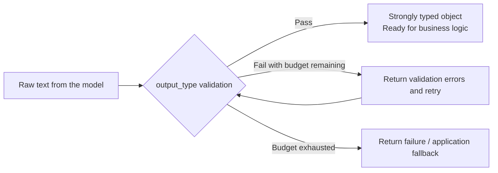

# Chapter 21: PydanticAI's Type-Safe Approach and Where the Three Frameworks Fit

## 21.1 A third approach: shifting from collaboration to correctness

PydanticAI organizes agents around Python types, tools, and dependency injection, but it is not limited to stateless, single-agent calls. It also supports conversation history, multi-agent composition, and durable-execution integrations. This chapter starts with the testable boundaries of a single agent, then considers how those capabilities extend.

Type safety here includes static checking and runtime validation. It does not automatically make natural-language inputs or model inference factually correct.

## 21.2 Core design: `Agent`, `output_type`, and dependency injection

PydanticAI's `Agent` accepts an `output_type`, usually a Pydantic `BaseModel`. Run results are automatically validated and converted to that type, rather than returned as a raw string you must parse yourself:

```python
from typing import Literal
from dataclasses import dataclass
import os
from pydantic import BaseModel, Field
from pydantic_ai import Agent, RunContext

class Sentiment(BaseModel):
    label: Literal["positive", "negative", "neutral"]
    score: float = Field(ge=-1, le=1)

@dataclass
class ReviewDeps:
    reviews: dict[str, list[str]]

agent = Agent(
    os.environ["PYDANTIC_AI_MODEL"],
    deps_type=ReviewDeps,
    output_type=Sentiment,
    retries=2,
)

@agent.tool
def recent_reviews(ctx: RunContext[ReviewDeps], product: str) -> list[str]:
    """Fetch recent review excerpts for a product."""
    return ctx.deps.reviews.get(product, [])

result = agent.run_sync(
    "请根据近期评论评价产品 keyboard。",
    deps=ReviewDeps(reviews={"keyboard": ["按键手感很好", "声音有点大"]}),
)
print(result.output.label, result.output.score)
```

First set `PYDANTIC_AI_MODEL` to an officially supported `provider:model` identifier available to your account, and configure credentials. A CLI model alias is not a provider API model name. This example uses in-memory data to demonstrate replaceable dependencies; production code could use a read-only service carrying the request's identity instead. The Chinese prompt asks for an assessment of `keyboard` based on recent reviews; the two excerpts say that the keys feel good and that they are a little loud. Inside an existing asynchronous event loop, use `await agent.run(...)`, not `run_sync()`.

Two points have immediate engineering implications:

1. **The signature and docstring of an `@agent.tool` function directly generate its tool schema.** This follows the same function-calling schema design principles discussed in the [Tools topic](../../tools/README.md). PydanticAI does not invent a new protocol; it connects schema generation directly to Python type annotations.
2. **`RunContext` is the entry point for dependency injection.** Tool functions use `ctx.deps` to access dependencies injected at runtime, such as database connections or the current user's identity. Tests can replace these dependencies with mocks, allowing the agent's call logic to be checked without connecting to external systems.

## 21.3 Engineering benefits of type safety



When an output violates constraints, the framework can feed validation errors back to the model and retry within a limit. Exhausting the budget still produces a failure the application must handle. Tool-based output, provider-native structured output, and prompted output have different support requirements; do not assume every model enforces the same strict JSON Schema constraints. Static typing tools can check the calling code, not external facts.

An output validator can check cross-field business constraints and request a correction with `ModelRetry`. If the evidence itself is insufficient, however, the agent should decline to answer rather than retry indefinitely. Retries also consume tokens and add latency; they cannot bypass the per-request budget.

## 21.4 What else matters beyond typed interfaces?

Compare state ownership, the granularity of recovery after failure, and migration costs for tools and observability data. The following three-step checklist helps; [Chapter 22](../06-selection-portability/22-cross-framework-technical-taxonomy.md) compares the full set of frameworks.

**Start with state: which objects does the framework provide, and where does run data live?**

| Framework | Core abstractions | State model |
|---|---|---|
| AutoGen | Core messages / AgentChat Teams | Internal agent state and Team messages |
| CrewAI | Agent, Task, Crew, Flow | Task outputs, memory, and Flow state |
| PydanticAI | Typed agents and dependencies | Runs, message history, and dependencies, each with a different responsibility |
| Semantic Kernel | Kernel, Plugin, Process / Agent | Modeled according to the particular Agent/Process |
| LangGraph | State graph | State channels and reducers |

**Then examine recovery: saving data does not mean execution can resume from any intermediate step.**

| Framework | Recovery entry point |
|---|---|
| AutoGen | `save_state` / `load_state`, with application-managed storage |
| CrewAI | Flow persistence, not a checkpoint for every internal call |
| PydanticAI | Official durable-execution integrations such as Temporal, DBOS, and Prefect |
| Semantic Kernel | Check the experimental feature and runtime rather than making a blanket promise |
| LangGraph | A checkpointer, still requiring a persistent backend |

**Finally, inspect tools and operational assets: what can be retained, and what needs new adapters?**

| Framework | Tool and observability integration | Main migration burden |
|---|---|---|
| AutoGen | AgentChat tools and Core messages occupy different layers; Core telemetry requires export configuration | Messages and Team policies; maintenance mode requires evaluating MAF |
| CrewAI | Tools / parameter schemas; Flow/Crew tracing integrations | Task context, Flow state, and execution services |
| PydanticAI | Type annotations, Pydantic, business validators; Logfire / OpenTelemetry | Message formats, retry/tool semantics, and durable-execution backends |
| Semantic Kernel | KernelFunction and Plugin; OpenTelemetry / Application Insights | Plugins, Filters, threads, and MAF migration |
| LangGraph | Tool schemas and execution nodes can be integrated; LangSmith / other integrations | Reducers, checkpoints, and interrupt semantics |

This is a checklist, not a ranking of "strictest," "most mature," or "least lock-in." New .NET/Python projects should also evaluate [MAF](../04-semantic-kernel/19-process-and-agent-framework.md) rather than defaulting to AutoGen in maintenance mode or experimental SK Process. PydanticAI's durable execution still requires deployment of the corresponding engine; an integration does not remove the operational burden.

An existing conversation can be passed to the next run through `message_history`. This is different from dependency injection and is not crash recovery. When recovering a long-running task, define replayable steps according to the semantics of the chosen backend, such as Temporal or DBOS. Avoid persisting database connections or authorization tokens as historical data.

## 21.5 Common mistakes

### 21.5.1 Assuming type validation can replace model-capability evaluation

`output_type` validation can ensure a valid format, not correct content. A perfectly well-formed but semantically wrong `Sentiment` object can still pass validation. Content quality still needs an independent evaluation process.

### 21.5.2 Treating dependency injection as an optional coding style

`RunContext` provides a convenient testable boundary, but it is not the only approach: ordinary function parameters or service adapters can also isolate dependencies. The key is to avoid coupling user identity to globally mutable connections and to let tests substitute external services.

### 21.5.3 Drawing a conclusion from just one dimension of the matrix

Python types may be easy to reuse, but that does not make session formats, tool retries, or durable runtimes free to migrate. Evaluate specific integrations rather than categorically describing PydanticAI as "stateless, with all recovery left to custom code."

### 21.5.4 Mistaking a role-based framework's team metaphor for its technical architecture

CrewAI's `role`/`goal`/`backstory` fields organize prompt engineering. They do not imply an underlying organizational structure or permission system like a human team's, and cannot replace actual authorization and approval design.

Follow-up questions about type systems should focus on failure cases: Does a valid `score=0.9` prove that a review is positive? Can a validator detect contradictory fields? If an order's status changes while validation is querying it, which version should govern the commit? Evaluation and business validation address the first two; the last needs a business transaction or version check, not Pydantic types alone.

## 21.6 Chapter summary

1. **PydanticAI organizes agent calls through typed interfaces.** `output_type` declares the output contract, validation failures can trigger bounded retries, and `RunContext` provides a testable dependency-injection entry point.
2. **Type annotations help generate tool schemas.** The provider's supported schema subset, output mode, and validation semantics still require verification.
3. **Type validation addresses format correctness, not content correctness.** Semantic quality still needs independent evaluation.
4. **AutoGen, CrewAI, and PydanticAI make noticeably different tradeoffs in state models, persistence, tool contracts, observability, and lock-in risk.** No framework is best on every dimension.
5. **Framework selection should start with the two or three dimensions that matter most to the project.** Then use the matrix to find the closest fit rather than searching for an all-purpose winner.

Where AutoGen and CrewAI primarily address how multiple agents collaborate, PydanticAI addresses a different layer: whether a single agent's inputs and outputs can have type-safety guarantees resembling those of ordinary Python functions. The three optimize for different concerns rather than being direct substitutes in a single category.

## References

- [PydanticAI official documentation](https://ai.pydantic.dev/)
- [PydanticAI: Core Agent concepts](https://pydantic.dev/docs/ai/core-concepts/agent/)
- [PydanticAI: Function Tools](https://ai.pydantic.dev/tools/)
- [PydanticAI: Dependency injection](https://ai.pydantic.dev/dependencies/)
- [AutoGen official documentation](https://microsoft.github.io/autogen/stable/)
- [CrewAI official documentation](https://docs.crewai.com/)
- [PydanticAI: Output modes and validation](https://pydantic.dev/docs/ai/core-concepts/output/)
- [PydanticAI: Durable Execution](https://pydantic.dev/docs/ai/capabilities/durable_execution/overview/)
- [AutoGen: State](https://microsoft.github.io/autogen/stable/user-guide/agentchat-user-guide/tutorial/state.html)
