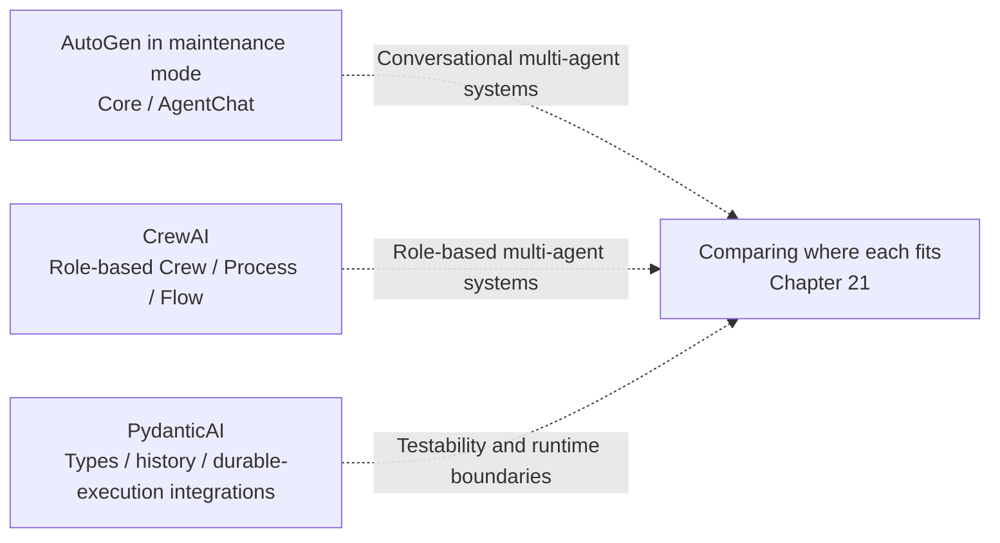

# Frameworks and Orchestration · Lightweight Agent Frameworks: AutoGen, CrewAI, and PydanticAI

"Lightweight" is a reading group, not a strict technical category. AutoGen has a messaging runtime, CrewAI has Crews and Flows, and PydanticAI also has multi-agent and durable-execution integrations. The label does not imply that these frameworks are suitable only for prototypes or individual calls.

AutoGen is now in maintenance mode, and its official recommendation is for new users to adopt Microsoft Agent Framework; version sources appear in Chapter 20's references. This module discusses both existing abstractions and choices for new projects. The number of roles, type validation, and runtime reliability should be evaluated separately.

## Chapters

1. [Chapter 20: Multi-Agent Abstractions in AutoGen and CrewAI](20-autogen-and-crewai.md)
2. [Chapter 21: PydanticAI's Type-Safe Approach and Where the Three Frameworks Fit](21-pydanticai-and-decision-matrix.md)

## How the pieces fit together

## Reading suggestions

- If you need multiple agents to collaborate, read Chapter 20 to compare messaging strategies, task ordering, and Flow control, then check the benefits against a single-agent baseline.
- If your focus is engineering correctness for one agent—types, validation, and dependency injection—go directly to the first half of Chapter 21.
- If you are choosing a framework and are unsure which to use, start with Chapter 21's decision matrix, then consult [Framework Selection and Portable Architectures](../06-selection-portability/README.md) for a unified comparison across all frameworks.

Return to [AI Frameworks and Orchestration topics](../README.md).
