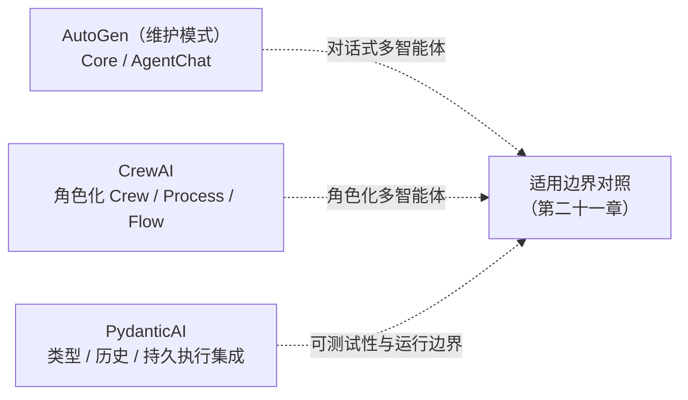

# 框架与编排 · 轻量级 Agent 框架：AutoGen、CrewAI 与 PydanticAI

「轻量级」是阅读分组，不是严格的技术分类：AutoGen 有消息运行时，CrewAI 有 Crew 与 Flow，PydanticAI 也有多 Agent 和持久执行集成，不能据此断言只适合原型或单次调用。

AutoGen 已进入维护模式，官方建议新用户采用 Microsoft Agent Framework，版本来源见第二十章参考资料。本模块同时讨论存量抽象与新项目选型；角色数量、类型校验与运行可靠性应分别评估。

## 章节

1. [第二十章：AutoGen 与 CrewAI 的多智能体抽象](20-autogen-and-crewai.md)
2. [第二十一章：PydanticAI 的类型安全范式与三者适用边界](21-pydanticai-and-decision-matrix.md)

## 模块关系

## 阅读建议

- 如果需要多个 Agent 协作，可读第二十章，对比消息策略、任务顺序和 Flow 控制，并用单 Agent 基线核对收益；
- 如果更关心单 Agent 的工程正确性（类型、校验、依赖注入），可直接读第二十一章前半部分；
- 如果正在选型、不确定用哪个，可直接看第二十一章的决策矩阵，再跳转 [框架选型与可移植架构](../06-selection-portability/README.md) 看跨全部框架的统一对照。

返回 [AI 框架与编排 相关知识点](../README.md)。
