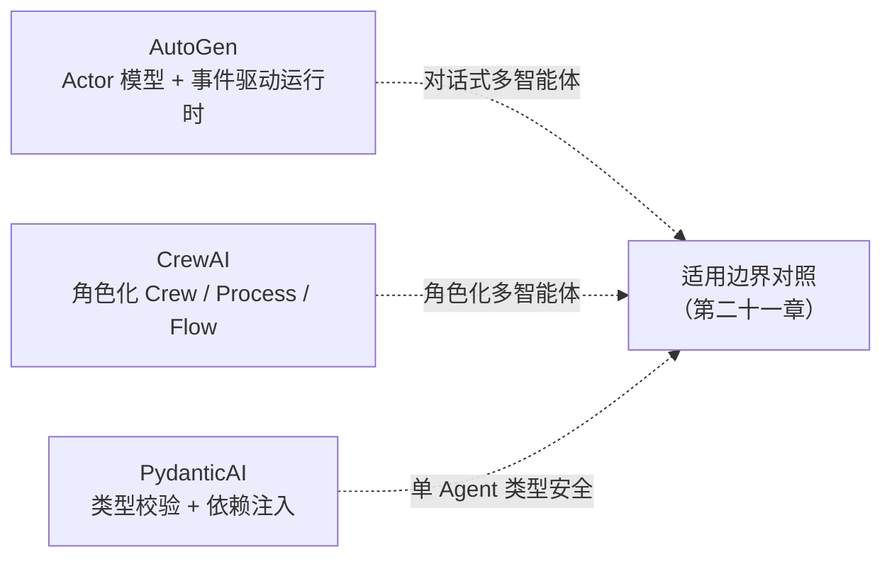

# 框架与编排 · 轻量级 Agent 框架：AutoGen、CrewAI 与 PydanticAI

前四个模块的框架覆盖了编排、数据层或企业中间件等多个层面。本模块涉及的三个框架更聚焦：它们主要解决「多智能体协作」或「单个 Agent 的类型安全」，数据处理、生产可观测性等能力通常需要外部组件补齐。阅读时更值得关注能力边界，而不只是 API 名称。

## 章节

1. [第二十章：AutoGen 与 CrewAI 的多智能体抽象](20-autogen-and-crewai.md)
2. [第二十一章：PydanticAI 的类型安全范式与三者适用边界](21-pydanticai-and-decision-matrix.md)

## 模块关系

## 阅读建议

- 如果需要多个 Agent 协作，可读第二十章，对比「分布式 / 事件驱动」和「角色化快速搭建」两种路线；
- 如果更关心单 Agent 的工程正确性（类型、校验、依赖注入），可直接读第二十一章前半部分；
- 如果正在选型、不确定用哪个，可直接看第二十一章的决策矩阵，再跳转 [框架选型与可移植架构](../06-selection-portability/README.md) 看跨全部框架的统一对照。

返回 [AI 框架与编排 相关知识点](../README.md)。
