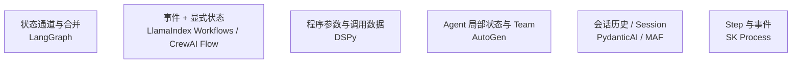

# 第二十二章：跨框架技术解构：状态、持久化、工具契约与可观测性

## 22.1 为什么不能只按功能清单比较框架

前五个模块已经分别讲过每个框架的核心抽象。如果把它们记成一份产品清单——「LangChain 是通用 Agent 框架」「LlamaIndex 是 RAG 框架」「AutoGen 是多智能体框架」——这种分类很快就会失效：**几乎每个框架都在往相邻能力范围扩张**（LlamaIndex 有 Agent 和 Workflows，LangChain 有完整的检索组件，Semantic Kernel 既能做流程编排又能做多智能体协作）。功能清单式的比较会不断过时，也回答不了真正影响工程决策的问题：**如果今天选了 A，明天需要迁移到 B，代价落在哪些地方？**

本章从四组工程维度比较实现约束，评测与可观测性放在同一组，但它们不是同一功能。这里不作框架成熟度排名；MAF 已作为 SK/AutoGen 后继进入新选型范围，AutoGen 已处于维护模式。

## 22.2 维度一：状态模型

「状态」指的是一次多步骤执行过程中，需要在步骤之间传递和积累的数据。各框架对「状态」的建模方式，决定了它的可调试性和扩展性：

| 框架 | 状态模型 | 特点 |
|---|---|---|
| LangGraph | Schema 定义状态通道，节点返回更新，由 reducer 合并 | 不是多个节点随意修改同一可变对象；并行写入要定义合并规则 |
| LlamaIndex Workflows | 类型化 Event + 共享 `Context` / `ctx.store` | 可定义 Pydantic 状态；事件驱动不等于无 Schema |
| DSPy | Module 参数及普通 Python 调用数据 | 指令/示例是程序参数，不应与每次请求状态、会话记忆混淆 |
| SK Process Framework | Step 局部状态与 Event | 实验性流程能力，具体语义需按语言包和运行时核对 |
| Microsoft Agent Framework | AgentSession 与 Workflow 执行状态 | 会话上下文和工作流检查点有不同用途 |
| AutoGen Core / AgentChat | Agent 状态、消息和 Team 协调状态 | Core 消息模型与 AgentChat 高层状态不能混为一谈 |
| CrewAI | Task 输出/上下文与 Flow 的字典或类型化 state | sequential Crew 也有显式任务顺序，不是完全隐式协作 |
| PydanticAI | Run、可传递的 message history 和依赖 | 支持多轮与 durable execution；依赖对象不等于可持久会话 |

这些是侧重点，不是互斥类别。调试要同时观察状态快照和事件/消息轨迹；有共享状态却不记录谁更新了它，也很难解释问题。选型时可要求团队画出一次请求的状态所有者、并发合并规则和最终提交点。

## 22.3 维度二：持久化

持久化为恢复提供数据基础，但还要由运行时解释这些数据并决定下一步。比较时，应同时问「保存了什么」和「恢复后会重做什么」：

| 框架 | 持久化机制 | 恢复粒度 |
|---|---|---|
| LangGraph | checkpointer 保存 super-step 检查点及相关任务写入 | 从可用检查点恢复；不是任意代码行回滚，也不会撤销已执行工具 |
| SK Process Framework | 按所选实验包/运行时评估状态存储 | 不能由 Step/Event API 推断完整故障恢复保证 |
| Microsoft Agent Framework | Workflow checkpointing 与 session 状态接口 | 需配置相应存储/运行时；不自动与业务数据库原子提交 |
| LlamaIndex Workflows | Context 快照含待处理事件及 store；应用写入或持久运行时负责保存 | 快照中未完成步骤重跑，至少一次；快照格式需版本兼容 |
| CrewAI Flow | `@persist` 与持久化后端，保存 Flow state | 区分恢复状态与恢复内部执行进度；不能假定每个 Crew 模型调用都有检查点 |
| AutoGen AgentChat | Agent/Team 的 `save_state`、`load_state` | 应用选择安全保存时机与存储；不自动记录外部工具事务 |
| PydanticAI | 消息历史序列化 + 官方 durable execution 后端集成 | 历史续聊与任务恢复不同；后者由 Temporal、DBOS 等引擎承担 |
| DSPy | 保存/加载优化程序参数 | 不等于长任务检查点；业务执行状态需另行管理 |

应分清五层：对象可序列化、数据写入持久存储、执行恢复、重放幂等、业务事务。前一层成立不保证后一层。长任务和审批系统应测试崩溃后的重复调用窗口、检查点升级兼容与恢复时间，而不是仅确认「有存数据库」。

## 22.4 维度三：工具契约

模型使用外部能力可以采用供应商原生 Function Calling，也可以由框架用结构化预测或文本协议驱动。工具 Schema 相似不代表消息格式、调用顺序、错误与重试语义相同：

| 框架 | Schema 生成方式 | 跨框架复用难度 |
|---|---|---|
| PydanticAI | 类型注解、docstring、Pydantic | 复用业务函数较容易；依赖注入、输出模式及重试需适配 |
| LangChain | `@tool`、类型注解或显式 Schema | 上下文注入、ToolMessage 和错误处理需适配 |
| LlamaIndex | `FunctionTool` 包装函数 | Query Engine 工具还要映射返回对象和引用信息 |
| Semantic Kernel | 代码或 Prompt 创建 KernelFunction | 两者都可暴露工具元数据；Prompt 模板、Filter 和调用设置需迁移 |
| Microsoft Agent Framework | Agent tools；.NET 常用 AIFunction | 消息、middleware 和 session 语义仍需测试 |
| AutoGen | AgentChat 的函数工具；Core 本身是消息机制 | 业务函数可复用，Team/消息路由另迁 |
| DSPy | ReAct 的 Tool 与预测循环 | 工具执行不必依赖编译；轨迹、错误反馈和循环边界需适配 |
| CrewAI | BaseTool / 装饰器与参数 Schema | 需保留超时、缓存、任务上下文和调用限制 |

标准类型注解有助于复用，但不同 provider 支持的 JSON Schema 子集、默认值、nullable 和 union 仍可能不同。迁移测试除了对比 Schema，还应验证鉴权、超时、幂等键、取消传播、错误类型和副作用。工具业务实现与工具执行契约是两份相关但不等价的资产。

## 22.5 维度四：评测与可观测性

| 框架 | 评测/可观测性生态 | 特点 |
|---|---|---|
| LangChain/LangGraph | LangSmith：Trace、Dataset、离线评测、生产反馈闭环 | 开发与生产均可用；不是只能接 LangSmith |
| LlamaIndex | instrumentation / tracing 及评测集成 | 应串起摄取、检索、重排和生成，不能只看最后一次 LLM 调用 |
| DSPy | 编译期指标驱动的评测（见 [第十七章](../03-dspy/17-compiler-and-optimizers.md)） | 评测即优化，但生产期在线监控仍需外部工具 |
| Semantic Kernel / MAF | OpenTelemetry 与监控后端集成 | 按实际 SDK、导出器及语义约定版本配置 |
| PydanticAI | 与 Pydantic Logfire 集成较紧密 | 同样基于 OpenTelemetry，适合已用 Pydantic 生态的团队 |
| AutoGen / CrewAI | 消息/流程追踪与观测集成 | 核对跨 Agent 关联、工具 span、导出和数据驻留，不按“年轻”推断能力 |

[OpenTelemetry GenAI 语义约定](https://github.com/open-telemetry/semantic-conventions-genai) 尝试统一模型、Agent 和工具调用的 span 命名与属性，便于不同框架的 Trace 在同一后端分析。**GenAI 总体文档和 Agent spans 仍标为 Development，不能把它们当成全部稳定的协议。** 评估时应检查实际导出字段与语义约定版本，而不只看自带 UI 或是否声称支持 OpenTelemetry。

仍需核对语义约定版本和字段稳定性；都使用 OTLP 不代表 span 名、token 统计和业务标签完全一致。Prompt/response 采集也不是默认越全越好，应明确脱敏、采样与保留期。Trace 帮助解释执行，评测判断质量，二者互补。

## 22.6 常见错误

### 22.6.1 用「有没有某个功能」代替「这个功能怎么实现的」做比较

例如只问「LlamaIndex 有没有 Agent」，而不问「LlamaIndex 的 Agent 编排模型（事件驱动）和 LangGraph（状态图）在调试体验上有什么区别」——后者才是真正影响长期维护成本的问题。

### 22.6.2 忽视工具契约和编排逻辑的耦合程度不同

误以为「工具能跨框架复用」就等于「整个 Agent 能轻松迁移」——工具定义的可移植性和编排逻辑的可移植性是两个独立的问题，后者通常耦合度更高、更难迁移。

### 22.6.3 把「持久化」简化成「有没有存数据库」

真正的差异在恢复粒度：能不能精确恢复到某一步、状态版本变化后旧的持久化数据还能不能被正确恢复，这些细节往往比「是否支持持久化」这个二元判断更重要。

### 22.6.4 只关注框架自带的可观测性 UI，忽视底层数据格式是否开放

如果 Trace 数据格式是框架私有的、不遵循 OpenTelemetry 之类的开放标准，即使 UI 再好用，长期看也会增加更换可观测性后端的成本。

## 22.7 用同一个故障场景验收各框架

设定一个任务：检索合同、两位 Agent 审核、人工确认、提交订单；提交成功后、检查点保存前杀掉进程。比较以下结果：

1. 恢复后是否重复提交，订单服务是否按业务 ID 去重；
2. 原审批是否仍有效，合同与工具参数变化后是否重新审批；
3. 哪些模型调用重做，恢复后 p95 延迟和费用增加多少；
4. Trace 能否关联原运行、重试与同一业务操作，而不记录敏感合同全文。

这能把「支持持久化」变成可测的恢复语义，也能暴露框架默认值与业务承诺之间的差距。

## 22.8 本章总结

1. **不应该用产品清单式的功能罗列比较框架**，因为几乎每个框架都在扩张覆盖其他框架的能力范围，功能列表很快过时；
2. **状态模型并非互斥分类**，事件、共享状态和会话可以同时存在，关键是状态归属与并发合并；
3. **持久化的核心问题是恢复粒度，不是「有没有」的二元判断**，长时间运行和人工审批场景应把持久化粒度列为选型硬约束；
4. **工具契约的可移植性和编排逻辑的可移植性是两个独立维度**，基于标准类型注解生成 Schema 的框架之间工具定义更容易复用，但这不代表整个 Agent 编排逻辑也容易迁移；
5. **评测、Trace 和开放导出分别验证**，不按品牌给成熟度排名，也不把 OTLP 当成所有数据语义完全一致。

> 比较框架时，更有用的做法是把「状态怎么建模」「怎么持久化和恢复」「工具契约怎么生成」「怎么评测和观测」拆成独立技术维度，而不是罗列各自支持哪些功能；真正决定系统可维护性和可迁移性的，是这些维度组合出来的约束。

## 参考资料

- [LangGraph: Persistence 概念](https://docs.langchain.com/oss/python/langgraph/persistence)
- [LangGraph: Checkpointers 与 super-step](https://docs.langchain.com/oss/python/langgraph/checkpointers)
- [LlamaIndex: Workflows](https://developers.llamaindex.ai/python/llamaagents/workflows/)
- [LlamaIndex: Durable Workflows](https://developers.llamaindex.ai/python/llamaagents/workflows/durable_workflows/)
- [AutoGen: State](https://microsoft.github.io/autogen/stable/user-guide/agentchat-user-guide/tutorial/state.html)
- [CrewAI: Flows](https://docs.crewai.com/en/concepts/flows)
- [PydanticAI: Durable Execution](https://pydantic.dev/docs/ai/capabilities/durable_execution/overview/)
- [Microsoft Agent Framework 概览](https://learn.microsoft.com/en-us/agent-framework/overview/)
- [Semantic Kernel: Process Framework](https://learn.microsoft.com/en-us/semantic-kernel/frameworks/process/process-framework)
- [OpenTelemetry Generative AI 语义约定及状态](https://github.com/open-telemetry/semantic-conventions-genai/blob/main/docs/gen-ai/README.md)
- [LangSmith 官方文档](https://docs.smith.langchain.com/)

版本说明：微软框架的发布与维护状态见第十九、二十章的固定来源；OpenTelemetry GenAI 的 Development 标记于 2026-09-15 复核。不同导出器仍需锁定并验证各自采用的语义约定版本。
