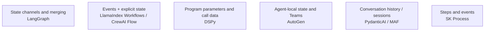

# Chapter 22: Comparing Framework Internals: State, Persistence, Tool Contracts, and Observability

## 22.1 Why feature checklists are not enough

The first five modules introduced each framework's core abstractions. Reducing them to a product list—"LangChain is a general-purpose agent framework," "LlamaIndex is a RAG framework," "AutoGen is a multi-agent framework"—quickly becomes misleading. **Almost every framework is expanding into adjacent capabilities**: LlamaIndex has agents and Workflows, LangChain has a full set of retrieval components, and Semantic Kernel supports both process orchestration and multi-agent collaboration. Feature checklists keep going out of date. More importantly, they do not answer the question that drives an engineering decision: **if we choose A today and need to move to B tomorrow, where will the migration costs fall?**

This chapter compares implementation constraints across four groups of engineering concerns. Evaluation and observability share a group, but they are not the same capability. This is not a maturity ranking: Microsoft Agent Framework (MAF), the successor to SK and AutoGen, is now a candidate for new projects, while AutoGen is in maintenance mode.

## 22.2 Dimension one: the state model

Here, *state* means the data that a multistep execution passes between steps and accumulates along the way. How a framework models that data shapes how easily the system can be debugged and extended:

| Framework | State model | Implications |
|---|---|---|
| LangGraph | A schema defines state channels; nodes return updates that reducers merge | Nodes do not freely mutate a single shared object; concurrent writes need explicit merge rules |
| LlamaIndex Workflows | Typed Events plus shared `Context` / `ctx.store` | State can use Pydantic models; event-driven does not mean schema-free |
| DSPy | Module parameters and ordinary Python call data | Instructions and demonstrations are program parameters, not per-request state or conversational memory |
| SK Process Framework | Step-local state and Events | An experimental process capability; check the specific language package and runtime for exact semantics |
| Microsoft Agent Framework | AgentSession and Workflow execution state | Session context and workflow checkpoints serve different purposes |
| AutoGen Core / AgentChat | Agent state, messages, and Team coordination state | Do not conflate Core's message model with AgentChat's higher-level state |
| CrewAI | Task outputs/context and a Flow's dictionary or typed state | A sequential Crew also has an explicit task order; collaboration is not entirely implicit |
| PydanticAI | Runs, transferable message history, and dependencies | Supports multiple turns and durable execution; a dependency object is not a persistent session |

These are areas of emphasis, not mutually exclusive categories. Debugging requires both state snapshots and event/message traces: shared state is hard to explain if nobody records who changed it. When evaluating a framework, ask the team to diagram the state owner, concurrent-update merge rules, and final commit point for one request.

## 22.3 Dimension two: persistence

Persistence supplies the data needed for recovery, but a runtime must still interpret that data and decide what to do next. Compare both **what is saved** and **what will run again after recovery**:

| Framework | Persistence mechanism | Recovery granularity |
|---|---|---|
| LangGraph | A checkpointer saves super-step checkpoints and associated task writes | Resumes from an available checkpoint; it neither rolls back to an arbitrary line of code nor undoes tools that already ran |
| SK Process Framework | Evaluate state storage for the selected experimental package/runtime | The Step/Event API alone does not establish comprehensive failure-recovery guarantees |
| Microsoft Agent Framework | Workflow checkpointing and session-state interfaces | Requires the appropriate storage/runtime configuration; does not automatically commit atomically with the business database |
| LlamaIndex Workflows | Context snapshots include pending events and the store; application writes or a durable runtime save them | Steps unfinished in the snapshot run again, giving at-least-once execution; snapshot versions must remain compatible |
| CrewAI Flow | `@persist` and a persistence backend save Flow state | Restoring state is not the same as restoring internal execution progress; do not assume every model call in a Crew has a checkpoint |
| AutoGen AgentChat | Agent/Team `save_state` and `load_state` | The application chooses safe save points and storage; external tool transactions are not recorded automatically |
| PydanticAI | Message-history serialization plus official durable-execution backend integrations | Continuing a conversation differs from recovering a task; engines such as Temporal and DBOS handle the latter |
| DSPy | Saving/loading optimized program parameters | Not checkpointing for a long-running task; business execution state needs separate management |

Keep five layers separate: object serialization, writing data to durable storage, execution recovery, idempotent replay, and business transactions. A guarantee at one layer does not establish the next. For long-running tasks and approval systems, test the window in which calls can repeat after a crash, checkpoint compatibility across upgrades, and recovery time—not just whether something is stored in a database.

## 22.4 Dimension three: tool contracts

Models can access external capabilities through a provider's native function calling, or through a framework's structured predictions or text protocol. Similar tool schemas do not imply identical message formats, call ordering, error behavior, or retry semantics:

| Framework | Schema generation | Cross-framework reuse considerations |
|---|---|---|
| PydanticAI | Type annotations, docstrings, and Pydantic | Business functions are relatively easy to reuse; adapt dependency injection, output modes, and retries |
| LangChain | `@tool`, type annotations, or an explicit schema | Adapt context injection, ToolMessage, and error handling |
| LlamaIndex | `FunctionTool` wraps functions | Query Engine tools also need mappings for return objects and citation information |
| Semantic Kernel | KernelFunction created from code or prompts | Both can expose tool metadata; migrate prompt templates, Filters, and invocation settings |
| Microsoft Agent Framework | Agent tools; AIFunction is common in .NET | Message, middleware, and session semantics still need testing |
| AutoGen | AgentChat function tools; Core itself supplies messaging | Business functions can be reused; migrate Team/message routing separately |
| DSPy | ReAct's Tool and prediction loop | Tool execution does not require compilation; adapt traces, error feedback, and loop boundaries |
| CrewAI | BaseTool / decorators and argument schemas | Preserve timeouts, caching, task context, and call limits |

Standard type annotations help reuse, but providers may still support different JSON Schema subsets and handle defaults, nullability, and unions differently. Migration tests should compare not only schemas but also authentication and authorization, timeouts, idempotency keys, cancellation propagation, error types, and side effects. A tool's business implementation and its execution contract are related assets, not interchangeable ones.

## 22.5 Dimension four: evaluation and observability

| Framework | Evaluation/observability ecosystem | Implications |
|---|---|---|
| LangChain/LangGraph | LangSmith: traces, datasets, offline evaluation, and production feedback | Useful in both development and production; LangSmith is not the only integration option |
| LlamaIndex | Instrumentation/tracing and evaluation integrations | Connect ingestion, retrieval, reranking, and generation rather than observing only the final LLM call |
| DSPy | Metric-driven evaluation during compilation (see [Chapter 17](../03-dspy/17-compiler-and-optimizers.md)) | Evaluation drives optimization, but production monitoring still needs external tools |
| Semantic Kernel / MAF | OpenTelemetry and monitoring-backend integrations | Configure against the actual SDK, exporter, and semantic-convention versions |
| PydanticAI | Close integration with Pydantic Logfire | Also based on OpenTelemetry; a natural fit for teams already using the Pydantic ecosystem |
| AutoGen / CrewAI | Message/workflow tracing and observability integrations | Check cross-agent correlation, tool spans, export, and data residency rather than inferring capabilities from a framework's age |

[OpenTelemetry's GenAI semantic conventions](https://github.com/open-telemetry/semantic-conventions-genai) seek to standardize span names and attributes for model, agent, and tool calls so traces from different frameworks can be analyzed in one backend. **The overall GenAI documentation and agent spans are still marked Development; do not treat the entire set as a stable protocol.** Evaluate the fields actually exported and the semantic-convention version, not just the bundled UI or a claim of OpenTelemetry support.

Check convention versions and field stability explicitly. Sharing OTLP transport does not make span names, token accounting, or business attributes identical. Nor is collecting every prompt and response automatically better: define redaction, sampling, and retention policies. Traces explain execution; evaluation judges quality. They complement each other.

## 22.6 Common mistakes

### 22.6.1 Comparing feature presence instead of implementation

For example, asking only "Does LlamaIndex have agents?" misses the more useful question: "How do LlamaIndex's event-driven agent orchestration and LangGraph's state graph differ when debugging?" The latter bears directly on long-term maintenance costs.

### 22.6.2 Assuming tool contracts and orchestration are equally coupled

"The tools work across frameworks" does not mean "the whole agent will be easy to migrate." Tool-definition portability and orchestration portability are separate concerns. Orchestration is usually more tightly coupled and harder to move.

### 22.6.3 Reducing persistence to whether data reaches a database

The important differences lie in recovery granularity: can execution resume at a particular step, and can old persisted data still be restored correctly after the state version changes? These details often matter more than a yes/no answer about persistence support.

### 22.6.4 Judging the observability UI without checking data openness

If trace data uses a framework's proprietary format rather than an open standard such as OpenTelemetry, even an excellent UI can come with higher long-term costs for switching observability backends.

## 22.7 Evaluate every framework with the same failure scenario

Use this test task: retrieve a contract, have two agents review it, obtain human confirmation, and submit an order. Terminate the process after submission succeeds but before the checkpoint is saved. Compare the following outcomes:

1. Does recovery submit the order again, and does the order service deduplicate by business ID?
2. Is the original approval still valid? Do changes to the contract or tool arguments require approval again?
3. Which model calls repeat, and how much do p95 latency and cost increase after recovery?
4. Can traces link the original run, retries, and the same business operation without recording the full sensitive contract?

This turns "supports persistence" into measurable recovery behavior and exposes gaps between framework defaults and business commitments.

## 22.8 Chapter summary

1. **Do not compare frameworks as product feature lists.** Nearly every framework is expanding into its neighbors' capabilities, so those lists age quickly.
2. **State models are not mutually exclusive categories.** Events, shared state, and sessions can coexist; state ownership and concurrent merging are what matter.
3. **Persistence is fundamentally a question of recovery granularity, not simple availability.** Long-running tasks and human approvals should treat that granularity as a hard selection constraint.
4. **Tool-contract portability and orchestration portability are independent dimensions.** Standard type annotations can make tool definitions easier to reuse, without making an entire agent's orchestration equally portable.
5. **Verify evaluation, tracing, and open export separately.** Do not rank maturity by brand or assume OTLP makes all data semantics identical.

> Compare how frameworks model state, persist and recover execution, generate tool contracts, and support evaluation and observation—not merely which features they list. The constraints created by those choices together determine how maintainable and portable a system will be.

## References

- [LangGraph: Persistence](https://docs.langchain.com/oss/python/langgraph/persistence)
- [LangGraph: Checkpointers and super-steps](https://docs.langchain.com/oss/python/langgraph/checkpointers)
- [LlamaIndex: Workflows](https://developers.llamaindex.ai/python/llamaagents/workflows/)
- [LlamaIndex: Durable Workflows](https://developers.llamaindex.ai/python/llamaagents/workflows/durable_workflows/)
- [AutoGen: State](https://microsoft.github.io/autogen/stable/user-guide/agentchat-user-guide/tutorial/state.html)
- [CrewAI: Flows](https://docs.crewai.com/en/concepts/flows)
- [PydanticAI: Durable Execution](https://pydantic.dev/docs/ai/capabilities/durable_execution/overview/)
- [Microsoft Agent Framework overview](https://learn.microsoft.com/en-us/agent-framework/overview/)
- [Semantic Kernel: Process Framework](https://learn.microsoft.com/en-us/semantic-kernel/frameworks/process/process-framework)
- [OpenTelemetry Generative AI semantic conventions and status](https://github.com/open-telemetry/semantic-conventions-genai/blob/main/docs/gen-ai/README.md)
- [LangSmith official documentation](https://docs.smith.langchain.com/)

Version note: see the fixed sources in Chapters 19 and 20 for the release and maintenance status of Microsoft's frameworks. The OpenTelemetry GenAI Development status was checked on 2026-09-15. Pin and verify the semantic-convention version used by each exporter.
