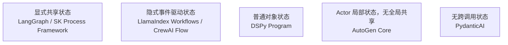

# 第二十二章：跨框架技术解构：状态、持久化、工具契约与可观测性

## 22.1 为什么不能只按功能清单比较框架

前五个模块已经分别讲过每个框架的核心抽象。如果把它们记成一份产品清单——「LangChain 是通用 Agent 框架」「LlamaIndex 是 RAG 框架」「AutoGen 是多智能体框架」——这种分类很快就会失效：**几乎每个框架都在往相邻能力范围扩张**（LlamaIndex 有 Agent 和 Workflows，LangChain 有完整的检索组件，Semantic Kernel 既能做流程编排又能做多智能体协作）。功能清单式的比较会不断过时，也回答不了真正影响工程决策的问题：**如果今天选了 A，明天需要迁移到 B，代价落在哪些地方？**

本章换一种比较方法——不看「能做什么」，看「怎么做」，拆成四个跨所有框架都存在、但实现方式各不相同的技术维度。

## 22.2 维度一：状态模型

「状态」指的是一次多步骤执行过程中，需要在步骤之间传递和积累的数据。各框架对「状态」的建模方式，决定了它的可调试性和扩展性：

| 框架 | 状态模型 | 特点 |
|---|---|---|
| LangGraph | 显式共享 `State`（TypedDict/Pydantic 模型），节点读写同一份状态 | 状态结构在编写时就完全确定，调试时能直接看到某一步的完整状态快照 |
| LlamaIndex Workflows | 隐式，通过 `Event` 类型的生产消费关系传递 | 无需预先设计 Schema，但状态全貌需要靠梳理事件流才能看清 |
| DSPy | `Program`（Python 对象）的实例属性，控制流是普通函数调用 | 状态就是普通 Python 对象状态，心智模型最贴近传统编程 |
| Semantic Kernel Process Framework | 显式 Step + Event，与 LangGraph 的图模型接近 | 建模语言更贴近传统 BPM（业务流程管理）术语 |
| AutoGen Core | Actor 之间的异步消息，没有全局共享状态 | 每个 Agent 只维护自己的内部状态，符合分布式系统的设计假设 |
| CrewAI | Crew 内隐式（依赖任务输出串联），Flow 内显式（`self.state`） | 简单协作靠任务串联的隐式状态，需要确定性控制时切到 Flow 的显式状态 |
| PydanticAI | 单次 `Run` 的局部上下文，无跨 Run 状态 | 框架本身假设「无状态单次调用」，多轮状态需要应用层自己管理 |

如果团队经常需要回答「第 N 步执行时，系统里到底有哪些数据」，显式共享状态模型（LangGraph、Process Framework）更容易调试；如果更看重扩展新步骤的便利性，并愿意沿事件流排查问题，隐式事件驱动模型（Workflows、Flow）更合适。

## 22.3 维度二：持久化

持久化决定了「一次执行能不能被打断、之后从断点恢复」，这是生产系统里长时间运行任务、人工审批、故障恢复的基础：

| 框架 | 持久化机制 | 恢复粒度 |
|---|---|---|
| LangGraph | `Checkpointer`，对整个 `State` 做快照 | 可精确恢复到任意一个节点执行前后 |
| Semantic Kernel Process Framework | 原生支持流程状态持久化 | Step 级别 |
| LlamaIndex Workflows | 依赖 `Context` 的序列化 | 事件流粒度，需要框架版本兼容序列化格式 |
| CrewAI Flow | Flow 状态可持久化 | Flow 步骤级别，Crew 内部协作过程通常不做细粒度持久化 |
| DSPy / AutoGen Core / PydanticAI | 无原生高层持久化抽象 | 需要应用层自己设计（数据库记录中间结果、重放消息日志等） |

持久化能力的差异不在「有没有」，而在恢复粒度。恢复粒度越细，需要保存和维护的状态版本兼容性成本也越高。长时间运行、需要人工审批介入的场景（如 [LangGraph 核心优势](../01-langchain/04-langgraph/10-langgraph-advantages.md) 讨论的人工介入模式）应把这一项列为选型的硬性约束，而不是留到后期补。

## 22.4 维度三：工具契约

所有框架最终都要解决「模型怎么调用外部能力」，本质都建立在 Function Calling 之上（见 [Tools 主题 · Function Calling](../../tools/01-function-calling/01-function-calling.md)），差异在于**契约生成方式**和**能否直接复用同一套工具定义**：

| 框架 | Schema 生成方式 | 跨框架复用难度 |
|---|---|---|
| PydanticAI | 从类型注解 + docstring 自动生成，校验最严格 | 低：本质是标准 JSON Schema，容易被其他框架消费 |
| LangChain | `@tool` 装饰器 + 类型注解 | 低：同样生成标准 Schema，是 07 章讨论互操作的基础 |
| LlamaIndex | `FunctionTool` 包装普通函数 | 低：同上 |
| Semantic Kernel | `[KernelFunction]`/`@kernel_function` 装饰 Native Function，或 Prompt 模板作为 Semantic Function | 中：Semantic Function 部分不是标准函数 Schema，迁移时需要单独处理 |
| AutoGen | 工具注册到 Agent 的消息处理逻辑 | 中：底层同样是 Function Calling，但消息路由逻辑与框架运行时耦合 |
| DSPy | `ReAct` Module 内建的工具调用循环 | 中：工具本身是标准函数，但调用循环逻辑绑定在 DSPy 的编译流程里 |
| CrewAI | Tool 类（继承 `BaseTool`）或函数装饰器 | 中：标准函数部分容易复用，但 Agent 的角色化 Prompt 组织方式不易迁移 |

凡是「Schema 生成方式基于标准类型注解」的框架，工具定义本身通常都更容易移植。同一个 Python 函数配合类型注解，理论上可以被 LangChain、LlamaIndex、PydanticAI 直接消费，这也是这三者经常出现在同一个系统里互相调用的技术基础。真正难迁的通常不是工具本身，而是**工具调用的编排逻辑**（谁来决定调用顺序、怎么处理调用失败）。

## 22.5 维度四：评测与可观测性

| 框架 | 评测/可观测性生态 | 特点 |
|---|---|---|
| LangChain/LangGraph | LangSmith：Trace、Dataset、离线评测、生产反馈闭环 | 生态最成熟，覆盖开发到生产全流程 |
| DSPy | 编译期指标驱动的评测（见 [第十七章](../03-dspy/17-compiler-and-optimizers.md)） | 评测即优化，但生产期在线监控仍需外部工具 |
| Semantic Kernel | 与 Application Insights、OpenTelemetry 集成 | 企业级遥测标准，适配已有的 .NET/云监控体系 |
| PydanticAI | 与 Pydantic Logfire 集成较紧密 | 同样基于 OpenTelemetry，适合已用 Pydantic 生态的团队 |
| AutoGen / CrewAI | 内置基础 Trace，社区生态相对年轻 | 复杂生产可观测性通常需要接入外部 APM 工具 |

[OpenTelemetry GenAI 语义约定](https://github.com/open-telemetry/semantic-conventions-genai) 是行业里正在收敛的一条线索：它为「模型调用」「Agent 步骤」「工具调用」定义统一的 Span 命名和属性规范，让不同框架产生的 Trace 能被同一套观测后端消费。评估框架的可观测性时，除了看自带 UI，还要看它是否遵循这类开放标准；这会直接影响未来更换可观测性后端，甚至更换编排框架时，监控体系能保留多少投入。

## 22.6 常见错误

### 22.6.1 用「有没有某个功能」代替「这个功能怎么实现的」做比较

例如只问「LlamaIndex 有没有 Agent」，而不问「LlamaIndex 的 Agent 编排模型（事件驱动）和 LangGraph（状态图）在调试体验上有什么区别」——后者才是真正影响长期维护成本的问题。

### 22.6.2 忽视工具契约和编排逻辑的耦合程度不同

误以为「工具能跨框架复用」就等于「整个 Agent 能轻松迁移」——工具定义的可移植性和编排逻辑的可移植性是两个独立的问题，后者通常耦合度更高、更难迁移。

### 22.6.3 把「持久化」简化成「有没有存数据库」

真正的差异在恢复粒度：能不能精确恢复到某一步、状态版本变化后旧的持久化数据还能不能被正确恢复，这些细节往往比「是否支持持久化」这个二元判断更重要。

### 22.6.4 只关注框架自带的可观测性 UI，忽视底层数据格式是否开放

如果 Trace 数据格式是框架私有的、不遵循 OpenTelemetry 之类的开放标准，即使 UI 再好用，长期看也会增加更换可观测性后端的成本。

## 22.7 本章总结

1. **不应该用产品清单式的功能罗列比较框架**，因为几乎每个框架都在扩张覆盖其他框架的能力范围，功能列表很快过时；
2. **状态模型分为显式共享状态、隐式事件驱动状态、普通对象状态、Actor 局部状态、无跨调用状态五类**，选择应基于「调试时需要多大程度看清系统全貌」；
3. **持久化的核心问题是恢复粒度，不是「有没有」的二元判断**，长时间运行和人工审批场景应把持久化粒度列为选型硬约束；
4. **工具契约的可移植性和编排逻辑的可移植性是两个独立维度**，基于标准类型注解生成 Schema 的框架之间工具定义更容易复用，但这不代表整个 Agent 编排逻辑也容易迁移；
5. **评测与可观测性生态的成熟度差异很大**，LangSmith 覆盖最全面，其他框架各有侧重，但行业正在向 OpenTelemetry GenAI 语义约定这样的开放标准收敛，评估框架时应该同时关注这一点。

> 比较框架时，更有用的做法是把「状态怎么建模」「怎么持久化和恢复」「工具契约怎么生成」「怎么评测和观测」拆成独立技术维度，而不是罗列各自支持哪些功能；真正决定系统可维护性和可迁移性的，是这些维度组合出来的约束。

## 参考资料

- [LangGraph: Persistence 概念](https://docs.langchain.com/oss/python/langgraph/persistence)
- [LlamaIndex: Workflows](https://developers.llamaindex.ai/python/llamaagents/workflows/)
- [Semantic Kernel: Process Framework](https://learn.microsoft.com/en-us/semantic-kernel/frameworks/process/process-framework)
- [OpenTelemetry Generative AI 语义约定仓库](https://github.com/open-telemetry/semantic-conventions-genai)
- [LangSmith 官方文档](https://docs.smith.langchain.com/)
