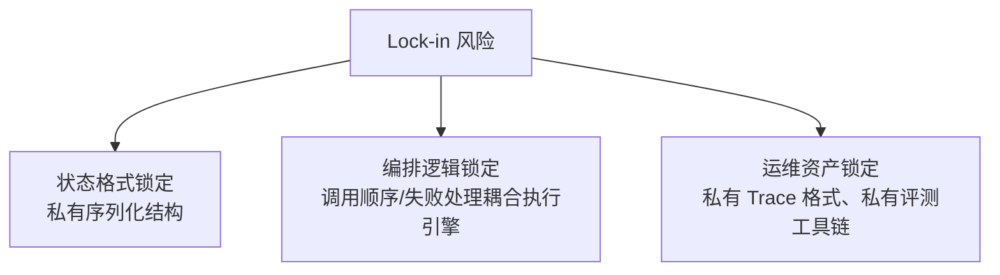
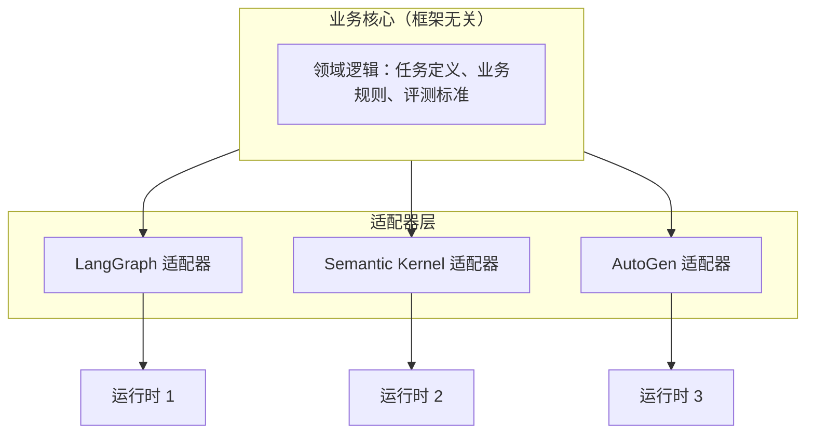
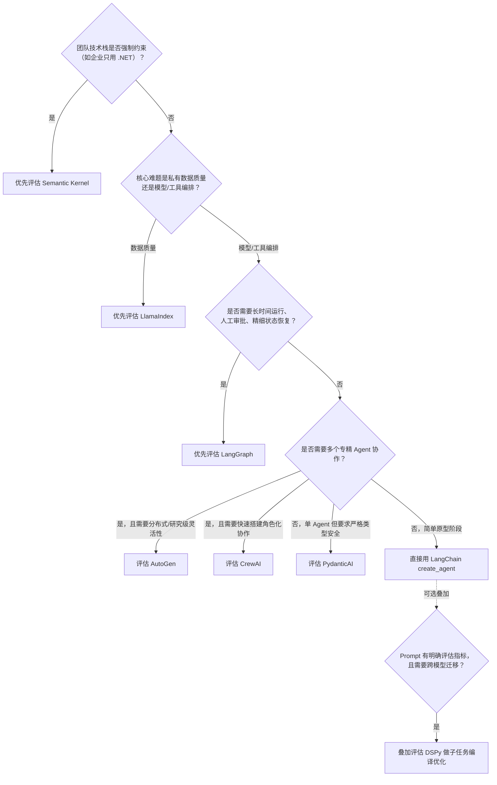
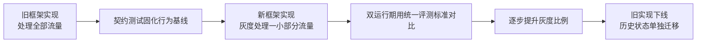

# 第二十三章：Lock-in 识别、可移植架构与迁移策略

## 23.1 Lock-in 从哪里来:三个具体来源，而不是一个抽象概念

「框架锁定」经常被当作一个模糊的风险提示，但拆开看，它总是来自三个具体来源之一：

1. **状态格式锁定**：业务的中间状态被序列化成框架私有的格式（比如 LangGraph 的 `Checkpointer` 快照结构、LlamaIndex Workflows 的 `Context` 序列化格式），换框架意味着这些历史状态无法直接迁移；
2. **工具契约与编排逻辑锁定**：工具定义本身通常可移植（见 [第二十二章 22.4 节](22-cross-framework-technical-taxonomy.md)），但「谁来决定调用哪个工具、调用失败怎么办」这类编排逻辑往往深度耦合在框架的执行引擎里；
3. **可观测性与运维锁定**：Trace 数据格式、告警规则、评测 Dataset 如果绑定在框架自带的私有工具链上（而不是开放标准），换框架意味着这套运维资产需要重建。

> **识别 lock-in 的第一步，是明确「如果今天要换框架，这三类资产里哪一类的迁移成本最高」**——大多数团队直觉上担心的是「代码要重写」，但实践中真正昂贵的往往是**历史状态数据**和**运维资产**的迁移，而不是业务逻辑代码本身。

## 23.2 可移植架构:用适配器把「业务逻辑」和「框架细节」分开

解决 lock-in 的通用架构模式借用了软件工程里熟悉的**六边形架构（Hexagonal Architecture）/端口适配器模式**：把业务核心逻辑放在一个不依赖任何具体框架的内核里，框架特定的代码全部收缩到「适配器」层。

具体到 Agent 系统的落地，这意味着：

- **工具定义放在核心层**：因为第二十二章已经指出，基于标准类型注解的工具 Schema 本身可移植性较好，值得作为核心资产维护，各框架的适配器只负责把这些工具「注册」进各自的运行时；
- **评测标准放在核心层**：评测指标、Golden Dataset 应该独立于任何框架的 Trace 格式存在（比如用普通的输入输出对存成结构化文件），这样即使换了编排框架，历史积累的评测能力依然可以复用；
- **编排逻辑允许适配器层有差异**：不强求「一套编排代码到处跑」，而是明确接受「编排细节是框架特定的，核心业务规则和评测标准才是需要跨框架保护的资产」。

> **这不是说所有项目都必须一开始就搭一层完整的适配器架构**——对于短生命周期、试验性质的项目，直接绑定单一框架反而效率更高。适配器架构的投入应该和「这个系统预期的生命周期」以及「未来更换框架的概率」成正比,过度设计同样是一种成本。

## 23.3 框架选型决策流程

结合本主题前 22 章的内容，选型可以归纳成一个决策流程：

> **这张图不是唯一正确答案，而是一种把本主题讨论过的判断标准串起来的方式**——真实项目往往需要同时满足多个条件（比如既要长时间运行又要多智能体协作），这种情况下常见的做法是**组合而非二选一**：用 LangGraph 做整体状态编排，某个节点内部再调用 AutoGen 或 CrewAI 完成一段多智能体协作子任务，正如 [LangChain 生态 · 第七章](../01-langchain/03-ecosystem/07-langchain-vs-llamaindex.md) 已经示范过的「用 Tool 做边界」的组合方式。

## 23.4 迁移策略：从单一框架到可移植架构

如果现有系统已经深度绑定某个框架，想要降低 lock-in 或迁移到另一个框架，直接「推倒重写」风险很高。更稳妥的路径借鉴了传统系统迁移里的成熟模式：

1. **契约测试先行**：在动手迁移代码之前，先把现有系统的输入输出行为固化成一套与框架无关的测试用例（沿用 23.2 节提到的、框架无关的评测 Dataset），确保迁移前后行为可对比；
2. **Strangler Fig（绞杀者模式）**：不追求一次性整体切换，而是先把新流量中的一小部分路由到新框架实现的等价功能，旧实现继续处理其余流量，通过灰度比例的逐步提升完成迁移，而不是设置一个「大爆炸」式的切换时间点；
3. **双运行期的可观测性对齐**：迁移期间新旧两套实现并行运行时，需要用统一的评测标准（而不是各自框架自带的 Trace UI）比较两者的输出质量和性能，这也是 23.2 节强调「评测标准放在核心层」的直接价值体现；
4. **状态迁移单独立项**：如果旧系统有大量依赖框架私有格式持久化的历史状态（比如未完成的长时间运行任务），应该单独设计一次性的状态转换脚本，而不是假设新框架能直接读取旧框架的持久化数据。

## 23.5 常见错误

### 23.5.1 把「框架无关的适配器架构」当成所有项目的默认起点

对生命周期短、需求不确定的试验性项目，提前搭建完整的适配器层是过度设计，会拖慢原型验证速度，应该先绑定单一框架快速验证，等系统证明有长期价值后再考虑投入可移植性建设。

### 23.5.2 迁移时只关注代码，忽视历史状态数据

代码逻辑可以重写，但线上还在运行的长时间任务、审批流程的历史状态，往往是迁移成本里最容易被低估的部分。

### 23.5.3 双运行期用两套不同的评测标准比较新旧实现

如果新旧实现分别用各自框架自带的评测工具打分，得到的分数不可比较，必须统一到一套框架无关的评测标准上才有意义。

### 23.5.4 认为「大爆炸」式切换比灰度迁移更简单

一次性整体切换看似省事，但把所有迁移风险集中在一个时间点爆发，出问题后也没有「旧实现兜底」的回退路径，实际风险远高于渐进式的 Strangler Fig 迁移。

## 23.6 本章总结

1. **Lock-in 来自三个具体来源**：状态格式锁定、编排逻辑锁定、可观测性与运维资产锁定，识别风险要具体拆到这三类，而不是笼统地担心「被框架绑定」；
2. **可移植架构的核心是把业务核心（工具定义、评测标准）和框架细节（编排执行引擎）分层**，用适配器隔离框架特定代码，但这层投入应该和系统预期生命周期成正比，不是所有项目都需要；
3. **框架选型可以归纳成一套决策流程**：先看技术栈约束，再看核心难题是数据还是编排，再看是否需要长时间运行和多智能体协作，真实项目常常需要组合多个框架而不是二选一；
4. **迁移应该走契约测试 + Strangler Fig 灰度切换的路径**，避免大爆炸式重写，历史状态数据需要单独设计迁移方案；
5. **贯穿本主题的核心判断始终是同一个**：不要按框架的名字和功能清单做选型决策，而要按状态模型、持久化粒度、工具契约可移植性、评测与可观测性这几个技术维度,结合项目自身的生命周期和团队约束做判断。

> **一句话概括：框架选型和迁移不是一次性的「选哪个更好」的决策，而是一套持续的工程纪律——把真正需要长期保护的资产（工具定义、评测标准、业务规则）和框架特定的实现细节分开管理，用灰度迁移代替大爆炸式重写，才能让「换框架」始终是一个可控的工程选项，而不是一场推倒重来的风险。**

## 参考资料

- [LangGraph: Persistence 概念](https://docs.langchain.com/oss/python/langgraph/persistence)
- [Semantic Kernel: Process Framework](https://learn.microsoft.com/en-us/semantic-kernel/frameworks/process/process-framework)
- [OpenTelemetry Generative AI 语义约定仓库](https://github.com/open-telemetry/semantic-conventions-genai)
- [Martin Fowler: StranglerFigApplication](https://martinfowler.com/bliki/StranglerFigApplication.html)
- [Alistair Cockburn: Hexagonal Architecture](https://alistair.cockburn.us/hexagonal-architecture/)
