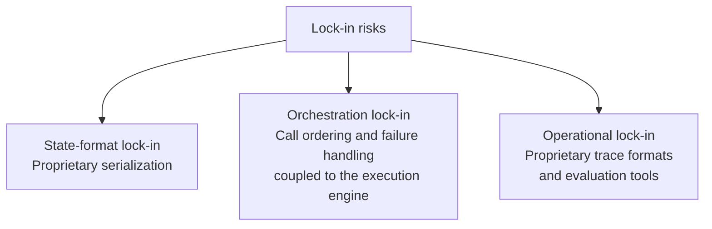
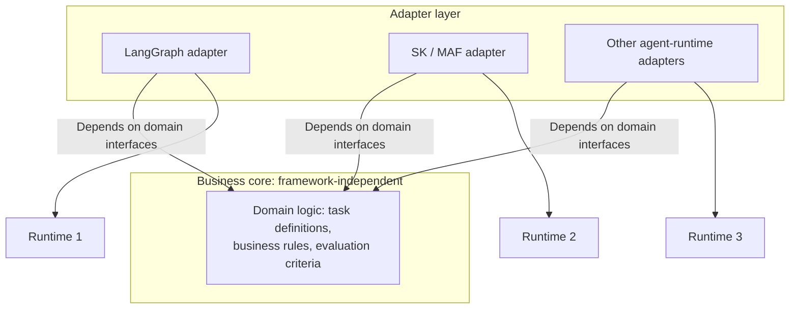
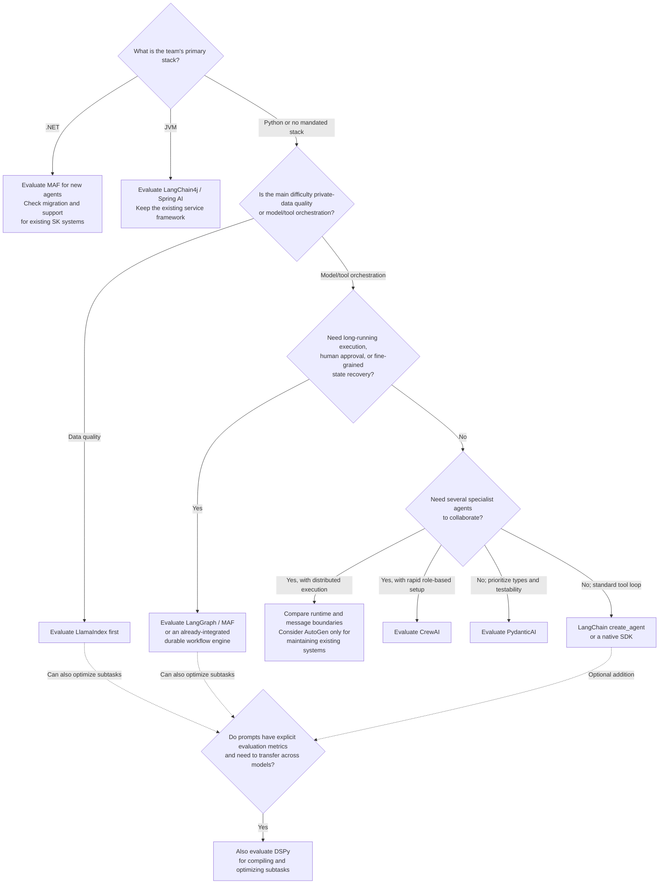
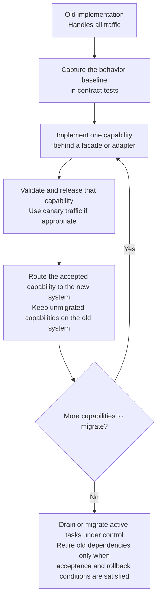

# Chapter 23: Identifying Lock-in, Designing Portable Architectures, and Planning Migrations

## 23.1 Three major sources of lock-in

Framework lock-in is often described as a vague risk. Start by separating three common technical sources. They do not account for every cost: team skills, cloud-service pricing, and model-specific capabilities can also create dependencies.

1. **State-format lock-in**: intermediate state uses runtime-specific formats, such as LangGraph checkpoints or a Workflows Context, that a new framework usually cannot read directly. Even parsing the fields does not establish that pending-task semantics can be reconstructed.
2. **Tool-contract and orchestration lock-in**: tool definitions are often portable (see [Chapter 22, Section 22.4](22-cross-framework-technical-taxonomy.md)), but decisions such as which tool to call and what to do when it fails are frequently coupled to the framework's execution engine.
3. **Observability and operational lock-in**: if trace formats, alert rules, and evaluation datasets depend on the framework's proprietary toolchain rather than open standards, switching frameworks means rebuilding those operational assets.

Begin with a concrete question: "If we switched frameworks today, which of these three asset groups would cost the most to migrate?" Teams instinctively worry about rewriting code. In practice, moving **historical state data** and **operational assets** is often more expensive than rewriting the business logic itself.

## 23.2 Portable architecture: isolate framework details behind adapters

A common architectural response borrows from **hexagonal architecture, or ports and adapters**: put the business logic in a core that does not depend on a particular framework, and confine framework-specific code to adapters.

The arrows represent code dependencies. Adapters depend on domain interfaces and concrete runtimes; the domain core does not import a framework in return. For an agent system, this means:

- **Keep business tool implementations in the core.** Preserve domain inputs and outputs, authorization rules, and idempotency semantics. Adapters handle framework registration, invocation context, error mapping, and cancellation—not merely a different decorator.
- **Keep evaluation criteria in the core.** Metrics and golden datasets should exist independently of a framework's trace format, for example as ordinary input/output pairs in structured files. That preserves accumulated evaluation capability even when the orchestration framework changes.
- **Allow orchestration to differ between adapters.** Do not demand one orchestration implementation that runs everywhere. Accept that orchestration details are framework-specific, while core business rules and evaluation criteria are the assets worth protecting across frameworks.

Not every project should start with a complete adapter layer. A short-lived experiment is often more efficient when tied directly to one framework. Weigh the investment against the system's expected lifetime and the likelihood of replacing its framework. Overengineering has a cost too.

A useful minimum contract generally includes a business request/operation ID, tenant and authorization context, input version, deadline, idempotency key, structured result, and retryable error categories. Do not pass a framework's Message or Context directly into domain services. Equally, do not erase required semantics such as streaming, approval, and cancellation in pursuit of a supposedly universal interface.

## 23.3 A framework-selection decision process

The preceding analysis can be organized into a decision process:

This diagram narrows the candidate set; it is not a brand-recommendation algorithm. Language affects integration cost, but every branch must still satisfy state, recovery, and permission requirements. MAF succeeds SK and AutoGen, and AutoGen is in maintenance mode. PydanticAI already has durable-execution integrations; Workflows and CrewAI Flow also deserve consideration when their runtimes fit the requirements.

Combining frameworks is an option, not an inevitable answer to complexity. If one runtime meets the requirements, one fewer layer is usually easier to manage. When nesting is necessary, designate a single top-level state owner and have subprocesses return through bounded requests. Assign responsibility for retries, cancellation, and approvals so two layers do not both replay the same write tool.

## 23.4 Migration strategy: from a single framework to a portable architecture

If an existing system is deeply tied to one framework, a wholesale rewrite is a risky way to reduce lock-in or switch frameworks. A safer approach draws on established system-migration patterns:

1. **Write contract tests first.** Before migrating code, capture the existing system's input/output behavior in framework-independent tests, reusing the evaluation dataset described in Section 23.2. Make behavior before and after migration comparable.
2. **Replace one business capability at a time with the Strangler Fig pattern.** Identify a boundary where a routing facade or adapter can direct that capability to the new implementation; leave unmigrated capabilities on the old system. Repeat until the old dependencies can be retired. This is incremental functional replacement, not merely a traffic-percentage change. Each migrated capability can also use a **canary release** to increase its new implementation's traffic gradually.
3. **Align observability while both implementations run.** Compare quality, cost, latency, and errors using the same data, model configuration, and metrics. Shadow runs should default to read-only operations, recorded replay, or simulated tools; the old and new implementations must not both send emails, charge accounts, or create orders.
4. **Design state migration separately.** Distinguish completed history, active tasks, and externally hosted sessions. Active tasks can often finish on the old runtime. If they must move, re-enter from confirmed business state and check approvals, idempotency keys, and pending events. A format-conversion script alone does not make migration safe.

## 23.5 Common mistakes

### 23.5.1 Making a framework-independent adapter architecture the default

For short-lived experiments with uncertain requirements, building a complete adapter layer upfront is overengineering that slows prototype validation. Start with one framework, learn quickly, and invest in portability once the system demonstrates lasting value.

### 23.5.2 Migrating code while overlooking historical state

Code can be rewritten. Long-running tasks still active in production and the historical state of approval processes are often the most underestimated migration costs.

### 23.5.3 Comparing the two implementations with different evaluation criteria

Scores are not comparable when the old and new implementations each use their framework's own evaluation criteria. A meaningful comparison requires one framework-independent set of criteria.

### 23.5.4 Keeping the old code without preserving a rollback path

A staged rollout can still be irreversible. If the new system writes state that the old version cannot read, or completes an irreversible external operation, routing traffic back does not restore the business state. Define version-compatibility windows, sticky routing for tasks, and compensation strategies. A small system that can tolerate downtime may use a controlled cutover rather than running both implementations merely to follow a pattern.

## 23.6 Migration acceptance criteria and cost boundaries

A migration review should include at least four kinds of evidence:

- **Behavioral differences**: contract tests for tool arguments, error categories, timeout/cancellation propagation, structured outputs, and citations. String equality alone is not a sufficient comparison for stochastic outputs.
- **Quality and cost**: task success rate, refusal rate, p95 latency, and cost per successful task on representative data. Record model versions so a benefit from changing models is not misattributed to changing frameworks.
- **Failure recovery**: interrupt before and after write-tool commits and checkpoint writes to establish that irreversible operations are not repeated. Exercise tasks awaiting approval separately.
- **Exit criteria**: thresholds for increasing or rolling back the new traffic share, time to drain old tasks, historical-data retention, and a named owner for retiring the old dependencies.

If asked, "Does exposing every tool through MCP eliminate lock-in?", distinguish protocol interoperability from business portability. Transport and discovery can be standardized, while authorization, sessions, errors, retries, and execution state still need adaptation. The adapter layer also adds combinations to maintain. Protect the assets expected to be expensive to move rather than supporting every framework in advance.

## 23.7 Chapter summary

1. **Common technical lock-in falls into three groups**: state formats, orchestration contracts, and operational assets. Include service dependencies and the team's migration costs as well.
2. **Portable architecture separates the business core—tool definitions and evaluation criteria—from framework details such as the orchestration engine.** Adapters isolate framework-specific code, but the investment should be proportionate to the system's expected lifetime; not every project needs it.
3. **Filter by business constraints, then verify maintenance status and actual runtime behavior.** Combining frameworks also needs a clear additional benefit.
4. **Contract tests should precede migration.** Strangler Fig replaces business capabilities incrementally; canary releases can control traffic within each migrated capability. A small system may instead use a controlled downtime-based cutover. Historical state and rollback still need separate designs.
5. **Selection ultimately returns to the same engineering dimensions.** Decide from state models, persistence granularity, tool-contract portability, evaluation, and observability—together with project lifetime and team constraints—not framework names and feature lists.

> Long-term portability depends on managing assets separately: keep tool definitions, evaluation criteria, and business rules independent, and prefer staged migration to a big-bang rewrite. That makes switching frameworks a controllable engineering task.

## References

- [LangGraph: Persistence](https://docs.langchain.com/oss/python/langgraph/persistence)
- [Semantic Kernel: Process Framework](https://learn.microsoft.com/en-us/semantic-kernel/frameworks/process/process-framework)
- [Microsoft Agent Framework overview and successor relationship](https://learn.microsoft.com/en-us/agent-framework/overview/)
- [SK → MAF migration guide](https://learn.microsoft.com/en-us/agent-framework/migration-guide/from-semantic-kernel/)
- [AutoGen official maintenance-mode notice](https://github.com/microsoft/autogen)
- [PydanticAI: Durable Execution](https://pydantic.dev/docs/ai/capabilities/durable_execution/overview/)
- [OpenTelemetry Generative AI semantic-conventions repository](https://github.com/open-telemetry/semantic-conventions-genai)
- [Martin Fowler: StranglerFigApplication](https://martinfowler.com/bliki/StranglerFigApplication.html)
- [Martin Fowler: CanaryRelease](https://martinfowler.com/bliki/CanaryRelease.html)
- [Alistair Cockburn: Hexagonal Architecture](https://alistair.cockburn.us/hexagonal-architecture/)
