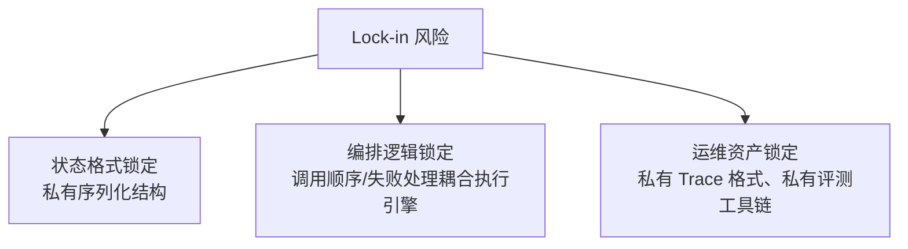
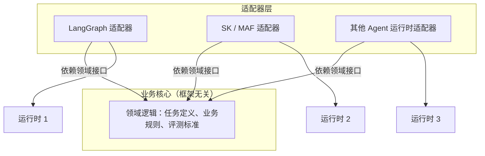
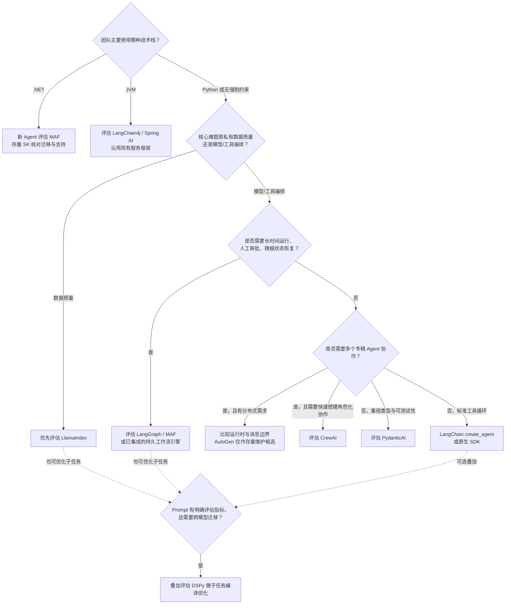
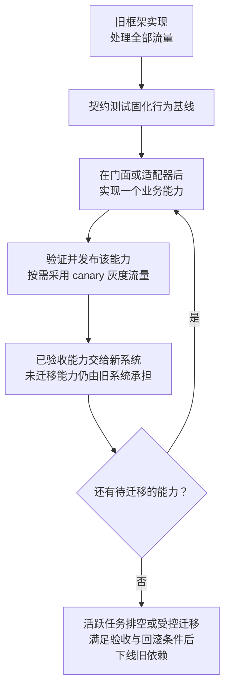

# 第二十三章：Lock-in 识别、可移植架构与迁移策略

## 23.1 Lock-in 的三个主要来源

「框架锁定」经常被当作模糊风险，下面先拆三个常见技术来源；它们不穷尽全部成本，团队技能、云服务计费和模型特性也可能形成绑定：

1. **状态格式锁定**：中间状态使用运行时特定格式（如 LangGraph 检查点、Workflows Context），新框架通常不能直接读取；即使能解析字段，也不代表能重建待执行任务语义；
2. **工具契约与编排逻辑锁定**：工具定义本身通常可移植（见 [第二十二章 22.4 节](22-cross-framework-technical-taxonomy.zh.md)），但「谁来决定调用哪个工具、调用失败怎么办」这类编排逻辑往往深度耦合在框架的执行引擎里；
3. **可观测性与运维锁定**：Trace 数据格式、告警规则、评测 Dataset 如果绑定在框架自带的私有工具链上（而不是开放标准），换框架意味着这套运维资产需要重建。

识别 lock-in 时，先要判断「如果今天切换框架，这三类资产里哪一类迁移成本最高」。很多团队直觉上担心的是「代码要重写」，但实践中真正昂贵的往往是**历史状态数据**和**运维资产**的迁移，而不是业务逻辑代码本身。

## 23.2 可移植架构：用适配器分离业务逻辑和框架细节

解决 lock-in 的通用架构模式借用了软件工程里熟悉的**六边形架构（Hexagonal Architecture）/端口适配器模式**：把业务核心逻辑放在一个不依赖任何具体框架的内核里，框架特定的代码全部收缩到「适配器」层。

图中箭头表示代码依赖：适配器依赖领域接口和具体运行时，领域核心不反向导入框架。具体到 Agent 系统，这意味着：

- **业务工具实现放在核心层**：保留领域输入输出、授权规则和幂等语义；适配器处理框架注册、调用上下文、错误映射和取消，不只是换装饰器；
- **评测标准放在核心层**：评测指标、Golden Dataset 应该独立于任何框架的 Trace 格式存在（比如用普通的输入输出对存成结构化文件），这样即使换了编排框架，历史积累的评测能力依然可以复用；
- **编排逻辑允许适配器层有差异**：不强求「一套编排代码到处跑」，而是明确接受「编排细节是框架特定的，核心业务规则和评测标准才是需要跨框架保护的资产」。

这并不意味着所有项目都该从一开始就搭完整的适配器层。对于短生命周期、试验性质的项目，直接绑定单一框架通常更高效。适配器架构的投入应该和系统预期生命周期、未来更换框架的概率一起评估，过度设计同样是一种成本。

一个值得保留的最小契约通常包含：业务请求/操作 ID、租户与授权上下文、输入版本、截止时间、幂等键、结构化结果及可重试错误类别。不要把某个框架的 Message 或 Context 直接作为领域服务参数，也不要为了「通用」而抹掉流式输出、审批和取消等必需语义。

## 23.3 框架选型决策流程

结合前面的分析，选型可以归纳成一个决策流程：

这张图用于缩小候选范围，不是品牌推荐算法。语言只约束接入成本，任何分支都还需检查状态、恢复和权限要求。MAF 是 SK/AutoGen 后继，AutoGen 已进入维护模式；PydanticAI 已有持久执行集成，Workflows、CrewAI Flow 也应按运行时需求参与评估。

组合框架是可选方案，不是复杂项目的必然答案。若一个运行时能满足要求，少一层往往更容易管理。确需嵌套时，指定一个顶层状态所有者，让子流程以有界请求返回；明确谁负责重试、取消和审批，避免两层同时重放同一个写工具。

## 23.4 迁移策略：从单一框架到可移植架构

如果现有系统已经深度绑定某个框架，想要降低 lock-in 或迁移到另一个框架，直接「推倒重写」风险很高。更稳妥的路径借鉴了传统系统迁移里的成熟模式：

1. **契约测试先行**：在动手迁移代码之前，先把现有系统的输入输出行为固化成一套与框架无关的测试用例（沿用 23.2 节提到的、框架无关的评测 Dataset），确保迁移前后行为可对比；
2. **用 Strangler Fig（绞杀者模式）逐个替换业务能力**：找到可以通过路由门面或适配器切换的能力边界，把该能力交给新实现，尚未迁移的能力继续由旧系统承担，逐步替换直到旧依赖可以下线。这是功能的增量替换，不只是调整流量比例；每个迁移能力还可以结合 **canary 灰度发布**，逐步增加其新实现承接的流量；
3. **双运行期的可观测性对齐**：用相同数据、模型配置及评测指标比较质量、成本、延迟与错误；影子运行默认只读、录制回放或模拟工具，不能让新旧两边同时发邮件、扣款或创建订单；
4. **状态迁移单独设计**：先区分已完成历史、活跃任务和外部托管会话。活跃任务通常可留在旧运行时排空；必须迁移时，从已确认的业务状态重新入场并核对审批、幂等键与待处理事件，不默认写个格式转换脚本就安全。

## 23.5 常见错误

### 23.5.1 把「框架无关的适配器架构」当成所有项目的默认起点

对生命周期短、需求不确定的试验性项目，提前搭建完整的适配器层是过度设计，会拖慢原型验证速度，应该先绑定单一框架快速验证，等系统证明有长期价值后再考虑投入可移植性建设。

### 23.5.2 迁移时只关注代码，忽视历史状态数据

代码逻辑可以重写，但线上还在运行的长时间任务、审批流程的历史状态，往往是迁移成本里最容易被低估的部分。

### 23.5.3 双运行期用两套不同的评测标准比较新旧实现

如果新旧实现分别用各自框架自带的评测工具打分，得到的分数不可比较，必须统一到一套框架无关的评测标准上才有意义。

### 23.5.4 只保留旧代码，没有保留回滚路径

灰度也可能不可回滚：新系统写入旧版本无法读的状态，或完成了不可逆外部操作，切回流量并不能还原业务。应定义版本兼容窗口、任务粘性路由和补偿策略；对可停机的小系统也可以选受控切换，而不是机械要求双跑。

## 23.6 迁移验收与成本边界

评审迁移方案时，至少给出四份证据：

- **行为差异**：工具参数、错误类别、超时/取消传播、结构化输出和引用的契约测试；随机生成结果不能只做字符串相等比较。
- **质量与费用**：代表性数据上的任务成功率、拒答率、p95 延迟、每成功任务成本；记录模型版本，避免把换模型收益记成换框架收益。
- **故障恢复**：在写工具提交前后、检查点写入前后分别中断，证明不会重复执行不可逆操作；审批等待中的任务单独演练。
- **退出条件**：灰度提高和回退的阈值、旧任务排空时间、历史数据保留期、最终关闭旧依赖的负责人。

如果被追问「用 MCP 暴露所有工具是否就没有 lock-in」，应区分协议互操作与业务可移植性：传输和发现可统一，授权、会话、错误、重试和执行状态仍需适配。适配层本身还会增加维护矩阵，应优先保护预计昂贵的资产，而非提前支持所有框架。

## 23.7 本章总结

1. **常见技术 lock-in 可拆三组**：状态格式、编排契约、运维资产；还应计入服务依赖和团队迁移成本；
2. **可移植架构的核心是把业务核心（工具定义、评测标准）和框架细节（编排执行引擎）分层**，用适配器隔离框架特定代码，但这层投入应该和系统预期生命周期成正比，不是所有项目都需要；
3. **先按业务约束筛选，再按维护状态和实际运行时验证**，组合多个框架也要说明额外收益；
4. **契约测试应先于迁移**；Strangler Fig 按业务能力逐步替换，每个迁移能力内部可以结合 canary 灰度放量。小系统也可受控停机切换，历史状态与回滚仍需单独设计；
5. **选型时最终仍要回到同一组技术维度**：不要按框架名字和功能清单做决策，而要按状态模型、持久化粒度、工具契约可移植性、评测与可观测性这些维度，结合项目自身的生命周期和团队约束做判断。

> 长期可移植性依赖于资产分层管理：把工具定义、评测标准和业务规则独立出来，用分阶段迁移替代大爆炸式重写，这样更换框架才会是一项可控的工程工作。

## 参考资料

- [LangGraph: Persistence 概念](https://docs.langchain.com/oss/python/langgraph/persistence)
- [Semantic Kernel: Process Framework](https://learn.microsoft.com/en-us/semantic-kernel/frameworks/process/process-framework)
- [Microsoft Agent Framework 概览与后继关系](https://learn.microsoft.com/en-us/agent-framework/overview/)
- [SK → MAF 迁移指南](https://learn.microsoft.com/en-us/agent-framework/migration-guide/from-semantic-kernel/)
- [AutoGen 官方维护模式说明](https://github.com/microsoft/autogen)
- [PydanticAI: Durable Execution](https://pydantic.dev/docs/ai/capabilities/durable_execution/overview/)
- [OpenTelemetry Generative AI 语义约定仓库](https://github.com/open-telemetry/semantic-conventions-genai)
- [Martin Fowler: StranglerFigApplication](https://martinfowler.com/bliki/StranglerFigApplication.html)
- [Martin Fowler: CanaryRelease](https://martinfowler.com/bliki/CanaryRelease.html)
- [Alistair Cockburn: Hexagonal Architecture](https://alistair.cockburn.us/hexagonal-architecture/)
