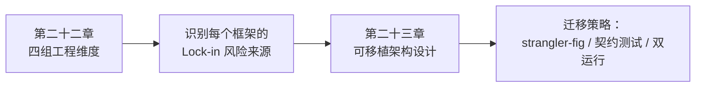

# 框架与编排 · 框架选型与可移植架构

前面模块介绍各框架抽象，本模块改为横向比较四组问题：状态归属、持久化与恢复、工具执行契约、评测与可观测性。评测和观测在最后一组分别讨论；不按产品标签给出「最好/最成熟」排名，而是核对哪些约束会形成迁移成本。

对照表已纳入 [MAF 的后继关系](https://learn.microsoft.com/en-us/agent-framework/overview/)、AutoGen 维护模式和 PydanticAI 持久执行集成。它们影响候选范围，但无法替代应用自己的故障恢复与成本测试。

## 章节

1. [第二十二章：跨框架技术解构：状态、持久化、工具契约与可观测性](22-cross-framework-technical-taxonomy.md)
2. [第二十三章：Lock-in 识别、可移植架构与迁移策略](23-lockin-and-portable-architecture.md)

## 模块关系

## 阅读建议

- **正在选型，还没有动手写代码**：先读第二十二章对照表，明确关键约束，再用统一故障场景验证第二十三章的候选选择；
- **已经用了某个框架，担心被锁死**：直接看第二十三章的 lock-in 识别清单和适配器架构；
- **需要把现有系统从一个框架迁移到另一个框架**：看第二十三章 23.4 节的迁移策略部分。

返回 [AI 框架与编排 相关知识点](../README.md)。
