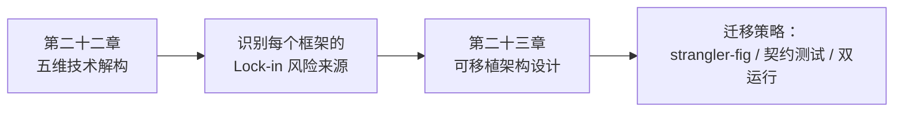

# 框架与编排 · 框架选型与可移植架构

前五个模块分别讲了六个框架各自的抽象。本模块把视角切换成横向：**不再问「这个框架能做什么」，而是问「这些框架在状态、持久化、工具契约、评测、可观测性五个技术维度上分别做了什么取舍，以及这些取舍会在多大程度上把你锁死在一个框架里」**。这是本主题的收尾模块，也是实际做选型决策时应该最先读的部分。

## 章节

1. [第二十二章：跨框架技术解构：状态、持久化、工具契约与可观测性](22-cross-framework-technical-taxonomy.md)
2. [第二十三章：Lock-in 识别、可移植架构与迁移策略](23-lockin-and-portable-architecture.md)

## 模块关系

## 阅读建议

- **正在选型，还没有动手写代码**：先读第二十二章的五维对照表，明确项目最看重哪几个维度，再看第二十三章的决策流程图；
- **已经用了某个框架，担心被锁死**：直接看第二十三章的 lock-in 识别清单和适配器架构；
- **需要把现有系统从一个框架迁移到另一个框架**：看第二十三章 23.4 节的迁移策略部分。

返回 [AI 框架与编排 相关知识点](../README.md)。
