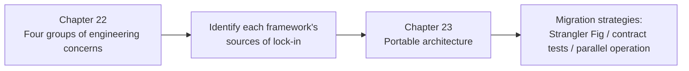

# Frameworks and Orchestration · Framework Selection and Portable Architecture

The preceding modules introduce individual frameworks' abstractions. This module compares four groups of concerns across them: state ownership, persistence and recovery, tool execution contracts, and evaluation and observability. Evaluation and observation are treated separately within the final group. Rather than ranking products as "best" or "most mature," the comparison examines which constraints create migration costs.

The tables account for [MAF's role as a successor](https://learn.microsoft.com/en-us/agent-framework/overview/), AutoGen's maintenance mode, and PydanticAI's durable-execution integrations. These developments affect the candidate set, but they do not replace failure-recovery and cost tests for your own application.

## Chapters

1. [Chapter 22: Comparing Framework Internals: State, Persistence, Tool Contracts, and Observability](22-cross-framework-technical-taxonomy.md)
2. [Chapter 23: Identifying Lock-in, Designing Portable Architectures, and Planning Migrations](23-lockin-and-portable-architecture.md)

## How the chapters connect

## Suggested reading paths

- **Choosing a framework before writing code**: start with Chapter 22's tables to identify the key constraints, then use the same failure scenario to test candidates from Chapter 23.
- **Already using a framework and concerned about lock-in**: go directly to Chapter 23's lock-in checklist and adapter architecture.
- **Moving an existing system between frameworks**: read the migration strategy in Chapter 23, Section 23.4.

Back to [AI Frameworks and Orchestration](../README.md).
