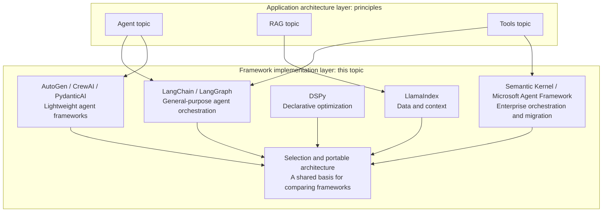

# AI Frameworks and Orchestration

This topic focuses on the **framework implementation layer**. The [Agent](../agent/README.md) and [RAG](../rag/README.md) topics discuss principles and tradeoffs, while [Tools](../tools/README.md) covers protocols separately. Here, the question is how different frameworks implement those principles and protocols—and what it costs to migrate when a framework no longer fits a project.

The material is organized into six modules. The [LangChain ecosystem](01-langchain/README.md) retains the existing LangChain/LangGraph paths. The remaining modules cover LlamaIndex, DSPy, Semantic Kernel, lightweight agent frameworks, and cross-framework selection and portable architecture.

"Lightweight" is a reading category, not a claim that AutoGen or CrewAI necessarily has a smaller runtime, fewer dependencies, or lower operating costs. Compare tool-use correctness, recovery semantics, latency, and cost on the same task rather than treating a framework's name as a capability guarantee.

## Modules

1. [LangChain Ecosystem (Chapters 1–13)](01-langchain/README.md)—Chain/LCEL, building agents, state orchestration with LangGraph, and production feedback with LangSmith
2. [LlamaIndex Ecosystem (Chapters 14–15)](02-llamaindex/README.md)—data and index abstractions, query engines, and event-driven Workflows
3. [Declarative Optimization with DSPy (Chapters 16–17)](03-dspy/README.md)—declarative programming with Signature/Module, compilers, and optimizers
4. [Enterprise Orchestration with Semantic Kernel (Chapters 18–19)](04-semantic-kernel/README.md)—Kernel/Plugin/Planner, Process Framework, and Agent Framework
5. [Lightweight Agent Frameworks (Chapters 20–21)](05-lightweight-agent-frameworks/README.md)—multi-agent abstractions in AutoGen and CrewAI, and PydanticAI's type-safe approach
6. [Framework Selection and Portable Architecture (Chapters 22–23)](06-selection-portability/README.md)—cross-framework technical comparison, identifying lock-in, and migration strategies

## Where this topic fits

## Technical connections between modules, not a product catalog

The six modules are not independent product introductions. Each revisits the same engineering dimensions: state models, persistence, tool contracts, evaluation and observability, and lock-in risk.

| Question | Start here | How to extend the comparison |
|---|---|---|
| How is state updated and recovered? | LangGraph (Chapter 10), LlamaIndex Workflows (Chapter 15) | Chapters 19 and 22 compare state ownership, merging, and recovery semantics; similar diagrams do not imply equivalent runtimes |
| How do multiple agents collaborate? | SK (Chapter 19), AutoGen / CrewAI (Chapter 20) | Chapter 21 compares boundaries around messages, tasks, and typed calls |
| How do models call tools? | The Function Calling chapter in the Tools topic | This topic covers registration, execution, and error handling in frameworks; similar schemas do not imply the same protocol or retry semantics |
| How does evaluation drive improvement? | LangSmith (Chapter 13), DSPy (Chapter 17) | The former supplies evaluation evidence for development and production; the latter searches program parameters. Chapter 22 separates evaluation from observation |
| Which assets are worth preserving across frameworks? | Chapter 23 | Revisit each framework's state, tool, and operational constraints to estimate migration costs |

## Suggested reading paths

For a first read, follow Chapters 1–23 in numerical order. The LangChain directory is grouped by topic: after Chapter 8, read Chapters 9–10, then return to Chapter 11 for version evolution. Directory grouping is not chapter order.

- **Only interested in LangChain/LangGraph**: go directly to the [LangChain ecosystem](01-langchain/README.md).
- **Selecting technology for RAG or a knowledge base**: [LlamaIndex ecosystem](02-llamaindex/README.md) → [LangChain: Ecosystem and Evolution](01-langchain/03-ecosystem/README.md) → [Framework Selection and Portable Architecture](06-selection-portability/README.md).
- **Improving prompts systematically rather than tuning them by hand**: [Declarative Optimization with DSPy](03-dspy/README.md).
- **Working in .NET or maintaining an existing SK system**: [Enterprise Orchestration with Semantic Kernel](04-semantic-kernel/README.md). **Java teams** can start with [Chapter 8: LangChain4j](01-langchain/03-ecosystem/08-langchain4j.md).
- **Building multi-agent collaboration or prioritizing type safety**: [Lightweight Agent Frameworks](05-lightweight-agent-frameworks/README.md).
- **Choosing a framework or planning a migration**: start with [Framework Selection and Portable Architecture](06-selection-portability/README.md), then consult individual framework chapters as needed.

Back to the [documentation topic index](../README.md).
