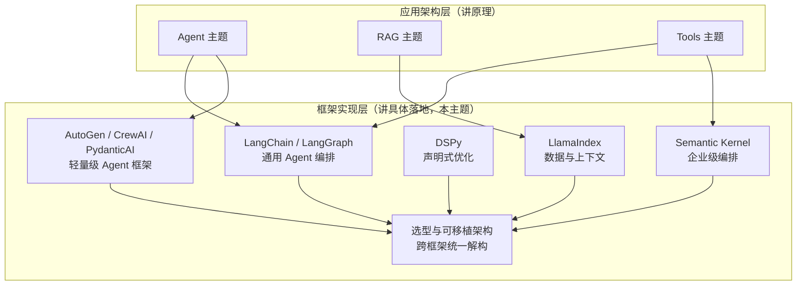

# AI 框架与编排

本主题聚焦「框架实现层」：[Agent](../agent/README.md) 与 [RAG](../rag/README.md) 主题讨论原理与取舍，[Tools](../tools/README.md) 主题单独说明协议；这里关注这些原理和协议在不同框架中的落地方式，以及框架不再适合项目时的迁移成本和路径。

当前内容按六个子模块组织。[LangChain 生态](01-langchain/README.md) 沿用原有 LangChain/LangGraph 路径，其余模块分别展开 LlamaIndex、DSPy、Semantic Kernel、轻量级 Agent 框架，以及跨框架的选型与可移植架构。

## 子模块

1. [LangChain 生态（第 1–13 章）](01-langchain/README.md)——Chain/LCEL、Agent 构建、LangGraph 状态编排、LangSmith 生产闭环
2. [LlamaIndex 生态（第 14–15 章）](02-llamaindex/README.md)——数据与索引抽象、查询引擎与事件驱动 Workflows
3. [DSPy 声明式优化（第 16–17 章）](03-dspy/README.md)——Signature/Module 声明式编程、编译器与优化器
4. [Semantic Kernel 企业级编排（第 18–19 章）](04-semantic-kernel/README.md)——Kernel/Plugin/Planner、Process Framework 与 Agent Framework
5. [轻量级 Agent 框架（第 20–21 章）](05-lightweight-agent-frameworks/README.md)——AutoGen、CrewAI 的多智能体抽象、PydanticAI 的类型安全范式
6. [框架选型与可移植架构（第 22–23 章）](06-selection-portability/README.md)——跨框架技术解构、Lock-in 识别与迁移策略

## 主题定位

## 模块之间的技术关系，而非并列产品清单

六个模块不是六个互相独立的框架介绍，而是围绕同一组技术维度（状态模型、持久化、工具契约、评测与可观测性、lock-in 风险）反复展开：

| 概念 | 详解归属 | 引用方 | 视角差异 |
|---|---|---|---|
| 状态编排：显式状态图 vs 事件驱动 | LangGraph（第 10 章）、LlamaIndex Workflows（第 15 章） | Semantic Kernel Process Framework（第 19 章）、第二十二章 | 前两者各自讲自己的实现，第二十二章统一对照五种状态模型 |
| 多智能体协作抽象 | AutoGen / CrewAI（第 20 章） | Semantic Kernel Agent Framework（第 19 章）、第二十一章决策矩阵 | 第 20 章讲两条技术路线，第 19 章指出概念同构，第 21 章给出跨框架对比 |
| 工具契约与 Function Calling | Tools 主题 Function Calling 章 | 本主题几乎每一章 | Tools 讲协议本身，本主题各章讲各框架怎么包装这套协议 |
| 评测驱动优化 | DSPy 编译器（第 17 章） | LangSmith 生产闭环（第 13 章）、第二十二章 | DSPy 把评测做成优化目标，LangSmith 把评测做成生产观测环节，第二十二章统一比较 |
| Lock-in 与可移植性 | 第二十三章 | 各框架章节的「常见错误」小节 | 第二十三章给出系统性方法论，各章节在具体技术点上呼应 |

## 阅读建议

- **只关心 LangChain/LangGraph 生态**：直接进入 [LangChain 生态](01-langchain/README.md)；
- **做 RAG / 知识库类项目的技术选型**：[LlamaIndex 生态](02-llamaindex/README.md) → [LangChain 生态 · 生态与演进](01-langchain/03-ecosystem/README.md) → [框架选型与可移植架构](06-selection-portability/README.md)；
- **需要系统化提升 Prompt 质量、而不是手工调参**：[DSPy 声明式优化](03-dspy/README.md)；
- **企业 .NET/Java 技术栈、需要合规治理**：[Semantic Kernel 企业级编排](04-semantic-kernel/README.md)；
- **需要多智能体协作或强调类型安全**：[轻量级 Agent 框架](05-lightweight-agent-frameworks/README.md)；
- **正在做框架选型或迁移决策**：直接从[框架选型与可移植架构](06-selection-portability/README.md)开始，按需回查具体框架章节。

返回[文档主题索引](../README.md)。
