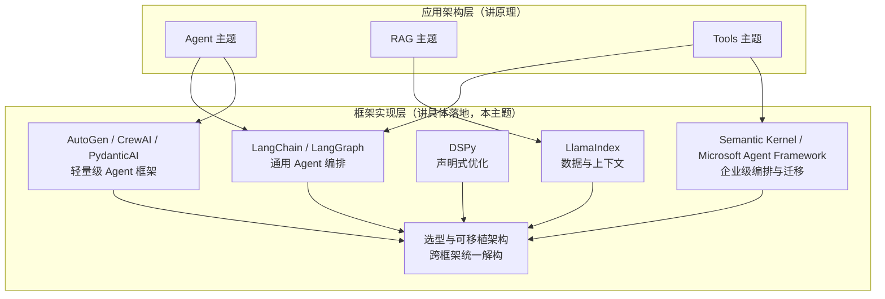

# AI 框架与编排

本主题聚焦「框架实现层」：[Agent](../agent/README.zh.md) 与 [RAG](../rag/README.zh.md) 主题讨论原理与取舍，[Tools](../tools/README.zh.md) 主题单独说明协议；这里关注这些原理和协议在不同框架中的落地方式，以及框架不再适合项目时的迁移成本和路径。

当前内容按六个子模块组织。[LangChain 生态](01-langchain/README.zh.md) 沿用原有 LangChain/LangGraph 路径，其余模块分别展开 LlamaIndex、DSPy、Semantic Kernel、轻量级 Agent 框架，以及跨框架的选型与可移植架构。

目录中的「轻量级」是阅读分组，不表示 AutoGen、CrewAI 的运行时、依赖或运维成本一定更小。选型应比较同一任务的工具正确率、恢复语义、延迟与费用，而不是把框架名称当作能力保证。

## 子模块

1. [LangChain 生态（第 1–13 章）](01-langchain/README.zh.md)——Chain/LCEL、Agent 构建、LangGraph 状态编排、LangSmith 生产闭环
2. [LlamaIndex 生态（第 14–15 章）](02-llamaindex/README.zh.md)——数据与索引抽象、查询引擎与事件驱动 Workflows
3. [DSPy 声明式优化（第 16–17 章）](03-dspy/README.zh.md)——Signature/Module 声明式编程、编译器与优化器
4. [Semantic Kernel 企业级编排（第 18–19 章）](04-semantic-kernel/README.zh.md)——Kernel/Plugin/Planner、Process Framework 与 Agent Framework
5. [轻量级 Agent 框架（第 20–21 章）](05-lightweight-agent-frameworks/README.zh.md)——AutoGen、CrewAI 的多智能体抽象、PydanticAI 的类型安全范式
6. [框架选型与可移植架构（第 22–23 章）](06-selection-portability/README.zh.md)——跨框架技术解构、Lock-in 识别与迁移策略

## 主题定位

## 模块之间的技术关系，而非并列产品清单

六个模块不是六个互相独立的框架介绍，而是围绕同一组技术维度（状态模型、持久化、工具契约、评测与可观测性、lock-in 风险）反复展开：

| 问题 | 先读哪里 | 后续怎样比较 |
|---|---|---|
| 状态如何更新与恢复 | LangGraph（第 10 章）、LlamaIndex Workflows（第 15 章） | 第 19、22 章比较状态归属、合并和恢复语义，不把图形相似当成运行时等价 |
| 多 Agent 如何协作 | SK（第 19 章）、AutoGen / CrewAI（第 20 章） | 第 21 章比较消息、任务和类型化调用的边界 |
| 模型怎样调用工具 | Tools 主题的 Function Calling 章 | 本主题说明框架注册、执行与错误处理；相似 Schema 不代表协议和重试语义一致 |
| 评测怎样推动改进 | LangSmith（第 13 章）、DSPy（第 17 章） | 前者提供开发与生产的评测证据，后者搜索程序参数；第 22 章再区分评测与观测 |
| 哪些资产值得跨框架保留 | 第 23 章 | 回查各框架的状态、工具和运维约束，估算迁移成本 |

## 阅读建议

首次通读可按第 1–23 章顺序前进。LangChain 目录按主题分组，第 8 章之后先读第 9–10 章，再回到第 11 章理解版本演进，不必把目录分组误当成章号顺序。

- **只关心 LangChain/LangGraph 生态**：直接进入 [LangChain 生态](01-langchain/README.zh.md)；
- **做 RAG / 知识库类项目的技术选型**：[LlamaIndex 生态](02-llamaindex/README.zh.md) → [LangChain 生态 · 生态与演进](01-langchain/03-ecosystem/README.zh.md) → [框架选型与可移植架构](06-selection-portability/README.zh.md)；
- **需要系统化提升 Prompt 质量、而不是手工调参**：[DSPy 声明式优化](03-dspy/README.zh.md)；
- **.NET 技术栈与存量 SK 维护**：[Semantic Kernel 企业级编排](04-semantic-kernel/README.zh.md)；**Java 技术栈**可先读[第八章 LangChain4j](01-langchain/03-ecosystem/08-langchain4j.zh.md)；
- **需要多智能体协作或强调类型安全**：[轻量级 Agent 框架](05-lightweight-agent-frameworks/README.zh.md)；
- **正在做框架选型或迁移决策**：直接从[框架选型与可移植架构](06-selection-portability/README.zh.md)开始，按需回查具体框架章节。

返回[文档主题索引](../README.zh.md)。
