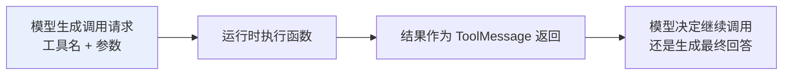
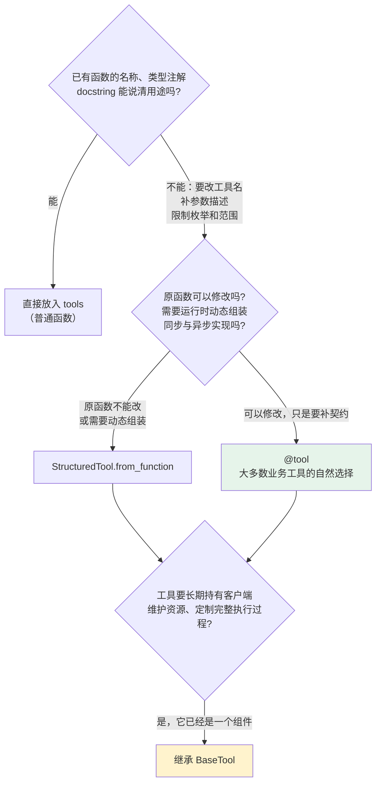
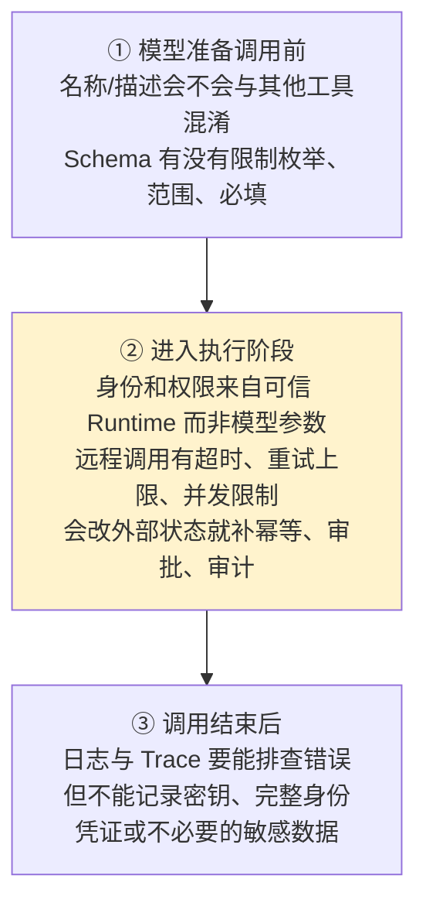

# 第五章：Tool 注册与工具契约

## 5.1 Tool 注册的到底是什么

**模型看不到 Python 函数的源码，那它凭什么知道该调用谁？**

注册工具时，LangChain 会先把函数转换成一份**模型能够理解的说明**：

| 部分 | 谁看 | 作用 |
|---|---|---|
| `name` + `description` | **模型** | 判断工具叫什么、什么情况下该用 |
| `args_schema` | **模型** | 生成满足类型和约束的参数 |
| executor（函数/协程） | **应用侧** | 真正拿着这些参数做事 |



> **工具描述和 Schema 不是普通注释，而是模型与业务代码之间的调用合同。**
>
> 描述过于模糊，模型可能**选错工具**；参数缺少约束，模型可能生成**无法执行的数据**。

## 5.2 四种定义方式怎么选

**没有必要为了显得专业而直接继承最底层的类。** 选择时先问一句：**这个工具到底还是不是一个普通函数？**



> **这四种方式不是互相竞争的功能清单，而是一条随复杂度上升的路径**：先让函数说清楚 → 再补充工具契约 → 接着处理动态组装 → 最后才管理组件生命周期。

### 5.2.1 一个例外

模型厂商提供的 **Web Search、代码执行器等服务端工具**，有时会使用厂商约定的字典配置。

> **这类工具属于特定 Provider 能力**，使用时应单独查看对应集成文档，**不要把它当作通用 Python Tool 的主要定义方式**。

## 5.3 为什么优先使用 `@tool`

`@tool` 能从**函数签名和 docstring 自动推导 Schema**，也允许通过 Pydantic 显式描述复杂参数。

```python
from typing import Literal

from langchain.agents import create_agent
from langchain.tools import tool
from pydantic import BaseModel, Field

class OrderQuery(BaseModel):
    # Field 描述和类型约束都会进入模型看到的工具 Schema
    order_id: str = Field(description="要查询的订单号")
    detail: Literal["summary", "full"] = Field(
        default="summary",
        description="返回摘要还是完整信息",
    )

# args_schema 显式指定工具参数的校验模型
@tool(args_schema=OrderQuery)
def query_order(order_id: str, detail: str = "summary") -> str:
    """查询订单状态。用户询问某个订单时调用。"""
    return f"订单 {order_id} 的状态为已发货，返回模式：{detail}"

agent = create_agent(
    model="<provider>:<your-model-id>",
    tools=[query_order],
)
```

**Pydantic 的字段描述和枚举限制会进入工具 Schema**，一举两得：

- **帮助模型正确填写参数**；
- **在执行前拦截非法输入**。

> **简单函数也可以不加装饰器直接传给 `tools`**，但函数必须有清楚的名称、类型注解和 docstring，否则自动生成的说明很难指导模型正确调用。

## 5.4 何时使用高级定义

### 5.4.1 `StructuredTool.from_function`

适合「**原函数不能修改，但需要改变它对模型的呈现方式**」：

- 同一个业务函数需要注册成**不同名称**；
- 要把**同步函数和异步协程组合成一个工具对象**。

### 5.4.2 `BaseTool`

**当工具不再只是一个函数**，而是要：

- 长期持有**数据库或第三方客户端**；
- 同时管理**同步、异步、tags、metadata 和回调**。

> **它已经变成了一个有生命周期的组件**，此时才值得承担更多样板代码。

## 5.5 可信参数如何注入

**假设「查询我的账户余额」工具需要用户 ID。**

如果把 `user_id` 放进模型可见的 Schema：

- 模型可能**填错用户**；
- 也可能被**恶意提示诱导查询其他账户**。

### 5.5.1 两类参数必须分开

| 参数类型 | 示例 | 来源 |
|---|---|---|
| **任务参数** | 城市、关键词、订单号 | **模型**根据用户问题生成 |
| **可信参数** | 用户 ID、租户、权限、当前状态 | **应用运行时注入** |

### 5.5.2 ToolRuntime 的三个作用域

| 来源 | 存放 |
|---|---|
| `runtime.context` | 用户身份、租户、依赖——**本次调用上下文** |
| `runtime.state` | 当前会话消息和短期状态 |
| `runtime.store` | **跨会话**仍要保留的长期数据 |

```python
from dataclasses import dataclass

from langchain.tools import ToolRuntime, tool

@dataclass
class UserContext:
    # 这些字段由应用运行时提供，不让模型生成
    user_id: str
    role: str

@tool
def get_balance(
    account_type: str,
    runtime: ToolRuntime[UserContext],
) -> str:
    """查询当前登录用户的账户余额。"""
    # 先使用可信 Context 做权限检查
    if runtime.context.role not in {"user", "finance_admin"}:
        return "当前用户无权查询余额"

    # 用户 ID 来自 Runtime，而不是模型参数
    user_id = runtime.context.user_id
    return f"用户 {user_id} 的 {account_type} 账户余额为 100 元"
```

> **模型能够看到并填写 `account_type`，却看不到 `runtime`。** 可信用户身份由应用传入而不是模型生成——**这是工具权限控制的重要边界**。

## 5.6 异步工具怎么处理

搜索、数据库和远程 API 通常是 **I/O 密集型**。底层客户端支持异步时，工具也应使用原生 `async def`，并通过 Agent 的 `ainvoke` 或异步流式接口调用。

> **最常见的假异步**：只把函数声明成 `async def`，内部却继续调用阻塞式 HTTP 客户端——**这种写法不会自动提高并发能力**。

**工具是否异步，应该和底层客户端以及整条 Agent 调用链保持一致。**

## 5.7 错误应该怎么分类

**工具调用失败时先别急着统一重试，因为不同失败意味着完全不同的下一步。**

| 失败类型 | 例子 | 正确处理 |
|---|---|---|
| **参数错误** | 日期格式错误、缺必填字段 | 先让 **Schema 拦截**，再把可修正信息交给模型重填 |
| **业务结果** | 库存不足、无权限、订单不存在 | **不是故障**，工具说清原因，让 Agent 换路径或告知用户 |
| **临时故障** | 网络超时、限流、服务不可用 | **有上限**的重试 + 退避 + **总超时** |
| **真实缺陷** | 程序 Bug、数据损坏、权限配置错误 | **不应统一转成「调用失败」后继续执行**，否则掩盖真正的问题 |

> **对于付款、发邮件、创建订单等有副作用的工具**，还必须设计**幂等键和人工审批**，避免重试造成重复执行。

## 5.8 注册后还要检查什么

**一个能被 Agent 调用的函数，并不等于一个可以安全上线的工具。** 沿着一次真实调用往下走：



### 5.8.1 工具数量不是越多越好

> **一次性向模型暴露大量相似工具，会增加选择错误和参数混淆的概率。**
>
> 更合理的做法是**根据用户权限和当前任务动态缩小工具集合**（可用 Middleware 实现，见 [第四章](04-build-agent.md)）。

## 5.9 常见错误

### 5.9.1 把工具描述当成普通注释

**它是模型与业务代码之间的调用合同**，描述模糊模型就会选错。

### 5.9.2 一上来就继承 `BaseTool`

**四种方式是随复杂度上升的路径**，绝大多数业务工具 `@tool` 就够了。

### 5.9.3 把 `user_id` 放进模型可见 Schema

模型可能填错，也可能被恶意提示诱导——**可信参数必须从 Runtime 注入**。

### 5.9.4 混淆 `context` / `state` / `store`

分别对应**本次调用上下文、会话短期状态、跨会话长期数据**。

### 5.9.5 假异步

`async def` 里包阻塞客户端，**并发能力不会凭空提高**。

### 5.9.6 把所有失败统一重试

**业务结果不该重试，真实缺陷更不该被掩盖成「调用失败」。**

### 5.9.7 重试没有退避和总超时

**Agent 只会在一个坏掉的服务前反复等待。**

### 5.9.8 有副作用的工具没有幂等键

一次重试就可能变成**重复扣款、重复发信**。

### 5.9.9 一次性暴露几十个相似工具

**选择错误和参数混淆的概率随之上升**，应按权限和任务动态裁剪。

### 5.9.10 日志里记录敏感数据

Trace 要能排查问题，**但不能落密钥和完整身份凭证**。

## 5.10 本章总结

1. **Tool = 模型可见的调用合同 + 运行时可执行函数**，name / description / args_schema 给模型看，executor 给应用跑；
2. **四种定义方式是一条复杂度递增的路径**：普通函数 → `@tool` → `StructuredTool` → `BaseTool`；
3. **`@tool` 是大多数业务工具的首选**，Pydantic 字段描述与枚举既指导模型也拦截非法输入；
4. **`StructuredTool` 解决运行时组装**（改名、同步异步合一），**`BaseTool` 解决组件生命周期**；
5. **参数必须二分**：任务参数由模型生成，**可信参数由运行时注入**；
6. **ToolRuntime 三作用域**：context（调用上下文）、state（会话状态）、store（跨会话长期）；
7. **异步要真异步**，底层客户端、工具、调用链三者一致；
8. **错误分四类**：参数错误、业务结果、临时故障、真实缺陷——处理方式完全不同；
9. **有副作用的工具必须幂等 + 审批 + 审计**；
10. **上线检查沿一次真实调用走**：选择前看契约、执行时看权限与限流、结束后看日志脱敏；
11. **工具数量要治理**，按权限和任务动态缩小可见集合。

> **一句话概括：注册工具的关键不是记住四个类名，而是把「模型看得见的契约」和「服务端执行的安全边界」这两层彻底分开——前者决定模型选不选得对，后者决定系统做不做得安全。**

## 参考资料

- [LangChain: Tools 概念文档](https://docs.langchain.com/oss/python/langchain/tools)
- [LangChain: Agents 概念文档](https://docs.langchain.com/oss/python/langchain/agents)
- [LangChain: Middleware](https://docs.langchain.com/oss/python/langchain/middleware)
- [langchain-core Tools API 参考](https://python.langchain.com/api_reference/core/tools.html)
- [Pydantic 官方文档](https://docs.pydantic.dev/latest/)
