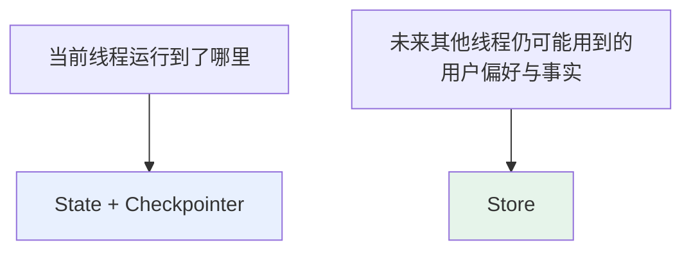
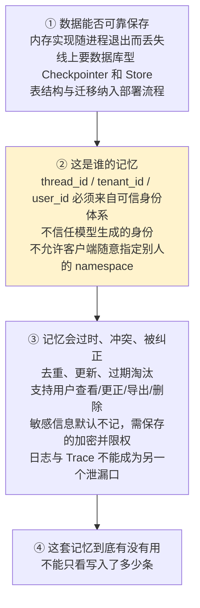

# 第六章：LangChain 的短期记忆与长期记忆

## 6.1 应该记住什么

**记忆设计的第一步不是选数据库，而是确定作用域。**

假设用户正在规划杭州旅行：

| 信息 | 性质 | 归属 |
|---|---|---|
| 当前对话提到的日期、预算、下一步计划 | **只服务于这次任务** | 短期状态 |
| 一周后新建会话，Agent 仍知道他不吃辣、喜欢住地铁附近 | **跨会话仍然有效** | 长期记忆 |



## 6.2 短期记忆如何实现

`create_agent` 底层运行在 LangGraph 上。**Agent State 默认包含 `messages`**，也可以扩展订单号、当前步骤、工具调用次数等业务字段。

### 6.2.1 只有 State 还不够

**请求可能由不同服务实例处理，进程也可能重启**——因此需要 Checkpointer 持久化执行状态。

```python
from langchain.agents import create_agent
from langgraph.checkpoint.memory import InMemorySaver

# Checkpointer 按 thread_id 保存线程内的 Agent State
agent = create_agent(
    model="<provider>:<your-model-id>",
    tools=[],
    checkpointer=InMemorySaver(),
)

# 两次调用复用同一个 thread_id，表示它们属于同一会话线程
config = {"configurable": {"thread_id": "chat-1001"}}

# 第一轮把用户姓名写入当前线程的 messages 状态
agent.invoke(
    {"messages": [{"role": "user", "content": "我叫小林"}]},
    config=config,
)

# 第二轮会先恢复同一线程之前保存的状态
result = agent.invoke(
    {"messages": [{"role": "user", "content": "我叫什么？"}]},
    config=config,
)
```

> **`InMemorySaver` 只适合本地演示。** 生产环境要换成持久化实现，否则进程退出后状态会丢失。

### 6.2.2 Checkpoint 保存的不只是聊天记录

**它保存的是图执行过程中的 State 快照**，因此还能支撑：

- 暂停恢复
- 人工审批
- 故障恢复

## 6.3 消息太多怎么办

> **Checkpointer 能保存历史，不代表每次都应该把全部历史交给模型。** 消息越多，Token、延迟和干扰越大。

| 策略 | 作用 | 主要风险 |
|---|---|---|
| **裁剪** | 只选择部分消息进入本次模型上下文 | **持久状态仍会继续增长** |
| **删除** | 从 State 中永久移除旧消息 | **信息不可恢复** |
| **摘要** | 把早期历史压缩成简短语义摘要 | 可能遗漏细节或**逐轮失真** |

### 6.3.1 关键是不能只按条数处理

- 客服 Agent 可能需要保护**当前工单和用户承诺**；
- 代码 Agent 可能需要保护**最新报错和修改记录**。

> **应该结合 Token 预算、消息角色和业务重要性制定策略**（记忆压缩的通用方法见 [Agent 主题](../agent/README.md)）。

## 6.4 长期记忆如何实现

**新 `thread_id` 默认不会继承旧线程的 State——这是正确的线程隔离。** 如果某条信息需要跨线程使用，就应提炼后写入 Store。

### 6.4.1 Store 的定位结构

```
namespace = (tenant_id, user_id, memory_type)
key       = 某条记忆的稳定标识
value     = JSON 数据
```

| 读取方式 | 场景 |
|---|---|
| 精确读取 | **已知 key** |
| 向量搜索 | 需要从多条记忆中**按语义查找**（需配置向量索引） |

> **向量检索只是召回方式，不代表所有聊天记录都应该成为长期记忆。**

### 6.4.2 长期记忆常见内容

| 类型 | 示例 |
|---|---|
| 用户事实与偏好 | 不吃辣、偏好中文、常用 Java |
| 历史经验 | 上次如何成功处理支付超时 |
| 工作规则 | 退款前必须核验订单归属 |

> **这些分类用于帮助设计数据结构，不是要求把每段原始对话都永久保存。** 写入前仍要做**去重、脱敏、冲突处理和质量判断**。

## 6.5 如何跨线程读取

**工具可以通过 ToolRuntime 访问这些信息，但不能把三个入口混成一个数据袋**（见 [第五章](05-tool-registration.md)）：

| 入口 | 内容 |
|---|---|
| `runtime.state` | 当前线程的**短期状态** |
| `runtime.context` | **可信**用户身份和权限 |
| `runtime.store` | **跨线程**长期数据 |

```python
from dataclasses import dataclass

from langchain.tools import ToolRuntime, tool

@dataclass
class UserContext:
    # 用户身份由可信应用注入，不暴露给模型填写
    user_id: str

@tool
def remember_preference(
    preference: str,
    runtime: ToolRuntime[UserContext],
) -> str:
    """保存当前用户明确要求记住的偏好。"""
    # namespace 将不同用户的长期记忆隔离开
    namespace = (runtime.context.user_id, "preferences")
    # key 为 main，本例只维护一条当前偏好记录
    runtime.store.put(namespace, "main", {"text": preference})
    return "偏好已保存"
```

> **模型只负责生成 `preference`，`user_id` 由已认证的应用通过 Context 注入。** 这样可以防止模型填错身份，或**被提示注入诱导访问其他用户的数据**。

**两个不同 `thread_id` 的会话，只要可信 `user_id` 相同，就可以访问同一个长期记忆 namespace**；另一位用户则应被 namespace 和服务端权限隔离。

## 6.6 什么时候写入长期记忆

> **长期记忆不是越多越好。把每句闲聊都存进去，会产生噪声、冲突和隐私风险。**

| 触发 | 写入时机 |
|---|---|
| 用户明确说「请记住」 | **主链路实时写入**，信息立即生效 |
| 普通对话中推断出的偏好和经验 | **会话结束后由后台任务**提炼、去重、脱敏再写入 |

**无论实时还是后台写入，都应保存来源、时间和置信度**，并支持更新、纠错和删除。

> **订单金额、账户余额和库存等实时事实仍应查询权威业务系统，不能使用长期记忆代替真实数据库。**

## 6.7 生产环境要注意什么



### 6.7.1 评测必须沿整条链路走

| 环节 | 检查 |
|---|---|
| 写入 | 这条信息**是否值得写入** |
| 召回 | 相关问题**能否召回**，无关问题**会不会误召回** |
| 使用 | 注入模型后**是否真正改善答案** |

> **只有写入、召回和使用三步都有效，记忆才不是一个不断膨胀的数据库。**

## 6.8 旧 Memory 还能用吗

旧教程常见的 `ConversationBufferMemory`、`ConversationSummaryMemory` 属于 **Chain 时代的抽象**，目前主要位于 `langchain-classic`，适合维护存量项目。

**v1 新项目更推荐**：

| 职责 | 方式 |
|---|---|
| 管理线程内状态 | **AgentState + Checkpointer** |
| 管理跨线程长期记忆 | **Store + namespace/key** |
| 管理裁剪、摘要和写入策略 | **Middleware 或图节点** |

> **这套方式把状态作用域、持久化和记忆治理拆得更清楚**，也更适合有工具调用、暂停恢复和多用户隔离要求的 Agent。

## 6.9 常见错误

### 6.9.1 先选数据库再想作用域

**第一步是判断这条信息是线程内的还是跨线程的。**

### 6.9.2 用 `InMemorySaver` 上生产

**进程退出状态全丢。**

### 6.9.3 以为 Checkpoint 只是聊天记录

**它是图执行的 State 快照**，正因如此才能支撑暂停恢复和人工审批。

### 6.9.4 把「能保存」等同于「都要塞给模型」

Token、延迟和干扰都会上升，**必须裁剪/删除/摘要**。

### 6.9.5 按固定条数裁剪

**当前工单、用户承诺、最新报错**这类消息不能被机械裁掉。

### 6.9.6 混淆裁剪与删除

**裁剪不减少持久状态，删除不可恢复**——风险完全不同。

### 6.9.7 把所有聊天记录写进向量库

**向量检索只是召回方式**，不代表什么都该长期保存。

### 6.9.8 让模型生成 `user_id`

会被提示注入诱导访问他人数据，**身份必须来自可信 Context**。

### 6.9.9 用长期记忆代替权威数据库

**余额、库存、订单金额这类实时事实必须现查。**

### 6.9.10 记忆只写不治理

**没有去重、更新、过期和用户可删除能力**，记得越多风险越大。

### 6.9.11 评测只统计写入条数

**要看召回准确率和是否真的改善了答案。**

## 6.10 本章总结

1. **两条主线**：短期记忆是线程级 State，由 Checkpointer 按 `thread_id` 保存；长期记忆是跨线程数据，由 Store 按 namespace / key 管理；
2. **记忆设计第一步是确定作用域**，不是选数据库；
3. **Checkpoint 保存的是 State 快照**，因此还能支撑暂停恢复、人工审批、故障恢复；
4. **历史管理三策略**：裁剪（状态仍增长）、删除（不可恢复）、摘要（可能失真）；
5. **裁剪要按 Token 预算 + 消息角色 + 业务重要性**，不能只数条数；
6. **新线程不继承旧 State 是正确的隔离**，跨线程信息要提炼后写入 Store；
7. **Store 用 namespace + key 定位**，精确读取与向量搜索并存；
8. **ToolRuntime 三入口不可混用**：state / context / store；
9. **写入时机二分**：明确要求实时写，推断出的偏好后台提炼写；
10. **实时事实不能用长期记忆代替权威系统**；
11. **生产四关**：可靠持久化 → 可信身份隔离 → 记忆治理与隐私 → 沿写入/召回/使用三步评测；
12. **旧 Memory 类属 Chain 时代**，已入 `langchain-classic`。

> **一句话概括：LangChain 的记忆不是一个「存聊天记录的地方」，而是按作用域拆开的两套机制——线程内靠 State 和 Checkpointer 保证不失忆和可恢复，线程外靠 Store 加可信 namespace 保证能积累且不串户，中间再用裁剪、摘要和治理策略控制它不会无限膨胀。**

## 参考资料

- [LangChain: Short-term Memory](https://docs.langchain.com/oss/python/langchain/short-term-memory)
- [LangChain: Long-term Memory](https://docs.langchain.com/oss/python/langchain/long-term-memory)
- [LangGraph 持久化文档](https://langchain-ai.github.io/langgraph/concepts/persistence/)
- [LangGraph Memory 概念文档](https://langchain-ai.github.io/langgraph/concepts/memory/)
- [LangChain: Middleware](https://docs.langchain.com/oss/python/langchain/middleware)
- [LangChain v1 迁移指南](https://docs.langchain.com/oss/python/migrate/langchain-v1)
