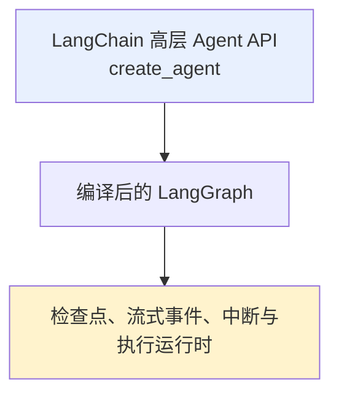
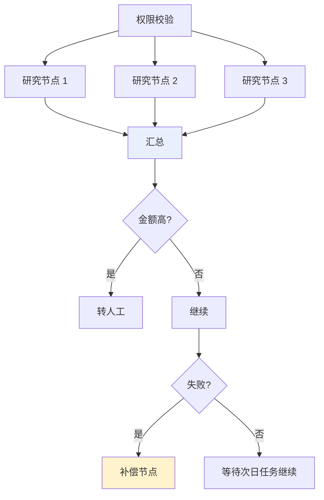
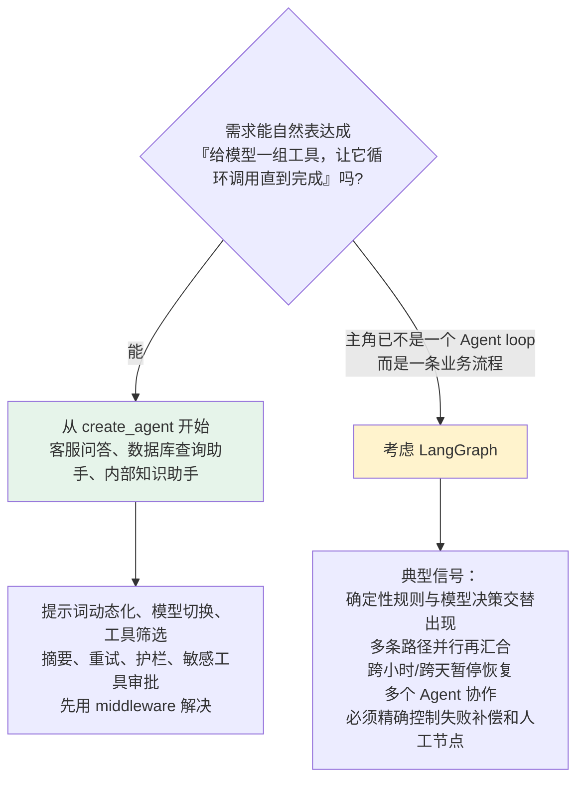

# 第九章：LangChain 与 LangGraph 的层次关系

## 9.1 两者处于同一层吗

**很多人第一次看到这两个名字，会自然地问「哪个功能更多」。**

> **这个问题就像在比较一台咖啡机和它内部的控制系统**——能列出差异，却很容易忽略两者是**上下层关系**。

**先用一句人话理解**：

> **LangChain 给我们一套装好的 Agent，LangGraph 让我们自己设计整条业务路线。**

| 框架 | 官方定位 |
|---|---|
| **LangChain** | **高层 Agent 框架**，提供模型、工具和常见的 Agent 循环 |
| **LangGraph** | **更低层的编排框架与运行时**，负责有状态流程如何执行、暂停和恢复 |

**LangGraph 可以使用 LangChain 的模型和工具组件，但并不强制依赖 LangChain**，也可以直接接其他模型 SDK 或普通 Python 函数。

### 9.1.1 关键的层次关系



**`create_agent` 会构建一个基于 LangGraph 的图运行时**：Agent 在模型节点和工具节点之间循环，直到模型给出最终答案或命中停止条件。

> **这也解释了为什么两者既有重叠能力，又不能说「选哪个都一样」**：
>
> - 用 **LangChain** 时，框架已经替你搭好了常见 Agent 的拓扑，**你主要配置零件和生命周期钩子**；
> - 用 **LangGraph** 时，**节点怎么拆、状态怎么更新、下一步去哪，都由你来决定**。

## 9.2 核心差异：抽象层级

| 对比维度 | LangChain v1 | LangGraph |
|---|---|---|
| **官方定位** | 高层 Agent 开发框架 | 低层 Agent 编排框架与运行时 |
| **主要入口** | `create_agent`、模型、工具、middleware、结构化输出 | `StateGraph`、State、Node、Edge、`Command`、`Send`、Subgraph |
| **默认提供什么** | 预构建的模型与工具调用循环，以及常用扩展点 | 构建任意有状态工作流的编排原语，**不替你规定 Prompt 或 Agent 架构** |
| **控制流** | 标准 Agent loop 已搭好，可通过 middleware 定制 | 开发者显式定义顺序、条件路由、循环、并行、动态分发和子图 |
| **状态** | 以 AgentState 和 messages 为默认核心，可扩展字段 | 可设计完整 State Schema、输入输出 Schema、内部通道与 reducer |
| **持久化与记忆** | 通过底层 LangGraph 的 checkpointer 和 store 使用 | 直接在图编译和运行层控制 checkpointer、store、thread 与状态历史 |
| **durable execution** | 可以继承底层运行能力，标准 Agent 也能暂停和恢复 | **是核心定位之一**，更适合显式设计长流程的恢复边界和副作用 |
| **人工介入** | 常用 `HumanInTheLoopMiddleware` 审批工具调用 | 可在**任意节点内**用 `interrupt()` 暂停，用 `Command(resume=...)` 恢复 |
| **流式输出** | 直接从 Agent 输出消息 token、步骤更新和自定义进度 | 除消息和状态外，还可观察 checkpoint、task、debug 等更底层事件 |
| **扩展方式** | middleware 钩住 Agent、模型和工具生命周期 | 节点、边、路由函数、`Command`、`Send`、子图和 Runtime |
| **部署与调试** | 可接 LangSmith tracing、Studio 和 Deployment | 同一套能力，并能更直接查看节点路径和状态变化 |
| **更适合** | 标准工具调用 Agent、客服助手、数据查询助手、快速原型 | 长流程、多阶段审批、确定性与 Agent 混排、复杂并行、多 Agent 系统 |

> **注意「持久化」「流式输出」「人工介入」都出现在两列——这不是写重复了。**
>
> **这些能力由 LangGraph 运行时提供，也能从 LangChain Agent 的高层接口中使用。两者差别主要是封装层级和控制粒度，不是简单的有或没有。**

## 9.3 「LangChain 只能线性执行」为什么是错的

**它混淆了三个不同概念。**

### 9.3.1 传统 Chain 也不只能顺序执行

**LCEL 除了 `RunnableSequence`，也能通过并行和分支 Runnable 表达并发与条件选择**（见 [第二章](02-chain-and-lcel.md)）。

> 固定的 Prompt、模型、解析器流水线**常写成线性形式，但那是用法选择，不是框架能力上限**。

### 9.3.2 `create_agent` 本身就不是一条直线

模型可能直接结束，也可能请求工具；工具执行后又回到模型继续决策——**这已经形成「条件路由 + 循环」**，多个工具调用还可能被并行执行。

> **拿一条早期 `prompt | model | parser` 管道去代表当前 LangChain Agent，并不公平。**

### 9.3.3 真正拉开差异的是「业务拓扑成为一等公民」

**比如这样一条流程**：



**这时开发者需要明确看到每个节点、状态字段和路由条件**，图编排的价值才真正体现出来。

> **更准确的边界**：LangChain 能表达分支和循环，但它的高层 Agent API 主要围绕**通用模型与工具循环**组织；**LangGraph 则允许开发者直接拥有整个工作流的拓扑控制权。**

## 9.4 Middleware 与图编排有何不同

**既然 middleware 什么都能插，为什么还要 LangGraph？**

> **关键要看我们是在「改造同一台机器」，还是「重新规划整条生产线」。**

| | 处理的问题 |
|---|---|
| **middleware** | 改造**标准 Agent loop**：模型调用前动态生成提示词、裁剪消息、选模型和工具；调用后做安全检查；给工具调用增加重试和人工审批。**这些逻辑都围绕 Agent / Model / Tool 的生命周期展开，不需要重新设计整张图** |
| **节点和边** | **更一般的流程结构**：分类节点进入完全不同的子流程，多个节点并行后汇合，把数据库写入、人工表单、规则引擎和一个完整 Agent 放在同一张图中。**这里的每一步不一定是模型或工具调用，甚至可以完全不使用 LLM** |

> **middleware 不是独立运行时**，它运行在 `create_agent` 返回的编译图内部。**这个完整 Agent 还可以作为节点或子图放进更大的 `StateGraph`，middleware 会跟着它一起工作。**
>
> **这正是两层组合，而不是二选一。**

### 9.4.1 组合示例

```python
from typing import Literal

from langchain.agents import AgentState, create_agent
from langgraph.graph import END, START, StateGraph

class WorkflowState(AgentState):
    # route 是外层业务流程状态，不属于标准 Agent loop 的固定字段
    route: Literal["research", "reject"]

def classify_request(state: WorkflowState) -> dict:
    # 这里用确定性规则演示路由，实际项目也可以调用分类模型
    text = str(state["messages"][-1].content)
    route = "reject" if "删除生产数据" in text else "research"
    return {"route": route}

def choose_route(state: WorkflowState) -> Literal["research_agent", "reject"]:
    # 条件边根据外层业务状态选择下一节点
    return "research_agent" if state["route"] == "research" else "reject"

def reject_request(state: WorkflowState) -> dict:
    # 确定性的拒绝节点不需要调用模型
    return {"messages": [{"role": "assistant", "content": "该操作不在允许范围内。"}]}

# create_agent 返回编译后的 LangGraph，可直接嵌入外层图成为子图
research_agent = create_agent(
    model=research_model,
    tools=[search_tool],
)

builder = StateGraph(WorkflowState)
builder.add_node("classify", classify_request)
builder.add_node("research_agent", research_agent)
builder.add_node("reject", reject_request)
builder.add_edge(START, "classify")
builder.add_conditional_edges("classify", choose_route)
builder.add_edge("research_agent", END)
builder.add_edge("reject", END)

# 外层 LangGraph 管业务拓扑，内层 LangChain Agent 管模型与工具循环
workflow = builder.compile()
```

> **这段代码不是在把 LangChain「迁移」成 LangGraph，而是在正确分工。** 内部研究 Agent 继续享受高层抽象，外部业务流程则获得显式路由。

## 9.5 State：默认状态与自由建模

**Agent 为什么需要状态？** 因为模型调用、工具结果、人工意见和中间产物不可能只靠函数局部变量一直传下去。

| | 状态使用姿势 |
|---|---|
| **LangChain** | 为常见 Agent 准备了 **AgentState，默认核心是 `messages`**。用户消息、工具调用、工具结果和最终回复都追加到这份状态。可用 TypedDict 扩展字段，**官方更推荐让相关 middleware 声明自己需要的状态**，避免能力和数据散落 |
| **LangGraph** | **状态设计本身成为工作流架构的一部分**。可定义整体 State，也可区分输入、输出和内部 Schema。**节点只返回局部更新，reducer 决定并行或多次更新如何合并** |

### 9.5.1 为什么需要 reducer

> **假如多个研究节点同时写入 `evidence`，我们希望追加结果，而不是让后写入的结果覆盖前一份证据。**
>
> **合并语义必须在 State 中提前定义。**

**这不是说 LangChain 没有 State**——它的 Agent State 就运行在 LangGraph 上。区别在于：用 LangChain 时通常接受一套**为标准 Agent loop 设计好的状态骨架**；直接用 LangGraph 时，你要为整个业务工作流**设计数据通道和更新规则**，也因此拥有更大的自由度和责任。

## 9.6 谁提供持久化与记忆

**这是最容易说错的地方。**

**两种错误说法**：

- ❌「LangChain 管记忆，LangGraph 管持久化」
- ❌「只有 LangGraph 才能断点恢复」

> **两种说法都把上下层拆散了。**

### 9.6.1 LangGraph 的两套持久化机制

| 机制 | 保存 | 适合 |
|---|---|---|
| **Checkpointer** | 按 `thread_id` 保存图状态快照 | 线程内短期记忆、人工介入、时间旅行、故障恢复 |
| **Store** | 图状态之外、**跨线程**可读取的业务数据 | 用户偏好、事实、共享知识等长期记忆 |

**`create_agent` 会把 checkpointer 和 store 交给底层图**，因此 LangChain Agent 同样可以获得短期记忆、长期记忆和恢复能力（见 [第六章](06-memory.md)）。

> **真正的差异在控制粒度**：LangChain 给标准 Agent 暴露便利入口，**LangGraph 让开发者在任意节点和子图层面设计状态保存与恢复边界**。

### 9.6.2 durable execution 不只是「把数据存进数据库」

> **一个长流程中途失败后，如果从头重跑发邮件、扣款等副作用，状态虽然保存了，业务仍可能出事故。**

**可靠恢复要求**：

1. 把**非确定性操作和副作用**放进可记录的任务边界；
2. 保证可能重试的操作**幂等**。

**直接设计 LangGraph 时这些边界会更显式**；LangChain 标准 Agent 虽然能借用同一运行时，**复杂业务副作用仍需要开发者认真建模**。

## 9.7 人工介入有什么区别

| 需求 | 更合适的 |
|---|---|
| 「模型想发送邮件时先让人确认」 | **`HumanInTheLoopMiddleware`**：工具真正执行前暂停，接受批准、修改、拒绝或人工直接回复 |
| 理赔流程展示中间材料让审核员补字段；营销流程等一周后继续；多位审核人分别填意见再按票数路由 | **LangGraph 的 `interrupt()`**：可放在节点内部的**任意业务位置**，恢复时把外部输入送回流程 |

> **底层状态都由 LangGraph 持久化，恢复时继续使用相同的 `thread_id`。**
>
> **准确说法是**：LangChain 提供了围绕 Agent 工具调用的**高层审批体验**，LangGraph 提供了**更通用的中断与恢复原语**。前者省事，后者表达范围更广。

## 9.8 流式输出能看到多深

**用户界面逐字显示模型回答，只是流式输出最表面的一层。**

- 用户还想看到「正在搜索」「工具已返回」「等待审批」等进度；
- **开发者可能需要观察哪个节点更新了哪些状态、哪个任务失败、何时写入检查点。**

| | 能观察到 |
|---|---|
| **LangChain Agent** | `stream` / `stream_events` 输出模型消息、Agent 步骤和工具自定义进度（**因为 `create_agent` 返回编译图，它遵循 LangGraph 的流式接口**） |
| **LangGraph** | 更低层的 `values`、`updates`、`messages`、`custom`、`checkpoints`、`tasks`、`debug` 等事件类型，还能处理**子图命名空间** |

> **两者都能流式输出**——LangChain 优先给常见 Agent 体验，LangGraph 允许观察完整执行引擎。

## 9.9 部署与调试如何分工

**把 LangSmith 当成 LangGraph 专属控制台也不准确。**

LangSmith 承担 **tracing、evaluation、Studio 和 Deployment** 等平台能力，可以观察 LangChain Agent，也可以观察直接编写的 LangGraph，甚至支持其他框架接入 tracing。

> **由于 `create_agent` 本身就是图，LangChain Agent 也可以在 Studio 中查看节点、线程、状态和执行轨迹。**

**直接使用 LangGraph 时**，业务步骤被拆成更明确的节点，往往更容易看到复杂路由走了哪条路径，并使用 checkpoint 做状态回放和时间旅行调试。**但这种可见性来自图的建模粒度，不代表 LangChain 无法部署或调试。**

> **别把两个问题混成一个**：是否使用托管平台，是**部署选择**；是否使用 LangChain 高层 Agent API，是**开发抽象选择**。

## 9.10 什么时候下沉 LangGraph



### 9.10.1 更常见的做法是渐进式组合

**先用 LangChain 做出单个可用 Agent，等业务拓扑变复杂时，再把这个 Agent 作为 LangGraph 的节点或子图。**

> **官方推荐的路线也是「从高层开始，需要时下沉到细粒度控制」。**

### 9.10.2 最后一个误区

> **不要因为 LangGraph 更底层，就默认它更高级、更适合所有项目。**
>
> **控制权越大，需要自己设计和测试的状态、路由、恢复与副作用就越多。** 一个标准 Agent 用几十个节点重新搭一遍，未必更可靠，反而可能增加维护成本。

## 9.11 常见错误

### 9.11.1 把两者当成并列的两套引擎比功能多少

**它们是上下层关系**，`create_agent` 就构建在 LangGraph 上。

### 9.11.2 说「LangChain 只能线性」

**LCEL 能并行和分支，Agent loop 本身就是条件路由 + 循环。**

### 9.11.3 说「持久化 / 流式 / 记忆 / 人工审批只有 LangGraph 才有」

**LangChain Agent 通过底层 LangGraph 同样能用**，差别是控制粒度和使用成本。

### 9.11.4 认为 middleware 能替代图编排

**middleware 围绕 Agent / Model / Tool 生命周期**，节点和边处理的是更一般的流程结构（可以完全不含 LLM）。

### 9.11.5 把 middleware 当成独立运行时

**它跑在编译图内部。**

### 9.11.6 用 LangGraph 却不定义 reducer

**并行写入同一字段会互相覆盖**，合并语义必须提前定义。

### 9.11.7 以为 durable execution 就是把状态存进数据库

**恢复时重跑扣款和发邮件照样出事故**，副作用必须放进任务边界并保证幂等。

### 9.11.8 把 LangSmith 当成 LangGraph 专属

**它可以观察 LangChain Agent，也支持其他框架接入。**

### 9.11.9 把部署选择和抽象选择混为一谈

**是否托管 ≠ 是否用高层 API。**

### 9.11.10 认为「更底层 = 更高级」

**控制权越大，要自己设计和测试的东西越多。**

## 9.12 本章总结

1. **关系先定准**：LangChain v1 是高层 Agent 框架，LangGraph 是低层编排框架与运行时，**`create_agent` 构建在 LangGraph 上**；
2. **核心边界**：LangChain 默认提供常见模型与工具循环；LangGraph 不替你规定 Agent 架构，而是把 State、Node、Edge、分支、循环、并行、子图、中断和恢复交出来；
3. **「LangChain 只能线性」是错的**：LCEL 支持并行分支，Agent loop 本身就是条件路由加循环；
4. **真正的差异是「业务拓扑是不是一等公民」**；
5. **middleware 改造同一台机器，图编排重新规划整条生产线**，且 middleware 跑在编译图内部；
6. **AgentState 是为标准 loop 准备的骨架，LangGraph 让状态设计成为架构的一部分**，reducer 决定合并语义；
7. **Checkpointer 管线程内快照，Store 管跨线程数据**，两者都由 LangGraph 提供、LangChain 可直接使用；
8. **durable execution 的难点是副作用而非存储**：任务边界 + 幂等；
9. **人工介入两档**：中间件审批工具调用 vs `interrupt()` 放在任意业务位置；
10. **流式输出两档**：Agent 步骤与消息 vs checkpoint / task / debug 等引擎级事件；
11. **LangSmith 不是 LangGraph 专属**，部署选择与抽象选择要分开；
12. **推荐路线是渐进式组合**：先 LangChain 做出可用 Agent，业务拓扑变复杂时把它作为节点或子图嵌入 LangGraph。

> **一句话概括：LangChain 和 LangGraph 不是二选一，而是同一套运行时的两个抽象高度——前者替你搭好了模型与工具的标准循环，后者把整张业务拓扑的控制权交还给你，绝大多数真实项目的最优解是用 LangChain 构建 Agent、再把它嵌进 LangGraph 的流程图里。**

## 参考资料

- [LangChain 官方文档](https://python.langchain.com/)
- [LangChain: Agents 概念文档](https://docs.langchain.com/oss/python/langchain/agents)
- [LangChain: Middleware](https://docs.langchain.com/oss/python/langchain/middleware)
- [LangChain: Streaming](https://docs.langchain.com/oss/python/langchain/streaming)
- [LangGraph 官方文档](https://langchain-ai.github.io/langgraph/)
- [LangGraph: Graph API](https://langchain-ai.github.io/langgraph/how-tos/graph-api/)
- [LangGraph 持久化文档](https://langchain-ai.github.io/langgraph/concepts/persistence/)
- [LangGraph: Human-in-the-loop](https://langchain-ai.github.io/langgraph/concepts/human_in_the_loop/)
- [LangSmith 官方文档](https://docs.smith.langchain.com/)
