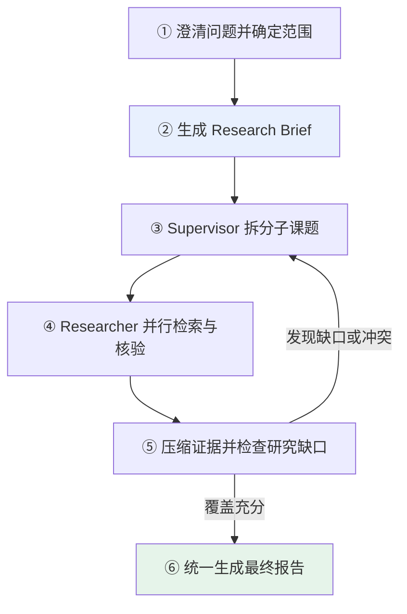
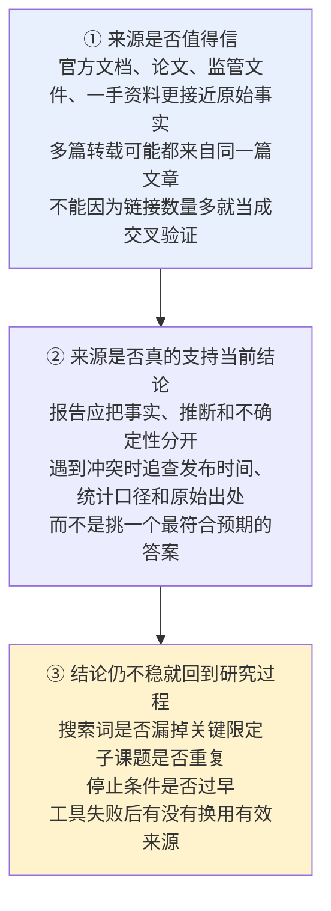
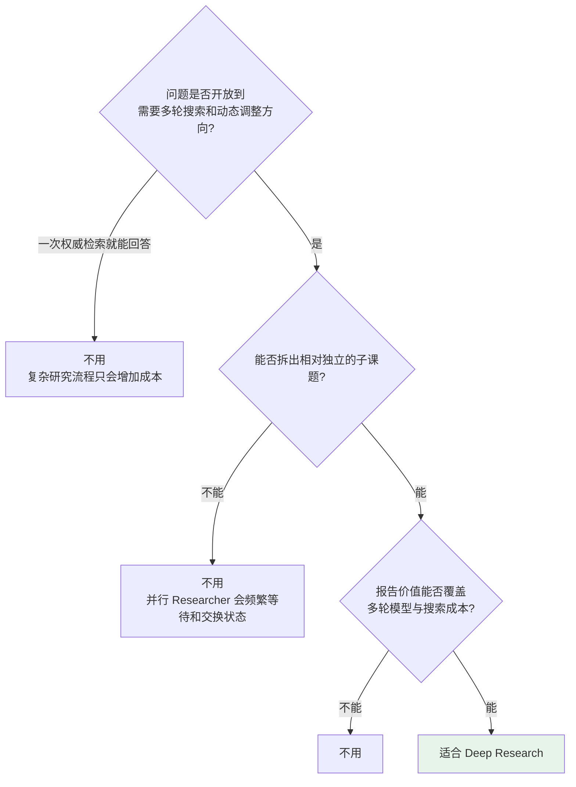

# 第十二章：Deep Research 的实现逻辑

## 12.1 Deep Research 是什么

**普通问答通常可以通过一次检索得到答案，而研究任务往往一开始就没有固定路径。**

**例如比较三家云厂商的 Agent 托管能力**：需要分别查产品定位、价格、限制和区域差异，还要处理**产品改名、资料过期和来源矛盾**。

> **Deep Research 的关键不是「搜索很多次」**，而是让系统围绕研究目标**动态决定**：下一步搜索什么、哪些问题可以并行、证据是否充分，以及**何时停止**。

### 12.1.1 生态里几个名字的区别

| 名字 | 定位 |
|---|---|
| **LangChain** | 提供模型、工具和 Agent 等**高层积木** |
| **LangGraph** | 负责**有状态流程如何编排和运行** |
| **open_deep_research** | 展示一套**具体研究流程** |
| **Deep Agents** | 把**规划、子 Agent 和上下文管理**提炼成更通用的能力 |

> **说明这层区别即可，不需要背诵每个托管产品和仓库实现。**

## 12.2 核心流程

| 步骤 | 关键点 |
|---|---|
| **① 范围澄清** | 用户只说「研究某家公司」时，要确认是关注**投资价值、技术路线还是就业风险**，否则后续搜索很容易跑偏 |
| **② Research Brief** | 把用户目标、研究维度、时间范围、来源要求和交付形式整理成**稳定的成功标准** |
| **③ 拆分子课题** | **只有相对独立的问题才适合并行**（如分别研究三家公司的定价）；后一个问题依赖前一个结论就应该串行 |
| **④ 多轮检索** | 每个研究员**只处理一个主题**，并**保留来源信息** |
| **⑤ 压缩与查缺** | **不是把所有网页原文塞回 Supervisor**，而是压缩成**带出处的关键证据**；再检查 Brief 是否被覆盖 |
| **⑥ 统一写作** | 组织论证、处理重复内容，**将事实、推断和不确定性分开表达** |

## 12.3 为什么需要子 Agent

**如果一个 Agent 同时研究多个主题**，搜索结果会不断占用同一个上下文——A 公司的价格、B 公司的安全文档和 C 公司的失败请求混在一起，**模型反而更难关注当前证据**。

### 12.3.1 第一目的是隔离上下文

> **每个 Researcher 只处理一个子课题，最终只返回压缩后的结论和来源，主 Agent 不必背着全部搜索过程继续思考。**

### 12.3.2 并行是隔离之后的自然结果

- 相互独立的研究任务可以同时执行，**整体等待时间下降**；
- **彼此依赖的任务却仍要按顺序完成**。

> **Agent 数量越多，模型调用、搜索费用、限流和协调成本也越高。不能为了并行而并行，关键仍是子课题能否独立推进。**

### 12.3.3 为什么不让子 Agent 分别写报告章节

> **因为各章节可能重复背景、使用不同口径，甚至得出相互冲突的结论。**
>
> **并行搜证据、统一写报告**，更容易保持全文一致性。

## 12.4 如何保证研究质量

**研究报告很长、链接很多，并不代表质量高。**

**判断质量时沿着「来源 → 证据 → 结论」反向追查**：

### 12.4.1 评测既看答案也看轨迹

| 维度 | 检查 |
|---|---|
| 最终答案 | 是否覆盖 Brief |
| **研究轨迹** | 搜索路径是否合理 |
| **来源覆盖率** | 关键维度是否都有证据 |
| **引用正确性** | 引用是否真的支持结论 |
| 耗时与成本 | 是否在预算内 |

> **通用 Benchmark 可以用于版本比较，但不能代替企业自己的业务数据集。**

## 12.5 如何控制成本和安全

### 12.5.1 成本受「宽度」和「深度」双重影响

| 维度 | 含义 | 控制手段 |
|---|---|---|
| **宽度** | 并行研究单元数量 | **限制同时运行的研究单元** |
| **深度** | 每个 Researcher 和 Supervisor 最多迭代多少轮 | **限制工具调用次数和补搜轮数** |

**单个分支有上限还不够**——整项任务还要设置**总 Token、搜索费用和超时预算**，再补上失败重试、缓存、限流和取消策略。

> **系统才知道什么时候继续、什么时候降级、什么时候停止。**

### 12.5.2 网页和外部文档都是不可信输入

> **它们可能包含诱导 Agent 泄露密钥或执行危险操作的提示词注入。**

| 措施 |
|---|
| 研究工具**优先只读** |
| 内部数据遵循**最小权限** |
| **密钥不要暴露给搜索或沙箱环境** |
| 高风险操作**必须人工审批并保留 Trace** |

> **对于金融、医疗、法律和安全决策，Deep Research 只能辅助资料整理，不能因为报告带有引用就取消专家复核。**

## 12.6 哪些场景适合

**三项都成立时才值得使用**：

**典型场景**：竞品分析、技术路线调研、文献综述、供应商尽调、政策影响研究，以及企业内部资料与公开信息的联合分析。

**不适合的情形**：

| 情形 | 原因 |
|---|---|
| 只查一个容易核验的实时事实 | **一次权威搜索更快、更便宜** |
| 多个子任务必须严格共享中间状态 | **强行并行只会增加冲突** |
| 数据源本身不可靠或没有访问权限 | **研究 Agent 也无法凭空得到正确答案** |

## 12.7 常见错误

### 12.7.1 把 Deep Research 理解成「搜索很多次」

**核心是动态决定搜什么、能否并行、证据够不够、何时停止。**

### 12.7.2 把它当成 LangChain 核心包里的一个开关

**它是一类研究型 Agent 架构**，参考实现和通用框架定位不同。

### 12.7.3 跳过范围澄清直接开搜

**Brief 不明确，后续所有搜索都可能跑偏。**

### 12.7.4 把有依赖关系的子课题也并行

**后一个依赖前一个结论时必须串行。**

### 12.7.5 把网页原文全部塞回 Supervisor

**应该压缩成带出处的关键证据**，否则上下文很快被占满。

### 12.7.6 让子 Agent 分别写报告章节

**会重复背景、口径不一、结论冲突**，应并行搜证据、统一写报告。

### 12.7.7 用链接数量当交叉验证

**多篇转载可能都来自同一篇文章。**

### 12.7.8 遇到冲突挑一个最符合预期的答案

**要追查发布时间、统计口径和原始出处。**

### 12.7.9 只控制单分支迭代不设总预算

**整项任务还要有总 Token、搜索费用和超时上限。**

### 12.7.10 把网页内容当可信输入

**提示词注入可能诱导泄露密钥或执行危险操作**，研究工具应优先只读。

### 12.7.11 因为报告有引用就取消专家复核

**金融、医疗、法律和安全决策它只能辅助。**

### 12.7.12 只用通用 Benchmark 评测

**不能代替企业自己的业务数据集。**

## 12.8 本章总结

1. **Deep Research 是一类研究型 Agent 架构**，不是核心包中的一个开关；
2. **它建立在 LangChain 的模型/工具/Agent 与 LangGraph 的状态与编排能力之上**；
3. **六步流程**：明确范围 → 生成 Brief → 拆分子课题 → 并行检索核验 → 压缩证据查缺 → 统一写作；
4. **Research Brief 是稳定的成功标准**，缺了它搜索必然跑偏；
5. **只有独立子课题适合并行**，有依赖就串行；
6. **子 Agent 的第一目的是隔离上下文**，并行是隔离之后的自然结果；
7. **并行搜证据、统一写报告**，避免章节重复与结论冲突；
8. **质量沿「来源 → 证据 → 结论」反向追查**，链接多不等于交叉验证；
9. **评测既看答案也看轨迹、覆盖率、引用正确性、耗时和成本**；
10. **成本受宽度和深度双重影响**，单分支上限之外还要有总预算和取消策略；
11. **外部文档是不可信输入**：工具只读、最小权限、密钥隔离、高风险人工审批；
12. **三项条件都成立才值得用**：问题足够开放、子课题可独立、报告价值覆盖成本。

> **一句话概括：Deep Research 的本质是把一个没有固定路径的研究任务，拆成「Supervisor 规划补缺 + Researcher 隔离上下文并行搜证 + 统一写作阶段综合报告」的有状态流程，而它能不能上线，取决于你有没有同时控住宽度、深度、预算、来源可信度和提示词注入风险。**

## 参考资料

- [LangChain 官方博客：Open Deep Research](https://blog.langchain.com/open-deep-research/)
- [open_deep_research 官方仓库](https://github.com/langchain-ai/open_deep_research)
- [LangChain 官方博客：Deep Agents](https://blog.langchain.com/deep-agents/)
- [deepagents 官方仓库](https://github.com/langchain-ai/deepagents)
- [LangGraph 官方文档](https://langchain-ai.github.io/langgraph/)
- [LangSmith Evaluation 文档](https://docs.smith.langchain.com/evaluation)
- [Anthropic: Building Effective Agents](https://www.anthropic.com/engineering/building-effective-agents)
