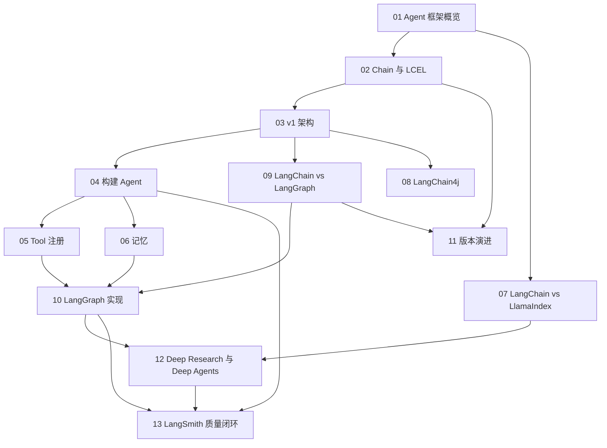

# LangChain 相关知识点

本目录梳理 LangChain 生态的**框架实现层**：同样的概念在 [Agent](../agent/README.md) 和 [RAG](../rag/README.md) 里讲的是原理与取舍，在这里讲的是「这个框架具体是怎么做的、为什么这么设计、什么时候该下沉到 LangGraph」。

## 目录

1. [主流 AI Agent 开发框架概览](01-agent-frameworks.md)
2. [Chain 的设计理念与 LCEL](02-chain-and-lcel.md)
3. [LangChain v1 的底层架构](03-langchain-architecture.md)
4. [用 LangChain 构建 Agent 的核心步骤](04-build-agent.md)
5. [为 Agent 注册工具](05-tool-registration.md)
6. [短期记忆与长期记忆的实现](06-memory.md)
7. [LangChain 与 LlamaIndex 的区别](07-langchain-vs-llamaindex.md)
8. [LangChain4j 与 Java 生态](08-langchain4j.md)
9. [LangChain 与 LangGraph 的核心区别](09-langchain-vs-langgraph.md)
10. [LangGraph 的核心优势与适配场景](10-langgraph-advantages.md)
11. [LangChain 大版本升级的核心变化](11-version-evolution.md)
12. [Deep Research 的实现逻辑](12-deep-research.md)
13. [用 LangSmith 建立生产质量闭环](13-langsmith-production-loop.md)

## 知识图谱

## 阅读建议

- **入门路线**：第 1、2、3 章建立框架心智模型，再看第 4 章动手；
- **工程落地路线**：第 4、5、6 章覆盖构建 Agent 的完整闭环；
- **架构选型路线**：第 7、9、10 章解决「用哪个框架、什么时候下沉」；
- **进阶路线**：第 11、12 章理解演进方向与复杂 Agent 的实现范式；第 13 章把 Trace、评测和发布门禁连成生产质量闭环。

返回[文档主题索引](../README.md)。
