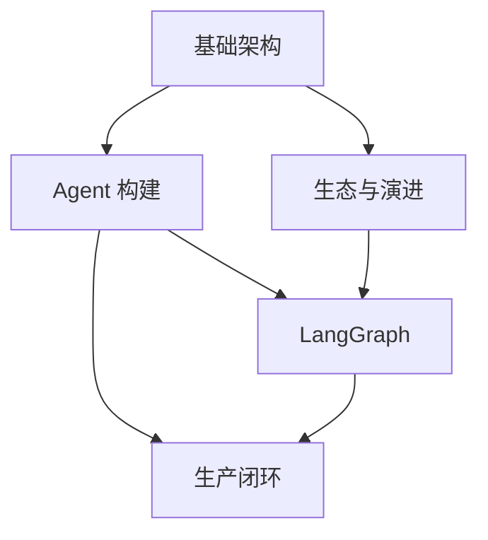

# LangChain 相关知识点

本主题位于框架实现层：Agent 与 RAG 主题讲原理和取舍，这里讲 LangChain、LangGraph、Deep Agents 与 LangSmith 如何具体实现。

## 子模块

1. [基础架构（第 1–3 章）](01-foundations/README.md)
2. [Agent 构建（第 4–6 章）](02-agent-building/README.md)
3. [生态与演进（第 7–8、11 章）](03-ecosystem/README.md)
4. [LangGraph（第 9–10 章）](04-langgraph/README.md)
5. [生产闭环（第 12–13 章）](05-production/README.md)

## 模块关系

## 阅读建议

- **框架入门**：基础架构 → Agent 构建；
- **复杂工作流**：基础架构 → Agent 构建 → LangGraph；
- **技术选型与升级**：基础架构 → 生态与演进；
- **生产质量闭环**：Agent 构建 → LangGraph → 生产闭环。

返回[文档主题索引](../README.md)。
