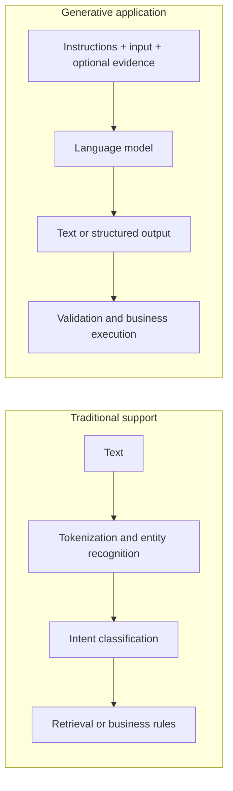
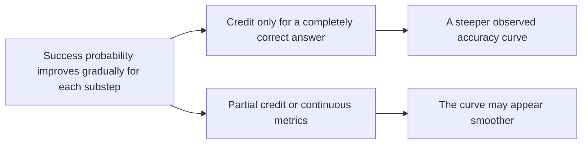

# Chapter 1: How Large Language Models Differ from Traditional NLP

## 1.1 What are we actually comparing when we contrast LLMs with traditional NLP?

There is no universally accepted parameter-count threshold for an LLM, and the broader term is not restricted to decoder-only models. This topic focuses on **generative, autoregressive language models**, such as GPT and Llama. That focus does not imply that all language models share one architecture.

Traditional NLP includes rule-based and statistical pipelines, but also end-to-end neural networks, pretrained representations, and generative models. The more accurate description of the shift is **from predominantly task-specific interfaces toward reusing a single pretrained model and text interface for many capabilities**, not “models used to classify, and only now can they generate.”

The diagram illustrates one customer-support example.



Errors can accumulate in a pipeline, but one upstream mistake does not necessarily invalidate every downstream step. Joint training, character-level models, and correction rules can mitigate this. Generative systems reduce some task-specific heads and labeling work, but introduce challenges around uncertain outputs, cost, authorization, and fact checking.

## 1.2 What BERT introduced—and what it did not

BERT's key contribution in 2018 was the combination of bidirectional Transformer representations and large-scale self-supervised pretraining. It did not introduce “pretraining followed by fine-tuning” for the first time.

The original English BERT used BooksCorpus, with approximately 800 million words, and English Wikipedia, with approximately 2.5 billion words. Its two objectives were:

| Objective | Approach in the original paper | Common confusion |
|---|---|---|
| MLM | Select approximately 15% of WordPiece tokens as prediction targets; replace 80% of those with `[MASK]`, 10% with random tokens, and leave 10% unchanged | Not all of the selected 15% are masked, and training does not predict just one word at a time |
| NSP | Construct pairs of genuinely consecutive segments and pairs with a random second segment; predict whether the second follows the first | This is a specific pretraining task, not evidence of reliable judgment about discourse logic |

Classification, sequence labeling, and extractive question answering can use different output heads. In practice, they are often fine-tuned separately, but they can also share an encoder, use multitask training, or directly use frozen representations. **Each task does not necessarily require its own complete copy of the model.**

BERT's standard training objective is not continuous left-to-right generation, so it is generally not used directly for open-ended chat. Calling it “purely discriminative” is also too simplistic: the MLM head itself predicts a vocabulary distribution, which can support masked-token completion and prompt-based classification.

When comparing training objectives, the original BERT optimizes MLM and NSP, whereas an autoregressive language model predicts the next token from the preceding text. Contextual representations are representations that both models learn through training, not a separate objective alongside those prediction tasks.

Autoregressive models generate text by repeatedly predicting the next token. This makes it convenient to express different tasks as conditional text generation, but a common interface does not guarantee good results on every task.

## 1.3 Why the autoregressive objective supports a common interface

Suppose a tokenizer converts text into `x_1, …, x_T`. Training minimizes the negative log-likelihood:

$$
\mathcal{L}(\theta) = -\sum_{t=1}^{T}\log P_\theta(x_t \mid x_1,\ldots,x_{t-1})
$$

A token is not necessarily a Chinese character or a word. During training, the model normally predicts the next token from the ground-truth prefix, using a causal mask to compute losses at all positions in parallel. During generation, it instead appends sampled outputs to the prefix step by step. This distinction is why training throughput cannot be directly equated with production generation latency.

| Task | Formulation as conditional text generation | Problems that remain |
|---|---|---|
| Classification | Supply label definitions and text; output a label | Valid labels, class imbalance, confidence calibration |
| Translation | Specify the target language and source text | Proper names, terminology, consistency |
| Question answering | Supply a question and optional retrieved evidence | Whether sources support the conclusion and whether the model should abstain |
| Code generation | Supply requirements, interfaces, and constraints | Compilation, testing, security, and execution permissions |

What becomes uniform is the calling interface, not the quality guarantee. A base model may merely imitate a text format. Instruction fine-tuning and preference optimization are commonly used to improve instruction following and usability in interactions.

A self-supervised objective does not require a human-written answer for every example, but **that does not mean any text on the internet is ready for training**. Data preparation must still address licensing, privacy, deduplication, contamination, quality, and language distribution. Reducing prediction loss can improve language and task capabilities, but local predictions may also succeed through memorization, co-occurrence, or shortcuts. Accurate predictions do not prove that the model has learned a correct reasoning process.

## 1.4 In-context learning changes the context, not the weights

Providing input–output examples can guide a model to continue a mapping without updating its parameters. In this Chinese customer-service example, A means a refund request and B means a shipping-status inquiry. The messages ask when money will be refunded, where a parcel is, and how to return a damaged item:

```text
标签定义：A = 请求退款，B = 查询物流
“钱什么时候退回来？” → A
“快递到哪了？” → B
“收到的商品坏了，想退掉。” →
```

The GPT-3 paper systematically studied zero-shot, one-shot, and few-shot settings. However, observations of task adaptation through context predate GPT-3; it is not correct to say that smaller models have no such capability.

To explain the difference between in-context learning and fine-tuning, describe their effects on system behavior:

- In-context learning leaves weights unchanged, but the examples consume tokens, prefill computation, and KV cache on every request. Their order and format can also affect results.
- Fine-tuning changes parameters or adapters. It incurs an upfront training cost and may remove the need for the same example prefix at deployment, but can introduce overfitting and capability regressions.
- In-context learning may involve recognizing a previously learned task or inferring a new mapping. A single familiar translation example cannot distinguish these possibilities.

## 1.5 How to describe gains from scale and “emergence”

The training-data volumes of well-known models illustrate historical changes, but their units and reporting scopes differ:

| Model and source scope | Training-data volume |
|---|---|
| Original English BERT | Approximately 3.3 billion words |
| GPT-3 (2020) | Approximately 300 billion tokens sampled during training |
| Llama 3 (2024 technical report) | On the order of 15 trillion pretraining tokens; consult the report for the specific variant |

Dividing word counts by token counts does not give an accurate growth factor. Nor should rumors fill gaps in undisclosed parameter counts or training-data volumes for closed models.

Scaling laws fit empirical relationships between loss, parameter count, data, and compute under particular experimental conditions. **They are not theorems guaranteeing that a capability will appear.** Chinchilla's 70B parameters and 1.4T tokens are a representative configuration from a study of fixed training budgets, not evidence that approximately 20 tokens per parameter is optimal for every model. When long-term inference cost matters, a smaller model trained on more tokens may be more economical.

“Emergence” usually describes an observation within a studied range of scales: smaller models perform near chance, while larger models improve markedly on particular metrics. Actual changes in capability must be distinguished from effects of the scoring rule:



There is no universal parameter-count threshold independent of the dataset, prompt, and scoring method. Training data, post-training, and test-time compute can also change the curves. A newer small model outperforming an older large model on some tasks does not mean it is better on every task, nor can the difference be attributed entirely to the ratio of parameters to training data.

## 1.6 A practical interview choice: a general-purpose model or a specialized one?

Suppose the task is to classify customer-service messages into ten fixed categories. First establish the cost of errors, throughput, latency, privacy requirements, and available labeled data, then choose an approach:

| Approach | Suitable conditions | Main costs |
|---|---|---|
| Rules or a small classifier | Stable labels, clear boundaries, strict low-latency requirements | Rule maintenance or labeling; generalization to new phrasing needs evaluation |
| Fine-tuned encoder | Representative data and a fixed output space | Training and version maintenance; new labels may require retraining |
| Prompting a general-purpose LLM | Frequently changing label descriptions, few examples, or tasks beyond classification | Token cost, latency, formatting failures, and error risk |
| LLM-generated labels plus a small model | High throughput, with human review available for important labels | Teacher errors propagate; an independent real-world test set is needed |

RAG supplies external evidence that can be updated and traced to its source. Fine-tuning adjusts model behavior or adapts it to a domain. A prompt specifies the conditions for an individual call. These approaches can be combined, but none replaces evaluation.

If asked “Why not replace everything with an LLM?”, explain that a common interface removes only part of the development cost. A small model may still handle a high-concurrency, single-task workload more economically. Complex applications also often need multiple models, retrievers, and business rules rather than one model serving the entire company.

## 1.7 The distinctions to retain from this chapter

The main engineering shift brought by LLMs is the reuse of pretrained capabilities through a general-purpose interface—not the obsolescence of traditional methods or the automatic arrival of reliable reasoning at scale. Keep **architecture, training objectives, post-training, prompting interfaces, and business evaluation** separate. This explains why the same model can attempt many tasks yet still be unsuitable for a particular production requirement.

## References

- [BERT: Pre-training of Deep Bidirectional Transformers for Language Understanding](https://arxiv.org/abs/1810.04805)
- [Language Models are Few-Shot Learners (GPT-3)](https://arxiv.org/abs/2005.14165)
- [Language Models are Unsupervised Multitask Learners (GPT-2)](https://cdn.openai.com/better-language-models/language_models_are_unsupervised_multitask_learners.pdf)
- [Emergent Abilities of Large Language Models](https://arxiv.org/abs/2206.07682)
- [Are Emergent Abilities of Large Language Models a Mirage?](https://arxiv.org/abs/2304.15004)
- [Scaling Laws for Neural Language Models](https://arxiv.org/abs/2001.08361)
- [Training Compute-Optimal Large Language Models (Chinchilla)](https://arxiv.org/abs/2203.15556)
- [The Llama 3 Herd of Models](https://arxiv.org/abs/2407.21783)
