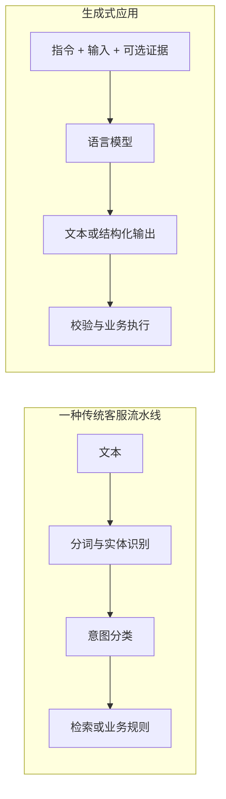

# 第一章：大语言模型与传统 NLP 的本质区别

## 1.1 先界定比较对象

LLM 没有公认的参数量分界线，广义上也不只指 Decoder-only。本主题主要讨论以 GPT、Llama 等为代表的**生成式、自回归语言模型**；不能据此把所有语言模型都归入同一种架构。

传统 NLP 既有规则与统计流水线，也有端到端神经网络、预训练表示和生成模型。更准确的变化是：**从较多任务专用接口，转向用同一个预训练模型和文本接口复用多种能力**，而不是「以前只能分类，现在才能生成」。



流水线可能累积误差，但不是前一步错了后面必然全错；联合训练、字级模型和纠错规则都可以缓解。生成式系统减少了一部分任务头与标注工作，却新增了输出不确定性、成本、权限和事实校验问题。

## 1.2 BERT 带来了什么，没带来什么

BERT（2018）的关键是双向 Transformer 表示与大规模自监督预训练，不是首次提出「预训练 + 微调」。

原始英文 BERT 使用 BooksCorpus（约 8 亿词）和英文维基百科（约 25 亿词）。两个目标是：

| 目标 | 原始论文中的做法 | 容易混淆的地方 |
|---|---|---|
| MLM | 抽取约 15% 的 WordPiece token 作为预测目标；其中 80% 换成 `[MASK]`，10% 换成随机 token，10% 保持不变 | 不是把全部 15% 都遮住，也不是每次只预测一个词 |
| NSP | 构造真实相邻片段与随机片段，预测后者是否接续前者 | 是特定预训练任务，不代表模型获得了可靠的篇章逻辑判断能力 |

分类、序列标注和抽取式问答可以接不同的输出头。实践中常分别微调，但也可以共享编码器、做多任务训练，或直接使用冻结表示；**不是每个任务都必须保留一份完整模型**。

BERT 的标准训练目标不是从左到右连续生成，因此通常不直接用于开放式聊天。但称它「只会判别」也过于简单：MLM 头本身预测词汇分布，掩码填空和基于提示的分类都能利用这个输出。
更关键的区别是：BERT 的预训练目标是学习上下文表示，而自回归语言模型是直接训练根据前文来预测下一个 token，使不同任务可以进一步统一为条件文本生成

## 1.3 自回归目标为什么能统一接口

设文本经 Tokenizer 转成 `x_1, …, x_T`，训练时最小化负对数似然：

$$
\mathcal{L}(\theta) = -\sum_{t=1}^{T}\log P_\theta(x_t \mid x_1,\ldots,x_{t-1})
$$

token 不等于汉字或单词。训练通常用真实前缀预测下一个 token，借助因果掩码并行计算各位置的损失；生成时才逐步把采样结果加入前缀。这一区别决定了训练吞吐与在线生成延迟不能直接类比。

| 任务 | 如何转成文本条件生成 | 仍需解决的问题 |
|---|---|---|
| 分类 | 输入标签定义、文本，输出标签 | 标签合法性、类别不平衡、置信度校准 |
| 翻译 | 给出语言要求和原文 | 专名、术语、一致性 |
| 问答 | 给出问题及可选检索证据 | 来源是否支持结论、是否应拒答 |
| 代码生成 | 给出需求、接口和约束 | 编译、测试、安全与执行权限 |

统一的是调用接口，不是质量保证。基础模型可能只会模仿文本格式；指令微调与偏好优化通常用于提高指令遵循和交互可用性。

自监督目标不要求逐条人工答案，**不等于互联网文本都可直接用于训练**。数据仍要处理授权、隐私、去重、污染、质量和语言分布。降低预测损失可以促进语言和任务能力，也可能靠记忆、共现或捷径完成局部预测；不能从「预测准确」推出模型一定掌握了正确推理过程。

## 1.4 In-Context Learning：变的是上下文，不是权重

给模型一些输入输出示例，可以在不更新参数的情况下引导它延续映射：

```text
标签定义：A = 请求退款，B = 查询物流
“钱什么时候退回来？” → A
“快递到哪了？” → B
“收到的商品坏了，想退掉。” →
```

GPT-3 论文系统研究了 zero-shot、one-shot 和 few-shot 设置，但上下文任务适应的观察早于 GPT-3，不能说小模型完全没有这类能力。

回答「上下文学习和微调有什么区别」时，需要落到系统行为：

- 上下文学习不改权重，但示例占用每次请求的 token、prefill 计算与 KV Cache；示例顺序和格式也可能影响结果。
- 微调改参数或适配器，训练成本在前，部署时不一定需要同样的示例前缀，但可能引入过拟合和能力回归。
- 上下文学习可能是在识别已学过的任务，也可能在推断新映射；仅凭一个熟悉的翻译例子，无法区分两者。

## 1.5 规模收益与「涌现」应怎样表述

经典模型的数据规模可用于理解历史变化，但计量口径不同：

| 模型与资料范围 | 训练数据量 |
|---|---|
| 原始英文 BERT | 约 33 亿词 |
| GPT-3（2020） | 训练采样总量约 3000 亿 token |
| Llama 3（2024 技术报告） | 约 15 万亿量级的预训练 token，具体变体以报告为准 |

词与 token 不能直接相除得到准确增长倍数，闭源模型未披露的参数量、数据量也不能由外界传闻补齐。

Scaling Law 拟合的是特定实验条件下损失随参数、数据、算力变化的经验关系，**不是某项能力必然出现的定理**。Chinchilla 的 70B 参数、1.4T token 是固定训练预算研究中的代表配置，不能把约 20 token/参数当成任意模型的最佳配方；考虑长期推理成本时，训练更多 token 的较小模型可能更合算。

「涌现」通常描述：在所观测的规模范围内，小模型表现接近随机，较大模型在某些指标上明显提升。要区分真实能力变化与指标效应：


原有「8B 以下约 0%、540B 约 60%」「ICL 的临界点约 100B」没有限定数据集、提示和计分方式，不能作为通用结论。不同训练数据、后训练和测试时计算也会改变曲线。跨代小模型在某些任务上超过早期大模型，不等于在所有任务上更强，也不能把差异全部归因于参数与数据比例。

## 1.6 面试中的实际选型：统一模型还是专用模型

假设目标是将客服消息分成十个固定类别，先给出错误成本、吞吐、延迟、隐私和可用标注量，再选择方案：

| 方案 | 适合的条件 | 主要代价 |
|---|---|---|
| 规则或小型分类器 | 标签稳定、边界明确、低延迟要求高 | 规则维护或标注；泛化到新表达需要评测 |
| 编码器微调 | 有代表性数据，输出空间固定 | 训练和版本维护；新标签可能需要重训 |
| 通用 LLM 提示 | 标签描述常变、样本少、任务不只分类 | token 成本、延迟、格式与错误风险 |
| LLM 生成标注 + 小模型 | 高吞吐，能人工复核关键标签 | 教师错误会传递，需独立真实测试集 |

RAG 补充可更新、可追溯的外部证据，微调调整模型行为或领域适配，Prompt 明确一次调用的条件；三者可以组合，但都不能替代评测。

若被追问「为什么不全部换成 LLM」，应说明统一接口只减少部分研发成本。高并发单任务可能仍由小模型更经济地完成，复杂应用也经常需要多个模型、检索器和业务规则，而非一套模型覆盖全公司。

## 1.7 本章要记住的边界

LLM 的主要工程变化是预训练能力通过通用接口复用，不是传统方法失效，也不是规模自动带来可靠推理。回答时把**架构、训练目标、后训练、提示接口和业务评测**分开，才能解释同一个模型为什么能尝试很多任务，却未必适合某个具体生产需求。

## 参考资料

- [BERT: Pre-training of Deep Bidirectional Transformers for Language Understanding](https://arxiv.org/abs/1810.04805)
- [Language Models are Few-Shot Learners（GPT-3）](https://arxiv.org/abs/2005.14165)
- [Language Models are Unsupervised Multitask Learners（GPT-2）](https://cdn.openai.com/better-language-models/language_models_are_unsupervised_multitask_learners.pdf)
- [Emergent Abilities of Large Language Models](https://arxiv.org/abs/2206.07682)
- [Are Emergent Abilities of Large Language Models a Mirage?](https://arxiv.org/abs/2304.15004)
- [Scaling Laws for Neural Language Models](https://arxiv.org/abs/2001.08361)
- [Training Compute-Optimal Large Language Models（Chinchilla）](https://arxiv.org/abs/2203.15556)
- [The Llama 3 Herd of Models](https://arxiv.org/abs/2407.21783)
