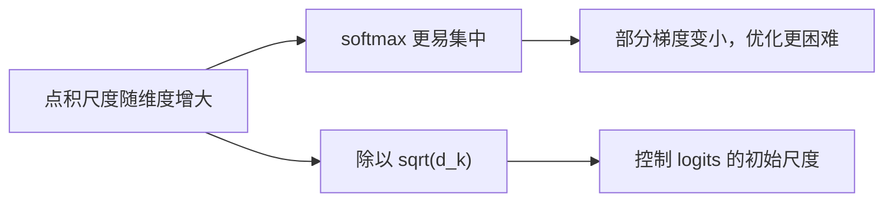
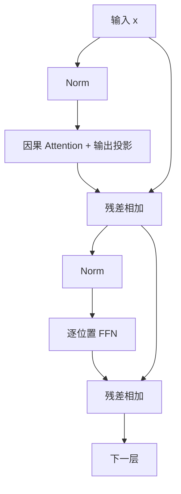

# 第二章：Transformer 架构原理

## 2.1 Transformer 解决的是哪种串行依赖

RNN 的隐藏状态 `h_t` 依赖 `h_{t-1}`，所以同一序列的时间步不能全部同时计算。但批次、矩阵乘法和部分输入投影仍能并行，不能说 RNN「完全用不上 GPU」。

Self-Attention 允许可见位置之间直接交换信息，缩短长距离依赖的路径，也允许训练时并行处理全部位置。它**没有保证长距离信息一定保留**，也没有消除自回归生成对前一个输出的依赖。

| 层或阶段 | 沿序列的主要依赖 | 开销范围 |
|---|---|---|
| RNN 层 | 时间步递归 | 典型稠密变换约 `O(Nd²)` |
| 全注意力层 | 可见位置间两两交互 | 注意力约 `O(N²d)`，投影约 `O(Nd²)` |
| 自回归 decode | 新输入依赖刚生成的 token | 即使单层内部并行，也通常逐 token 推进 |

`N` 是序列长度，`d` 是隐藏维度。只写「RNN 是 O(N)，Transformer 是 O(N²)」隐去了维度与投影开销。

## 2.2 从输入到 Q、K、V

以单个样本、单头为例，输入 `X` 的形状是 `(N, d_model)`：

```python
# W_Q、W_K: (d_model, d_k)，W_V: (d_model, d_v)
Q = X @ W_Q  # (N, d_k)
K = X @ W_K  # (N, d_k)
V = X @ W_V  # (N, d_v)
```

Q 用于查询，K 用于匹配，V 提供被聚合的信息。这是解释计算角色的类比，并不意味着某个向量有可直接读取的「标签」。

Self-Attention 的三者来自同一序列；Cross-Attention 通常是 Q 来自解码器状态，K/V 来自编码器输出。除第一层外，输入也不是原始 embedding，而是上一层的上下文化表示。

$$
\mathrm{Attention}(Q,K,V)
= \mathrm{softmax}\left(\frac{QK^T}{\sqrt{d_k}}+M\right)V
$$

softmax 沿键的位置维度计算。`QKᵀ` 为 `(N, N)`，输出为 `(N, d_v)`；`M` 可以包含因果掩码、padding 掩码或位置偏置。

## 2.3 为什么除以平方根，而不是 d_k

在 Q/K 各维近似独立、均值为 0、方差为 1，并且两者相互独立的简化假设下：

$$
\mathrm{Var}\left(\sum_{i=1}^{d_k}q_i k_i\right)=d_k
$$

除以 `√d_k` 把点积方差保持在同一量级。若除以 `d_k`，维度增大时方差反而趋小；若不缩放，较大 logits 更容易让 softmax 饱和。这里是初始化与尺度控制的解释，不是训练后 Q/K 一定满足独立同分布的证明。



常见实现保留这个缩放，但也有 QK normalization、可学习温度等方法。Pre-LN 是对子层输入做归一化，不能直接等同于对 Q/K 点积的缩放；「不这样做就一定训不起来」也过强。

## 2.4 多头注意力不是把同一结果重复几遍

每个头使用不同投影，在各自子空间计算，再拼接并做输出投影：

$$
\mathrm{MultiHead}(X)
=\mathrm{Concat}(\mathrm{head}_1,\ldots,\mathrm{head}_H)W^O
$$

典型 MHA 令 `d_k = d_v = d_model / H`，所以所有头拼接后仍是 `d_model` 维。忽略 bias，Q/K/V 和输出投影的参数总量约为 `4d_model²`，不是每增加一个头就乘一遍完整模型宽度。

不同头可能学习不同关联，也可能冗余；不能预先规定每个头分别负责主谓、指代或语法。头数增多时每头变窄，实际速度还受 kernel、布局和硬件影响。共享 K/V 的 MQA、GQA 见[第三章](03-attention-variants.md)。

## 2.5 因果掩码、位置编码与训练标签

预测位置 `t` 的下一个 token 时，可以读取输入位置 `1, …, t`，不能读取未来位置。实现中将**严格上三角**的注意力 logits 置为负无穷，保留对角线；再把输出与右移一位的目标对齐。

```text
输入： BOS   我   喜欢   苹果
目标： 我    喜欢 苹果   EOS
```

因果掩码不等于 padding 掩码。训练时若把多篇独立文档打包，还要明确文档边界是否阻断注意力，否则后一篇可能读取前一篇。SFT 的「只对答案计算损失」也不意味着不能关注提示词：**loss mask 和 attention mask 是不同的东西**。

没有位置特征与非对称掩码的自注意力具有置换等变性：重排输入会同样重排输出，而不是输出矩阵完全不变。因果掩码本身已经引入方向性，因此不能把「Attention 完全不知顺序」无条件套在 decoder 上。显式位置方案通常仍是建模相对距离的重要部分，见[第四章](04-position-encoding.md)。

## 2.6 完整 Block：残差、归一化和 FFN

只写出 Attention 公式还不是完整 Transformer。以下是常见 Pre-Norm decoder block 的示意，具体模型可能不同：



$$
u=x+\mathrm{Attention}(\mathrm{Norm}(x)),\qquad
y=u+\mathrm{FFN}(\mathrm{Norm}(u))
$$

原始 Transformer 使用 Post-LN，即子层和残差相加后归一化；Pre-LN 将归一化放在子层前，常有助于深层训练的梯度传播，但不能仅凭这一点判定模型最终质量。

LayerNorm 对特征做中心化及方差归一化；RMSNorm 按均方根缩放，不减均值。两者都不是跨 token 的 BatchNorm。残差支路提供直接的信息与梯度通路，但不等于自动消除梯度问题。

FFN 对每个位置独立、共享参数地做特征变换。经典形式为两层线性变换加激活；现代模型也常用门控形式，例如：

$$
\mathrm{FFN}_{\mathrm{SwiGLU}}(x)
=\bigl(\mathrm{SiLU}(xW_g)\odot(xW_u)\bigr)W_d
$$

Attention 包含依赖输入的 softmax，**本身已经是非线性的**；FFN 不是整个 Block 唯一的非线性来源。部分可解释性研究将 FFN 看作键值记忆，但事实知识也分布在其他参数与计算路径中，不能把它视作可逐条查询的数据库。

```python
import torch
import torch.nn as nn
import torch.nn.functional as F


class DecoderBlock(nn.Module):
    """Pre-Norm decoder block，省略位置编码、dropout 与 KV Cache。"""

    def __init__(self, d_model, n_heads, d_ff):
        super().__init__()
        self.n_heads = n_heads
        # 注意力子层：一次线性变换同时得到 Q、K、V，再经输出投影 W^O
        self.norm1 = nn.RMSNorm(d_model)
        self.qkv = nn.Linear(d_model, 3 * d_model, bias=False)
        self.out = nn.Linear(d_model, d_model, bias=False)
        # FFN 子层：SwiGLU 的门控、升维与降维三个矩阵
        self.norm2 = nn.RMSNorm(d_model)
        self.gate = nn.Linear(d_model, d_ff, bias=False)
        self.up = nn.Linear(d_model, d_ff, bias=False)
        self.down = nn.Linear(d_ff, d_model, bias=False)

    def attention(self, x):  # x: (B, N, d_model)
        B, N, D = x.shape
        # 切出 Q、K、V，并拆成 H 个头：(B, N, D) -> (B, H, N, d_k)
        q, k, v = (
            t.view(B, N, self.n_heads, -1).transpose(1, 2)
            for t in self.qkv(x).split(D, dim=-1)
        )
        # 缩放点积：每个查询位置对所有键位置打分
        scores = q @ k.transpose(-2, -1) / k.size(-1) ** 0.5  # (B, H, N, N)
        # 因果掩码：严格上三角是未来位置，填 -inf 后 softmax 权重为 0
        future = torch.ones(N, N, dtype=torch.bool, device=x.device).triu(1)
        weights = scores.masked_fill(future, float("-inf")).softmax(dim=-1)
        # 按权重聚合 V，再把 H 个头拼回 d_model 维
        heads = (weights @ v).transpose(1, 2).reshape(B, N, D)
        return self.out(heads)

    def forward(self, x):
        # u = x + Attention(Norm(x))
        u = x + self.attention(self.norm1(x))
        # y = u + FFN(Norm(u))，FFN 采用 SwiGLU
        h = self.norm2(u)
        return u + self.down(F.silu(self.gate(h)) * self.up(h))
```

## 2.7 训练与生成怎样走过这个 Block

训练时所有输入 token 已知，因果掩码保证不泄漏答案，可以一次前向计算各位置的预测损失。

推理时分两段：

| 阶段 | 输入 | 主要工作 |
|---|---|---|
| Prefill | 已知提示词序列 | 并行计算提示词表示，形成每层 K/V，并得到首个输出 token 的分布 |
| Decode | 上一步生成的 token | 计算新位置的 Q/K/V，追加缓存，让新 Q 读取已有 K/V |

缓存生效依赖历史表示不随未来输入变化；标准因果 decoder 满足这个条件，普通双向编码器追加文本后则可能需要重算旧位置。

最后一层表示经最终归一化和词表投影得到 logits，再由解码策略选 token。训练吞吐高不意味着输出可以一次并行生成，相关缓存与采样见[推理与部署](../03-inference-serving/README.md)。

## 2.8 三种架构怎样比较

| 架构 | 可见性与数据流 | 典型目标或任务 |
|---|---|---|
| Encoder-only | 输入内部双向可见，仍可有 padding 掩码 | BERT 的 MLM；检索表示、分类、重排 |
| Decoder-only | 标准自回归设置下使用因果掩码 | CLM；续写、对话、代码生成 |
| Encoder-Decoder | Encoder 编码输入，Decoder 因果自注意力并跨注意力读取输入 | 翻译；T5 的去噪文本生成 |

架构和目标不是一一绑定。Decoder-only 在通用生成中的广泛应用来自目标、数据、后训练和工程生态的共同作用，不能把「每个位置都有 loss」当作它在所有任务上优于 MLM 的充分证明。

如果被要求手算一个 Block，先固定 batch、序列长度、隐藏维度、头数与 FFN 宽度，逐步写形状；若讨论性能，则再说明训练、prefill 还是 decode。否则容易把注意力矩阵、参数量和 KV Cache 混为一谈。

## 参考资料

- [Attention Is All You Need](https://arxiv.org/abs/1706.03762)
- [BERT](https://arxiv.org/abs/1810.04805)
- [Exploring the Limits of Transfer Learning with a Unified Text-to-Text Transformer（T5）](https://arxiv.org/abs/1910.10683)
- [On Layer Normalization in the Transformer Architecture](https://arxiv.org/abs/2002.04745)
- [Root Mean Square Layer Normalization](https://arxiv.org/abs/1910.07467)
- [GLU Variants Improve Transformer](https://arxiv.org/abs/2002.05202)
- [Query-Key Normalization for Transformers](https://arxiv.org/abs/2010.04245)
- [Transformer Feed-Forward Layers Are Key-Value Memories](https://arxiv.org/abs/2012.14913)
