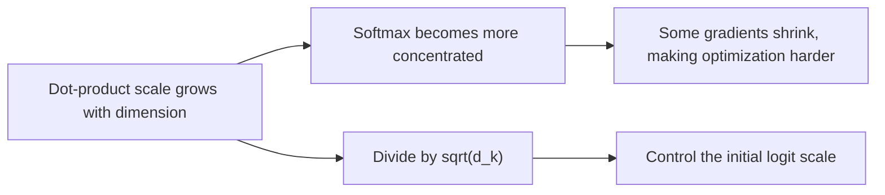
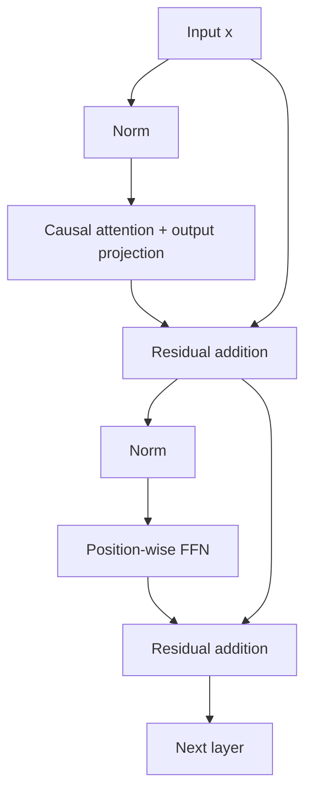

# Chapter 2: Transformer Architecture

## 2.1 Which sequential dependency does the Transformer address?

An RNN's hidden state `h_t` depends on `h_{t-1}`, so all time steps within a sequence cannot be computed simultaneously. However, batches, matrix multiplications, and some input projections can still run in parallel. It is incorrect to say that an RNN “cannot use a GPU at all.”

Self-attention lets visible positions exchange information directly, shortening the path for long-range dependencies and allowing all positions to be processed in parallel during training. It **does not guarantee that long-range information will be retained**, nor does it remove autoregressive generation's dependence on the previous output.

| Layer or stage | Main dependency along the sequence | Cost scope |
|---|---|---|
| RNN layer | Recurrence across time steps | Typical dense transformations cost approximately `O(Nd²)` |
| Full-attention layer | Pairwise interaction between visible positions | Approximately `O(N²d)` for attention and `O(Nd²)` for projections |
| Autoregressive decode | The new input depends on the token just generated | Usually advances token by token, even when operations within a layer run in parallel |

Here, `N` is sequence length and `d` is the hidden dimension. Simply writing “an RNN is O(N), a Transformer is O(N²)” hides the dimensions and projection costs.

## 2.2 From input to Q, K, and V

For one example and one attention head, the input `X` has shape `(N, d_model)`:

```python
# W_Q, W_K: (d_model, d_k); W_V: (d_model, d_v)
Q = X @ W_Q  # (N, d_k)
K = X @ W_K  # (N, d_k)
V = X @ W_V  # (N, d_v)
```

Q supplies queries, K is used for matching, and V supplies the information to aggregate. These are analogies for computational roles; they do not mean that a vector contains a directly readable “label.”

In self-attention, all three come from the same sequence. In cross-attention, Q typically comes from decoder states and K/V from encoder outputs. After the first layer, the input is not the original embedding either: it is the contextualized representation produced by the preceding layer.

$$
\mathrm{Attention}(Q,K,V)
= \mathrm{softmax}\left(\frac{QK^T}{\sqrt{d_k}}+M\right)V
$$

The softmax operates along the key-position dimension. `QKᵀ` has shape `(N, N)` and the output has shape `(N, d_v)`. `M` may contain a causal mask, a padding mask, or a positional bias.

## 2.3 Why divide by the square root rather than d_k?

Under the simplifying assumptions that the components of Q and K are approximately independent, have mean 0 and variance 1, and are also independent across Q and K:

$$
\mathrm{Var}\left(\sum_{i=1}^{d_k}q_i k_i\right)=d_k
$$

Dividing by `√d_k` keeps the dot-product variance at the same order of magnitude. Dividing by `d_k` would instead shrink the variance as the dimension increases. Without scaling, larger logits are more likely to saturate the softmax. This explains initialization and scale control; it is not proof that trained Q/K components must remain independent and identically distributed.



Common implementations retain this scaling, but alternatives include QK normalization and learnable temperatures. Pre-LN normalizes the input to a sublayer and is not equivalent to scaling Q/K dot products. “Training will always fail without this scaling” is also too strong a claim.

## 2.4 Multi-head attention does not just repeat the same result

Each head uses different projections and computes attention in its own subspace. The results are concatenated and passed through an output projection:

$$
\mathrm{MultiHead}(X)
=\mathrm{Concat}(\mathrm{head}_1,\ldots,\mathrm{head}_H)W^O
$$

Typical MHA sets `d_k = d_v = d_model / H`, so concatenating all heads still gives a `d_model`-dimensional vector. Ignoring biases, the Q/K/V and output projections together have approximately `4d_model²` parameters. Each additional head does not add another set of full model-width projection matrices.

Different heads may learn different relationships, or they may be redundant. We cannot assign each head a predetermined job such as subject–verb agreement, coreference, or syntax. More heads mean narrower individual heads, and actual speed also depends on kernels, layouts, and hardware. For MQA and GQA, which share K/V, see [Chapter 3](03-attention-variants.md).

## 2.5 Causal masks, positional encoding, and training targets

When predicting the next token at position `t`, the model may read input positions `1, …, t`, but not future positions. Implementations set the **strict upper triangle** of attention logits to negative infinity and retain the diagonal. Outputs are then aligned with targets shifted one position ahead.

The Chinese tokens below mean “I,” “like,” and “apples.” The example keeps the same tokens to show the input–target shift:

```text
Input:  BOS   我   喜欢   苹果
Target: 我    喜欢 苹果   EOS
```

A causal mask is not a padding mask. When independent documents are packed together for training, the implementation must also specify whether document boundaries block attention; otherwise, a later document may read an earlier one. In SFT, “compute loss only on the answer” does not mean the model cannot attend to the prompt. **Loss masks and attention masks serve different purposes.**

Self-attention without positional features or asymmetric masks is permutation-equivariant: permuting the inputs permutes the outputs in the same way, rather than leaving the output matrix unchanged. A causal mask already introduces directionality, so “attention has no sense of order” cannot be applied unconditionally to a decoder. Explicit positional schemes usually remain important for modeling relative distance; see [Chapter 4](04-position-encoding.md).

## 2.6 The complete block: residuals, normalization, and the FFN

The attention equation alone does not describe a complete Transformer. The following diagram shows a common pre-norm decoder block; individual models may differ:



$$
u=x+\mathrm{Attention}(\mathrm{Norm}(x)),\qquad
y=u+\mathrm{FFN}(\mathrm{Norm}(u))
$$

The original Transformer uses Post-LN: normalization follows the addition of the sublayer output and residual. Pre-LN places normalization before the sublayer, which often helps gradients propagate during deep-network training. That fact alone does not determine the model's final quality.

LayerNorm centers features and normalizes their variance. RMSNorm scales by the root mean square without subtracting the mean. Neither is BatchNorm across tokens. Residual branches provide direct paths for information and gradients, but do not automatically eliminate gradient-related problems.

The FFN transforms each position independently with shared parameters. The classic form is two linear transformations with an activation between them. Modern models also commonly use gated forms, such as:

$$
\mathrm{FFN}_{\mathrm{SwiGLU}}(x)
=\bigl(\mathrm{SiLU}(xW_g)\odot(xW_u)\bigr)W_d
$$

Attention includes an input-dependent softmax and **is already nonlinear**. The FFN is not the block's only source of nonlinearity. Some interpretability work views FFNs as key–value memories, but factual knowledge is also distributed across other parameters and computation paths. An FFN should not be treated as a database that can be queried record by record.

```python
import torch
import torch.nn as nn
import torch.nn.functional as F


class DecoderBlock(nn.Module):
    """Pre-norm decoder block without positional encoding, dropout, or KV cache."""

    def __init__(self, d_model, n_heads, d_ff):
        super().__init__()
        self.n_heads = n_heads
        # Attention: one linear transformation produces Q, K, V; W^O projects the output.
        self.norm1 = nn.RMSNorm(d_model)
        self.qkv = nn.Linear(d_model, 3 * d_model, bias=False)
        self.out = nn.Linear(d_model, d_model, bias=False)
        # FFN: SwiGLU gate, up-projection, and down-projection matrices.
        self.norm2 = nn.RMSNorm(d_model)
        self.gate = nn.Linear(d_model, d_ff, bias=False)
        self.up = nn.Linear(d_model, d_ff, bias=False)
        self.down = nn.Linear(d_ff, d_model, bias=False)

    def attention(self, x):  # x: (B, N, d_model)
        B, N, D = x.shape
        # Split Q, K, V into H heads: (B, N, D) -> (B, H, N, d_k).
        q, k, v = (
            t.view(B, N, self.n_heads, -1).transpose(1, 2)
            for t in self.qkv(x).split(D, dim=-1)
        )
        # Scaled dot product: each query position scores all key positions.
        scores = q @ k.transpose(-2, -1) / k.size(-1) ** 0.5  # (B, H, N, N)
        # Causal mask: future positions are strictly above the diagonal; -inf gives zero softmax weight.
        future = torch.ones(N, N, dtype=torch.bool, device=x.device).triu(1)
        weights = scores.masked_fill(future, float("-inf")).softmax(dim=-1)
        # Aggregate V by the weights, then concatenate H heads back to d_model.
        heads = (weights @ v).transpose(1, 2).reshape(B, N, D)
        return self.out(heads)

    def forward(self, x):
        # u = x + Attention(Norm(x))
        u = x + self.attention(self.norm1(x))
        # y = u + FFN(Norm(u)), with a SwiGLU FFN.
        h = self.norm2(u)
        return u + self.down(F.silu(self.gate(h)) * self.up(h))
```

## 2.7 How training and generation pass through this block

During training, all input tokens are known. The causal mask prevents target leakage, so one forward pass can compute prediction losses for every position.

Inference has two stages:

| Stage | Input | Main work |
|---|---|---|
| Prefill | The known prompt sequence | Compute prompt representations in parallel, produce K/V for each layer, and obtain the distribution for the first output token |
| Decode | The token generated in the previous step | Compute Q/K/V for the new position, append to the cache, and let the new Q read the available K/V |

Caching works only when past representations do not change with future inputs. A standard causal decoder meets this condition, whereas appending text to a conventional bidirectional encoder may require recomputing earlier positions.

The final-layer representation passes through final normalization and a vocabulary projection to produce logits. A decoding strategy then selects a token. High training throughput does not mean all output tokens can be generated in parallel. For caching and sampling, see [Inference and Serving](../03-inference-serving/README.md).

## 2.8 Comparing the three architectures

| Architecture | Visibility and data flow | Typical objectives or tasks |
|---|---|---|
| Encoder-only | Bidirectional visibility within the input, potentially with a padding mask | BERT's MLM; retrieval representations, classification, reranking |
| Decoder-only | Causal masking in the standard autoregressive setting | CLM; text continuation, dialogue, code generation |
| Encoder–decoder | The encoder represents the input; the decoder uses causal self-attention and reads the input through cross-attention | Translation; T5's denoising text generation |

Architectures and objectives do not have a one-to-one relationship. The widespread use of decoder-only models for general-purpose generation reflects a combination of objectives, data, post-training, and the engineering ecosystem. “Every position has a loss” is not sufficient proof that they outperform MLM on every task.

If asked to work through a block by hand, first fix the batch size, sequence length, hidden dimension, head count, and FFN width, then write down the shapes step by step. For performance questions, also specify whether the stage is training, prefill, or decode. Otherwise, it is easy to confuse the attention matrix, parameter count, and KV cache.

## References

- [Attention Is All You Need](https://arxiv.org/abs/1706.03762)
- [BERT](https://arxiv.org/abs/1810.04805)
- [Exploring the Limits of Transfer Learning with a Unified Text-to-Text Transformer (T5)](https://arxiv.org/abs/1910.10683)
- [On Layer Normalization in the Transformer Architecture](https://arxiv.org/abs/2002.04745)
- [Root Mean Square Layer Normalization](https://arxiv.org/abs/1910.07467)
- [GLU Variants Improve Transformer](https://arxiv.org/abs/2002.05202)
- [Query-Key Normalization for Transformers](https://arxiv.org/abs/2010.04245)
- [Transformer Feed-Forward Layers Are Key-Value Memories](https://arxiv.org/abs/2012.14913)
