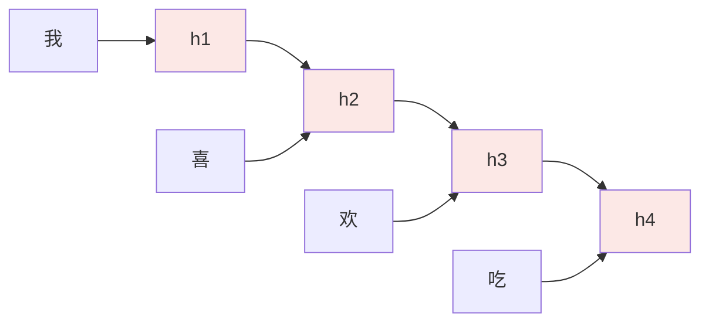
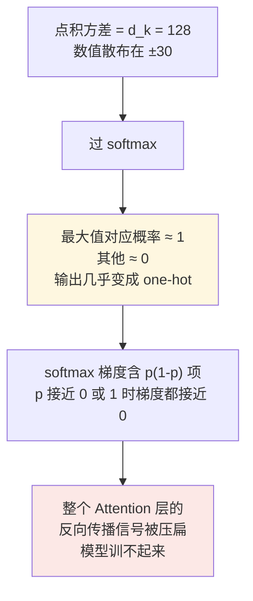
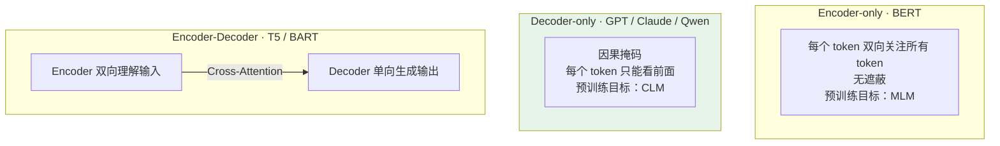

# 第二章：Transformer 架构原理

## 2.1 Transformer 之前：RNN 的两个致命缺陷

在 Transformer 出现之前，处理序列数据的主流是 RNN 及其变体（LSTM、GRU）。它的问题有两个，而且都是致命的。

### 2.1.1 顺序计算，无法并行

RNN 从左到右逐个处理每个词，**第 $N$ 步必须等第 $N-1$ 步算完才能开始**：



这种依赖链**完全用不上 GPU 的并行计算能力**，训练大型 RNN 极慢。

### 2.1.2 长距离梯度消失

序列很长时（比如 1000 个词），RNN 理论上能记住早期信息，但实践中梯度在反向传播时会**指数级衰减**，网络很难学到「第 1 个词和第 800 个词之间的关系」。

LSTM 通过门控机制有所缓解，但根本问题没解决。

2017 年 Google 在《Attention Is All You Need》里提出 Transformer，用一个全新架构一举解决了这两个问题。

## 2.2 Self-Attention 的核心直觉

核心思路：**让序列中每个 token 都能直接关注任意其他位置的 token**，计算出「我和其他位置的相关程度」，再按相关程度加权聚合其他位置的信息。

三个关键向量：

| 向量 | 含义 |
|---|---|
| **Q**（Query，查询） | 我想找什么 |
| **K**（Key，键） | 我有什么标签 |
| **V**（Value，值） | 我的实际内容 |

**图书馆检索类比**：你有一个搜索关键词（Q），图书馆里每本书都有标签（K）和内容（V）。注意力机制就是用关键词去匹配每本书的标签算出相似度分数，再按分数把书的内容加权求和。

## 2.3 Q/K/V 是怎么得到的

很多人讲 Self-Attention 会卡在「Q/K/V 从哪儿冒出来的」这一步。

它们**不是凭空生成的**，而是把输入 embedding 通过三个独立的线性投影矩阵算出来：

```python
# 输入 X 形状 (序列长度 N, embedding 维度 d_model)
# W_Q, W_K, W_V 都是可训练参数矩阵，形状 (d_model, d_k)

Q = X @ W_Q     # (N, d_k)  每个 token 都有自己的 Query 向量
K = X @ W_K     # (N, d_k)  每个 token 都有自己的 Key 向量
V = X @ W_V     # (N, d_v)  每个 token 都有自己的 Value 向量
```

三个关键点：

### 2.3.1 Q/K/V 都来自同一个输入 X

输入既要扮演**提问者**（Q），也要扮演**被查者**（K + V）——这就是「自注意力」里那个「自」字的含义。

区别于 Encoder-Decoder 架构里的 **Cross-Attention**：那里 Q 来自一边，K/V 来自另一边。

### 2.3.2 三个矩阵是独立学习的

这个细节容易被忽略但很重要。

如果让 Q/K/V 都直接等于 X 不做变换，模型就没法学到「该从什么角度提问」「该用什么标签匹配」「该返回什么内容」这种细致差异。**三个独立投影给了模型 3 倍的自由度**去学习角度上的差异，模型容量大幅提升。

### 2.3.3 投影维度通常是 d_model / H

$H$ 是头数。比如 $d_{model}=512$、$H=8$ 时，$d_k = 64$。

这样做的目的是**让多头的总参数量和单头版本基本一致**，不增加额外计算开销。

准备好之后代入注意力公式：

$$
\mathrm{Attention}(Q, K, V) = \mathrm{softmax}\!\left(\frac{QK^{T}}{\sqrt{d_k}}\right) V
$$

## 2.4 为什么要除以 √d_k

这一步叫 **Scaled Dot-Product Attention（缩放点积注意力）**。这个 $\sqrt{d_k}$ 不是随便加的。

### 2.4.1 不除会发生什么

假设 Q 和 K 的每一维都是均值 0、方差 1 的随机数，那么点积 $Q \cdot K$ 是 $d_k$ 个数相加：

$$
\mathrm{Var}(Q \cdot K) = d_k
$$

$d_k = 128$ 时标准差是 $\sqrt{128} \approx 11.3$，意味着点积数值会散布在 $\pm 30$ 这种很大的范围。



除以 $\sqrt{d_k}$ 之后方差被压回 1，softmax 输出分布合理，梯度能正常传播。

### 2.4.2 能不能用别的方案

业界确实尝试过几种替代：

| 方案 | 问题 |
|---|---|
| 用 Layer Norm 归一化（Pre-LN） | 严格说是「在 Attention 之前做归一化」，不是真的替换 $\sqrt{d_k}$ |
| 学一个可学习的 scaling 标量 | 实测效果和 $\sqrt{d_k}$ 差不多，但多了参数，不如固定常数简洁 |
| 直接限制 $d_k$ 很小 | 等于直接限制模型容量，不划算 |

**所有主流实现（GPT、Llama、Qwen）都用 $\sqrt{d_k}$，八年没改。** 这是一个「简单且数学上合理」的选择。

### 2.4.3 回到主线：两个问题一起解决了

拿到稳定的注意力权重后对 V 加权求和，就是 Self-Attention 的输出。这个过程：

- **对所有位置的计算可以并行** → 解决了 RNN 的并行问题；
- **每对位置之间都有直接连接**（通过注意力分数）→ 不存在长距离信息衰减。

代价是**计算复杂度从 RNN 的 $O(N)$ 变成了 $O(N^2)$**——这是后来所有长上下文优化工作要对付的根源，[第三章](03-attention-variants.md) 会展开。

## 2.5 Multi-Head Attention：多角度观察

单组 Q/K/V 只能学到一种关联关系，但语言中的关联是多维度的：

| 关联类型 | 例子 |
|---|---|
| 主谓关系 | 「我」↔「吃」 |
| 宾动关系 | 「苹果」↔「吃」 |
| 指代关系 | 「苹果」↔ 前文的「苹果树」 |

Multi-Head Attention 把 Q/K/V 投影到多个不同子空间（比如 8 个或 32 个头），**每组独立计算注意力，最后把所有头的输出拼接**。

$$
\mathrm{MultiHead}(Q,K,V) = \mathrm{Concat}(\mathrm{head}_1, \ldots, \mathrm{head}_H) W^{O}
$$

每个头可以专注捕捉不同类型的语言关联，整体表达能力更强。

## 2.6 位置编码：注入顺序信息

Self-Attention 有一个天然缺陷：**它的计算是对称的，不考虑词的顺序**。

「我打你」和「你打我」对 Attention 来说可能得到一样的结果——它只看哪些词相关，不看谁在前谁在后。

所以需要显式给每个 token 注入位置信息。具体方案有 sin/cos、RoPE、ALiBi 等多种，各有不同的设计哲学和长上下文外推能力，[第四章](04-position-encoding.md) 专门展开。

本节只需知道：**Transformer 靠加上位置编码来让模型感知词序**。

## 2.7 前馈网络（FFN）的作用

每个 Transformer 块里除了注意力层，还有一个前馈网络——两层全连接加一个激活函数：

$$
\mathrm{FFN}(x) = W_2 \cdot \sigma(W_1 x + b_1) + b_2
$$

它对**每个位置独立**做非线性变换。两个作用：

1. **补充非线性**——注意力层本质上是线性加权，FFN 引入非线性；
2. **储存事实知识**——研究表明 FFN 层储存了大量事实知识，可以理解为模型的「记忆仓库」。

第二点是从可解释性角度看 Transformer 的一个重要视角。它也解释了为什么 FFN 通常占了模型参数的大头（隐藏层维度一般是 $4 \times d_{model}$）。

## 2.8 三种架构

理解了 Attention 机制，就能解释三种架构的区别：



| 架构 | 注意力方式 | 预训练目标 | 擅长 |
|---|---|---|---|
| **Encoder-only** | 双向，无遮蔽 | MLM | 理解任务：分类、NER、语义相似度 |
| **Decoder-only** | 因果掩码，只看前面 | CLM（预测下一个 token） | 生成任务，现在几乎所有 LLM |
| **Encoder-Decoder** | Encoder 双向 + Decoder 单向 + Cross-Attention | 较复杂 | 输入输出是不同文本：翻译、摘要 |

**因果掩码**的实现很简单：在 softmax 之前把注意力分数矩阵的上三角置为负无穷，这样每个位置对未来位置的注意力权重就变成 0。

## 2.9 为什么 Decoder-only 赢了

这是面试里最容易被追问的点。三个原因：

### 2.9.1 目标极其统一

所有类型的任务——问答、写作、推理、代码生成、翻译——都能统一表达成**「续写」**这一件事。不需要区分「这是理解任务」还是「那是生成任务」，一套训练目标搞定一切。

### 2.9.2 可以直接在海量无标注文本上自监督训练

互联网上的公开文本天然可以构造成训练样本，不需要逐条人工标注。

**这一点 BERT 的 MLM 做不到吗？** MLM 也是无标注的，但训练效率不如 CLM：

- MLM 每个样本只有 15% 的位置产生训练信号，CLM 是**每个位置都产生信号**；
- MLM 引入了训练/推理不一致（训练时有 `[MASK]` 标记，推理时没有）。

这两点让 CLM 更适合 scale up。

### 2.9.3 规模越大，涌现的能力越强

模型从「会续写文本」开始，逐渐学会数学、推理、代码、跨语言迁移——这些都是这个简单目标在足够大规模下自然涌现的（详见 [第七章](../02-training-alignment/07-scaling-law-emergence.md)）。

### 2.9.4 但另外两种架构没有消失

- **Encoder-only** 在检索、分类、嵌入场景仍是主力（RAG 的 embedding 模型和 reranker 大量是 Encoder 架构，见 [RAG 主题](../../rag/README.md)）；
- **Encoder-Decoder** 在翻译、摘要这类明确的 seq2seq 任务上仍有价值。

**结论应该表述为**：如果目标是做一个通用对话与生成模型，Decoder-only 更容易 scale up，也更符合「一个模型续写所有任务」的统一接口——而不是「另外两种被淘汰了」。

## 2.10 常见错误

### 2.10.1 说不清 Q/K/V 从哪来

它们是同一个输入 X 经过**三个独立可训练矩阵**投影得到的。能说出「三个矩阵独立是为了给模型学习不同角度的自由度」，就比一般答案深一层。

### 2.10.2 说不出 √d_k 的动机

不是「归一化一下」这么笼统。要说出完整链条：**$d_k$ 大 → 点积方差大 → softmax 趋近 one-hot → 梯度含 $p(1-p)$ 项趋近 0 → 训不起来。**

### 2.10.3 忽略 Attention 的 O(N²) 代价

Self-Attention 解决了并行和长距离依赖，但代价是复杂度从 $O(N)$ 变成 $O(N^2)$。这是后续所有长上下文优化的根源。

### 2.10.4 认为 Multi-Head 只是「多算几遍」

关键在于每个头投影到**不同子空间**，捕捉不同类型的关联。而且 $d_k = d_{model}/H$ 的设计让总参数量与单头基本持平，不是简单堆算力。

### 2.10.5 忘了位置编码的必要性

Self-Attention 本身对顺序不敏感。忘了这一点，就解释不了为什么需要位置编码这个额外模块。

### 2.10.6 把 FFN 当成无关紧要的配角

它占了参数大头，而且研究表明它储存了大量事实知识。能提到「FFN 是模型的记忆仓库」是加分点。

### 2.10.7 说「Encoder-only 被淘汰了」

RAG 里的 embedding 模型和 reranker 大量还是 Encoder 架构。正确表述是「在通用生成场景 Decoder-only 胜出」，而不是另外两种消失了。

## 2.11 本章总结

1. **Transformer 的动机是 RNN 的两个致命缺陷**：顺序计算无法并行、长距离梯度消失；
2. **Self-Attention 让每个 token 直接关注任意位置**，用 Q 匹配 K 算分数，按分数加权聚合 V；
3. **Q/K/V 来自同一个 X 经三个独立矩阵投影**，「自」字的含义就在这里，独立矩阵提供学习角度差异的自由度；
4. **除以 $\sqrt{d_k}$ 是为了把点积方差压回 1**，否则 softmax 趋近 one-hot 导致梯度消失；
5. **代价是复杂度 $O(N^2)$**，这是后续长上下文优化的根源；
6. **Multi-Head 让不同头捕捉不同类型的语言关联**，$d_k = d_{model}/H$ 保证参数量不膨胀；
7. **Attention 对顺序不敏感**，所以必须显式注入位置编码；
8. **FFN 提供非线性并储存事实知识**，是模型的记忆仓库；
9. **Decoder-only 胜出的三个原因**：目标统一、可在无标注数据上高效自监督、规模化后能力涌现；
10. **另外两种架构仍有价值**，Encoder-only 在检索与嵌入场景是主力。

> **一句话概括：Transformer 用「每个位置直接看向所有位置」换掉了 RNN 的逐步传递，代价是平方复杂度，收益是可并行与无衰减的长距离依赖——而 Decoder-only 之所以胜出，是因为它把所有任务压缩成了一个可以无限 scale 的训练目标。**

## 参考资料

- [Attention Is All You Need](https://arxiv.org/abs/1706.03762)
- [BERT: Pre-training of Deep Bidirectional Transformers for Language Understanding](https://arxiv.org/abs/1810.04805)
- [Improving Language Understanding by Generative Pre-Training（GPT-1）](https://cdn.openai.com/research-covers/language-unsupervised/language_understanding_paper.pdf)
- [Exploring the Limits of Transfer Learning with a Unified Text-to-Text Transformer（T5）](https://arxiv.org/abs/1910.10683)
- [Transformer Feed-Forward Layers Are Key-Value Memories](https://arxiv.org/abs/2012.14913)
- [The Illustrated Transformer](https://jalammar.github.io/illustrated-transformer/)
- [What Language Model Architecture and Pretraining Objective Work Best for Zero-Shot Generalization?](https://arxiv.org/abs/2204.05832)
