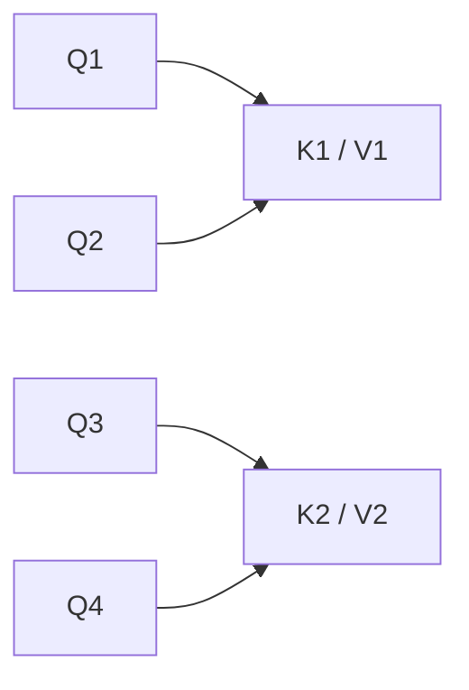
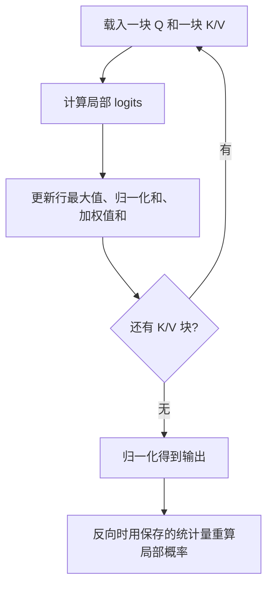

# 第三章：MHA 的局限与 MQA、GQA、Flash Attention

## 3.1 先区分三种开销

| 场景 | 全注意力的主要计算 | 主要存储问题 |
|---|---|---|
| 训练 | 所有位置两两交互并反向传播 | 朴素实现物化注意力矩阵，另有其他激活、梯度和优化器状态 |
| Prefill | 已知提示词并行处理 | 长提示词的中间激活及待保留的 K/V |
| Decode | 每个新 Q 读取历史 K/V | 持久 KV Cache 及每步读取权重、缓存的带宽 |

单层单头长度为 `N` 的注意力矩阵有 `N²` 个元素。若 `N = 4096`，FP16 矩阵约 32 MiB；若 `N = 32768`，约 2 GiB。这是**物化矩阵的实现开销**，不是数学上必须保存整个矩阵，FlashAttention 正是反例。

有缓存时，每步对长度 `N` 的历史做注意力约需 `O(Nd)` 计算，整个增长序列的注意力总量仍可达平方级。没有缓存且每次重算整个前缀时，这部分总量可达立方级；不能把这些量级当成模型全部计算或实际延迟。

新 token 需要计算自己的 **Q、K 和 V**，新 K/V 要加入缓存，不是只算 Q。小批量 decode 常受带宽限制，长序列 prefill 更可能受计算限制，实际应以 profiler 为准。

## 3.2 KV Cache 要用 KV 头数计算

对所有层头数和维度相同、K/V 维度相等的稠密缓存，字节数为：

$$
\mathrm{KVBytes}=2BLNH_{\mathrm{KV}}d_hs
$$

`B` 为批大小，`L` 为层数，`N` 为每个请求已缓存的长度，`H_KV` 为 KV 头数，`d_h` 为每头维度，`s` 为每元素字节数。不同请求长度不同，应该按各请求的有效长度或实际分配长度累加。

例：`B=1, L=32, N=32000, H_KV=32, d_h=128, s=2`：

$$
2\times1\times32\times32000\times32\times128\times2
=16{,}777{,}216{,}000\ \mathrm{bytes}
$$

即约 **16.78 GB / 15.625 GiB**。再加约 14 GB 的 7B FP16 权重，已经超过 24 GB，尚未计运行时工作区。

这是一个明确的 **32 KV 头 MHA 配置**，不是所有 7B 模型的缓存大小。换成 8 个 KV 头，其他条件不变，缓存约为 4.19 GB；量化权重也不会自动把 KV Cache 一起量化。

## 3.3 MQA 与 GQA 改的是模型结构

标准 MHA 每个 Q 头都有对应的 K/V 头。MQA 让所有 Q 头共用一组 K/V；GQA 将 Q 头分组，每组共用 K/V：

| 结构 | Q 头数 | KV 头数 | 相对 MHA 的缓存比例 |
|---|---|---|---|
| MHA | `H` | `H` | 1 |
| GQA | `H` | `G` | `G/H` |
| MQA | `H` | 1 | `1/H` |

图示为 `H=4, G=2` 的 GQA。常见实现要求 Q 头数能被 KV 头数整除；张量并行还可能要求分片整除或复制部分 KV 头，不能忽略这些约束直接按卡数均分显存。

共享的是 K/V 投影及表示，**Q 头仍各自计算不同的注意力分布**，因此 MQA 不等于「只剩一个视角」。减少 KV 头降低容量与带宽需求，也可能影响质量；变化取决于模型规模、数据、训练方式和任务，没有通用的「MQA 降 2–5%、GQA 降不到 0.5%」。

GQA 原论文研究了从 MHA checkpoint 转换：组内 K/V 头均值池化后继续预训练，并在其设置下用原预训练算力约 5% 做 uptraining。它不是无需训练、删除头就可保证质量的推理开关。

公开例子包括 Llama 2 70B 的 `64 Q / 8 KV` 头，以及 Llama 3 文本模型使用 GQA。具体头数要读目标 checkpoint 的配置，不能由模型参数量反推。

## 3.4 MLA 压缩的是缓存表示

DeepSeek-V2/V3 的 Multi-head Latent Attention 不只是减少 KV 头数，而是用低维 latent 联合表示 K/V。推理时可通过吸收投影矩阵等计算重写，避免每步显式恢复并长期保存完整的多头 K/V。

关键细节是**解耦 RoPE**：V2 的缓存除压缩 latent 外，还需要位置相关的 key 部分。普通 RoPE 直接作用于完整 key 会影响投影吸收，因此不能把 MLA 简化成「给任意 K/V 做一次低秩压缩即可」。

| 比较项 | GQA | MLA |
|---|---|---|
| 缓存对象 | 较少组的 K/V | latent 与位置相关 key 等表示 |
| 主要约束 | 共享组数、头维度、并行分片 | 低秩维度、位置解耦与专用 kernel |
| 能否直接替换现有模型 | 通常需要转换与训练 | 需要模型架构与训练配合 |

DeepSeek-V2 报告的 KV Cache 减少 93.3% 是**相对 DeepSeek 67B 的特定配置**，不意味着 MLA 对所有 GQA 模型都固定省这个比例。部署收益还取决于框架是否真正使用压缩缓存路径。

## 3.5 FlashAttention 改的是实现

朴素注意力先把 `S = QKᵀ` 写到 GPU 显存，再读取计算 `P = softmax(S)`，最后计算 `PV`。中间矩阵的读写会很昂贵。

FlashAttention 对 Q/K/V 分块，在片上存储中计算局部分数，使用 **online softmax** 合并不同块的统计量，避免在显存中物化完整 `N × N` 矩阵。

为什么不能把每块 softmax 独立归一化后直接相加？因为分母应该覆盖整行。以旧块最大值 `m`、指数和 `l`，新块对应 `m_b, l_b` 为例：

$$
m'=\max(m,m_b),\qquad
l'=e^{m-m'}l+e^{m_b-m'}l_b
$$

加权 V 的未归一化累积量也要做相同的重缩放，最后再除以总指数和。这解释了「分块」为什么仍能得到全行 softmax，而不是分块近似注意力。

| 能解决什么 | 不能据此声称什么 |
|---|---|
| 注意力中间存储从平方级降为随序列线性增长的量级 | 整个训练过程只需要保存输出 |
| 减少显存与片上存储之间的 IO | 全注意力算术量变成 `O(N)` |
| 计算与标准 attention 数学等价，不做稀疏近似 | 浮点数逐位一致，或任何低精度模式都无误差 |
| 在合适硬件与工作负载下提速 | 所有模型端到端固定快 2–4 倍 |

原论文的 IO 分析以片上容量和头维度为变量，不能把容量简单写成「块大小 M」后宣称任意实现固定减少 M 倍 IO。A100 的显存带宽随型号而异，片上带宽也不是把单个 SM 容量和全芯片带宽拼成一个固定 13 倍结论。

**版本范围**：FlashAttention-2 改进并行与工作划分，FlashAttention-3 面向 Hopper；截至 2026-09-08 核实的官方仓库还列有采用 CuTeDSL、面向 Hopper/Blackwell 的 FlashAttention-4。这里不是框架默认后端列表，实际可用性要同时核对 GPU、数据类型、head dimension、mask、库与框架版本。

## 3.6 结构与实现可以组合，但不是任意互换

GQA 决定存几组 K/V，FlashAttention 决定如何高效计算注意力，二者可组合。MLA 同样可以使用针对其结构设计的融合 kernel，但不能把 DeepSeek-V3 写成「GQA + FlashAttention」。

部署前应依次回答：

1. checkpoint 原本使用 MHA、GQA 还是 MLA，支持哪种位置编码？
2. 缓存按什么精度与布局存储，是否有分片复制、分页碎片或预留空间？
3. 瓶颈是 prefill 算力、decode 带宽、KV 容量，还是调度和通信？
4. 所选 kernel 支持哪些输入形状，回退路径是否改变实际收益？

「7B 能否在 24GB 显卡上跑 32K」要结合权重、缓存、运行时空间、batch 和上下文训练范围回答。省下显存不等于模型具备 32K 有效理解能力。

## 3.7 长上下文的其他路线

| 方向 | 机制 | 需要保留的边界 |
|---|---|---|
| Sliding Window Attention | 每层只读局部窗口 | 多层可间接扩大感受野；远距离检索与可淘汰缓存范围依架构而定 |
| 稀疏注意力 | 选择部分位置计算 | 改变可见连接，需评估遗漏信息的风险 |
| Linear Attention | 将特征映射或递推状态用于线性复杂度计算 | 不必都是 softmax 的近似；固定状态也有记忆容量限制 |
| Linformer | 沿序列维做低秩投影 | 不是与 Performer 相同的核方法 |
| Mamba / SSM 及混合结构 | 用选择性状态更新，或与 attention 交替 | 可持续处理流不等于无损记住无限历史 |

面试时应把「改连接」「改缓存表示」「改算子实现」区分开，才知道质量损失可能来自哪里、哪些优化能够叠加。

## 参考资料

- [Fast Transformer Decoding: One Write-Head is All You Need（MQA）](https://arxiv.org/abs/1911.02150)
- [GQA: Training Generalized Multi-Query Transformer Models from Multi-Head Checkpoints](https://arxiv.org/abs/2305.13245)
- [Llama 2](https://arxiv.org/abs/2307.09288)
- [The Llama 3 Herd of Models](https://arxiv.org/abs/2407.21783)
- [DeepSeek-V2 论文与官方实现](https://github.com/deepseek-ai/DeepSeek-V2)
- [FlashAttention](https://arxiv.org/abs/2205.14135)
- [FlashAttention 官方仓库与版本要求（2026-07-06 README 快照）](https://github.com/Dao-AILab/flash-attention/blob/1f7ce2f7cb503473559f3d44d575ae05b1ed8557/README.md)
- [Online normalizer calculation for softmax](https://arxiv.org/abs/1805.02867)
- [Mistral 7B](https://arxiv.org/abs/2310.06825)
- [Linformer](https://arxiv.org/abs/2006.04768)
- [Rethinking Attention with Performers](https://arxiv.org/abs/2009.14794)
- [Mamba: Linear-Time Sequence Modeling with Selective State Spaces](https://arxiv.org/abs/2312.00752)
