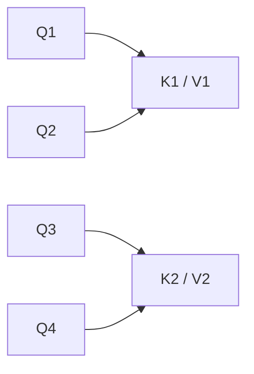
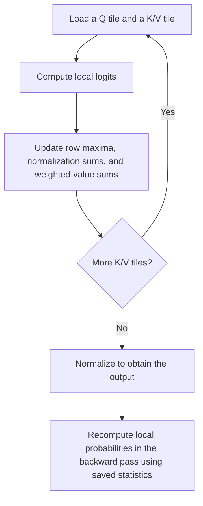

# Chapter 3: MHA Limitations, MQA, GQA, and FlashAttention

## 3.1 Are attention bottlenecks the same during training and generation?

No. Training and prefill process many query positions at once. Cached decode usually adds only one query per step, so the bottleneck is more likely to shift toward reading weights and historical K/V. Distinguish these stages before deciding whether to change the model architecture or the operator implementation.

| Scenario | Main full-attention computation | Main storage concern |
|---|---|---|
| Training | Pairwise interactions across all positions, plus backpropagation | A naive implementation materializes the attention matrix; other activations, gradients, and optimizer states also need memory |
| Prefill | Process the known prompt in parallel | Intermediate activations for a long prompt and K/V that must be retained |
| Decode | Each new Q reads historical K/V | Persistent KV cache and bandwidth for reading weights and the cache at each step |

For one layer and one head, an attention matrix for a sequence of length `N` contains `N²` elements. At `N = 4096`, an FP16 matrix occupies approximately 32 MiB; at `N = 32768`, approximately 2 GiB. This is **the implementation cost of materializing the matrix**, not a mathematical requirement to store the entire matrix. FlashAttention is a counterexample.

With caching, attention over a history of length `N` requires approximately `O(Nd)` computation per step. Total attention computation over a growing sequence can still be quadratic. Without caching, recomputing the entire prefix at every step can make this total cubic. These orders of growth should not be mistaken for the model's total computation or actual latency.

A new token needs its own **Q, K, and V** computed, and its K/V must be appended to the cache. Computing Q alone is not enough. Small-batch decode is often bandwidth-bound; long-sequence prefill is more likely to be compute-bound. Use a profiler to establish the actual bottleneck.

## 3.2 Calculate KV cache size using the number of KV heads

For a dense cache in which all layers have the same head counts and dimensions, and K and V have equal dimensions, the size in bytes is:

$$
\mathrm{KVBytes}=2BLNH_{\mathrm{KV}}d_hs
$$

Here, `B` is batch size, `L` the number of layers, `N` the cached length per request, `H_KV` the number of KV heads, `d_h` the dimension per head, and `s` the bytes per element. When requests have different lengths, sum over each request's effective or actually allocated length.

For example, take `B=1, L=32, N=32000, H_KV=32, d_h=128, s=2`:

$$
2\times1\times32\times32000\times32\times128\times2
=16{,}777{,}216{,}000\ \mathrm{bytes}
$$

This is approximately **16.78 GB / 15.625 GiB**. Add approximately 14 GB for the FP16 weights of a 7B model, and the total already exceeds 24 GB, before accounting for runtime workspaces.

This is specifically **an MHA configuration with 32 KV heads**, not the cache size of every 7B model. With 8 KV heads and everything else unchanged, the cache is approximately 4.19 GB. Quantizing the weights does not automatically quantize the KV cache.

## 3.3 MQA and GQA change the model architecture

Standard MHA gives every Q head a corresponding K/V head. MQA shares one set of K/V across all Q heads. GQA divides Q heads into groups, with each group sharing K/V:

| Architecture | Q heads | KV heads | Cache size relative to MHA |
|---|---|---|---|
| MHA | `H` | `H` | 1 |
| GQA | `H` | `G` | `G/H` |
| MQA | `H` | 1 | `1/H` |



The diagram shows GQA with `H=4, G=2`. Common implementations require the number of Q heads to be divisible by the number of KV heads. Tensor parallelism may impose additional divisibility constraints or replicate some KV heads. Memory cannot simply be divided by the GPU count while ignoring these constraints.

```python
# GQA: H Q heads share G groups of K/V (requires H % G == 0).
# x: (B, N, d_model); d_h is the dimension of each head.
q = W_q(x).view(B, N, H, d_h).transpose(1, 2)  # (B, H, N, d_h)

# Project K/V into only G heads; the KV cache stores these smaller tensors.
k = W_k(x).view(B, N, G, d_h).transpose(1, 2)  # (B, G, N, d_h)
v = W_v(x).view(B, N, G, d_h).transpose(1, 2)

# Before attention, repeat each K/V group H // G times to match the Q heads:
# Q head i uses K/V group i // (H // G).
k = k.repeat_interleave(H // G, dim=1)  # (B, H, N, d_h)
v = v.repeat_interleave(H // G, dim=1)

# As in MHA, each Q head still computes its own attention distribution.
# is_causal applies here only to prefill with equal Q/K lengths; cached decode needs separate mask handling.
out = F.scaled_dot_product_attention(q, k, v, is_causal=True)
```

The shared objects are K/V projections and representations. **Q heads still compute distinct attention distributions**, so MQA does not mean “only one perspective remains.” Fewer KV heads reduce capacity and bandwidth requirements, but may also affect quality. The effect depends on model size, data, training procedure, and task. There is no universal rule that “MQA loses 2–5% and GQA loses less than 0.5%.”

The original GQA paper studied conversion from MHA checkpoints: it mean-pooled K/V heads within each group, then continued pretraining. In its experimental setting, uptraining used approximately 5% of the original pretraining compute. GQA is not an inference switch that guarantees preserved quality simply by deleting heads without training.

Public examples include Llama 2 70B with `64 Q / 8 KV` heads and the use of GQA in Llama 3 text models. Read the target checkpoint's configuration for the exact head counts; they cannot be inferred from the model's parameter count.

## 3.4 MLA compresses the cached representation

Multi-head Latent Attention in DeepSeek-V2/V3 does more than reduce the number of KV heads: it represents K/V jointly with a low-dimensional latent. During inference, computation can be rewritten by absorbing projection matrices and related transformations, avoiding the need to explicitly reconstruct and persistently store full multi-head K/V at every step.

A crucial detail is **decoupled RoPE**. Besides the compressed latent, V2's cache must retain a position-dependent key component. Applying ordinary RoPE directly to the full key interferes with projection absorption. MLA therefore cannot be reduced to “apply one low-rank compression to arbitrary K/V.”

| Comparison | GQA | MLA |
|---|---|---|
| Cached objects | Fewer groups of K/V | Representations including a latent and a position-dependent key |
| Main constraints | Number of shared groups, head dimension, parallel sharding | Low-rank dimension, positional decoupling, and specialized kernels |
| Can it directly replace an existing model's attention? | Usually requires conversion and training | Requires coordinated architecture and training changes |

DeepSeek-V2's reported 93.3% reduction in KV cache is **relative to a particular DeepSeek 67B configuration**. It does not mean MLA saves that fixed percentage over every GQA model. Deployment gains also depend on whether the framework actually uses the compressed-cache path.

## 3.5 FlashAttention changes the implementation

Naive attention first writes `S = QKᵀ` to GPU device memory, then reads it to compute `P = softmax(S)`, and finally computes `PV`. Reading and writing these intermediate matrices can be expensive.

FlashAttention tiles Q/K/V, computes local scores in on-chip memory, and uses **online softmax** to combine statistics across tiles. This avoids materializing the full `N × N` matrix in device memory.



Why not normalize each tile's softmax independently and simply add the results? The denominator must span the entire row. Let the previous tiles have maximum `m` and exponential sum `l`, and the new tile have `m_b, l_b`:

$$
m'=\max(m,m_b),\qquad
l'=e^{m-m'}l+e^{m_b-m'}l_b
$$

The unnormalized weighted-V accumulator requires the same rescaling, followed by division by the total exponential sum at the end. This is why tiling can still compute the full-row softmax rather than an approximation based on independent tiles.

| What it provides | What this does not justify claiming |
|---|---|
| Intermediate attention storage grows linearly rather than quadratically with sequence length | The entire training process only needs to save the output |
| Less IO between device memory and on-chip memory | Full-attention arithmetic becomes `O(N)` |
| Mathematical equivalence to standard attention, without a sparse approximation | Bitwise-identical floating-point results, or error-free results in every low-precision mode |
| Speedups on suitable hardware and workloads | A fixed 2–4× end-to-end speedup for every model |

The original paper's IO analysis uses on-chip capacity and head dimension as variables. It is not valid to relabel capacity as “tile size M” and claim a fixed M-fold IO reduction for any implementation. A100 device-memory bandwidth varies by model. Combining one SM's capacity with chip-wide on-chip bandwidth also does not establish a universal 13-fold ratio.

**Version scope:** FlashAttention-2 improves parallelism and work partitioning; FlashAttention-3 targets Hopper. The official repository snapshot cited below also lists FlashAttention-4, implemented in CuTeDSL for Hopper/Blackwell. This is not a list of default framework backends. Actual availability requires checking the GPU, data type, head dimension, mask, library version, and framework version together.

## 3.6 Architecture and implementation can be combined, but not freely interchanged

GQA determines how many groups of K/V are stored; FlashAttention determines how attention is computed efficiently. They can be combined. MLA can likewise use fused kernels designed for its structure, but DeepSeek-V3 should not be described as “GQA + FlashAttention.”

Before deployment, answer these questions in order:

1. Does the checkpoint use MHA, GQA, or MLA, and which positional encoding does it support?
2. What precision and layout does the cache use? Are there replicated shards, paging fragmentation, or reserved capacity?
3. Is the bottleneck prefill compute, decode bandwidth, KV capacity, or scheduling and communication?
4. Which input shapes does the chosen kernel support, and does a fallback path change the actual benefit?

“Can a 7B model handle 32K on a 24GB GPU?” requires accounting for weights, cache, runtime memory, batch size, and the context lengths covered during training. Saving memory does not mean the model can effectively understand 32K of context.

## 3.7 Other approaches to long context

| Approach | Mechanism | Limitations to retain |
|---|---|---|
| Sliding Window Attention | Each layer reads only a local window | Multiple layers can indirectly expand the receptive field; long-range retrieval and which cached entries can be evicted depend on the architecture |
| Sparse attention | Compute over selected positions | Changes the visible connections; the risk of missing information must be evaluated |
| Linear attention | Use feature maps or recurrent state for linear-complexity computation | Not every method approximates softmax; a fixed state also has limited memory capacity |
| Linformer | Low-rank projection along the sequence dimension | Not the same kernel-based approach as Performer |
| Mamba / SSM and hybrid architectures | Selective state updates, or alternating these with attention | Processing a continuous stream does not mean retaining an unlimited history without loss |

In an interview, distinguish changes to connections, cached representations, and operator implementations. This makes it possible to explain where quality losses might originate and which optimizations can be combined.

## References

- [Fast Transformer Decoding: One Write-Head is All You Need (MQA)](https://arxiv.org/abs/1911.02150)
- [GQA: Training Generalized Multi-Query Transformer Models from Multi-Head Checkpoints](https://arxiv.org/abs/2305.13245)
- [Llama 2](https://arxiv.org/abs/2307.09288)
- [The Llama 3 Herd of Models](https://arxiv.org/abs/2407.21783)
- [DeepSeek-V2 paper and official implementation](https://github.com/deepseek-ai/DeepSeek-V2)
- [FlashAttention](https://arxiv.org/abs/2205.14135)
- [FlashAttention official repository and version requirements (README snapshot, 2026-07-06)](https://github.com/Dao-AILab/flash-attention/blob/1f7ce2f7cb503473559f3d44d575ae05b1ed8557/README.md)
- [Online normalizer calculation for softmax](https://arxiv.org/abs/1805.02867)
- [Mistral 7B](https://arxiv.org/abs/2310.06825)
- [Linformer](https://arxiv.org/abs/2006.04768)
- [Rethinking Attention with Performers](https://arxiv.org/abs/2009.14794)
- [Mamba: Linear-Time Sequence Modeling with Selective State Spaces](https://arxiv.org/abs/2312.00752)
