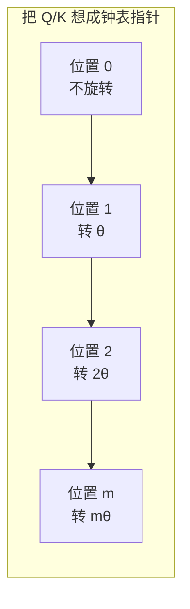
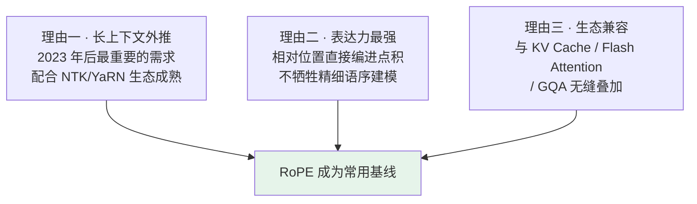

# 第四章：位置编码

## 4.1 为什么 Attention 必须有位置编码

[第二章](02-transformer-architecture.md) 提过 Self-Attention 有一个致命特点：**它对位置不敏感**，俗称「位置盲」。

### 4.1.1 一个直观例子

输入「我打你」，每个字被转成 embedding。Attention 计算时「我」去看「打」和「你」，「打」去看「我」和「你」……模型只知道**这三个字之间互相算了注意力，完全不知道谁在前谁在后**。

换成「你打我」，三个 embedding 一模一样（只是顺序变了），Attention 算出来的结果几乎相同——**但这两句话语义是反的**。

分不清位置，就分不清主语和宾语，根本没法理解语言。

### 4.1.2 为什么不能直接用序号 1, 2, 3

两个问题：

| 问题 | 说明 |
|---|---|
| **数值量级不匹配** | embedding 通常在 $[-1, 1]$ 之间，第 1000 位加个「1000」会把原始信息整个拉爆 |
| **无法泛化** | 训练见过 1–2048，推理来了 4096，这个数字模型从没见过，效果必崩 |

所以位置编码必须满足三个要求：

1. **数值范围合理**，不能把 token embedding 覆盖掉；
2. **能区分不同位置**，每个位置有独特的「指纹」；
3. **能泛化到长序列**，最好支持外推到训练时没见过的长度。

后面比较三种方案时，就看它们能否同时满足这三条。

## 4.2 sin/cos 绝对位置编码

2017 年原始 Transformer 用的方案，简称 Sinusoidal PE。

### 4.2.1 思路：不同频率的振子叠加

用一组不同频率的 sin/cos 函数给每个位置生成独特的指纹向量。

$$
PE_{(pos, 2i)} = \sin\!\left(\frac{pos}{10000^{2i/d}}\right), \quad
PE_{(pos, 2i+1)} = \cos\!\left(\frac{pos}{10000^{2i/d}}\right)
$$

直觉上：把 $d$ 维分成 $d/2$ 对，每对用一组 sin/cos。

| 维度对 | 频率 | 作用 |
|---|---|---|
| 第 1 对 | 最快（高频） | 相邻位置区别明显，区分**精细位置** |
| 第 $d/2$ 对 | 最慢（低频） | 相邻位置几乎一样，跨越很远才能区分，记录**粗略位置** |

就像几个不同频率的振子叠加，每个位置在 $d$ 维空间里有一个独特的组合——它的「身份证」。

### 4.2.2 为什么是「加」不是「拼接」

最终输入 = token embedding + position embedding。

加法**不增加维度**，结构上更省事。而且神经网络有足够能力从相加的结果里把两部分信息自动解开。

### 4.2.3 优点与致命问题

**优点**：零参数（纯数学公式算出来，不占模型容量）。

**致命问题：长上下文外推能力差。**

虽然理论上 sin/cos 可以算到任意位置，但实际效果**在训练见过的最长位置之外会迅速恶化**。只在 2K 上训练过，推理给 4K，表现会断崖下跌。

根本原因是：**模型训练时只学过 2K 以内的相对位置关系**，超出的相对距离它从没见过，注意力权重分布会乱掉。

在小模型时代还行，到了要支持几十 K 甚至上百 K 长上下文的大模型时代就明显不够用了。

## 4.3 绝对位置 vs 相对位置：模型真正想要什么

先想一个生活化的问题：你跟别人介绍你坐在哪儿，是说「我坐在前排第 3 个座位」，还是说「我坐在 XX 旁边」？

大部分时候选第二种，因为**相对位置比绝对位置更有信息量**。

### 4.3.1 语言里也是如此

「主语-动词-宾语」这种句法关系，关键不是「主语在第 3 位、动词在第 5 位」，而是**「主语和动词之间隔了 2 个词」**。

同样的「我吃饭」，不管前面加「今天」「中午」「饿了所以」，主谓宾的相对距离都没变。

### 4.3.2 绝对位置编码的问题就在这里

它给每个位置发一个独立身份证，然后**要让模型自己从「位置 3 的身份证」和「位置 5 的身份证」推断出「相对距离是 2」**。

这个推断完全靠模型在训练中慢慢碰运气学到，**没有显式的归纳偏置**。

相对位置编码的思路是：让两个 token 的位置编码**只取决于它们的差值 $m - n$**，跟各自的绝对值无关。这是 RoPE 和 ALiBi 共同的出发点——目标一致，实现路线不同。

## 4.4 RoPE：用旋转把相对位置编进点积

RoPE（Rotary Position Embedding）由苏剑林在 2021 年提出，已成为许多主流大模型采用的位置编码基线。

### 4.4.1 核心思路

**不把位置信息加到 embedding 上，而是旋转 Q 和 K 向量。**

每个 token 的 Q/K 向量根据它的位置 $m$ 被旋转一个角度 $m\theta$：位置 0 不旋转，位置 1 转 $\theta$，位置 2 转 $2\theta$……

### 4.4.2 为什么旋转能表达位置

关键的数学性质：**两个旋转后的向量做点积，结果只依赖于它们的旋转角度差。**

$$
\langle R_m q,\ R_n k \rangle = \langle q,\ R_{n-m} k \rangle
$$

位置 $m$ 的 Q 和位置 $n$ 的 K 做点积，结果**只跟 $(m-n)$ 这个相对距离有关**，跟 $m$、$n$ 各自的绝对值无关。

这就把相对位置信息**天然编进了 Attention 计算里**，模型不用自己学。

### 4.4.3 RoPE 成为常用基线，主要靠这四点

| 优点 | 说明 |
|---|---|
| **天然的相对位置编码** | 直接编进点积，不用模型自己学相对关系——这是区别于 sin/cos 的核心 |
| **零参数** | 纯数学旋转，不引入可学习参数 |
| **保留向量长度** | 旋转只改方向不改模长，不破坏 embedding 的数值范围，训练更稳 |
| **兼容现代推理优化** | 在 Q/K 上做旋转，和 KV Cache、Flash Attention、MQA/GQA 都能无缝叠加 |

第三、四点常被忽略，但很实际——尤其第四点，[第三章](03-attention-variants.md) 讲的所有优化都能和 RoPE 共存。

### 4.4.4 长上下文外推

RoPE 的外推能力远好于 sin/cos。原因是**旋转是连续的角度变化，本身没有「训练截止」这个概念**。训练只见过 2K，推理来了 4K，多出来的位置只是更大的旋转角度而已，模型不会彻底懵，效果衰减比 sin/cos 平缓很多。

再配合后来的扩展技巧，可以把 2K 推到 32K、100K 甚至更长：

| 技巧 | 思路 |
|---|---|
| **Position Interpolation (PI)** | 把超出的位置线性压缩回训练范围内 |
| **NTK-aware Scaling** | 按频率分层调整 base，高频少改低频多改 |
| **YaRN** | NTK 的改进版，配合注意力温度调整 |

**但别说成「几乎无损」的银弹。** 外推效果取决于模型、任务、长度倍率和是否做过继续训练。推得越远，越需要专门评测长文检索、多跳推理这类位置敏感任务。

### 4.4.5 谁在用

2023 年之后基本所有主流开源模型：Llama 1/2/3 全系、Qwen 全系、DeepSeek 全系、Mistral / Mixtral、GLM 系列。

## 4.5 ALiBi：直接给注意力加距离惩罚

2022 年提出，思路比 RoPE 更暴力：**根本不动 Q、K、V，直接在注意力分数里加一个距离惩罚项。**

### 4.5.1 做法

在 softmax 之前，给每对 token 的注意力分数加上偏置：

$$
\mathrm{score}_{ij} = \frac{q_i \cdot k_j}{\sqrt{d_k}} - m \cdot |i - j|
$$

$|i-j|$ 是两个 token 的距离，$m$ 是固定斜率（**每个 head 不同**）。

直观理解：**离得越远，注意力分数被扣得越多，模型越倾向关注近邻**。每个 head 用不同斜率，等于让不同 head 关注不同范围的距离——有的管近邻，有的管远处。

### 4.5.2 优点与短板

| 优点 | 短板 |
|---|---|
| 零参数 | **表达力弱**：所有位置信息靠「距离惩罚」这一个机制传递，对精细语序关系建模不如 RoPE |
| 实现极简（就是加个偏置矩阵，比 RoPE 还简单） | **局部偏置过强**：线性惩罚让模型过度关注近邻，对需要长距离依赖的任务不利 |
| 天然支持长外推（线性惩罚没有训练截止） | 没能在大厂主力模型上推广开 |

用过它的：MosaicML 的 MPT 系列、BLOOM 的某些版本——**都不是主流大模型**。

## 4.6 三种方案对比与 RoPE 为什么赢

| 维度 | sin/cos | ALiBi | RoPE |
|---|---|---|---|
| **编码类型** | 绝对位置 | 相对位置（距离惩罚） | 相对位置（旋转） |
| **可学习参数** | 否 | 否 | 否 |
| **注入方式** | 加到 token embedding | 加到注意力分数 | 旋转 Q/K 向量 |
| **长上下文外推** | 差（容易断崖） | 好（线性外推） | 很强（配合 NTK/YaRN，常需校准或继续训练） |
| **表达力** | 中等 | 弱（局部偏置过强） | 强 |
| **主流采用** | 原始 Transformer | MPT、BLOOM | **Llama / Qwen / DeepSeek 全系** |

RoPE 赢的三个理由：

ALiBi 的外推也不错，但**它是靠「强制关注近邻」换来的**——这个代价在需要真正长距离依赖的任务上太大。RoPE 是在不牺牲表达力的前提下拿到了外推能力。

## 4.7 常见错误

### 4.7.1 只说「RoPE 是旋转」说不出为什么

关键是那个数学性质：**旋转后的点积只依赖角度差**，所以相对位置被天然编进了注意力计算。说不出这一点等于没答。

### 4.7.2 说不清绝对与相对的区别

绝对位置编码要让模型**自己从两个身份证推断距离**，没有显式归纳偏置；相对位置编码把距离**直接编进计算**。这是理解 RoPE 和 ALiBi 的前提。

### 4.7.3 认为 sin/cos「理论上能算任意长度所以能外推」

理论上能算，实际效果在训练最长长度之外断崖下跌——因为模型没学过那些相对距离。

### 4.7.4 把 RoPE 外推说成无损银弹

NTK/YaRN 能大幅扩展，但效果取决于模型、任务、倍率和是否继续训练。要说「需要长文任务专项评测」，别说「一改参数就无损支持 100K」。

### 4.7.5 说 ALiBi「效果差不多所以随便选」

ALiBi 的外推靠强制局部偏置换来，表达力有实质损失。这也是它没成主流的原因。

### 4.7.6 忽略 RoPE 与推理优化的兼容性

这是很实际但常被忽略的选型理由：RoPE 作用在 Q/K 上，和 KV Cache、Flash Attention、GQA 都不冲突。

### 4.7.7 说不出位置编码的三个基本要求

数值范围合理、能区分位置、能泛化到长序列。有了这三条，三种方案的优劣对比就有了统一的评判框架。

## 4.8 本章总结

1. **Attention 天然位置盲**，「我打你」和「你打我」算出来几乎一样，必须显式注入位置信息；
2. **不能直接用序号**：量级会拉爆 embedding，且对没见过的长度无法泛化；
3. **三个基本要求**：数值范围合理、位置可区分、能泛化到长序列；
4. **sin/cos 用多频率振子给每个位置发身份证**，零参数，但外推能力差、超出训练长度断崖下跌；
5. **模型真正关心的是相对位置**，绝对编码要模型自己推断距离，缺乏归纳偏置；
6. **RoPE 的核心是旋转后点积只依赖角度差**，把相对位置天然编进注意力；
7. **RoPE 的四个优点**：相对编码、零参数、保留模长、兼容全部现代推理优化；
8. **NTK/YaRN 能扩展外推，但不是无损银弹**，需要长文任务专项评测；
9. **ALiBi 更简单、外推也好，但靠强制局部偏置换来**，表达力弱，未成主流；
10. **RoPE 赢在三个维度均衡**：外推能力、表达力、生态兼容性。

## 参考资料

- [Attention Is All You Need](https://arxiv.org/abs/1706.03762)
- [RoFormer: Enhanced Transformer with Rotary Position Embedding](https://arxiv.org/abs/2104.09864)
- [Train Short, Test Long: Attention with Linear Biases Enables Input Length Extrapolation（ALiBi）](https://arxiv.org/abs/2108.12409)
- [Extending Context Window of Large Language Models via Positional Interpolation](https://arxiv.org/abs/2306.15595)
- [YaRN: Efficient Context Window Extension of Large Language Models](https://arxiv.org/abs/2309.00071)
- [Self-Attention with Relative Position Representations](https://arxiv.org/abs/1803.02155)
- [The Llama 3 Herd of Models](https://arxiv.org/abs/2407.21783)
