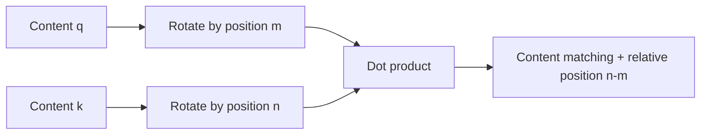

# Chapter 4: Positional Encoding

## 4.1 Why give the model positional information?

Self-attention without positional features, where every position can attend to every other position, is **permutation-equivariant**. If `P` permutes the input positions:

$$
\mathrm{Attention}(PX)=P\mathrm{Attention}(X)
$$

This does not mean “the output stays exactly the same after reordering.” The output is reordered in the same way as the input. Given the same tokens, these symmetric interactions alone cannot distinguish word-order relationships such as “我打你” (“I hit you”) versus “你打我” (“you hit me”).

This conclusion has prerequisites. Causal masks, local windows, and similar mechanisms already break full symmetry and can introduce ordering information. Thus, “a model can never represent order without positional encoding” is too strong. Mainstream decoders nevertheless usually encode positions or distances explicitly.

Adding the position index `1, 2, 3, …` directly to every dimension is not mathematically forbidden; it is an unsuitable choice of scale and representation. It changes the input along only one direction, and its magnitude grows with sequence length. Positional encoding should account for distinguishability, scale, relative relationships, and length generalization—not assume that embeddings must lie within `[-1,1]`.

## 4.2 Sinusoidal absolute positional encoding

The original Transformer adds a position vector to each token embedding. For an even dimension `d`, with `i = 0, …, d/2−1`:

$$
PE_{(pos,2i)}=\sin\left(\frac{pos}{10000^{2i/d}}\right),\qquad
PE_{(pos,2i+1)}=\cos\left(\frac{pos}{10000^{2i/d}}\right)
$$

Lower-indexed dimensions vary faster and higher-indexed dimensions vary more slowly. Multiple frequencies jointly represent position, while each dimension remains bounded.

### 4.2.1 Why addition works

Addition keeps the hidden dimension unchanged and avoids an extra projection after concatenation. The model can learn to use the combined content and position information, but there is no guarantee that it can separate them without loss. Learned absolute position embeddings are another option; they require an explicit extension strategy for inputs beyond the position table.

### 4.2.2 Sinusoids also have relative-position structure

It is incorrect to say that absolute encoding has “no relative-position inductive bias at all.” For any fixed offset `k`, trigonometric identities give:

$$
\begin{pmatrix}
\sin((m+k)\theta)\cr
\cos((m+k)\theta)
\end{pmatrix}=
\begin{pmatrix}
\cos(k\theta)&\sin(k\theta)\cr
-\sin(k\theta)&\cos(k\theta)
\end{pmatrix}
\begin{pmatrix}
\sin(m\theta)\cr
\cos(m\theta)
\end{pmatrix}
$$

In other words, a fixed offset can be expressed as a linear transformation independent of `m`. This was one motivation for the original paper's choice.

However, after the encoding is added to the input and passed through learned projections, attention does not automatically depend only on relative distance. Being able to evaluate the formula at any position also does not prove that task performance is reliable beyond the training length. Separate “computable” from “generalizes effectively.”

## 4.3 RoPE: encoding relative position in Q/K dot products

RoFormer (2021) introduced Rotary Position Embedding. A common implementation divides the even-dimensional Q/K vectors into pairs and rotates each pair. It does not add positional information to the input, nor does it use the same angle for every dimension.

For a two-dimensional subspace:

$$
R(m\theta)=
\begin{pmatrix}
\cos(m\theta)&-\sin(m\theta)\cr
\sin(m\theta)&\cos(m\theta)
\end{pmatrix}
$$

Different dimension pairs use different frequencies. A common base form is `θ_i = b^(−2i/d)`, where `b` is the RoPE base. Actual models may change the base, the number of rotated dimensions, or frequency scaling.

### 4.3.1 Deriving the relative-position property

Using the orthogonality of rotation matrices and angle addition:

$$
\langle R_mq,R_nk\rangle
=q^TR_m^TR_nk
=q^TR_{n-m}k
$$

For fixed content vectors `q,k`, the **explicit positional term** enters the dot product only through `n−m`. The score still depends on content. In deeper layers, q/k already contain contextual information, so this property does not imply that the entire model's output depends only on distance.

### 4.3.2 Why V is usually not rotated

Q/K determine “where to read,” while V supplies “what to read.” Standard RoPE injects position into matching scores, so rotating V is usually unnecessary. Rotation preserves Q/K vector norms and can work with MHA, GQA, and fused kernels that support this form.

Positions must remain consistent when caching. If the cache stores already-rotated K, a new Q must use its actual continuation position. Resetting positions or changing the base or scaling rule may invalidate the old cache. MLA's projection absorption also requires separate treatment of the positional component. These optimizations are not all “seamlessly compatible” by default.

## 4.4 RoPE does not inherently guarantee reliable long-context extrapolation

Both RoPE and sinusoidal encoding can compute angles beyond the training length. **Continuous rotation is not sufficient for reliable extrapolation.** New relative distances, frequency combinations, and attention distributions may fall outside the training regime. The Position Interpolation paper specifically addresses attention abnormalities that can arise from directly extending RoPE.

If the training window is `L` and the target window is `L'`, linear position interpolation uses:

$$
m'=m\frac{L}{L'}
$$

This maps the target range back into the original positional range, but also reduces the angular difference between adjacent tokens. Extending a window from 4096 to 16384 gives a scale factor of `1/4`. The model must adapt to the new local-distance resolution; this is not free additional memory.

| Method | What changes | Main tradeoff |
|---|---|---|
| Position Interpolation | Equivalently scale positions by the same factor for every rotation frequency | Avoids direct extrapolation but compresses local distances; the original paper combines it with continued training |
| NTK-aware scaling | Adjust the base so different frequencies change by different amounts | A family of scaling designs, not a guarantee that the complete Transformer preserves its NTK |
| YaRN | Blend interpolation and extrapolation in frequency bands, and adjust the attention scale | Must match the specific model configuration and context-extension training scheme |

Static and dynamic scaling must also be distinguished. If frequencies change dynamically as a request grows, whether the existing cache needs recomputation or transformation depends on the implementation. Changing one configuration value is not enough without checking cache consistency.

## 4.5 ALiBi: adding a distance bias to logits

The ALiBi preprint appeared in 2021 and was subsequently published at ICLR 2022. It leaves Q/K/V unchanged and adds a distance bias to each head's attention logits. For causally visible positions `j = 1, …, i`:

$$
s_{ij}^{(h)}=\frac{q_i\cdot k_j}{\sqrt{d_k}}-a_h(i-j)
$$

Here, `a_h` is a fixed positive slope for each head. Future positions still require a causal mask. The distance penalty is added to the content-matching score; it is not a hard window and does not force distant tokens to receive no attention.

Different head slopes introduce different strengths of preference for nearby positions. ALiBi needs no position-embedding table, and its computation extends easily to new lengths. Its local bias may also hurt some long-range tasks. The original paper reports extrapolation benefits in specific language-modeling experiments. **That does not establish that ALiBi is less expressive than RoPE on every task.**

BLOOM and MPT are public examples that use ALiBi. It should not be dismissed as something “used only in a few obscure BLOOM versions.” Adoption alone is not proof of quality either.

## 4.6 Define the problem before comparing methods

| Scheme | Where position enters | How relative relationships enter | Length limits |
|---|---|---|---|
| Sinusoids | Input embeddings | Fixed offsets can be expressed linearly, but scores after mixing need not depend only on distance | The formula extends; quality requires validation |
| RoPE | Two-dimensional rotations of Q/K | With fixed q/k, the positional term in the dot product depends on relative distance | Quality may degrade beyond the native window; extension requires configuration and evaluation |
| ALiBi | Attention logits | A fixed linear distance bias per head | Supported by extrapolation experiments, not guaranteed at arbitrary lengths or on every task |

There is no ranking of “most expressive” independent of the model, training budget, and task. Changing a trained model's positional scheme changes a distribution it has learned. A pros-and-cons table is not enough to justify swapping schemes directly.

## 4.7 How should a long context window be validated?

A claim of 128K support must distinguish at least three things: the interface accepts 128K, memory can hold 128K, and the model can effectively retrieve information and reason within that range.

If asked whether passing a needle-in-a-haystack test establishes adequate long-document capability, the answer is no. Retrieving one conspicuous string does not cover combining multiple pieces of evidence, ordering events, detecting contradictions, or locating citations. Also check:

- Whether conclusions remain stable when the same evidence appears at the beginning, middle, or end.
- Whether multi-hop tasks and cross-passage relationships degrade as distracting text increases.
- Whether short-context capabilities regress after extension, and how prefill latency and memory use grow.
- Whether truncation, sliding windows, prefix caching, and multi-turn continuation use consistent position numbering.

Positional encoding is only one part of a long-context solution. Training data, attention patterns, cache budgets, and evaluation must also support it. For the costs, see [Chapter 3](03-attention-variants.md); for cache management, see [Chapter 14](../03-inference-serving/14-kv-cache.md).

## References

- [Attention Is All You Need](https://arxiv.org/abs/1706.03762)
- [RoFormer: Enhanced Transformer with Rotary Position Embedding](https://arxiv.org/abs/2104.09864)
- [ALiBi: Train Short, Test Long](https://arxiv.org/abs/2108.12409)
- [Position Interpolation](https://arxiv.org/abs/2306.15595)
- [YaRN: Efficient Context Window Extension of Large Language Models](https://arxiv.org/abs/2309.00071)
- [Hugging Face Transformers: RoPE parameters and variants](https://huggingface.co/docs/transformers/main/en/internal/rope_utils)
- [BLOOM model card](https://huggingface.co/bigscience/bloom)
- [MosaicML: MPT-7B release announcement and ALiBi configuration](https://www.databricks.com/blog/mpt-7b)
- [Lost in the Middle: How Language Models Use Long Contexts](https://arxiv.org/abs/2307.03172)
