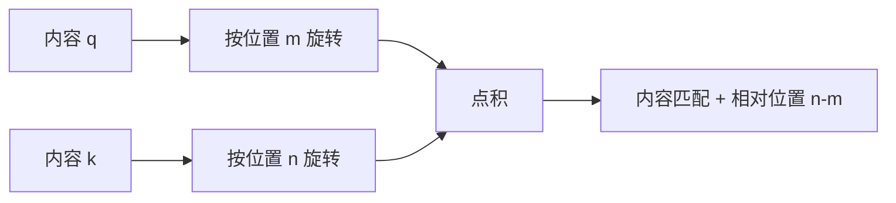

# 第四章：位置编码

## 4.1 为什么要给模型位置信息

没有位置特征、且所有位置都可见的 Self-Attention 具有**置换等变性**。若 `P` 表示重排输入位置：

$$
\mathrm{Attention}(PX)=P\mathrm{Attention}(X)
$$

它不是「重排后输出完全一样」，而是输出随输入同样重排。对于相同 token，模型不能仅靠这种对称的交互，区分「我打你」与「你打我」的语序关系。

这个结论有前提：因果掩码、局部窗口等已经打破完全对称性，可以引入顺序信息。因此「不加位置编码就绝不可能建模顺序」过强，但主流 decoder 通常仍显式编码位置或距离。

直接把序号 `1, 2, 3, …` 加到每一维不是数学上不允许，而是尺度和表达方式不合适：它只沿一个方向改变输入，数值还随长度增大。位置编码的设计要考虑可区分性、尺度、相对关系和长度泛化，而不是假定 embedding 一定落在 `[-1,1]`。

## 4.2 sin/cos 绝对位置编码

原始 Transformer 将位置向量加到 token embedding。令 `d` 为偶数维度，`i = 0, …, d/2−1`：

$$
PE_{(pos,2i)}=\sin\left(\frac{pos}{10000^{2i/d}}\right),\qquad
PE_{(pos,2i+1)}=\cos\left(\frac{pos}{10000^{2i/d}}\right)
$$

低下标维度变化较快，高下标维度变化较慢；多个频率联合描述位置，且每维数值有界。

### 4.2.1 为什么加法可行

加法保持隐藏维度不变，省去拼接后的额外投影。模型可以学习利用混合后的内容与位置，但不保证能无损分离两者。可学习的绝对位置 embedding 则是另一种方案，需要为位置表之外的输入规定扩展方式。

### 4.2.2 sin/cos 也有相对位置结构

不能说绝对编码「完全没有相对位置归纳偏置」。对任意固定偏移 `k`，由三角恒等式可知：

$$
\begin{pmatrix}
\sin((m+k)\theta)\cr
\cos((m+k)\theta)
\end{pmatrix}=
\begin{pmatrix}
\cos(k\theta)&\sin(k\theta)\cr
-\sin(k\theta)&\cos(k\theta)
\end{pmatrix}
\begin{pmatrix}
\sin(m\theta)\cr
\cos(m\theta)
\end{pmatrix}
$$

也就是说，固定偏移可以用与 `m` 无关的线性变换表达。这是原始论文选择该形式的动机之一。

不过加到输入后，经过可学习投影得到的 attention 不自动只依赖相对距离。公式能算到任意位置，也不证明训练外长度的任务效果可靠；应把「可计算」与「泛化有效」分开。

## 4.3 RoPE：在 Q/K 的点积中编码相对位置

RoFormer（2021）提出 Rotary Position Embedding。常见做法是把 Q/K 的偶数维两两配对，分别旋转；不是把位置信息加到输入，也不是对所有维度使用同一个角度。

对一个二维子空间：

$$
R(m\theta)=
\begin{pmatrix}
\cos(m\theta)&-\sin(m\theta)\cr
\sin(m\theta)&\cos(m\theta)
\end{pmatrix}
$$

不同维度对使用不同频率，常见基础形式为 `θ_i = b^(−2i/d)`；`b` 是 RoPE base，实际模型可能改变 base、旋转维度或频率缩放。

### 4.3.1 相对位置性质怎样推出来

利用旋转矩阵正交性及角度相加：

$$
\langle R_mq,R_nk\rangle
=q^TR_m^TR_nk
=q^TR_{n-m}k
$$

在固定内容向量 `q,k` 时，**显式位置项**只通过 `n−m` 进入点积。分数仍依赖内容；深层 q/k 已经携带上下文，不能据此断言整个模型输出只由距离决定。

### 4.3.2 为什么通常不旋转 V

Q/K 决定「读取哪里」，V 提供「读取什么」。标准 RoPE 的核心是在匹配分数中注入位置，通常无需旋转 V。旋转保留 Q/K 模长，且能与 MHA、GQA 和支持该形式的融合 kernel 配合。

缓存时必须保持位置一致。若缓存的是已旋转 K，新 Q 要使用真实续接位置；若重置位置、改变 base 或缩放规则，旧缓存未必还能复用。MLA 的投影吸收还需要单独处理位置部分，不能一概称为「所有优化无缝兼容」。

## 4.4 RoPE 不自带可靠的长上下文外推

RoPE 与 sin/cos 都能在训练长度之外计算角度，**连续旋转不是可靠外推的充分条件**。新相对距离、频率组合与注意力分布可能偏离训练范围。Position Interpolation 论文正是为直接扩展 RoPE 可能出现的注意力异常提出改进。

假设训练窗口为 `L`，目标窗口为 `L'`，线性位置插值使用：

$$
m'=m\frac{L}{L'}
$$

将目标范围压回原位置范围，代价是原本相邻 token 的角度差也缩小。若把窗口从 4096 扩至 16384，缩放因子为 `1/4`；模型需要适应新的局部距离分辨率，不能把它理解成免费增加记忆。

| 方法 | 改什么 | 主要取舍 |
|---|---|---|
| Position Interpolation | 所有旋转频率等效按同一比例缩放位置 | 避免直接外推，但压缩局部距离；原论文结合继续训练 |
| NTK-aware scaling | 调整 base，使不同频率的变化幅度不同 | 是一类缩放设计，不是完整 Transformer 保持 NTK 的保证 |
| YaRN | 按频率分段混合插值/外推，并调整注意力尺度 | 需匹配具体模型配置与扩展训练方案 |

还要区分静态与动态缩放：若请求增长时动态修改频率，已有缓存是否需重算或变换，取决于实现；不能只修改一个配置值而不检查缓存一致性。

## 4.5 ALiBi：把距离偏置加到 logits

ALiBi 的预印本发表于 2021 年，后发表于 ICLR 2022。它不改 Q/K/V，而是在每个头的注意力 logits 上加距离偏置。在因果可见位置 `j = 1, …, i` 上：

$$
s_{ij}^{(h)}=\frac{q_i\cdot k_j}{\sqrt{d_k}}-a_h(i-j)
$$

`a_h` 是每个头固定的正斜率；未来位置仍须使用因果掩码。公式中的距离惩罚与内容匹配相加，不是硬窗口，也不是远处 token 必然没有注意力。

不同头的斜率引入不同程度的近邻偏好。其优点是无需位置 embedding 表，计算容易延伸到新长度；其局部偏置也可能不利于某些远距离任务。原论文在特定语言建模实验中报告了外推收益，**不能直接推出它在所有任务上表达力弱于 RoPE**。

BLOOM 与 MPT 是采用 ALiBi 的公开例子，不应说成「只有 BLOOM 某些不知名版本用过」。架构采用率也不是质量证明。

## 4.6 比较方法时，先固定问题

| 方案 | 注入位置 | 相对关系如何进入 | 长度边界 |
|---|---|---|---|
| sin/cos | 输入 embedding | 固定偏移可线性表示，但混合后分数未必只依赖距离 | 公式可延伸，质量需验证 |
| RoPE | Q/K 的二维旋转 | 固定 q/k 下点积的位置项依赖相对距离 | 原生窗口外可能退化，扩展需配置与评测 |
| ALiBi | attention logits | 每头固定线性距离偏置 | 有外推实验支持，不保证任意长度与任务 |

没有脱离模型、训练预算和任务的「表达力最强」排行榜。修改已训练模型的位置方案还会改变它学过的分布，不能根据一张优缺点表就直接互换。

## 4.7 长窗口应该怎样验收

声明支持 128K，至少要区分：接口接受 128K、显存能够容纳 128K，以及能否在这段范围里有效检索和推理。

若被追问「针刺测试通过是否说明长文能力足够」，答案是否定的。单个显著字符串检索不覆盖多证据聚合、事件顺序、矛盾识别和引用定位。应同时检查：

- 相同证据位于开头、中间、结尾时，结论是否稳定；
- 干扰文本增加后，多跳任务与跨段关联是否退化；
- 扩窗后短上下文能力是否回归，以及 prefill 延迟和显存增长；
- 截断、滑窗、前缀缓存和多轮续接是否使用一致的位置编号。

位置编码只是长上下文方案的一部分，训练数据、注意力模式、缓存预算与评测都需要配套。相关开销见[第三章](03-attention-variants.zh.md)，缓存管理见[第十四章](../03-inference-serving/14-kv-cache.zh.md)。

## 参考资料

- [Attention Is All You Need](https://arxiv.org/abs/1706.03762)
- [RoFormer: Enhanced Transformer with Rotary Position Embedding](https://arxiv.org/abs/2104.09864)
- [ALiBi: Train Short, Test Long](https://arxiv.org/abs/2108.12409)
- [Position Interpolation](https://arxiv.org/abs/2306.15595)
- [YaRN: Efficient Context Window Extension of Large Language Models](https://arxiv.org/abs/2309.00071)
- [Hugging Face Transformers：RoPE 参数与变体](https://huggingface.co/docs/transformers/main/en/internal/rope_utils)
- [BLOOM 模型卡](https://huggingface.co/bigscience/bloom)
- [MosaicML：MPT-7B 发布说明与 ALiBi 配置](https://www.databricks.com/blog/mpt-7b)
- [Lost in the Middle: How Language Models Use Long Contexts](https://arxiv.org/abs/2307.03172)
