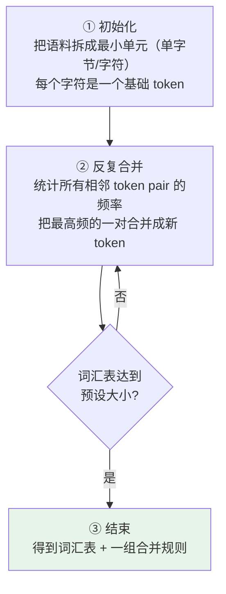

# 第五章：Tokenizer 分词器

## 5.1 为什么需要 Tokenizer

对本章讨论的自回归文本模型，Tokenizer 把字符串转为 token ID 序列，模型为下一个 token 计算概率分布，选出的 token 序列再被解码为文字。

ID 用于查找 embedding，Transformer 的主体实际处理连续向量；多模态模型还可能接收图像或音频特征，不能把「只接收整数」作为所有大模型的定义。


Tokenizer 提供编码与解码，但不只是查词表：归一化、预切分、子词算法和特殊 token 规则也可能参与。

## 5.2 三种分词粒度的取舍

### 5.2.1 字符级：太碎

每个字母或汉字算一个 token。

| 优点 | 问题 |
|---|---|
| 相对词级词表较小，但仍需覆盖大小写、标点和所需字符集 | **序列较长**：「hello」是 5 个字符 token |
| 覆盖的字符可组合成新词；未覆盖字符仍可能 OOV | 全注意力计算量随序列长度平方增长 |
| 便于字符级操作 | 模型需从较细粒度单位学习词与短语关系 |

### 5.2.2 词级：太散

每个完整单词算一个 token。

| 问题 | 说明 |
|---|---|
| **词汇表爆炸** | 光是 `cat / cats / catting / catty` 这种变形就要分别存，膨胀到几十万甚至几百万 |
| **OOV 未登录词** | 遇到训练时没见过的新词（专有名词、网络用语、拼写错误）直接无法处理，只能输出「未知词」标记，**语义完全丢失** |
| **中文词边界** | 词级方案通常需要显式确定词边界，歧义可能传到下游，但并非必然导致后续全部失败 |

### 5.2.3 子词是常用折中，不是唯一可行方案

**字符级太碎，词级太散**，子词（subword）级分词取中间：既控制词汇表大小，又能处理新词，同时保留比字符更多的语义信息。

BPE、Unigram、WordPiece 是子词算法；**SentencePiece 是工具库和处理框架，支持 BPE、Unigram 等算法**，不能把四者当成同一层次的互斥选项。字节或字符级模型也有适用场景，代价主要在序列长度与训练效率。

## 5.3 BPE 算法

BPE（Byte Pair Encoding，字节对编码）原理很简单，三步：



**合并过程举例**：

```
「t」和「h」经常相邻   → 合并成「th」，加入词汇表
「th」和「e」经常相邻  → 合并成「the」，加入词汇表
...
```

每轮合并产生一条合并规则，同时词汇表增加一个 token。

| 模型 | 词汇表大小 |
|---|---|
| GPT-2 | 50,257 |
| Llama 2 | 32,000 |
| Llama 3 | 128,000 个普通 token，另有 256 个特殊 token |
| Qwen2/3 示例 | 约 15 万量级，精确值应读取所用 checkpoint 的 tokenizer 与配置 |

需要区分普通词表、添加后的特殊 token 总数，以及为硬件对齐而填充的 embedding 行数；三者未必相同。

### 5.3.1 为什么它能解决 OOV

以「lowest」为例，BPE 可能切成 `low` + `est`，因为两者都是高频子词。

遇到训练时**完全没见过**的「lowest123」：

```
lowest123  →  low + est + 1 + 2 + 3
```

**不会出现 OOV**。对于采用 byte-level BPE 的 tokenizer，最坏情况下会退化为若干字节 token；这些 token 只是可逆编码单元，不一定各自有语言学意义。

现代 **byte-level BPE** 使用 256 种字节作为基础，因此可编码任意 UTF-8 文本。BPE 名称来自原始压缩算法，不意味着所有用于 NLP 的 BPE 都以字节为最小单位；字符级 BPE 若没有 byte fallback，仍可能遇到未覆盖字符。

字节 token 的边界不保证等于 Unicode 字符边界：一个汉字的 UTF-8 字节可能分属多个 token，单独解码中间 token 时甚至可能不是有效文本。启用了规范化的 tokenizer 也不一定逐字节还原原文，例如大小写、空白或全半角可能已被归一化。

### 5.3.2 编码时不是重新统计输入频率

BPE 训练得到词表和合并顺序。推理编码时按已学的合并优先级处理输入，而不是重新给当前句子训练一套规则。

WordPiece 常使用最长前缀匹配来分解词，BERT 中 `##` 标记非词首片段；Unigram 则为候选片段赋概率，通过搜索选择序列概率高的切分，也可以在训练时采样切分。SentencePiece 可以直接处理原始文本，并用 `▁` 表示空格，避免依赖语言专用的预分词；其归一化和 byte fallback 设置仍须单独检查。

## 5.4 中文的特点

中文通常没有词间空格，因此预切分与训练语料分布会显著影响词表，但 BPE 的合并机制本身并不因中文而改变。

一个具体 tokenizer 可能出现以下情况：

- **常用汉字是独立 token**，也可能跨 token 分成字节片段，取决于词表；
- **常见词语**（如「人工智能」）可能被合并成单个 token，也可能是「人工」+「智能」两个——取决于训练数据里的频率。

### 5.4.1 一个经验规则和它的适用边界

「1000 个汉字对应 1000–1500 token」只能是某些 tokenizer 和文本的经验值，不能作为通用预算；中文词组可能合并，少见字也可能拆成多个 token。

> **但这只是粗估。** Qwen、Llama、OpenAI、Claude 的 tokenizer 完全不一样；中文、英文、代码、表格混在一起时比例会明显变化。**正式算成本前一定要用目标模型的 tokenizer 实际跑一遍。**

## 5.5 特殊 Token

Tokenizer 里还有一些不来自文本的 token，用来给模型传递**结构信息**：

| 特殊 Token | 作用 |
|---|---|
| **BOS**（Beginning of Sequence） | 标记序列开始 |
| **EOS**（End of Sequence） | 标记序列结束，模型生成到它就停止输出 |
| **PAD**（Padding） | 批量处理时对齐不同长度的序列 |
| **SEP**（Separator） | 分隔不同部分 |
| `<\|im_start\|>` / `<\|im_end\|>` | ChatML 格式里区分对话轮次和角色 |

这些 token 的含义来自训练格式与生成实现，不是模型具有某种「意识」。角色分隔符帮助模型识别消息结构，但不能单独形成可靠的权限边界。

这解释了一件很多人困惑的事：为什么把对话历史拼成一段纯文本喂给模型，效果会明显不如用标准的 messages 格式？因为后者会被渲染成带特殊 token 的模板，而模型在训练时就是按这个模板学的。

### 5.5.1 EOS 与停止生成

模型可以学习预测 EOS 或轮次结束 token；服务端也可能因最大输出长度、停止字符串、工具调用协议或外部取消而终止。需要区分「模型自然结束」和「被系统截断」，不能把所有停止都归因于 EOS。

这也解释了一类线上故障：如果推理时用的 chat template 和训练时不一致，模型可能永远预测不出 EOS，表现为「停不下来一直说」，只能靠 `max_tokens` 硬截断。

## 5.6 Tokenizer 对工程的直接影响

分词规则会同时影响成本、上下文预算和模型行为。

### 5.6.1 API 成本估算

主流 LLM API **按 token 计费，不是按字数**。

| 内容类型 | 粗略比例 |
|---|---|
| 中文 | 与汉字、词组和字节覆盖有关，不采用固定换算率 |
| 英文 | 常见词可能整体编码，罕见词与空白会增加数量 |
| 代码 | 依赖语言和训练语料，缩进、标点也可能被合并 |

**这些都只是经验值**——要预估费用必须用目标模型的 tokenizer 数出来，不能只按字数拍脑袋。

### 5.6.2 上下文窗口管理

每个模型有最大 token 限制。字数和 token 数的比例取决于语言和内容类型，**中文 + 代码混合内容很容易让你以为「才 5 万字应该不超」，实际已经 8 万 token 了**。

预算应根据最终请求的 token 数确定，而不是根据用户可见的正文长度。

### 5.6.3 避免截断重要信息

如果文档恰好卡在上下文边缘，**按 token 长度截断可能落在词、Unicode 字符或 UTF-8 字节序列的内部**。这不会产生一个可发送给模型的「半个 token」，但把已截断 token 单独解码、或交给只接受完整 Unicode 的下游系统时，可能得到替换字符、乱码或不完整词语。

工程上先在语义边界选择段落，再对**最终序列化的请求**计数，为系统提示、工具 schema、模板和输出留预算。安全余量由协议和任务决定，不固定为几百 token；截断历史时还要保持工具调用与结果的配对。

### 5.6.4 影响模型的数学与字符级能力

一个经典现象：**问模型「strawberry 里有几个 r」经常答错。**

分词粒度会让这类任务更难：`strawberry` 可能被切成 `str` + `aw` + `berry` 这样的块，模型不一定逐字符操作。**但这不是唯一原因**；训练数据、位置表示和推理策略也会影响结果，不能据此把字符计数错误完全归因于 tokenizer。

同理，数字可能逐位或按固定长度分组，分组方向也会影响位数对齐。逐位表示方便某些算术模式，却增加序列长度；哪一种更好要结合训练与任务比较，不能断言逐位切分全面占优。需要精确计数或计算时，通常应调用确定性程序。

### 5.6.5 词表越大是否越省

词表扩大往往可以减少序列长度，但会增加 embedding 和输出层成本。隐藏维度为 `d`、词表大小为 `V` 时，一份 embedding 约有 `Vd` 个参数；若输入输出权重不共享，还需另一份相近大小的输出投影。

更换 tokenizer 会改变 ID 与 embedding 的对应关系，通常不能给已有模型无训练地替换。部署时要同时固定 tokenizer revision、模型权重、chat template 和特殊 token 配置，否则相同字符串可能变成不同输入。

## 5.7 常见错误

### 5.7.1 说不出「为什么需要 Tokenizer」

Tokenizer 负责离散编码，embedding 把 ID 映射为模型使用的向量；不要把 ID 当作具有数值大小意义的输入特征。

### 5.7.2 说不清三种粒度的取舍

字符级太碎（序列长、语义少），词级太散（OOV 严重、词汇表爆炸），子词级是折中。这是 BPE 存在的动机。

### 5.7.3 认为 BPE 是唯一的子词方案

算法层面有 BPE、Unigram、WordPiece；SentencePiece 是可承载不同算法的库。

### 5.7.4 用字数直接估算 token 数

比例随语言和内容类型变化很大。必须用目标模型的 tokenizer 实际跑。

### 5.7.5 忽略特殊 token 与 chat template

拼纯文本 vs 用标准 messages 格式效果差别很大，因为模型训练时就是按模板学的。template 不一致还会导致模型停不下来。

### 5.7.6 不知道 tokenizer 会影响模型能力

字符计数和算术错误可能受切分影响，但还与训练、任务分布和推理策略有关。检查实际 token 序列，不能拿猜测的切分作为唯一解释。

### 5.7.7 在 token 边界上截断

应先按 token 预算定位，再回退到可验证的 Unicode 与语义边界并留安全 buffer；不要假定 token 边界就是字符边界。

## 5.8 本章总结

1. **Tokenizer 将文本编码为 ID**，embedding 再将其映射为连续向量；
2. **字符级粒度细**：序列更长，需在覆盖范围、计算开销与任务之间取舍；
3. **词级太散**：词汇表爆炸、OOV 严重、中文还要先分词；
4. **BPE 三步**：拆成最小单元 → 反复合并最高频相邻 pair → 达到预设词汇表大小；
5. **byte-level BPE 解决 OOV 的方式**是最坏退化到字节级，任何 UTF-8 文本都能表示；token 边界不保证等于字符边界；
6. **中文不能按固定字数换算**，必须对目标 tokenizer 和完整请求实测；
7. **特殊 token 传递结构信息**，EOS、轮次结束与服务端截断应区分，chat template 必须匹配；
8. **词表、长度与输出层成本相互制约**，换 tokenizer 不只是换一个预处理函数。


## 参考资料

- [Neural Machine Translation of Rare Words with Subword Units（BPE）](https://arxiv.org/abs/1508.07909)
- [SentencePiece: A simple and language independent subword tokenizer](https://arxiv.org/abs/1808.06226)
- [Subword Regularization: Improving NMT Models with Multiple Subword Candidates（Unigram）](https://arxiv.org/abs/1804.10959)
- [Hugging Face: Tokenizers 教程](https://huggingface.co/learn/nlp-course/chapter6/1)
- [OpenAI tiktoken](https://github.com/openai/tiktoken)
- [The Llama 3 Herd of Models](https://arxiv.org/abs/2407.21783)
- [Meta Llama 3 Tokenizer 官方实现](https://github.com/meta-llama/llama3/blob/main/llama/tokenizer.py)
- [Google SentencePiece 官方实现与配置说明](https://github.com/google/sentencepiece)
- [Hugging Face Transformers：Tokenization algorithms](https://huggingface.co/docs/transformers/tokenizer_summary)
- [Hugging Face Transformers：Chat templates](https://huggingface.co/docs/transformers/chat_templating)
