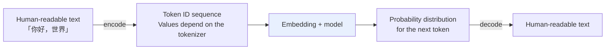
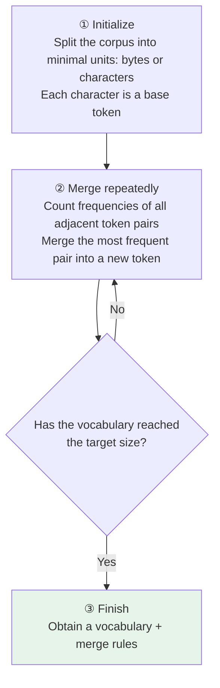

# Chapter 5: Tokenizers

## 5.1 Why a tokenizer is needed

For the autoregressive text models discussed in this chapter, a tokenizer converts a string into a sequence of token IDs. The model computes a probability distribution for the next token, and the selected token sequence is decoded back into text.

IDs are used to look up embeddings; the Transformer itself operates on continuous vectors. Multimodal models may also receive image or audio features, so “accepts only integers” is not a definition of all large models.

The Chinese example “你好，世界” below means “Hello, world.”



A tokenizer provides encoding and decoding, but it does more than look up vocabulary entries. Normalization, pre-tokenization, a subword algorithm, and special-token rules may also be involved.

## 5.2 Why use subwords rather than only characters or whole words?

Subwords balance vocabulary size against sequence length: frequent fragments become longer tokens, while rare words are split into existing pieces. Not every token is guaranteed to have an independent meaning. Whether out-of-vocabulary inputs can be eliminated also depends on coverage of the underlying characters or bytes.

### 5.2.1 Character-level tokenization: very fine-grained

Each letter or Chinese character becomes one token.

| Advantage | Problem |
|---|---|
| A smaller vocabulary than word-level tokenization, though it must still cover case, punctuation, and the required character set | **Longer sequences:** “hello” takes 5 character tokens |
| Covered characters can combine into new words; uncovered characters may still be OOV | Full-attention computation grows quadratically with sequence length |
| Convenient for character-level operations | The model must learn word and phrase relationships from finer-grained units |

### 5.2.2 Word-level tokenization: too many separate entries

Each complete word becomes one token.

| Problem | Explanation |
|---|---|
| **Vocabulary explosion** | Even variants such as `cat / cats / catting / catty` need separate entries, expanding the vocabulary into hundreds of thousands or even millions |
| **Out-of-vocabulary (OOV) words** | A purely word-level vocabulary cannot directly represent a new word outside it and usually maps it to an “unknown word” marker; the original word's identity is lost, although surrounding context may still convey some meaning |
| **Chinese word boundaries** | Word-level approaches generally need explicit word segmentation; ambiguity can propagate downstream, but does not necessarily invalidate all subsequent processing |

### 5.2.3 Subwords are a common compromise, not the only viable approach

**Characters are very fine-grained, while whole words require too many distinct entries.** Subword tokenization takes a middle path: it controls vocabulary size, handles new words, and retains more semantic information per unit than characters.

BPE, Unigram, and WordPiece are subword algorithms. **SentencePiece is a library and processing framework that supports algorithms including BPE and Unigram.** These four names are not mutually exclusive alternatives at the same level. Byte- and character-level models also have suitable applications, with costs primarily in sequence length and training efficiency.

## 5.3 The BPE algorithm

BPE, or Byte Pair Encoding, has a simple three-step principle:



**An example of merging:**

```
"t" and "h" frequently occur together   → merge into "th" and add it to the vocabulary
"th" and "e" frequently occur together  → merge into "the" and add it to the vocabulary
...
```

Each merge produces one merge rule and adds one token to the vocabulary.

| Model | Vocabulary size |
|---|---|
| GPT-2 | 50,257 |
| Llama 2 | 32,000 |
| Llama 3 | 128,000 ordinary tokens, plus 256 special tokens |
| Qwen2/3 examples | On the order of 150,000; read the chosen checkpoint's tokenizer and configuration for the exact value |

Distinguish the ordinary vocabulary size, the total after special tokens are added, and the number of embedding rows after padding for hardware alignment. These three numbers need not be equal.

### 5.3.1 Under what conditions does BPE avoid OOV?

The vocabulary must cover the base units required by the input. Ordinary character-based BPE does not automatically guarantee this.

For example, BPE might split “lowest” into `low` + `est` because both are frequent subwords.

For “lowest123,” which may **never have appeared at all** during training:

```
lowest123  →  low + est + 1 + 2 + 3
```

If the vocabulary covers these base units, there is no OOV. A byte-level BPE tokenizer with complete byte coverage falls back to individual byte tokens in the worst case. These are reversible encoding units, not necessarily pieces with independent linguistic meaning.

Modern **byte-level BPE** uses 256 byte values as its base and can therefore encode any UTF-8 text. BPE's name comes from the original compression algorithm; it does not mean all NLP applications of BPE use bytes as their smallest units. Character-based BPE without byte fallback can still encounter uncovered characters.

Byte-token boundaries do not necessarily coincide with Unicode character boundaries. The UTF-8 bytes of one Chinese character may span multiple tokens, and decoding an intermediate token on its own may not even produce valid text. A tokenizer that applies normalization may also fail to reconstruct the original text byte for byte: case, whitespace, or full-width versus half-width forms may already have been normalized.

### 5.3.2 Encoding does not recount frequencies in the input

BPE training learns a vocabulary and a merge order. At inference time, encoding applies the learned merge priorities rather than training a new set of rules for the current sentence.

WordPiece commonly uses longest-prefix matching to split words; in BERT, `##` marks a fragment that is not at the start of a word. Unigram assigns probabilities to candidate pieces and searches for a segmentation with high sequence probability; it can also sample segmentations during training. SentencePiece can process raw text directly and represents spaces with `▁`, avoiding dependence on language-specific pre-tokenization. Its normalization and byte-fallback settings still need to be checked separately.

## 5.4 What is distinctive about Chinese?

Chinese usually has no spaces between words, so pre-tokenization and the distribution of training text strongly influence the vocabulary. The BPE merging mechanism itself does not change for Chinese.

A particular tokenizer may behave as follows:

- **Common Chinese characters may be individual tokens**, or may be split across tokens as byte fragments, depending on the vocabulary.
- **Frequent words**, such as “人工智能” (“artificial intelligence”), may become one token or two pieces, “人工” + “智能,” depending on their frequency in the training data.

### 5.4.1 A rule of thumb and its limits

“1,000 Chinese characters correspond to 1,000–1,500 tokens” can only be an empirical estimate for particular tokenizers and texts, not a universal budget. Chinese phrases may be merged, while rare characters may require multiple tokens.

> **This is only a rough estimate.** Qwen, Llama, OpenAI, and Claude use different tokenizers. Mixing Chinese, English, code, and tables can change the ratio substantially. **Before calculating actual costs, tokenize the text with the target model's tokenizer.**

## 5.5 How do special tokens represent conversation structure and endings?

Special tokens are encoding units reserved for purposes such as sequence boundaries and roles. They convey **structural information**. They may have corresponding string representations, but whether ordinary user text is recognized as a special ID depends on the tokenizer and server configuration:

| Special token | Purpose |
|---|---|
| **BOS** (Beginning of Sequence) | Marks the start of a sequence |
| **EOS** (End of Sequence) | Marks the end of a sequence; generators usually use the configured EOS ID as a stopping condition |
| **PAD** (Padding) | Aligns sequences of different lengths for batch processing |
| **SEP** (Separator) | Separates different parts |
| `<\|im_start\|>` / `<\|im_end\|>` | Distinguishes turns and roles in the ChatML format |

These tokens derive their meaning from the training format and generation implementation, not from any model “consciousness.” Role delimiters help the model recognize message structure, but cannot establish a reliable authorization boundary on their own.

Arbitrarily concatenating a conversation history can break the format learned during training. `messages` is a structured input interface that the server typically renders using the model's template; the interface itself is not an extra source of capability. If manual serialization produces exactly the same token sequence and all other inputs and generation settings remain identical, changing the calling interface does not give the model different conversational information.

### 5.5.1 EOS and stopping generation

A model can learn to predict EOS or an end-of-turn token. The server may also stop generation because of a maximum output length, stop string, tool-call protocol, or external cancellation. Distinguish a natural model ending from system truncation; not every stop is caused by EOS.

This explains one class of production failure: if the inference-time chat template differs from the training template, the model may never predict EOS. It appears to “keep talking without stopping” until `max_tokens` forcibly truncates it.

## 5.6 Direct engineering effects of tokenization

Tokenization rules affect cost, context budgets, and model behavior at the same time.

### 5.6.1 Estimating API costs

Mainstream LLM APIs **charge by token, not by character or word count**.

| Content type | Rough relationship |
|---|---|
| Chinese | Depends on characters, phrases, and byte coverage; do not assume a fixed conversion ratio |
| English | Common words may be encoded whole; rare words and whitespace add tokens |
| Code | Depends on the language and training corpus; indentation and punctuation may also be merged |

**These are only empirical observations.** Estimate costs by counting with the target model's tokenizer, not by guessing from text length.

### 5.6.2 Managing the context window

Each model has a maximum token limit. The ratio between characters or words and tokens depends on language and content type. **With mixed Chinese and code, what looks like “only 50,000 characters, so it should fit” can already be 80,000 tokens.**

Base the budget on the final request's token count, not the length of its user-visible body.

### 5.6.3 Avoiding truncation of important information

When a document is close to the context limit, **truncating by token count may cut inside a word, a Unicode character, or a UTF-8 byte sequence**. This does not create “half a token” that can be sent to the model. However, decoding a truncated token sequence on its own, or passing it to downstream systems that require complete Unicode, may produce replacement characters, garbled text, or incomplete words.

In an implementation, first select passages at semantic boundaries, then count the tokens in the **final serialized request**. Reserve space for the system prompt, tool schemas, template, and output. The safety margin depends on the protocol and task, not a fixed few hundred tokens. When truncating history, also preserve the pairing of tool calls and their results.

### 5.6.4 Effects on mathematical and character-level capabilities

A familiar observation is that **models often answer “How many r's are in strawberry?” incorrectly.**

Tokenization granularity can make these tasks harder: `strawberry` might be split into chunks such as `str` + `aw` + `berry`, and the model does not necessarily operate character by character. **But this is not the only cause.** Training data, positional representations, and reasoning strategies also affect the result. Character-counting errors cannot be attributed entirely to tokenization.

Similarly, numbers may be split digit by digit or into fixed-length groups, and grouping direction affects digit alignment. Digit-level representations help some arithmetic patterns but lengthen the sequence. Which choice is better must be evaluated together with training and the task; digit-level tokenization is not universally superior. When exact counting or calculation is needed, a deterministic program is usually the right tool.

### 5.6.5 Does a larger vocabulary always save resources?

A larger vocabulary often reduces sequence length, but increases the cost of embeddings and the output layer. With hidden dimension `d` and vocabulary size `V`, one embedding table has approximately `Vd` parameters. If input and output weights are not shared, a similarly sized output projection is also needed.

Replacing the tokenizer changes the mapping between IDs and embeddings, so an existing model generally cannot adopt a new tokenizer without training. At deployment, pin the tokenizer revision, model weights, chat template, and special-token configuration together. Otherwise, the same string may turn into different model inputs.

## 5.7 Common mistakes

### 5.7.1 Being unable to explain why a tokenizer is needed

The tokenizer performs discrete encoding, and the embedding maps IDs to the vectors the model uses. Do not treat the numerical magnitude of a token ID as an input feature with meaning.

### 5.7.2 Failing to explain the tradeoffs between the three granularities

Characters are fine-grained, producing long sequences with little meaning per unit. Whole words require too many entries, creating vocabulary growth and severe OOV problems. Subwords are a compromise. This is the motivation for BPE.

### 5.7.3 Treating BPE as the only subword method

BPE, Unigram, and WordPiece are algorithms; SentencePiece is a library that can support different algorithms.

### 5.7.4 Estimating tokens directly from character or word counts

The ratio varies widely with language and content type. Use the target model's tokenizer to measure it.

### 5.7.5 Ignoring special tokens and chat templates

Check whether the final token sequence matches the training template, rather than treating the `messages` interface as a quality guarantee. A mismatched template or ending marker may cause the model to continue as the wrong role or fail to stop as expected.

### 5.7.6 Overlooking the tokenizer's effect on model capabilities

Segmentation can contribute to character-counting and arithmetic errors, but training, task distribution, and reasoning strategies also matter. Inspect the actual token sequence; do not make a guessed segmentation the sole explanation.

### 5.7.7 Assuming token boundaries are safe truncation points

Use the token budget to locate a cutoff, then step back to a verifiable Unicode and semantic boundary and leave a safety buffer. Do not assume that a token boundary is a character boundary.

## 5.8 Chapter summary

1. **A tokenizer encodes text as IDs**, which an embedding maps to continuous vectors.
2. **Character-level tokenization is fine-grained:** sequences are longer, requiring tradeoffs among coverage, computation, and the task.
3. **Word-level tokenization needs too many distinct entries:** vocabularies grow rapidly, OOV is a serious problem, and Chinese requires word segmentation first.
4. **BPE has three steps:** split into minimal units → repeatedly merge the most frequent adjacent pair → reach the target vocabulary size.
5. **Byte-level BPE handles OOV** by falling back to bytes in the worst case, making any UTF-8 text representable; token boundaries do not necessarily match character boundaries.
6. **Chinese has no fixed character-to-token conversion ratio.** Measure the target tokenizer on the complete request.
7. **Special tokens convey structure.** Distinguish EOS, end of turn, and server-side truncation, and use a matching chat template.
8. **Vocabulary size, sequence length, and output-layer cost constrain one another.** Replacing a tokenizer is more than swapping a preprocessing function.


## References

- [Neural Machine Translation of Rare Words with Subword Units (BPE)](https://arxiv.org/abs/1508.07909)
- [SentencePiece: A simple and language independent subword tokenizer](https://arxiv.org/abs/1808.06226)
- [Subword Regularization: Improving NMT Models with Multiple Subword Candidates (Unigram)](https://arxiv.org/abs/1804.10959)
- [Hugging Face: Tokenizers tutorial](https://huggingface.co/learn/nlp-course/chapter6/1)
- [OpenAI tiktoken](https://github.com/openai/tiktoken)
- [The Llama 3 Herd of Models](https://arxiv.org/abs/2407.21783)
- [Meta Llama 3 tokenizer implementation](https://github.com/meta-llama/llama3/blob/main/llama/tokenizer.py)
- [Google SentencePiece implementation and configuration](https://github.com/google/sentencepiece)
- [Hugging Face Transformers: Tokenization algorithms](https://huggingface.co/docs/transformers/tokenizer_summary)
- [Hugging Face Transformers: Chat templates](https://huggingface.co/docs/transformers/chat_templating)
